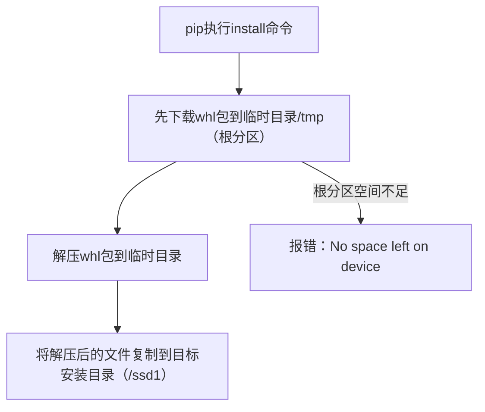

[toc]

---

# MiniConda3安装与配置

> 下载地址： https://docs.conda.io/projects/miniconda/en/latest/

1. 下载并安装 `miniconda`

2. 测试是否安装成功

   ```shell
   conda --version
   
   conda config --show # 查看所有配置信息
   ```

3. 配置显示通道URL。（win：C:/users/【用户名】/.condarc；linux：~/.condarc）

   ```python3
   conda config --set show_channel_urls yes
   ```

   win 系统下，此时才会出现 `.condarc` 文件

4. 配置是否进入 `base` 环境

    ```shell
    # 关闭自动进入base环境
    conda config --set auto_activate_base false
    
    # 开启自动进入base环境
    conda config --set auto_activate_base true
    ```

    

5. 打开 `.condarc` 文件

   - 清华源

     ```config
      channels:
        - defaults
      show_channel_urls: true
      default_channels:
        - https://mirrors.tuna.tsinghua.edu.cn/anaconda/pkgs/main/
        - https://mirrors.tuna.tsinghua.edu.cn/anaconda/pkgs/free/
        - https://mirrors.tuna.tsinghua.edu.cn/anaconda/cloud/msys2/
      custom_channels:
        conda-forge: https://mirrors.tuna.tsinghua.edu.cn/anaconda/cloud
        msys2: https://mirrors.tuna.tsinghua.edu.cn/anaconda/cloud
        bioconda: https://mirrors.tuna.tsinghua.edu.cn/anaconda/cloud
        menpo: https://mirrors.tuna.tsinghua.edu.cn/anaconda/cloud
        pytorch: https://mirrors.tuna.tsinghua.edu.cn/anaconda/cloud
        pytorch-lts: https://mirrors.tuna.tsinghua.edu.cn/anaconda/cloud
        simpleitk: https://mirrors.tuna.tsinghua.edu.cn/anaconda/cloud
        deepmodeling: https://mirrors.tuna.tsinghua.edu.cn/anaconda/cloud
     ```

     或另一种方式，提高优先级

     ```config
     channels:
       - https://mirrors.tuna.tsinghua.edu.cn/anaconda/pkgs/main/
       - https://mirrors.tuna.tsinghua.edu.cn/anaconda/pkgs/free/
       - https://mirrors.tuna.tsinghua.edu.cn/anaconda/cloud/conda-forge/
       - https://mirrors.tuna.tsinghua.edu.cn/anaconda/cloud/msys2/
       - https://mirrors.tuna.tsinghua.edu.cn/anaconda/cloud/bioconda/
       - https://mirrors.tuna.tsinghua.edu.cn/anaconda/cloud/menpo/
       - https://mirrors.tuna.tsinghua.edu.cn/anaconda/cloud/pytorch/
       - defaults
     show_channel_urls: true
     
     ```

   - 交大源

     ```config
     channels:
       - defaults
     show_channel_urls: true
     default_channels:
       - https://mirrors.sjtug.sjtu.edu.cn/anaconda/pkgs/main/
       - https://mirrors.sjtug.sjtu.edu.cn/anaconda/pkgs/free/
       - https://mirrors.sjtug.sjtu.edu.cn/anaconda/cloud/msys2/
     custom_channels:
       conda-forge: https://mirrors.sjtug.sjtu.edu.cn/anaconda/cloud
       msys2: https://mirrors.sjtug.sjtu.edu.cn/anaconda/cloud
       bioconda: https://mirrors.sjtug.sjtu.edu.cn/anaconda/cloud
       menpo: https://mirrors.sjtug.sjtu.edu.cn/anaconda/cloud
       pytorch: https://mirrors.sjtug.sjtu.edu.cn/anaconda/cloud
       simpleitk: https://mirrors.sjtug.sjtu.edu.cn/anaconda/cloud
     ```

     或另一种方式，高优先级：

     ```config
     channels:
       - https://mirrors.sjtug.sjtu.edu.cn/anaconda/pkgs/main/
       - https://mirrors.sjtug.sjtu.edu.cn/anaconda/pkgs/free/
       - https://mirrors.sjtug.sjtu.edu.cn/anaconda/cloud/conda-forge/
       - https://mirrors.sjtug.sjtu.edu.cn/anaconda/cloud/msys2/
       - https://mirrors.sjtug.sjtu.edu.cn/anaconda/cloud/bioconda/
       - https://mirrors.sjtug.sjtu.edu.cn/anaconda/cloud/menpo/
       - https://mirrors.sjtug.sjtu.edu.cn/anaconda/cloud/pytorch/
       - defaults
     show_channel_urls: true
     ```

6. ```shell
    conda config --get channels                    # 获取已有的通道
    conda config –set show_channel_urls yes       # 搜索时显示通道地址
    ```

7. 修改包保存路径。

   ```config
   envs_dirs:
     - E://conda//pkg  # 包存储路径
   ```


# 问题记录
## 关于conda中pip install提示空间不足问题
> 问题分析：安装目录空间足够，但临时文件目录盘空间不足，而pip默认先安装到临时文件目录，导致空间不足。

你明明将包安装到 `/ssd1` 分区的 conda 环境中，但安装 PyTorch 时依然提示「设备上没有剩余空间」，核心原因是：**pip 下载安装包时，会先把文件缓存到系统临时目录（默认是 `/tmp`，归属根分区 `/dev/sda2`），而非直接下载到目标安装目录**。你的根分区 `/dev/sda2` 已用 100%（只剩 2G 且实际可用空间不足），无法容纳 899.7MB 的 PyTorch 安装包，因此即便安装目录在 `/ssd1`（有 856G 可用），依然会触发空间不足的报错。

### 核心原因拆解

简单说：**下载/解压阶段用的是根分区的临时目录，而非目标安装分区**，这是你踩的核心误区。

### 解决方案（按优先级排序）
#### 方案 1：临时指定 pip 临时目录到 /ssd1（快速解决）
激活 conda 环境后，通过环境变量 `TMPDIR` 指定临时目录到 `/ssd1`（有充足空间），再执行安装：
```bash
# 1. 激活你的conda环境（比如agent_test）
conda activate agent_test

# 2. 在/ssd1创建临时目录（确保有权限）
sudo mkdir -p /ssd1/pip_tmp
sudo chmod 777 /ssd1/pip_tmp

# 3. 指定临时目录并安装PyTorch（关键！TMPDIR指向ssd1）
TMPDIR=/ssd1/pip_tmp pip install torch==2.9.0 -i https://mirrors.aliyun.com/pypi/simple/
```
- 该命令仅本次生效，临时把 pip 的下载/解压路径切换到 `/ssd1`，避开满的根分区。

#### 方案 2：永久修改 pip 临时目录（推荐，一劳永逸）
修改 pip 配置文件，让其永久使用 `/ssd1` 的临时目录：
```bash
# 1. 激活conda环境
conda activate agent_test

# 2. 编辑环境内的pip配置文件（之前配置镜像的那个文件）
vim $CONDA_PREFIX/pip.conf
```
在配置文件中添加 `temp-dir` 配置，最终内容如下：
```ini
[global]
index-url = https://mirrors.aliyun.com/pypi/simple/
trusted-host = mirrors.aliyun.com
timeout = 120
temp-dir = /ssd1/pip_tmp  # 新增：指定pip临时目录到ssd1
```
保存后，后续该环境内的 pip 安装所有包，都会优先使用 `/ssd1/pip_tmp` 作为临时目录，彻底避开根分区。

若不想创建目录也可直接执行以下命令。
```bash
pip config --site set global.index-url https://mirrors.aliyun.com/pypi/simple/
pip config --site set global.trusted-host mirrors.aliyun.com
pip config --site set global.timeout 120
pip config --site set global.temp-dir /ssd1/pip_tmp

# 输出
#Writing to /ssd1/envs/agent_test/pip.conf
#Writing to /ssd1/envs/agent_test/pip.conf
#Writing to /ssd1/envs/agent_test/pip.conf
```

#### 方案 3：清理根分区临时文件（辅助释放空间）
虽然核心问题是临时目录路径，但清理根分区的临时文件能应急释放少量空间：
```bash
# 1. 清理/tmp目录下的旧文件（根分区的临时文件）
sudo rm -rf /tmp/*

# 2. 清理pip全局缓存（根分区可能存了缓存）
pip cache purge

# 3. 清理系统日志（释放根分区空间）
sudo journalctl --vacuum-size=500M
```

### 验证安装是否成功
安装完成后，验证 PyTorch 是否装到 `/ssd1` 的 conda 环境中：
```bash
# 激活环境后执行
pip show torch
```
查看输出中的 `Location` 字段，应指向 `/ssd1` 下的 conda 环境目录（比如 `/ssd1/xxx/miniconda3/envs/agent_test/lib/python3.12/site-packages`），说明安装成功。

### 总结
1. **核心原因**：pip 下载/解压安装包时优先使用 `/tmp`（根分区），而非目标安装分区，根分区满导致报错。
2. **关键解决思路**：将 pip 的临时目录（TMPDIR）切换到有充足空间的 `/ssd1` 分区。
3. **推荐方案**：方案 2 永久修改 pip 配置文件的 `temp-dir`，后续所有安装都不会再触发根分区空间不足问题。

按方案 1 操作可快速解决本次安装问题，方案 2 能避免后续同类问题，建议优先配置。