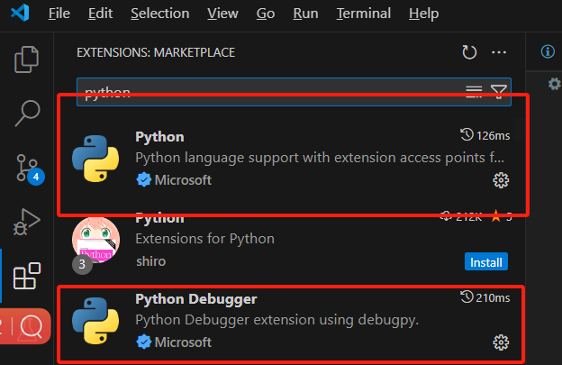
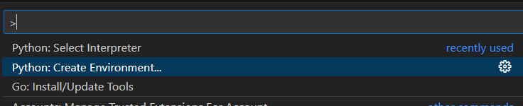
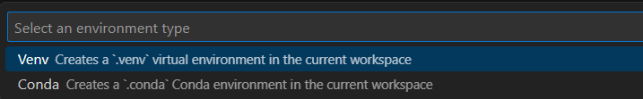
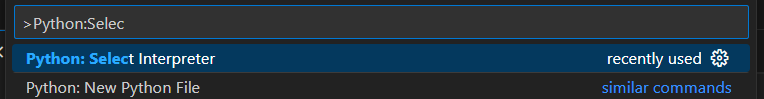
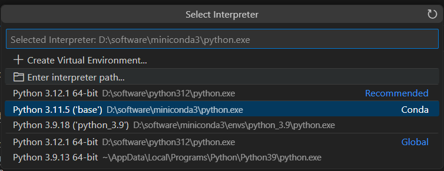

[toc]

---

# 在vscode进行python开发

## 安装插件

安装支持插件

1. python 和 python debugger

 

2. pylance  代码提示
3. blackFormatter 格式化

## 配置解释器

1. 【可选】如果没有环境，则使用 `Ctrl+Shift+P`，输入 `Python: Create Environment `

   

   在为当前工作区创建一个环境

   

2. Ctrl+shift+P，输入 `Python:Select Interpreter`

   

3. 选择环境

   