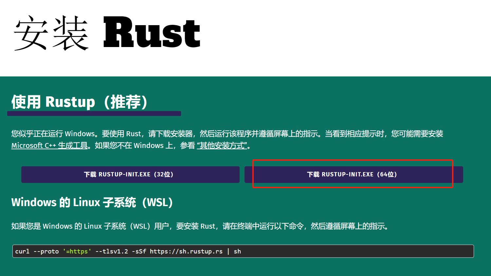
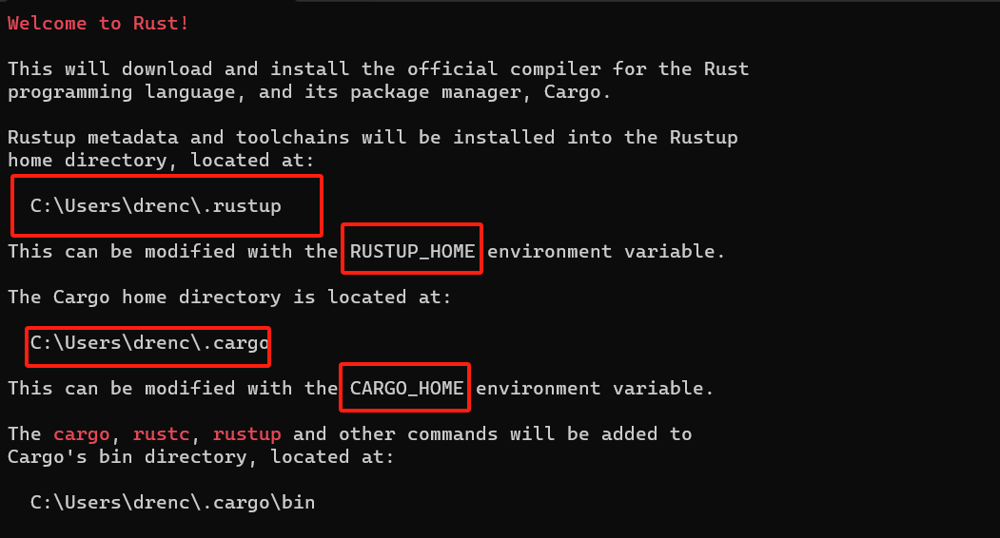
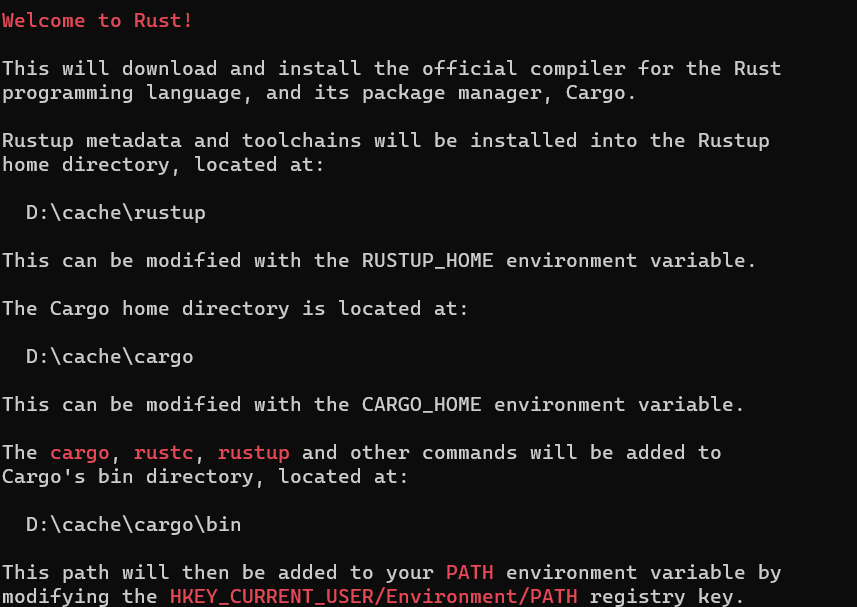
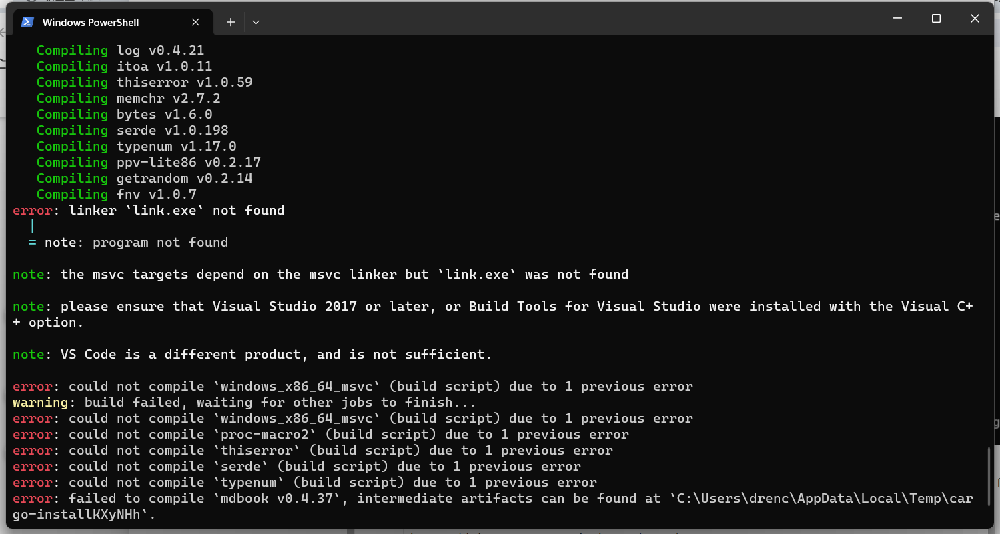
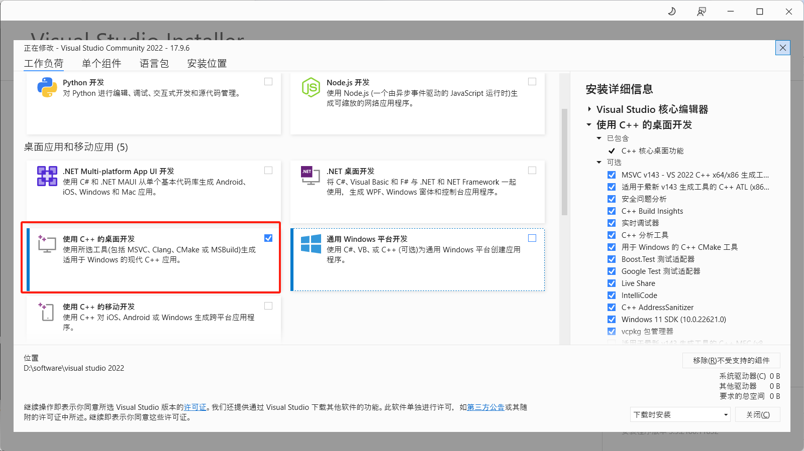

[toc]

---

# 安装RUST

## 下载应用

> 官网： https://www.rust-lang.org/zh-CN/tools/install



下载完成后，双击 `rust-init.exe`。可以看到包路径在 `用户名\.cargo`下



这里通过配置环境变量方式，来更改存放的位置。

- CARGO_HOME
- RUSTUP_HOME

更改完成后，再次打开`rust-init.exe`。



## 镜像配置

增加环境变量 `RUSTUP_DIST_SERVER`

```shell
# 选一个即可
# 中科大
https://mirrors.ustc.edu.cn/rust-static
# 清华
https://mirrors.tuna.tsinghua.edu.cn/rustup
# 上海交大
https://mirrors.sjtug.sjtu.edu.cn/rust-static/
```

# 安装MDBOOK

执行指令。

```shell
cargo install mdbook
```

如果出现异常



 **解决方案**：安装C++生成工具。从这里下载 https://visualstudio.microsoft.com/zh-hans/visual-cpp-build-tools/。安装时选择红框组件。 



