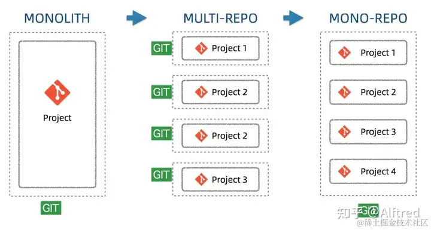
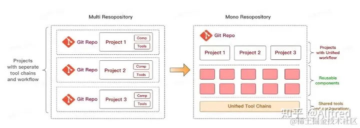
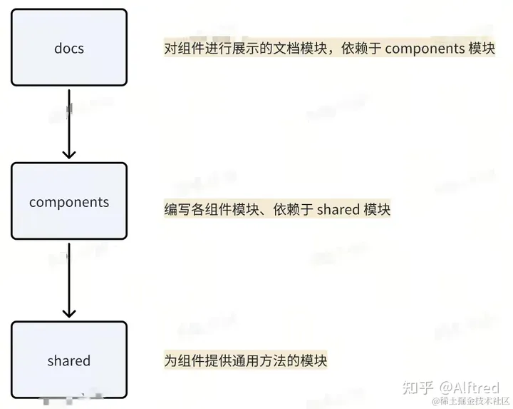
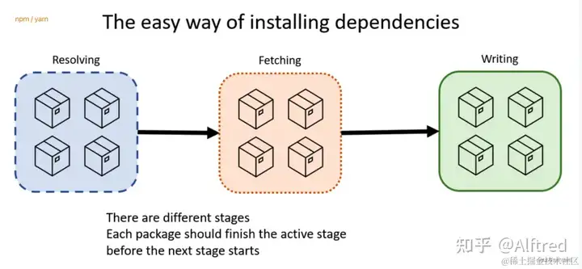
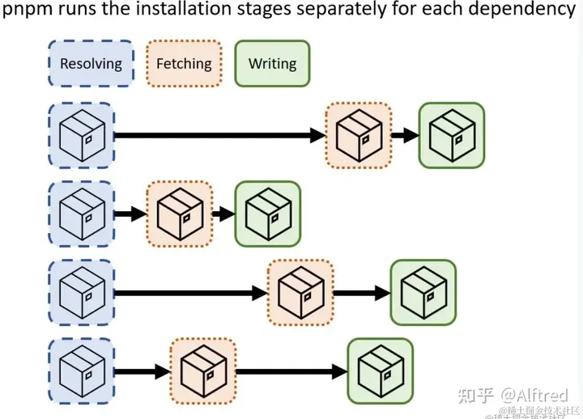
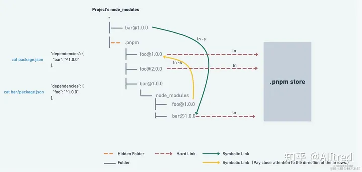

[toc]

---

# 前言

当下前端组件库 / 工具库的最佳实践方案基本都是 pnpm + monorepo 的开发模式，如 Vue、React、Vite、Element UI、Varlet UI、Vant UI 等。

其中 pnpm 是一种前端的包管理工具，是前端开发中最重要的工具之一，它自身支持的某些特性可以很好的与 monorepo 模式相结合。

monorepo 是一种开发模式，这种开发模式非常适合组件库这种涉及不同模块且不同模块还存在相互依赖的项目，所以在进入实践之前，我会先介绍一下前端开发中的包管理器以及 monorepo 开发模式，尽量让大家明确为什么 pnpm + monorepo 会是当下前端组件库开发的最佳实践。

# 项目开发与管理模式

## Monolithic（单体应用）开发模式

- 在软件开发的早期阶段，通常采用单体应用的开发模式。整个应用程序由一个单一的代码库、构建和部署流程组成。这种模式简单易懂，适合小型项目。

- 优点：

  - 易于集成和部署。所有的代码在一个仓库里面，不需要特别的集中管理和协调，也可以直接在本地部署调试。
  - 易于重用。所有的代码都在一个仓库中，开发人员开发的时候比较容易发现和重用已有的代码。
  - 易于规范代码。所有的代码在一个仓库当中就可以标准化依赖管理，规范化代码的风格。
- 缺点：
  - 代码维护性变差，随着功能以及代码量的大幅增加，代码功能耦合性增强。
  - 构建时间过长，任何小修改必须重新构建整个项目，这个过程往往很长。
  - 稳定性差，任意一个功能出现问题，可能导致整个应用挂掉。

## Multirepo（多仓多模块）开发模式

- 为了解决单体应用的扩展性问题，团队开始将项目拆分为多个独立的仓库，每个仓库独立维护自己的代码和构建流程。这种模式更适合大型和复杂的项目，因为它提供了更好的隔离性和独立性，同时可以更灵活地管理多个团队的工作。

- 优点：
  - 每一个项目都有一个独立的仓库，职责单一。
  - 代码量和复杂性受控，项目由不同的团队独立维护、边界清晰。
  - 单个项目也易于自治开发测试部署和扩展，不需要集中管理集中协调。
  - 利于进行权限控制，可以针对单个仓库来分配权限，权限分配粒度比较细。
- 缺点：
  - 代码和配置很难共享：每个仓库都需要做一些重复的工程化能力配置（如 eslint/test/ci 等）且无法统一维护，且不利于代码复用。
  - 依赖的治理复杂：模块越来越多，涉及多模块同时改动的场景增加。如何保障底层组件升级后，其引用到的组件也能同步更新到位。这点很难做到，如果没及时升级，各工程的依赖版本不一致，往往会引发一些意想不到的问题。
  - 开发人员缺乏对整个项目的整体认知：开发人员一般只关心自己的服务代码，看不到项目整体，造成缺乏对项目整体架构和业务目标整体性的理解。
  - 存储和构建消耗增加：假如多个工程依赖 pkg-a，那么每个工程下 node_modules 都会重复安装 pkg-a，对本地磁盘内存和本地启动都是个很大的挑战。而且每个模块的发布都是相对独立的，当一次迭代修改较多模块时，总体发布时效就是每个发布流程的串联。对发布者来说是一个非常大的负担。

## Monorepo （**单仓多模块**）开发模式

- 回归单体管理：Monorepo 是一种试图回归单体管理优势的方法，但保留了多仓库开发的某些优点。它允许在一个代码库中管理多个项目、组件或服务，提供更好的代码共享和重用性。

- 现代工具支持：现代的版本控制系统和工具链使得 Monorepo 开发模式更为可行，例如像 Pnpm、Yarn 、Lerna 和 Turborepo 等工具，它们提供了更好的管理、构建和部署多个项目的能力。

- 优点：

  - 保留 multirepo 的主要优势

    1. 代码复用
    2. 模块独立管理
    3. 分工明确，业务场景独立
    4. 代码耦合度降低

  - 管理所有项目的版本控制更加容易和一致，降低了不同项目之间的版本冲突。

  - 可以统一项目的构建和部署流程，降低了配置和维护多个项目所需的工作量。

- 缺点：
  - Monorepo 可能随着时间推移变得庞大和复杂，导致构建时间增长和管理困难，git clone、pull 的成本增加。
  - 权限管理问题：项目粒度的权限管理较为困难，容易产生非owner管理者的改动风险。

**Monorepo 绝不是简单地将代码搬到一个仓库（即不等于 Monolith）。**

在 Monorepo 中，每个子模块仍然是独立的，有独立的版本，可以独立发包，不受其他模块的限制，最重要的是 Monorepo 的 build、test 都是增量的，只有发生更改的子模块会进行构建和测试，而不需要重新构建和测试整个代码库。这可以大大加快持续集成（CI）的速度，提高开发效率。

与 Mulitrepo 相比，Monorepo 中的子模块可以代码共享，可以最大程度复用依赖、复用工作流、复用基础配置。

单体仓库和多仓库两种方案能同时存在，一定是各有利弊的，不要将自己锁定到一种方案上，选择最合适的才是最好的。

# Monorepo模式项目模块

对于组件库项目，很自然的会涉及到划分以下模块

- components 包，作为组件库的主要代码，实现各个 UI 组件的核心逻辑。
- shared 包，主要存放各种杂七杂八的工具方法。
- theme 包，实现组件库的主题样式定制方案。
- cli 包，实现组件库模板脚手架的命令行工具。
- docs 包，组件库的示例 demo 与使用文档。
- playground 包，组件库的在线编辑、演示应用。

细化拆分不同模块的好处非常明显，一句话总结就是：模块划分的越清晰，复用时的灵活性、可操作性就越强，每个独立模块产物的体积也会越轻量。传统 mutirepo 模式在组件库项目中的劣势

如果对组件库项目的每一个模块建立一个代码仓库进行管理，每个独立仓库会有它自己的版本号、配置、发布流程。由于组件库项目每个模块之间存在许多依赖关系，这在这种模式下就有非常大的劣势。

假设有如下依赖关系

image.png

暂时无法在飞书文档外展示此内容

最理想的情况是： 更新了 shared 包中的工具方法，依赖 shared 的 components 包也能立即适应更新，并即刻反馈在 docs 包的 demo 示例中。

在 mutirepo 模式下 会造成以下困扰：

1. 上层包想要得到底层包更改的效果，需要严格逐层升级并部署，在相互依赖复杂的项目当中会变得很繁琐
2. 每个包的工程化配置具有很多相似之处，每个仓库会有很多复制粘贴的配置部分，一旦有整体性修改 CI 流程的需求，那就要分别修改多个仓。

monorepo 模式正是解决了组件库项目开发中，这两个多仓模式下的最大痛点：

1. 在一个代码仓中，任意一个模块发生修改，另一个模块能够立即反馈而不用走繁琐的发布和依赖更新流程；
2. 各个模块之间也能够充分复用配置、CI 流程的脚本；各个包的版本和互相之间的依赖关系得到集中管理。

# 前端包管理工具与workspace模式

## **Workspace 工作区**

包管理工具通过 workspace 功能来支持 Monorepo 模式。Workspace 是指在一个代码库中管理多个相关项目或模块的能力。

## 包管理工具通过以下方式实现 workspace 的支持：

1. 代码结构组织：在 Monorepo 中，不同的项目或模块通常位于同一个代码库的不同目录中。包管理工具通过识别并管理这些目录结构，可以将它们作为独立的项目或模块进行操作。
2. 共享依赖：Monorepo 中的不同项目或模块可以共享相同的依赖项。包管理工具可以通过在根目录中维护一个共享的依赖项列表，以确保这些依赖项在所有项目或模块中都可用。
3. 交叉引用：在 Monorepo 中，不同项目或模块之间可能存在相互引用的情况。包管理工具需要处理这些交叉引用，以确保正确解析和构建项目之间的依赖关系。
4. 版本管理：Monorepo 中的不同项目或模块可能具有不同的版本。包管理工具需要能够管理和跟踪这些版本，并确保正确地安装和使用适当的版本。
5. 构建和测试：包管理工具需要支持在 Monorepo 中进行增量构建和测试。这意味着只有发生更改的项目或模块会重新构建和测试，而不需要重新构建和测试整个代码库。

前端目前最主流的三款包管理工具 npm7+、yarn、pnpm 都已经原生支持 workspace 模式，也就是说不管使用哪个包管理工具，我们都可以实现其与 monorepo 的配合，但最终依然选择 pmpm 作为包管理工具主要是由于 pnpm 很好的解决了 npm 与 yarn 遗留的历史问题。

## npm 与 yarn 的历史遗留问题

- 扁平化依赖算法复杂，需要消耗较多的性能，依赖串行安装还有提速空间。
- 大量文件需要重复下载，对磁盘空间的利用率不足。（虽然在同一个项目中我不会重复的安装依赖 d 了，但是如果我有100个项目，100个项目都需要用到某个包，那么这个包依然会被下载100次，也就是在磁盘的不同地方写入100次）
- 扁平化依赖虽然解决了不少问题，但是随即带来了**依赖非法访问**的问题，项目代码在某些情况下可以在代码中使用**没有被定义在 package.json 中的包**，这种情况就是我们常说的**幽灵依赖**。

## **pnpm 是如何解决上述问题的**

1. 安装依赖提速：

- resolving：首先他们会解析依赖树，决定要下载哪些安装包。
- fetching：下载依赖的tar包。这个阶段可以同时下载多个，来增加速度。
- wrting：解压包，根据文件构建出真正的依赖树，这个阶段需要大量文件IO操作。

- pnpm 针对每个包的三个流程都是平行的，所以速度会快很多。当然pnpm会多一个阶段，就是通过链接组织起真正的依赖树目录结构。
- **pnpm 使用硬连接的方式节约磁盘空间利用率、采用虚拟存储目录+软连接解决幽灵依赖**

**在开始正式介绍pnpm之前先来回忆一下操作系统当中的软硬链接**

**硬链接：** 电脑文件系统中的多个文件平等的共享同一个文件存储单元。

假如磁盘中有一个名为 data 的数据，C盘中的一个名为 hardlink1 的文件硬链接到磁盘 data 数据，另一个名为 hardlink2 的文件也硬链接到磁盘 data 数据，此时如果通过 hardlink1 文件改变磁盘 data 的数据内容，则通过 hardlink2 访问磁盘 data 数据内容是改变过后的内容。

硬链接可以有多条，它们可以指向同一块磁盘空间。

**软链接（符号连接）：** 包含一条以绝对路径或相对路径的形式指向其他文件或者目录的引用。

最常见的就是桌面的快捷方式，其本质就是一个软链接，软链接所产生的文件是无法更改的，它只是存储了目标文件的路径，并根据该路径去访问对应的文件。

这个平铺的结构避免了 npm v2 创建的嵌套 `node_modules` 引起的长路径问题，但与 npm v3,4,5,6 或 yarn v1 创建的平铺的 `node_modules` 不同的是，它保留了包之间的相互隔离。

`.pnpm/@/node_modules/`称之为虚拟存储目录

## 总结 pnpm 相比于 npm 与 yarn 包管理工具有以下优势：

- 速度快：多数场景下，安装速度是 `npm/yarn` 的 2 - 3 倍。
- 基于内容寻址：硬链接节约磁盘空间，不会重复安装同一个包，对于同一个包的不同版本采取增量写入新文件的策略。
- 依赖访问安全性强：优化了 `node_modules` 的扁平结构，提供了限制**依赖的非法访问(幽灵依赖)** 的手段。
- 支持 `monorepo`：自身能力就对 `monorepo` 工程模式提供了有力的支持。在轻量场景下，无需集成 lerna、Turborepo 等工具。