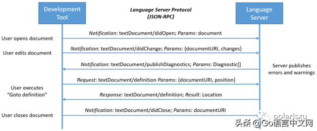

[toc]

---

# LSP是什么

LSP，全称 Language Server Protocol，即语言服务器协议，这是微软创建的一个协议（目前已有 Codenvy，Red Hat 和 Sourcegraph 等公司一起支持它的发展）。定义了在编辑器或 IDE 中与语言服务器之间使用的协议，该语言服务器提供诸如自动完成，转到定义，查找所有引用等语言功能。语言服务器索引格式（LSIF，其发音类似于“ else if”）的目标是支持开发工具或 Web UI 中的富代码导航，而不需要源代码的本地副本。

目前该协议得到了编辑器和语言社区的广泛支持。

LSP 的官方网站：https://microsoft.github.io/language-server-protocol/

GitHub 地址：https://github.com/Microsoft/language-server-protocol

# **LSP 解决了什么问题**

为编程语言添加诸如自动完成、转到定义或鼠标悬停出现文档之类的功能需要付出大量的努力。传统上，这项工作必须为每个开发工具重复进行，因为每个工具为实现相同的特性提供不同的 api。

语言服务器（Language Server）旨在提供特定语言的智能功能，并通过支持进程间通讯协议与开发工具进行通信。

语言服务器协议（LSP）背后的思想是为这些服务器和开发工具的通信方式提供标准化协议支持。通过这种方式，可以在多个开发工具中重用单个 Language Server，而这些工具反过来可以用最少的工作支持多种语言。

例如，之前需要为 VSCode 构建 Go 插件、为 Sublime Text 构建 Go 插件、为 Vim 构建 Go 插件、为 Sourcegraph 构建 Go 插件，很多重复的工作。现在，对于每种语言，LSP 允许语言社区将精力集中在一个高性能语言服务器上，这个服务器可以提供代码完成，悬停文档提示、跳转到定义、查找引用等功能，而编辑器和客户端社区可以专注于构建一个单一的、高性能的、直观的和惯用的扩展，这个扩展可以与任何语言服务器通信，即时提供深入的语言支持。

LSP 是语言提供商和工具供应商的双赢！

# **LSP 的工作原理**

语言服务器（Language Server）作为单独的进程运行，开发工具在 LSP 基础上通过 JSON-RPC 与服务器通信。下面是一个开发工具和语言服务器在进行编辑时如何通信的例子：

图片来自 LSP 官网，演示了协议如何在文档引用（uri）和文档位置级别与语言服务器通信。这些数据类型与编程语言无关，适用于所有编程语言。

- **用户在开发工具中打开一个文件（称为文档）**：开发工具通知语言服务器文档已打开（textDocument/didOpen）。从现在开始，关于文档内容的真实信息不再存储在文件系统中，而是由开发工具保存在内存中。现在必须在开发工具和语言服务器之间同步内容。
- **用户进行编辑**：该开发工具通知服务器文档更改（textDocument/didChange），并由语言服务器更新文档的语言表示形式。在这种情况下，语言服务器会分析这些信息，并将检测到的错误和警告通知开发工具（textDocument/publishDiagnostics）。
- **在打开的文档中，用户就一个符号（symbol）执行 Go to Definition**：该开发工具发送一个带有两个参数的 “textdocument/Definition” 请求：(1)文档 URI 和(2)发出 “Go to Definition” 请求的文本位置，发送到服务器。服务器的响应包含文档 URI 和该符号在该文档中的定义位置。
- **用户关闭文档（文件） **：开发工具发出 “textDocument/didClose” 的通知，告知语言服务器文档现在不在内存中了。文件系统上的当前内容现在是最新的。