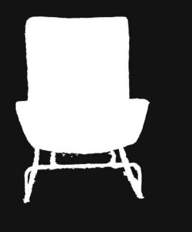
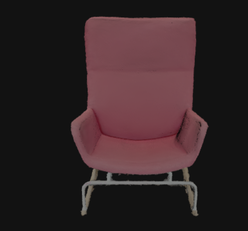

[TOC]

---

# 关于glb模型顶点颜色不生效问题

> 在线浏览 http://3dviewer.bimant.com/

## Three.js几何体顶点颜色和材质颜色区别

在学习Three.js的过程中你可能会思考Threejs几何体顶点颜色和材质对象的颜色有什么区别？如果你产生了这个疑问，说明你可能没有原生WebGL基础或者说你对Three.js整个系统的原理不够理解。

如果整个网格模型Mesh的颜色是单一的颜色，不是彩色渐变，直接设置材质对象Material的颜色属性.color就可以。没有必要去设置几何体的顶点颜色，如果你希望你个几何体的表面产生渐变的彩色效果，在不使用贴图的情况下，可以通过设置几何体的顶点颜色实现，比如一个温度云图。

在Three.js中几何体对象Geometry和缓冲类型几何体对象BufferGeometry本质上就是对WebGL中各种顶点数据的封装，顶点颜色数据就是顶点数据中的一种，至于Three.js中的各种点材质、线材质、网格材质、精灵材质本质上都是对顶点着色器、片元着色器、uniform变量数据的封装。

材质对象Material颜色属性.color的属性值直接影响的是原生WebGL中的片元着色器进行计算后赋值给内置变量gl_FragColor,如果是几何体中的顶点颜色数据需要先在顶点着色器中进行插值计算，然后传递给片元着色器。

设置模型的几何体顶点颜色时候，对于Geometry几何体，如果是点Points或线Line模型，可以直接设置几何体对象的.colors属性，如果是网格模型Mesh，需要通过三角形属性.faces来设置顶点颜色,Face3.color或Face3.vertexColors。对于BufferGeometry几何体而言，直接设置attributes.color属性就可以，一般加载的外部模型都是BufferGeometry几何体。

## 问题说明

- 渲染效果对比
  
  - 面渲染
    
    
  
  - 顶点渲染
    
    

- 渲染代码

```typescript
  /**
   * glb 和 gltf 渲染
   *
   * @param url 地址
   */
  function renderGltf(url: string, cb: Function) {
    const loader: GLTFLoader = new GLTFLoader();
    progressState.value = true;
    loader.load(
      url,
      async (gltf: GLTF) => {
        // 解决模型为黑色的问题
        gltf.scene.traverse(function (child: any) {
          if (child.isMesh) {
            // 解决模型黑色问题
            child.material.emissive = child.material.color;
            child.material.emissiveMap = child.material.map;


            child.castShadow = true;  // 光照是否有阴影
            child.receiveShadow = true;  // 是否接收阴影
            child.ancestors = gltf.scene;
            child.material.side = THREE.DoubleSide; // 模型双面渲染


            child.material.vertexColors = true
          }
        });
        gltf.scene.castShadow = true;


        const depthMaterial = new THREE.MeshDepthMaterial({
          depthPacking: THREE.RGBADepthPacking
        })
        gltf.scene.children[0].customDepthMaterial = depthMaterial

        if (typeof cb === 'function') {
          await cb(gltf);
        }
        scene.add(gltf.scene);

        objView.push(gltf.scene)
        progressState.value = false;
      },
      function (xhr) {
        // 控制台查看加载进度xhr
        console.log(Math.floor((xhr.loaded / xhr.total) * 100));
        progressPercent.value = Math.floor(xhr.loaded / xhr.total);
      }
    );
  }
```

- 问题点和解决方法
  
  ```javascript
  // 解决模型黑色问题
  child.material.emissive = child.material.color;
  child.material.emissiveMap = child.material.map;
  
  // 上面配置注释掉后，顶点颜色才能正常显示，但面模颜色会变黑
  child.material.vertexColors = true
  
  // 兼容写法
  if (child.geometry.attributes.color) {
    child.material.vertexColors = true
  } else {
    // 会和顶点颜色冲突
    child.material.emissive = child.material.color;
    child.material.emissiveMap = child.material.map;
  }
  ```

# 关于glb 后期处理不高亮问题
当加载GLB模型后，将其设置为边缘高亮时，会出现没有特效处理的情况，如以下代码所示：
```javascript
this.outlinePass.selectedObjects = model;
```
需要将它的所有子对象传入才可以 正常高亮。
```javascript
this.outlinePass.selectedObjects = model.children;
```
