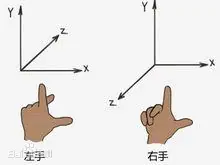

[toc]
---

# 坐标系
定义物体在平面上，即二维的位置时，使用表示两个方向的 和 坐标轴(称作笛卡尔坐标或直角坐标)。与此相反，在空间中，即为三维定义位置时，使用 这3个坐标轴。这是因为平面上的位置用“纵”、“横”值来表示，对此，三维空间位置则在“纵”、“横”的基础上又加上“深”，从而用3个坐标来表示。

在三维坐标中，根据z轴的不同防线，分为**右手系和左手系**两种坐标系。
- 拇指表示x轴
- 食指表示y轴
- 中指表示z轴
  

如果是右手系，则中指指向自己一方，如果是左手系，则中指指向前方。
