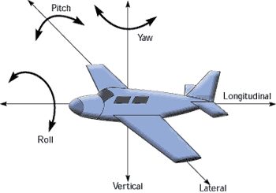
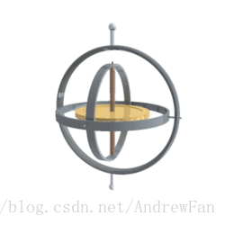
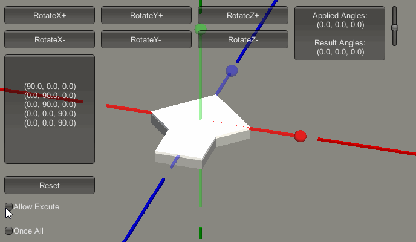

- [欧拉角](#欧拉角)
  - [引文（欧拉角与万向节死锁）](#引文欧拉角与万向节死锁)


---

# 欧拉角

## 引文（欧拉角与万向节死锁）

> https://blog.csdn.net/AndrewFan/article/details/60981437

以下是对文章内容的修正版总结，修正了原文中表述不严谨或易误解的部分，并补充了准确的技术细节：


### **《Unity中欧拉角与万向节死锁》核心内容修正总结**


#### **一、核心概念与技术背景**
1. **万向节（Gimbal）**  
   - 定义：由互相垂直的枢纽轴组成的多层环架结构，允许物体绕单一轴旋转。  
   - 典型应用：陀螺仪通过三层万向节（对应三个旋转轴）抵消载体运动，保持转子平衡。  

2. **欧拉角（Euler Angles）**  
   - **Unity默认旋转顺序**：按 **Z（局部轴）→ X（局部轴）→ Y（局部轴）**（ZXY顺规）依次旋转。  
     - **Pitch（俯仰）**：绕局部X轴旋转。  
     - **Yaw（偏航）**：绕局部Y轴旋转。  
     - **Roll（桶滚）**：绕局部Z轴旋转。  
   - 关键特性：基于**局部坐标系**的顺序旋转，每次旋转会更新后续旋转的参考轴。  


#### **二、陀螺仪与万向节死锁原理**
1. **陀螺仪工作机制**  
   - 通过三层万向节的相对旋转（绕局部轴），抵消载体的Pitch、Yaw、Roll运动，使转子保持惯性参考系中的方向不变。  
   

2. **万向节死锁（Gimbal Lock）的本质**  
   - **成因**：当某一轴旋转至 **±90度** 时，相邻两个旋转轴在局部坐标系中 **重合**，导致自由度从3个减少为2个。  
   - **实例解析**：  
     - 按ZXY顺规旋转，若X轴旋转90度（如船首仰起90度），则：  
       - 初始绕Z轴的Roll（桶滚）方向不变。  
       - 后续绕Y轴的Yaw（偏航）会与绕Z轴的Roll（桶滚）在局部坐标系中**指向同一轴**，导致两者均表现为“桶滚”，丢失一个自由度。  
   - **核心结论**：死锁是由**旋转顺序**和**局部轴更新机制**共同导致的“轴重合”现象，而非单纯的“结果不确定”。  


#### **三、Unity中的死锁复现与代码建议**
1. **小程序演示逻辑**  
   - 操作顺序：先绕X轴旋转90度（触发死锁条件），再绕Y轴和Z轴旋转时，两者均影响“桶滚”，验证自由度丢失。  
   - 关键原因：X轴旋转90度后，局部Y轴与原局部Z轴重合，导致Y轴和Z轴的旋转效果重叠。  

2. **编程建议**  
   - **避免直接修改欧拉角的场景**：  
     - 涉及多轴连续旋转或动态控制时（如角色转向、摄像机插值），使用**四元数（Quaternion）**计算旋转，避免死锁和万向节误差。  
   - **可使用欧拉角的场景**：  
     - 仅需单一轴向旋转（如初始角度设置），且其他轴角度固定为0时，可直接操作`Transform.eulerAngles`，代码效率较高。  
   - **最佳实践**：  
     - 用四元数处理旋转逻辑，如需可视化或调试，再转换为欧拉角显示。  


#### **四、常见误区修正**
1. **旋转坐标系的混淆**  
   - 原文误将“局部轴旋转”表述为“围绕世界坐标系轴旋转”，实际Unity欧拉角基于**每次旋转后的局部轴**，而非固定世界轴。  

2. **术语准确性**  
   - 原文“进动”应改为“旋转”，避免与物理学中“进动”（圆锥运动）概念混淆。  
   - 明确“相对自身局部坐标系”指“旋转后更新的局部轴”，而非固定坐标系。  


#### **五、总结**
- **核心问题**：欧拉角的ZXY顺规和局部轴旋转机制，导致特定角度下两轴重合，引发自由度丢失。  
- **解决方案**：复杂旋转场景使用四元数，简单场景谨慎使用欧拉角并避免死锁角度（如±90度的中间轴旋转）。  
- **延伸建议**：结合Unity官方文档《[Transform.eulerAngles](https://docs.unity3d.com/ScriptReference/Transform-eulerAngles.html)》和《[四元数旋转](https://docs.unity3d.com/Manual/Quaternions.html)》深入理解底层原理。  

 
以下是基于 **Three.js** 开发场景的万向节死锁解决方法，结合 Three.js 的旋转机制（基于四元数）和常见开发需求，提供具体方案及代码示例：


## threejs 万向节死锁解决方法

### **一、Three.js 旋转机制回顾**
Three.js 中物体的旋转默认通过 **四元数（Quaternion）** 表示，`Object3D.rotation` 是欧拉角接口（本质是四元数的封装）。  
- **旋转顺序**：Three.js 欧拉角默认顺规为 **XYZ**（绕局部轴依次旋转 X→Y→Z），与 Unity 的 ZXY 顺规不同。  
- **死锁触发条件**：当中间轴（Y轴）旋转至 ±90° 时，X轴和 Z轴在局部坐标系中重合，导致自由度丢失。


### **二、解决方法与代码示例**


#### **1. 优先使用四元数（推荐方案）**
Three.js 的底层旋转逻辑基于四元数，直接操作四元数可避免欧拉角的死锁问题，且计算更高效。  
**关键 API**：  
- `Quaternion.setFromAxisAngle(axis, angle)`：绕任意轴旋转。  
- `Quaternion.slerp(a, b, t)`：球面插值实现平滑旋转。  
- `Quaternion.multiply(q)`：组合多个旋转。  

**示例：绕任意轴旋转（无死锁）**  
```javascript
import * as THREE from 'three';

const object = new THREE.Mesh(...);
const axis = new THREE.Vector3(1, 1, 0).normalize(); // 旋转轴（归一化）
const angle = Math.PI / 4; // 45度

// 创建四元数旋转
const q = new THREE.Quaternion().setFromAxisAngle(axis, angle);
object.quaternion.multiply(q); // 应用旋转
```

**示例：平滑插值旋转（避免突变触发死锁）**  
```javascript
let targetQuaternion = new THREE.Quaternion();
let currentQuaternion = object.quaternion.clone();

function updateRotation(targetAngle) {
  targetQuaternion.setFromAxisAngle(new THREE.Vector3(0, 1, 0), targetAngle); // 绕Y轴旋转
  object.quaternion.slerp(currentQuaternion, targetQuaternion, 0.1); // 平滑过渡
  currentQuaternion.copy(object.quaternion);
}
```


#### **2. 限制欧拉角旋转范围（规避死锁角度）**
通过限制中间轴（Y轴）的旋转角度在 **(-90° + ε, 90° - ε)** 范围内（ε 为极小值，如 1°），避免 X轴和 Z轴重合。  
**适用场景**：摄像机俯仰控制、机械臂关节旋转等。  

**代码示例：限制俯仰角度（绕X轴旋转）**  
```javascript
let xRotation = 0;
const xMin = -89 * Math.PI / 180; // -89度（弧度）
const xMax = 89 * Math.PI / 180; // 89度

function handleMouseRotation(deltaX, deltaY) {
  xRotation -= deltaY; // 俯仰控制（绕X轴）
  xRotation = Math.max(xMin, Math.min(xRotation, xMax)); // 限制范围
  
  // 应用旋转（通过欧拉角接口，内部自动转换为四元数）
  object.rotation.set(xRotation, object.rotation.y, object.rotation.z);
}
```


#### **3. 切换欧拉角旋转顺序**
Three.js 允许通过 `Object3D.rotation.order` 修改欧拉角顺规，可选值包括：  
- `'XYZ'`（默认）  
- `'YZX'`  
- `'ZXY'`  
- `'XZY'`  
- `'YXZ'`  
- `'ZYX'`  

**原理**：不同顺规的死锁临界点不同。例如，将顺规改为 `'ZXY'` 后，死锁触发条件变为中间轴（X轴）旋转至 ±90°，可根据需求调整。  

**代码示例：切换顺规为 ZXY**  
```javascript
object.rotation.order = 'ZXY'; // 先绕Z轴，再X轴，最后Y轴
object.rotation.set(90 * Math.PI / 180, 0, 0); // 绕X轴旋转90度（此时Z轴和Y轴在局部坐标系中重合，触发死锁）
```

**注意**：切换顺规后，需重新校准旋转逻辑，避免与原有动画冲突。


#### **4. 使用旋转混合（Blend Rotations）**
通过组合多个四元数旋转，分解复杂动作为无死锁的单轴旋转序列。  
**示例：先绕Y轴旋转，再绕X轴旋转（避免同时多轴操作）**  
```javascript
// 第一阶段：绕Y轴旋转
const qY = new THREE.Quaternion().setFromAxisAngle(new THREE.Vector3(0, 1, 0), Math.PI / 2);
object.quaternion.multiply(qY);

// 第二阶段：绕当前X轴旋转（基于更新后的局部轴）
const qX = new THREE.Quaternion().setFromAxisAngle(object.getWorldAxis(new THREE.Vector3(1, 0, 0)), Math.PI / 2);
object.quaternion.multiply(qX);
```


#### **5. 物理引擎辅助（如 Cannon.js）**
若涉及物理模拟，可借助 `Cannon.js` 等物理库的约束功能，直接限制旋转自由度。  
**示例：创建铰链约束（Hinge Joint）**  
```javascript
import * as CANNON from 'cannon-es';

// 创建物理世界
const world = new CANNON.World();
const bodyA = new CANNON.Body({ mass: 1 });
const bodyB = new CANNON.Body({ mass: 1 });

// 创建铰链约束（限制绕Y轴旋转范围）
const hinge = new CANNON.HingeConstraint(bodyA, bodyB, {
  pivotA: new CANNON.Vec3(0, 0, 0),
  axisA: new CANNON.Vec3(0, 1, 0),
  maxAngle: Math.PI / 2, // 最大旋转角度（限制死锁）
  minAngle: -Math.PI / 2,
});
world.addConstraint(hinge);
```


### **三、Three.js 死锁诊断工具**
1. **可视化欧拉角**：  
   通过监听 `Object3D.rotation` 的变化，实时显示欧拉角数值，观察中间轴是否接近 ±90°。  
   ```javascript
   function logEulerAngles(object) {
     const euler = object.rotation.toEuler(); // 转换为欧拉角
     console.log(`X: ${euler.x.toDegrees()}°, Y: ${euler.y.toDegrees()}°, Z: ${euler.z.toDegrees()}°`);
   }
   ```

2. **调试旋转轴**：  
   使用 `THREE.AxesHelper` 可视化物体的局部坐标轴，观察旋转后轴是否重合。  
   ```javascript
   const axesHelper = new THREE.AxesHelper(2); // 轴长度为2
   object.add(axesHelper);
   ```


### **四、总结：Three.js 最佳实践**
| **方案**         | **核心代码**                                  | **适用场景**                |  
|------------------|-----------------------------------------------|-----------------------------|  
| **四元数优先**   | `object.quaternion.setFromAxisAngle(...)`       | 所有动态旋转（摄像机、角色）|  
| **角度限制**     | `xRotation = Math.clamp(xRotation, xMin, xMax)` | 俯仰/偏航控制               |  
| **切换顺规**     | `object.rotation.order = 'ZXY'`                | 特定顺规需求（如适配 Unity）|  
| **物理约束**     | `Cannon.HingeConstraint`                      | 物理模拟场景                |  

**关键原则**：在 Three.js 中，**避免直接操作欧拉角的多轴分量**，优先通过四元数处理旋转逻辑，并结合场景需求限制危险角度或切换顺规，从根本上规避万向节死锁问题。