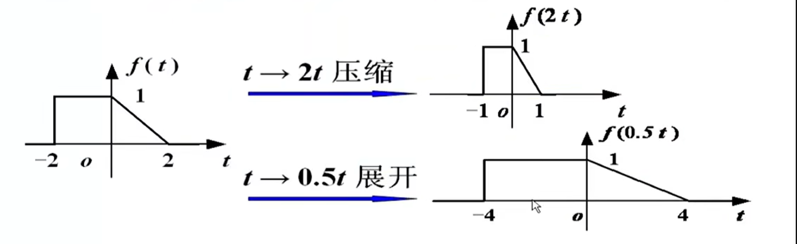
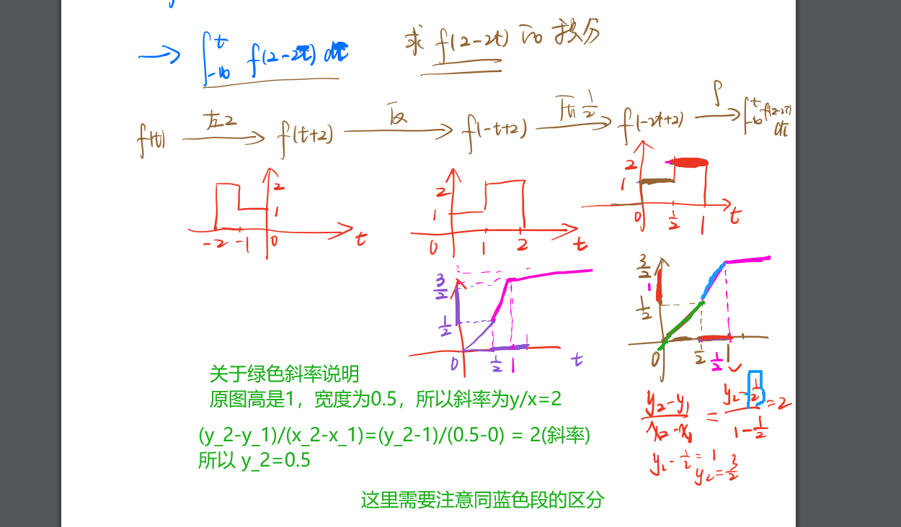

[TOC]

---

# 信号的加减乘

$f_1$和$f_2$的加减乘指**同一时刻**两信号之值对应加减乘。

# 基于自变量t的信号运算

<mark>不影响纵向的函数值</mark>

## 信号的平移

$f(t) \to f(t-t_0),f(k) \to f(k-k_0)$。称为平移

**图形上若 $t_0(或k_0) > 0$，则将 $f$ 右移，反之左移**

注意 $f(-t)$ 的情况。

**图形上若$t_0(或k_0) > 0$，则将 f 左移，反之右移**

## 信号的反转

将$f(t) \to f(-t),f(k) \to f(-k)$ 称为对信号 $f$ 的**反转或反折**。

图形上是将$f$以 <mark>纵坐标为轴反转`180°`。</mark>

## 信号的尺度变换

将$f(t) \to f(at)$称为对信号 f 的**尺度变换**。

**若 $a>1$，则波形沿横坐标压缩；若$0<a<1$，则展开**

# 综合运算方法

> **可采用六种运算，但必须是对t的变化**

### 方法一

> **平移-缩放-反转。推荐次序。**

### 方法二

> 压缩-平移-反转。

### 方法三(逆运算)

> **反转-缩放-平移。推荐次序**

# 关于微积分性质晕眩

