[TOC]

---

# 知识点铺设

## 线性系统的判定

1. 定义——同时满足叠加性和均匀性(齐次性)的系统称之为线性系统。
   
   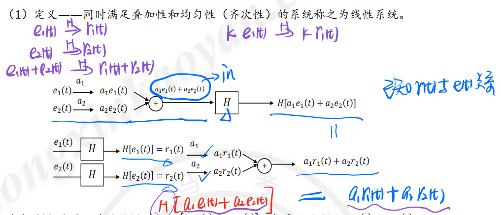

2. 判断方法 <mark>先线性后系统$H[a_1e_1(t)+a_2e_2(t)]=先系统后线性a_1r_1(t)+a_2r_2(t)$</mark>
   
   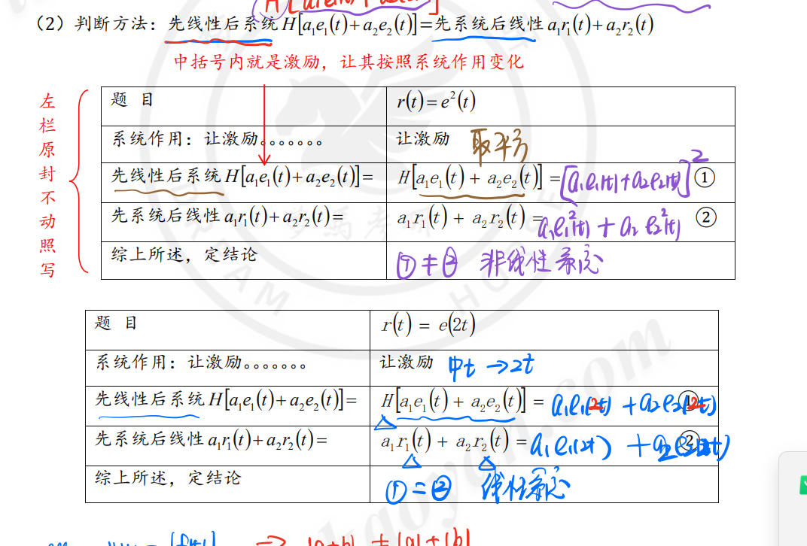

## 时不变系统的判定

1. 定义：对于时不变系统，系统参数本身不会随着时间而改变。因此，系统响应与激励接入系统的时刻无关。

      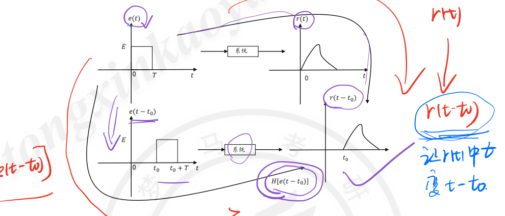

2. 判断方法：<mark>先时移后系统$H[e(t-t_0)]=$先系统后时移$r(t-t_0)$</mark>
3. 规律
   - **若 $f(·)$ 出现变系数，或有反转、展缩变化，则该系统为<u>时变系统</u>。**
   - 激励中 t 前有非1系数(反转、展缩) => 时变系统
   - 激励外有 t (变系数)=> 时变系统

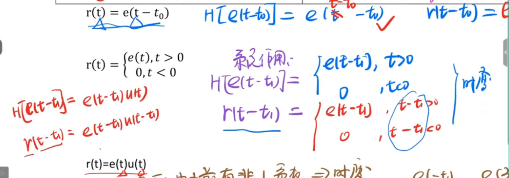

<mark>注意t的例子不同</mark>

### 示例

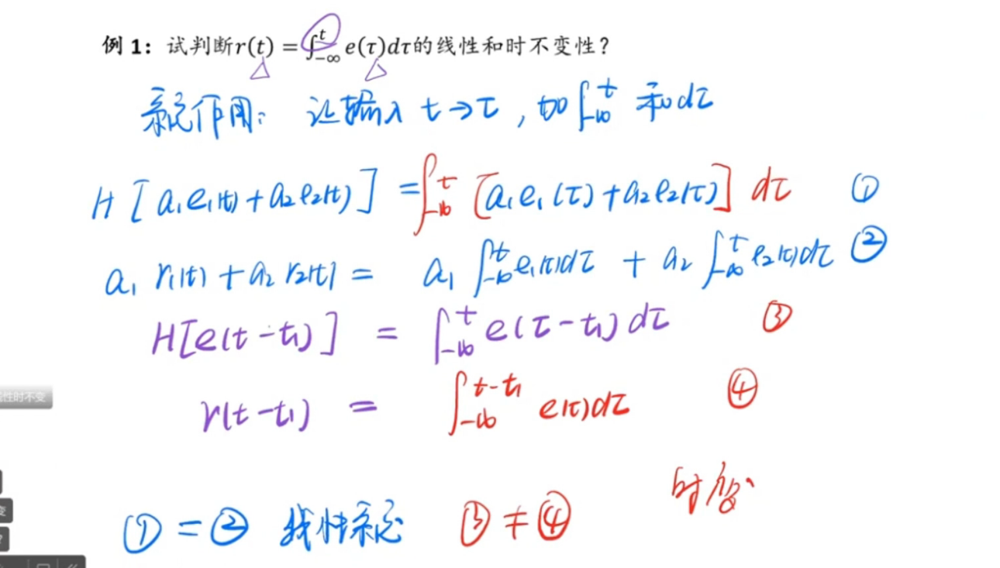

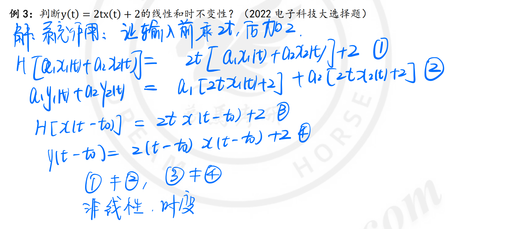

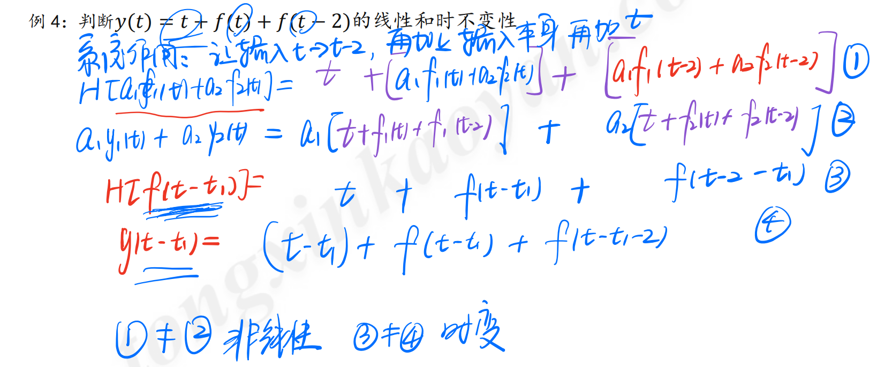

## 因果系统

1. 定义：因果系统-(零状态)，响应仅与当前时刻或之前时刻的输入有关，(零状态)响应不应出现在激励之前，$即e(t)=0,t<t_0; 则r(t)=0,t<t_0$

2. 判断方法：<mark>（响应中t）<（激励括号内整体），若无解，则为因果系统；若有解，为非因果系统。</mark>
   
   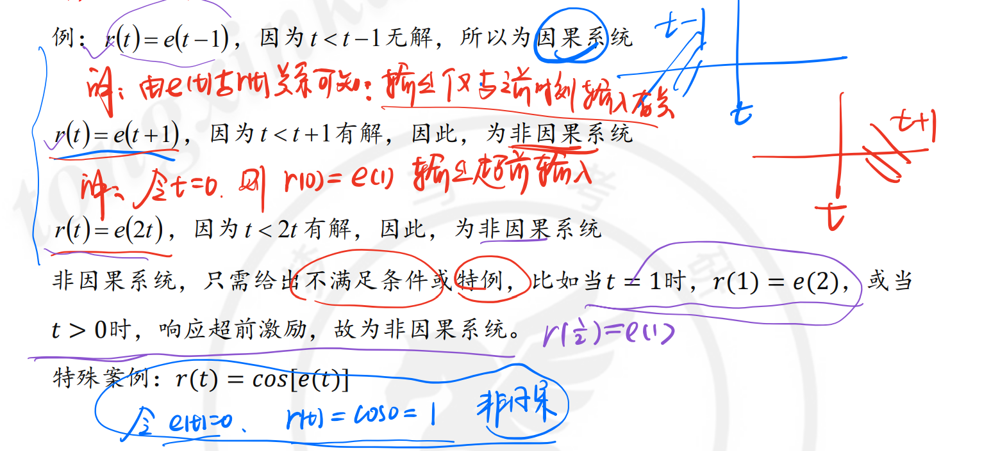

## 记忆系统与无记忆系统

- 无记忆系统/即时系统：有输入信号时即有输出信号，输出信号仅与**当前时刻的输入**有关，在时域用**代数方程**描述的系统。

- 有记忆系统/动态系统：输出信号**不仅取决于同时刻激励**信号，而且**与过去的工作状态有关的系统**[PS：某种意义上，系统输出不仅取决于当前输入，还依赖于过去或未来的输入信号**]。

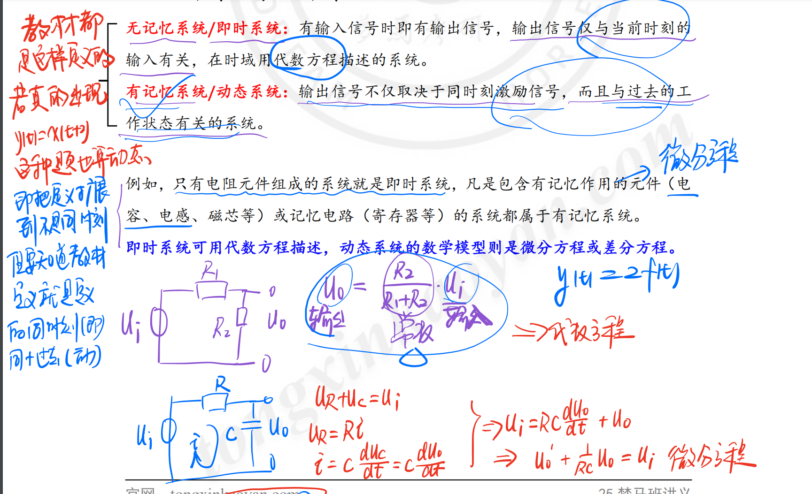

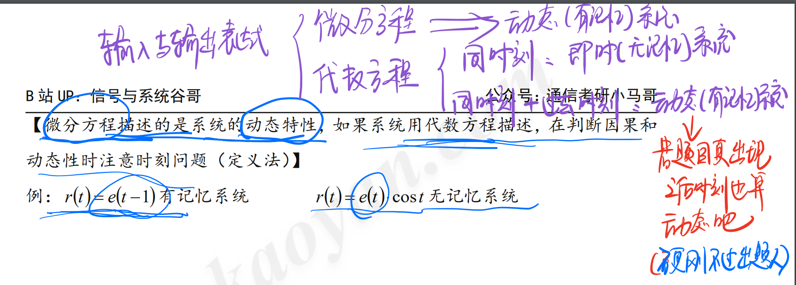

## 稳定系统与不稳定系统

1. 定义：有界输入，有界输出

2. <mark>判断方法：若$|f(x)| \le M$成立，则判断$|y(t)|$ 是否为有限数（小于无穷大）</mark>

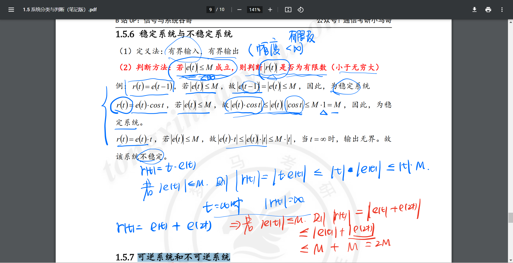

## 可逆系统和不可逆系统

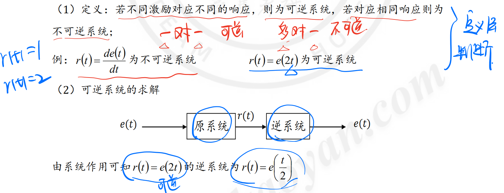

# 系统定义

系统的基本作用:**对输入信号进行加工和处理，将其转换为所需要的输出信号。**

# 系统模型

1. 系统模型：对实际系统的理想化。（对共性的抽取）

2. 集中参数系统：忽略电磁辐射，即电场和磁场可分别用C,L表示，且能量传输不需要时间。电路尺寸<<波长。

3. 分布参数系统：电磁辐射，电磁能在传输线连续分布，且能量传输需要时间。电路尺寸与波长相近。如微波传输系统

# 系统状态

定义：**系统在任意时刻$t_0$的状态，是指取该时刻最少数目的一组数，这组数连同$t_0$以后的输入足以确定$t>t_0$时刻的输出。**

# 系统分类

## 线性与非线性系统

> <mark>MARK重点</mark>

### 基础

线性系统是满足线性性质的系统。**同时满足齐次性和可加性**

$$
T[af_1(·)+bf_2(·)]=aT[f_1(·)]+bT[f_1(·)]
$$

<mark>关于T 的说明</mark>

$$
T[\left \{ 输入 \right \},\left \{ 状态 \right \}]
$$

### 动态线性系统的判定条件

**动态系统**的响应<u>不仅</u>与激励${f(·)}$有关，而且与**它过去的状态${x_0}$有关**，也称**记忆系统**。

含有记忆元件（电容、电感等）的系统是动态系统。否则称**即时系统或无记忆系统**。

公式：<mark>mark重点</mark>

完全响应：

$$
y(·)=T[\left \{  f(·)\right \},\left \{ x(0) \right \}]
$$

零状态响应：

$$
y_{zs}(·)=T[\left \{ f(·) \right \},\left \{ 0 \right \} ]
$$

零输入响应：

$$
y_{zi}(·)=T[\left \{ 0 \right \},\left \{ x(0) \right \} ]
$$

#### 动态系统判定线性

> 满足以下三个条件时，该系统为线性系统

1. **可分解性：全响应=零状态+零输入**
   
   满足可加性和齐次性

$$
y(·)=y_{zs}(·)+y_{zi}(·)
$$

2. **零状态线性**
   
   输入的线性组合=响应的线性组合
   
   $$
   T[ \left \{ af_1(t)+bf_2(t) \right \} ,\left \{ {0} \right \}]=aT[\left \{ f_1(·) \right \} ,\left \{ {0} \right \}  ]+bT[ \left \{ bf_2(·) \right \} ,\left \{ {0} \right \}]
   $$

3. **零输入线性**
   
   状态的组合为状态分别响应的组合
   
   $$
   T[ \left \{ 0 \right \} ,\left \{ {ax_1(0)+bx_2(0)} \right \}]=aT[\left \{ 0 \right \} ,\left \{ x_1(0) \right \}  ]+bT[ \left \{ 0 \right \} ,\left \{ {x_2(0)} \right \}]
   $$

### 例题

## 时变与时不变系统

### 时不变性质

时不变系统：系统输入延迟多少时间，其**零状态响应**也相应延迟多少时间。

$$
T[\left \{ 0 \right \},\left \{ x(t-t_d) \right \} ] = y_{zs}(t-t_d)
$$

### 时不变的直观判断方法

**若 $f(·)$ 出现变系数，或有反转、展缩变化，则该系统为<u>时变系统</u>。**

## 线性时不变系统 LTI

<mark>mark重点</mark>

### LTI连续系统的微分和积分特性

1. 微分特性
   
   若 $f(t)\to y_{zs}(t)$，则$f'(t) \to y_{zs}'(t)$

2. 积分特性
   
   若 $f(t)\to y_{zs}(t)$，则 $\int_{-\infty}^{t}f(x)dx \to \int_{-\infty}^t y_{zs}(x)dx$

## 因果与非因果系统

### 定义

因果系统是零状态响应不会出现在激励之前的系统。

输出只与当前时刻和过去时刻的输入有关，而与未来的输入无关。

 

$$
-3\delta(t)=[-4e^{-t}+cos(\pi t)]\delta (t)。因为\delta (t）只在0有值，将t=0d代入
$$
