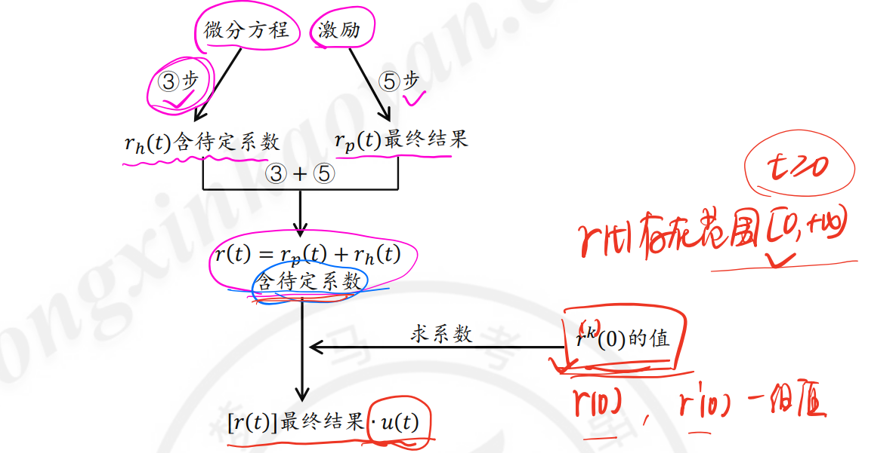
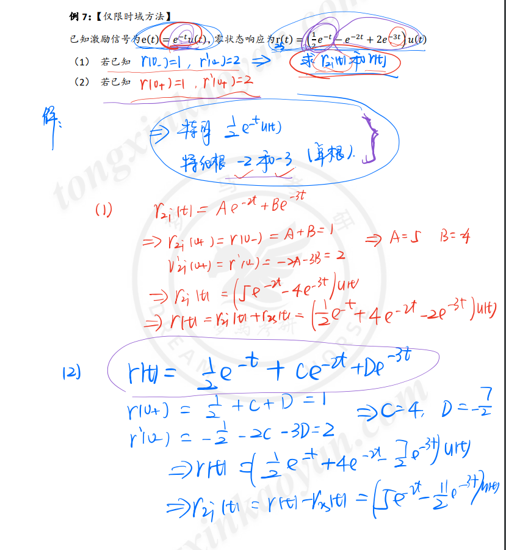
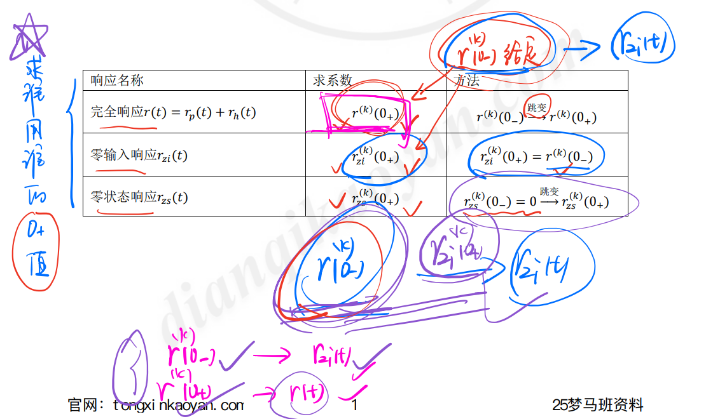

[TOC]

---

# 知识点铺设—连续系统表征形式的相互转换

## 常规图--用加法器、倍乘器和积分器表示连续系统

1. 方法1：加法器列方程-考察分程与结构的辨识认知（考研不用该方法）

2. 方法2：messon公式(秒级，后期学)

## 非常规图--属于系统框图，出现了其他器件———加法器(突破口）

## 1. 表示形式

## 2. 连续系统的微分方程

1. 微分方程的标准形式——**常系数微分方程**

$$
a_2 \frac{d^2 y(t)}{dt^2}+a_2 \frac{d y(t)}{dt}+a_0y(t)=f(t)\\y''(t)+a_1y'(t)+a_0y(t)=f(t)
$$

- 方程左边：**响应及响应各阶导数的线性组合**且响应最高阶导数项系数为1

- 方程右边：**激励及激励各阶导数的线性组合**
2. 方程阶数：**响应的最高阶导数**

## 3. 连续系统的模拟框图

1. 模拟框图基本器件

2. 连续系统的模拟框图表示——**微分方程 -> 模拟框图**

### 画图说明

<mark>mark重点</mark>

#### 方程右端不含有激励

#### 方程右端含有激励

## 4.模拟框图的微分表示

## 5. 线性时不变系统的判断与应用

### 微分方程系统LTS的判断

### 微分方程形式下LTS的判断

### 线性时不变系统的特性与应用

1. LTS 的线性性质——系统（零状态）响应与外加激励

2. LTS的时不变性质

3. LTS的微积分性质

4. LTS性质的考察

<mark>注意尺度变换的问题</mark>

# 知识点铺设—连续时间系统的时域分析

## 核心问题

<mark>重点问题</mark>

- 核心问题一:已知某系统和输入，求解系统响应/输出
  
  1. 第1章 借助于系统作用，求系统输出
  
  2. 第2章 借助于微分方程求解，求系统输出
     
     1. 完全响应=<mark>自由响应+强迫响应(经典法)=零输入响应+零状态响应(双零法)</mark>=稳态响应+暂态响应
     
     2. 求解方法:经典法、卷积法

. 核心问题二:根据系统某一表示形式，反映系统内在特性。

1. 第1章 借助于**输入和输出关系(简易表达式和微分方程)**，反映系统特性、线性时不变、因果、稳定、记忆、可逆            →**定义法判断**

2. 第2章 借助于**系统表示形式(单位冲激响应)**，反映系统特性线性时不变、因果、稳定、记忆、可逆                                    →**冲激响应(充要)法判断**

## 主要内容

1. 经典法求解自由响应、强迫响应;响应间关系求解稳态响应和暂态响应;

2. 0-到 0+状态的跳变:经典法求边界条件;

3. 双零法求解零输入响应、零状态响应；

4. 双零法的重要应用；

5. 冲激响应与阶跃响应的求解和系统内在特性判断；

6. 卷积求解与响应求解应用。

## 1. 基于微分方程的连续系统响应求解

1. 微分方程形式
   
   

2. 微分方程解形式—<mark>完全解r(t)=$齐次解f_h(t)+特解f_p(t)$</mark>

3. 响应分解与响应区间
   
   1. 完全解(完全响应)=<mark>齐次解(自由响应)+特解(强迫响应)</mark>
   
   2. 响应区间: 因果系统

## 2. 连续系统的齐次解求解

### 齐次解的求解流程

<mark>mark重点，齐次解解题目步骤</mark>

1. 列写特征方程，并因式分解;

2. 求特征根;

3. 根据特征根写齐次解解形式【含有待定系数】;

### 微分方程对齐次解的影响

LTI系统的数学模型--常系数线性微分方程的全解由齐次解和特解组成，**齐次解（零输入响应）** 的函数形式仅仅依赖于系统本身的特性，而与激励f(t)的函数形式无关，称为系统的**自由响应或固有响应**。<mark>特征方程的根称为系统的“固有频率”</mark>，它决定了系统**自由响应**的形式。但应注意，齐次解的系数是与激励有关的。

**特解（零状态响应）** 的形式由激励信号确定，称为**强迫响应**。

## 3. 连续系统的特解求解

1. 将激励带入方程右端，化简得自由项

2. 根据**t>0时自由项形式选特解形式** (含待定系数)

3. 将选定的特解带入到方程左端

4. 方程左右两端系数平衡，求待定系数

5. 得特解的最终结果

## 4. 连续系统的求解流程->三要素

## 示例

## 5. 自由响应与强迫响应的特点与辨识

1. LTI系统的数学模型--常系数线性微分方程的全解由齐次解和特解组成；

2. **齐次解的函数形式(零输入响应)** 仅仅依赖于**系统本身的特性**，而与激励f(t)的函数形式无关，称为系统的自由响应或固有响应。**特征方程的根称为系统的“固有频率”** ，它决定了系统自由响应的形式；齐次解的系数是与激励有关的。

3. **特解的形式(零状态响应)** 由激励信号确定，称为强迫响应。

## 6. 小结

# 知识点铺设——0-到0+状态

## 1. 0-到0+状态

### 1. 定义及物理意义

### 2. 响应区间 $[0_+,+\infty)$

### 3. 0-到0+状态跳变的图形化解释

## 2. 冲激函数匹配法

### 1. 0-到0+发生跳变的判断方法

### 2. 冲激函数匹配法列写

### 3. 连续系统经典法求解流程（完整）

<mark>mark重点掌握</mark>

### 4. 示例

# 知识点铺设——连续系统的双零法分析

## 1. 系统双零法分解

## 2. 零输入响应的求解

1. 零输入满足方程**齐次方程（右边等于0）**

2. $y_{zi}(t)$对应齐次微分方程，所以不存在跃变，即：
   
   $$
   y_{zi}^{(j)}(0_+)=y_{zi}^{(j)}(0_-)=y^{(j)}(0_-)
   $$
   
   **说明一下**：零输入响应即没有输入，没有输入系统就不会产生跳变，**所以$0_+和0_-$相等**

## 3. 零状态响应的求解

1. 零状态响应满足方程：非齐次响应=>齐次解+特解
2. **零状态响应 0_ 时为零**。

  

## 小结

## 4. 完全响应分解及其关联

### 系统的完全响应

<mark>mark重点注意下两者的关联和区别</mark>

### 完全响应求解流程

<mark>重点</mark>

### 解形式下各响应的判断

## 5. 总结

<mark>mark总结</mark>

# 知识点总结——连续系统的双零法应用与求解

## 连续时间系统时域分析流程

## 完全响应求解流程

## 各响应的解形式特点与关联

## 1. 边界条件对双零法的影响

# 连续系统的描述

## 电路图建立微分模型

## 数学模型

抽取其具有的物理含义，**微分方程**写成：

$$
a_2 \frac{d^2 y(t)}{dt^2}+a_2 \frac{d y(t)}{dt}+a_0y(t)=f(t)
$$

### 相似系统

> 能用相同方程描述的系统

# 微分方程的模拟框图

## 基本部件

$$
a_2 \frac{d^2 y(t)}{dt^2}+a_2 \frac{d y(t)}{dt}+a_0y(t)=f(t)\\y''(t)+a_1y'(t)+a_0y(t)=f(t)
$$

- 基本运算：数乘、微分、相加

- 基本部件：加法器、数乘器、积分器

## 模拟框图

> 将微分方程用基本部件的相互连接表征出来的图，称为**框图**

<mark>列方程围绕求和器列方程</mark>

 

再加上 $y(t)=4x'(t)+x(t)$

# 微分方程的经典解法

## 经典解

<mark>mark重点</mark>

$y(t)=y_h(t)(齐次解)+y_p(t)(特解)$

**齐次解**是对应齐次微分方程的解：

$y^{(n)}+a_{n-1}y^{n-1}+...+a_1y^{(1)}(t)+a_0y(t)=0$

**特征根**为$\lambda^n+a_{n-1}\lambda^{n-1}+...+a_0=0$的根$\lambda_i(i=1,2,...,n)$，由特征根可以得到齐次解的函数形式。

**特解**的函数形式与激励的函数形式有关。

## 齐次解的常用函数形式

## 特解的常用函数形式

## 示例

# 连续系统的初始值

- **初始值**是 n 阶系统在$t=0$时接入激励，其响应在 $t=0$ 时刻的值，即$y^{(j)}(0_+)(j=0,1,2,3,4,...,n-1)$。

- **初始状态**是指系统哦那个在激励尚未接入的 $t=0_-$时刻的响应值 $y^{(j)}(0_-)$，该值反映了**系统的历史情况**，而与激励无关

- **为求解微分方程，需要从已知的初始状态$y^{(j)}(0_-)$求得$y^{(j)}(0_+)$.**

## 示例

- 这里只有 $y''(t)包含\delta(t)$ 的原因在于只能由最高项匹配，如果说 由 $y'(t)包含\delta(t)$那么会产生导致$y''(t)$产生$\delta'(t)$，则等式不相等；

- $y'(0_+) \neq y'(0_-)$是 因为 $y''(t)包含\delta(t)$，$\delta(t)$会产生一个冲激，所以低一阶导数必然为跃变函数，且不相等；

- 因为 $y'(t)$ 不产生$\delta(t)$，也就是意味着低一阶导数$y(t)$的$0_-,0_+$相等。

 

<mark>结论：mark重点</mark>

- 微分方程等号右端含有 $\delta(t)$ 时，仅在等号左端$y(t)$得最高阶导数中含有$\delta(t)$，则$y(t)$的次高阶跃变，其余连续；

- 若右端不含冲激函数，则不会跃变。

# 零输入响应

$$
y(t)=y_{zi}(t)+y_{zs}(t)
$$

## 初始值的确定

$$
y^{(t)}(0_-)=y_{zi}^{j}(0_-)+y_{zs}^{j}(0_-)=0\\
y^{(t)}(0_+)=y_{zi}^{j}(0_+)+y_{zs}^{j}(0_+)\\
j=0,1,2,...,n-1
$$

在 $y^{(t)}(0_-)$ 时，$y_{zs}^{j}(0_-) = 0$，因为此时输入为0，所以零状态响应为0

$y_{zi}(t)$对应齐次微分方程，所以不存在跃变，即：

$$
y_{zi}^{(j)}(0_+)=y_{zi}^{(j)}(0_-)=y^{(j)}(0_-)
$$

**说明一下**：零输入响应即没有输入，没有输入系统就不会产生跳变，**所以$0_+和0_-$相等**

## 求解步骤

1. 设定齐次解；

2. 带入初始值，求待定系数。

补充说明：

1. 零输入响应对应齐次微分方程，所以不存在跃变。此时**齐次解等于零输入响应**
   
   $$
   y_{zi}(t)=y_h(t)
   $$

## 示例

# 零状态响应

## 初始值的确定

$$
y_{zs}^{(j)}(0_-)=0，j=0,1,2,3...,n-1
$$

**在 $y^{(t)}(0_-)$ 时，$y_{zs}^{j}(0_-) = 0$，因为此时输入为0，所以零状态响应为0**

1. 由系统匹配法，从 $y_{zs}^{j}(0_-)=0$，求$y_{zs}^{j}(0_+)=0$

2. 先求$y_{zi}^{j}(0_+)$，再求$y_{zs}^{j}(0_+)=y^{j}(0_+)-y_{zi}^{j}(0_+)$。零状态响应=全响应-零输入响应

3. **特解等于零状态响应**

## 求解步骤

1. 设定齐次解；

2. 设定特解，带入方程求解

3. 带入初始值，求待定系数。齐次解等于

## 示例

- $y_{zsp}(t)=p$ 属于一个常量，所以代入求导后得 $2p=6$ 了。

- $2\delta(t)是一个跳变，也是在0+时刻被包含进了6\varepsilon(t)里面$

- $y_{zs}'(0_+)-y_{zs}'(0_-)=2$是由于$y_{zs}''$产生$2\delta(t)$所以说产生了2倍的冲激，那么$f_{zs}(t)$则会产生一个阶跃，类似于从$0_- \to 0_+$时，值从$0\to2$。

# 响应分类

## 固有响应和强迫响应

**固有响应**仅与**系统本身的特性有关**，而与**激励的函数形式无关**。

齐次解的函数形式**仅与特征方程的根有关**，特征方程的根称为系统的**固有频率**。**齐次解常被称为系统的固有响应或自由响应**。

**强迫响应与激励的函数形式有关**。

**特解的函数形式与激励的函数形式有关，常被称为强迫响应。**

## 暂态响应和稳态响应

**暂态响应是指响应中暂时出现的分量**，随着时间的增长，它将消失。**（极限->0）**

**稳态响应是稳定的分量**。若存在，通常表**现为阶跃函数和周期函数**。比如电路系统中的直流稳态响应和正弦稳态响应。

## 示例

