[TOC]

---

# 知识点铺设——冲激响应与阶跃响应

## 知识回顾

1. 经典法--完全响应=自由响应+强迫响应

2. 双零法--完全响应=零输入响应+零状态响应

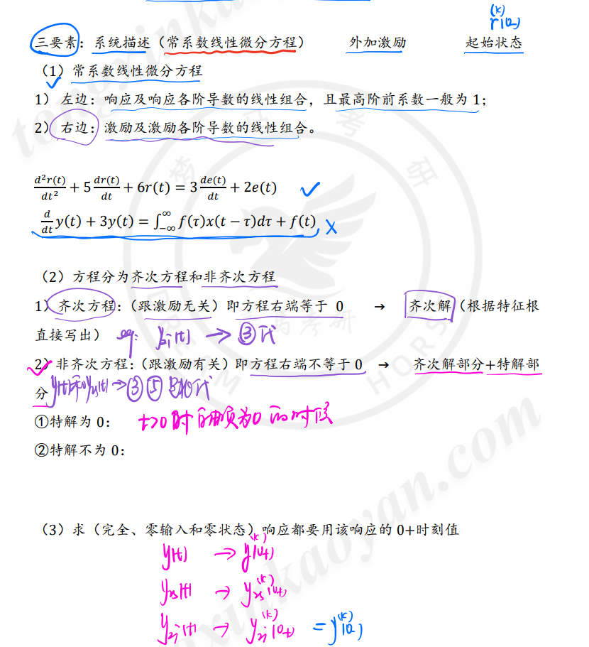

## 1. 冲激响应的求解

1. 定义

<mark>$in\to \delta(t)，out \to h(t) \space; h^{k}(0_-)=0$</mark>

以单位 **冲激信号δ(t)** 作激励，系统产生的**零状态响应**称为“单位冲激响应"或简称“冲激响应”，以h(t)表示。

2. 经典法求解

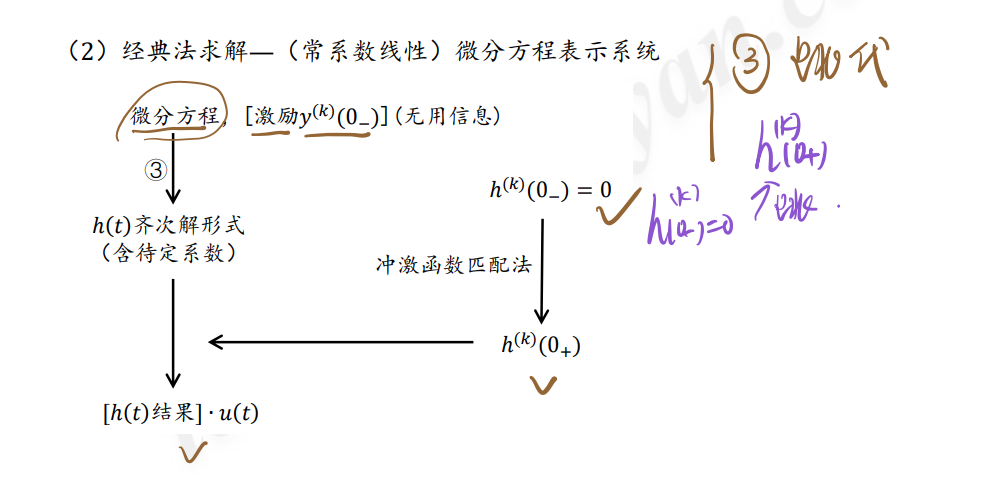

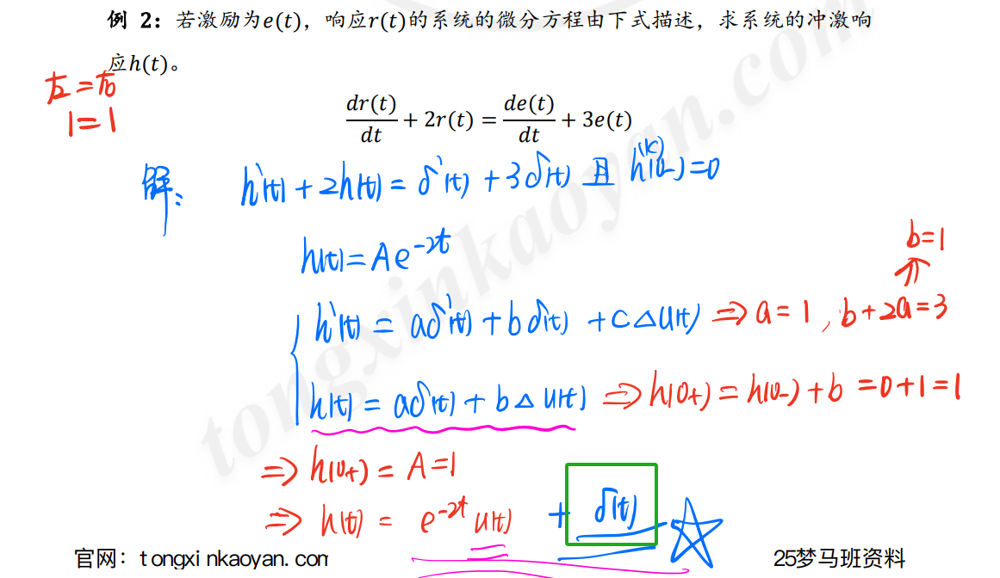

## 2. 特殊情况下冲激函数匹配法的应用

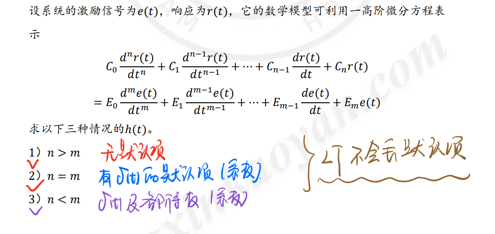

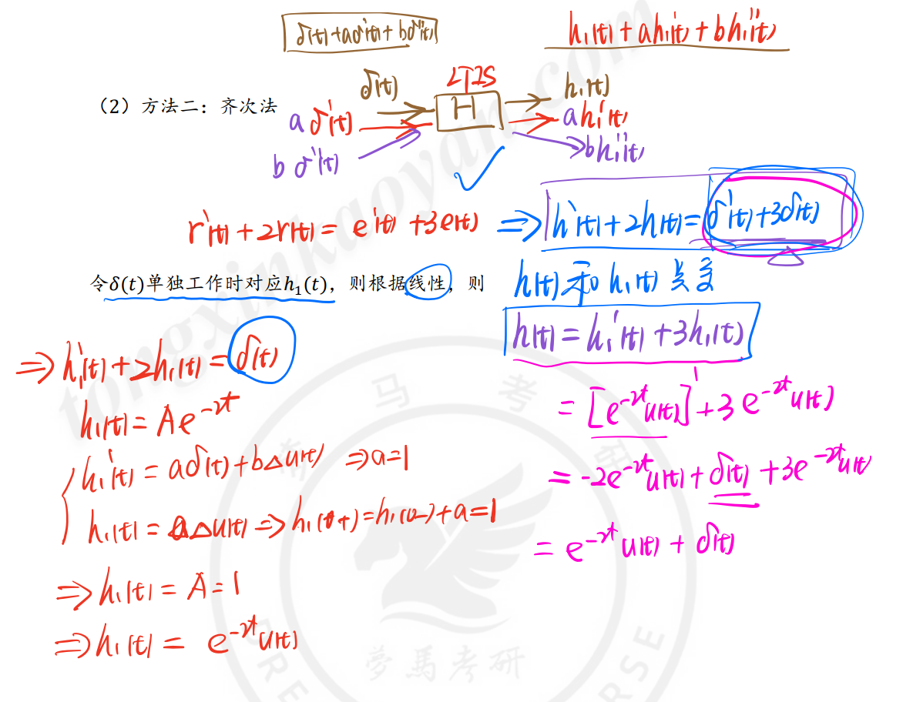

3. 方法比较

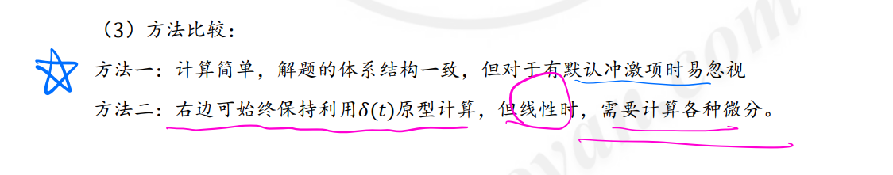

## 3. 阶跃响应的求解

1. 定义

<mark>$in\to u(t)，out\to g(t);g^{k}(0_-)=0$</mark>

以 **单位阶跃信号u(t)** 作激励，系统产生的**零状态响应**称为“单位阶跃响应”或简称阶跃响应”，以 **g(t)** 表示。

2. 经典法求解

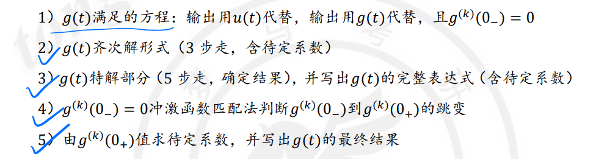

3. 微积分求解法

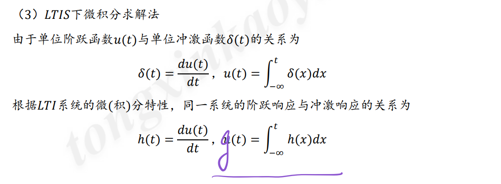

## 4. h(t)和g(t)求解法

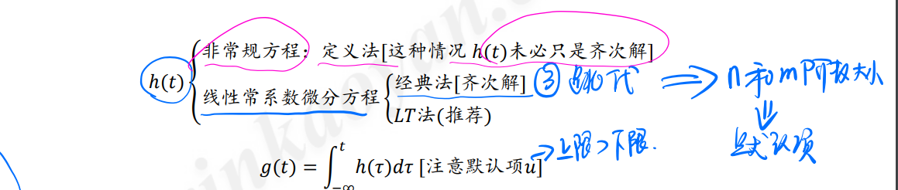

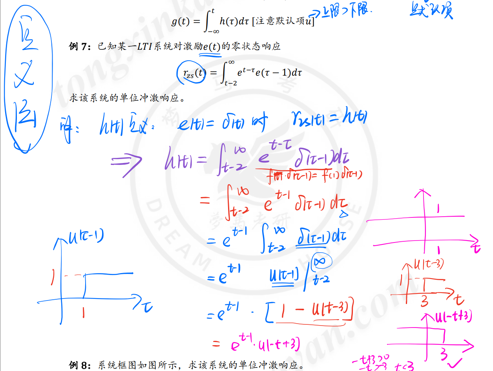

## 5. h(t)系统表示和应用

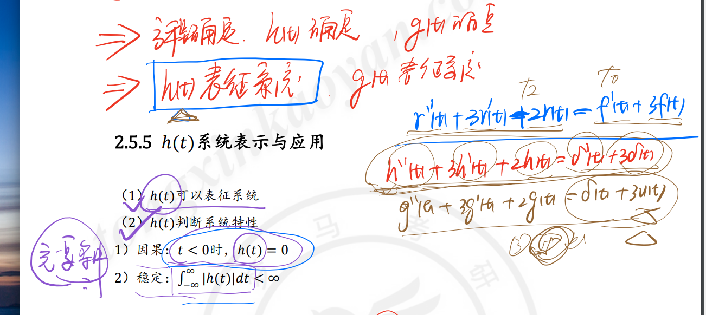

# 冲激响应

## 定义

**冲激响应**是单位冲激函数 $\delta(t)$ 所引起的**零状态响应**，记为 $h(t)$

$h(t)$**隐含条件**：

$$
f(t)=\delta(t)\\
h(0_-)=h'(0_-)=0;
$$

## 求解方法

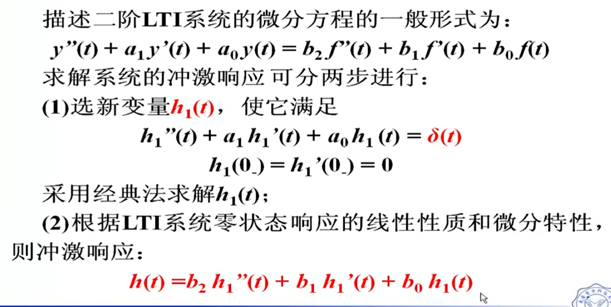

## 示例

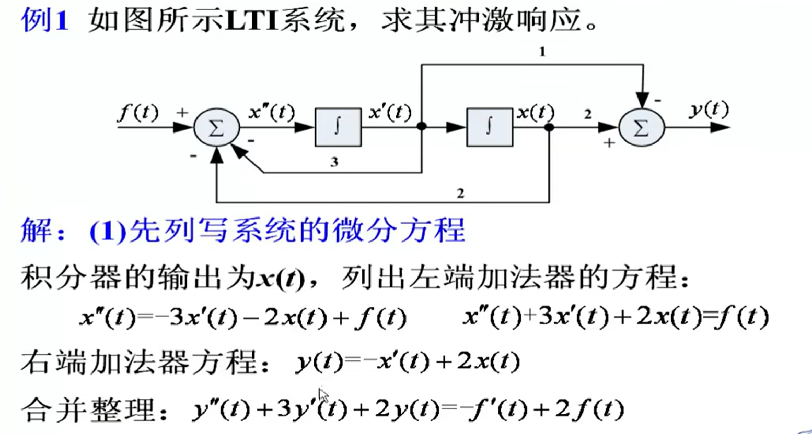

1. 这里把$f(t)$是一个输入，$x(t)$ 是响应，那输入一个$\delta(t)$时，对应的响应也需要换成冲激响应$h(t)$

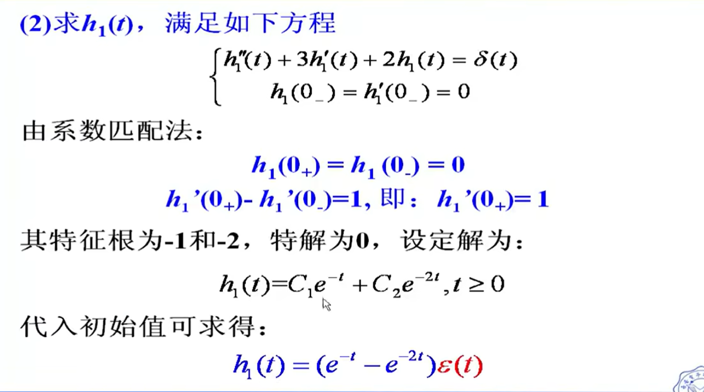

1. 对上式从$0_- \to 0_+$求积分，得到后面部分。

2. 将 $h_1''(t)+3h_1''(t)+2h_1(t)=0$ 得出特征根，并根据特征根数量判定为2个，且函数式 $e^t$ 。

3. $t>=0$和$\varepsilon(t)$的区别 ，前者米有说明t<0时是多少，但后者隐含的说了小于0为0.

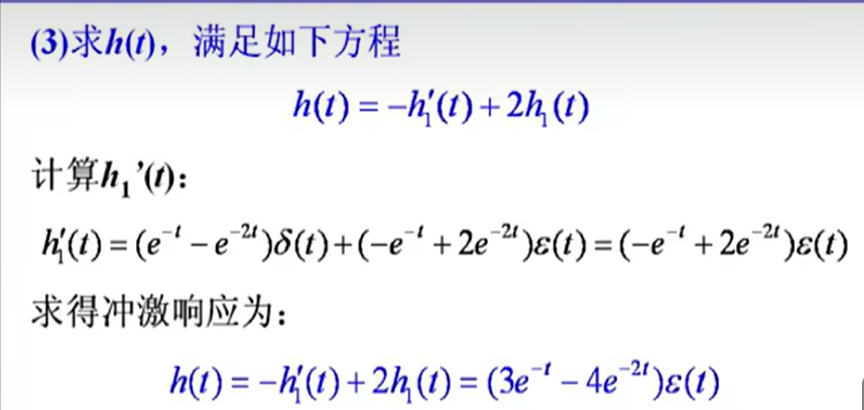

## 小结

结合零状态响应的线性性质和微分性质，来简化求解过程；若直接进行求解，方程右端将会出现冲激函数的各阶导数。

# 阶跃响应

## 定义

**阶跃响应**就是由单位阶跃函数 $\varepsilon(t)/u(t)$ 所引起的**零状态响应**，记为 $g(t)$.

隐含条件

$$
f(t)=\varepsilon(t)=g(t)\\
g(0_-) = g'(0_-)=0
$$

## 求解方法

### 方法一

利用**线性性质和微分性质**

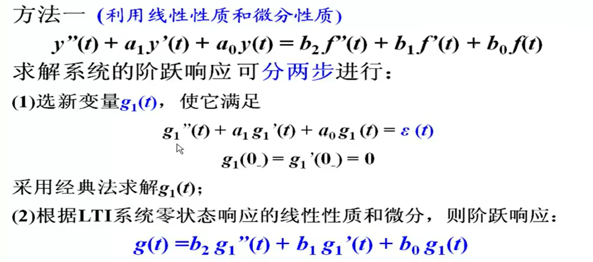

## 方法二

利用**单位阶跃函数 $\varepsilon(t)$ 与单位冲激函数 $\delta(t)$ 的关系：**

$$
\varepsilon(t)= \int_{-\infty}^{t}\delta(\tau) d\tau，\delta(t)=\frac{\mathrm{d} \varepsilon(t)}{dt}
$$

根据LTI系统的微积分特性，阶跃响应与冲激响应的关系为：

$$
g(t)= \int_{-\infty}^{t} h (\tau) d\tau，h(t)=\frac{\mathrm{d} g(t)}{dt}
$$

## 示例

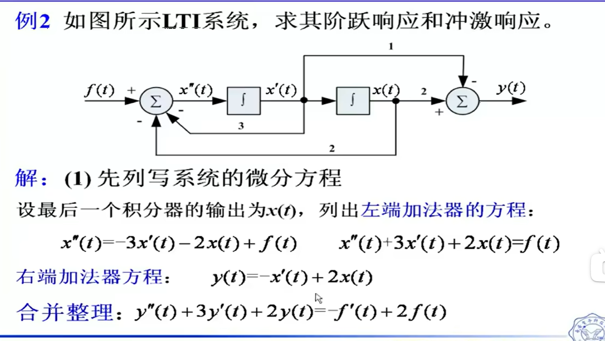

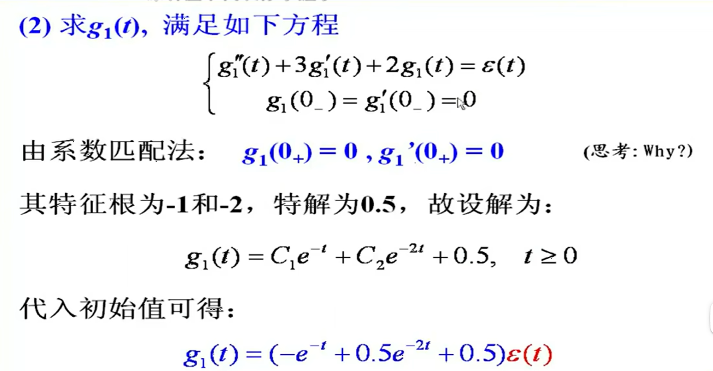

- **这里因为 $\varepsilon(t)$ 是由 $g_1''(t)$ 产生的，如果说右侧出现 $\delta(t)$ ，那么表示此时出现了阶跃，所以可推出 $g_1(0_+)=g_1'(0_+)=0$**

- 这里的特解为0.5是由于两个特征根均不为0，且$g_1(t)为t的形式$，所以 特解 为 $y_p(t)=P_1t+P_0=Q$，所以带入式子后 ，由于Q是一个常数，求导后为0，且 $\varepsilon(t)>0时，\varepsilon(t)=1$，只留下 $2Q = 1$，所以 $Q=0.5$，即特解为 0.5

- 最后写 $\varepsilon(t)$ 的原因在于，$g_1(0_-)=0$，所以需要写。**需要注意与 $t \ge 0$ 的区别。**

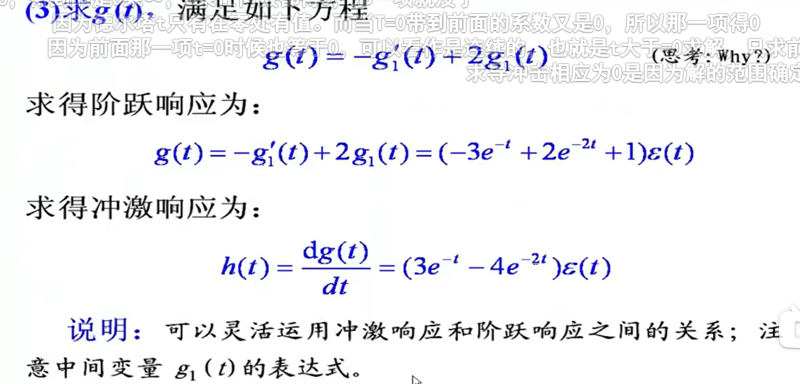

- 因为是线性组合性质。
