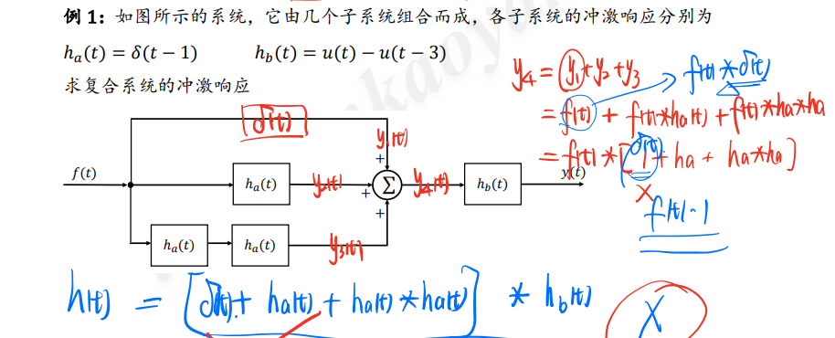
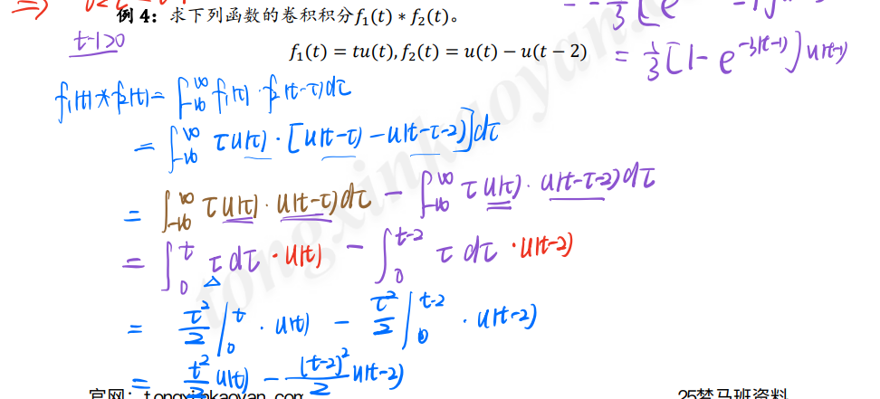
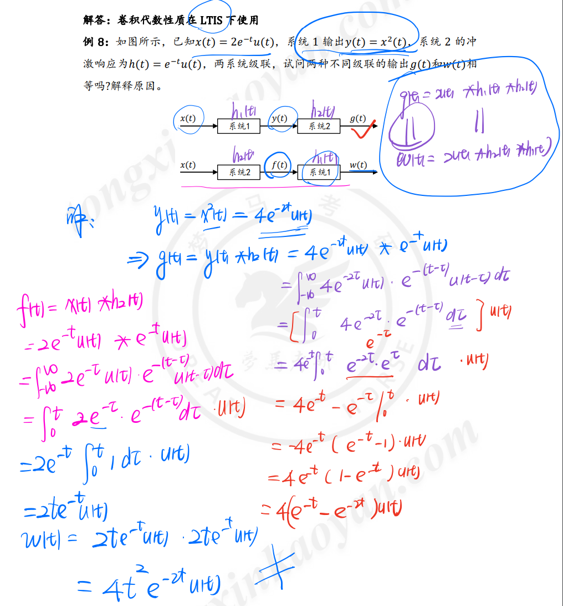
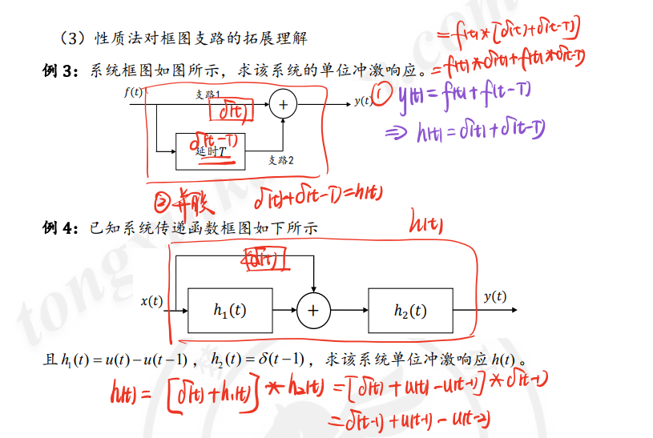
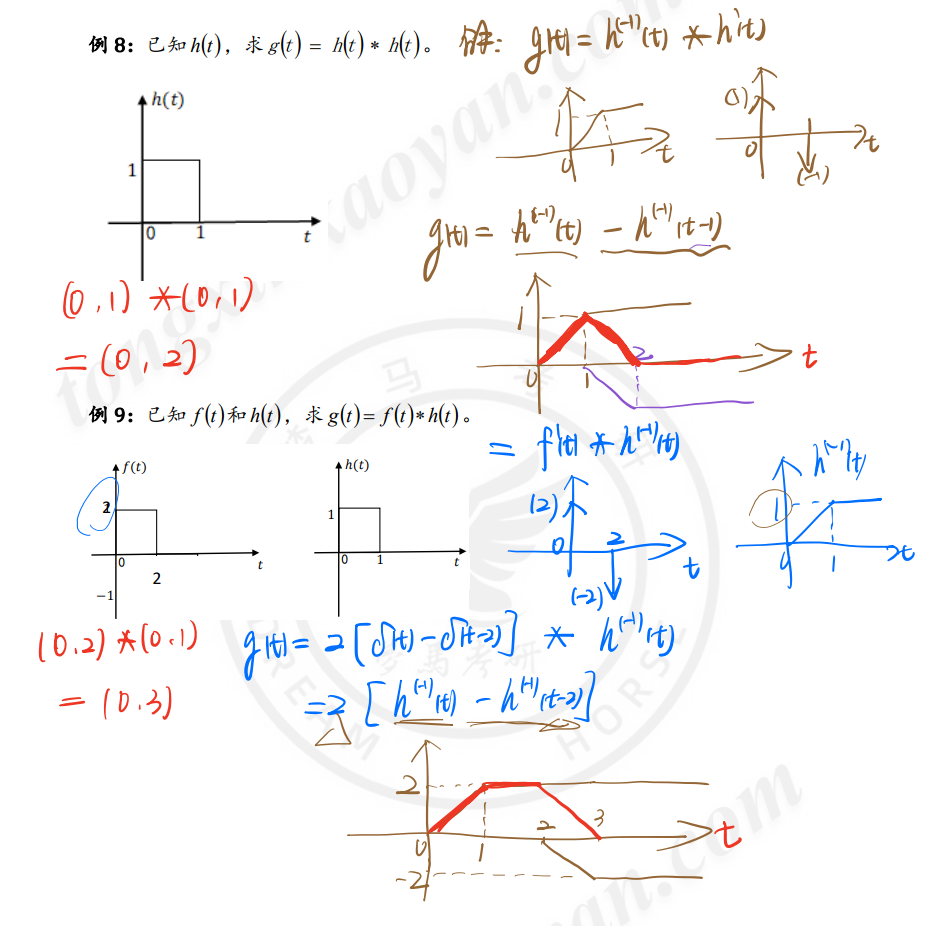

[TOC]

---

# 知识点铺设——卷积性质及其系统表示

## 1.卷积定义及其隐含特性

$$
\lim_{\Delta \to 0} \hat{f}(t)=f(t)=\int_{-\infty}^{\infty}f(\tau)\delta(t-\tau)d\tau=f(t)*\delta(t)
$$

$$
y_{zs}(t)=\int_{-\infty}^{\infty}f(\tau)h(t-\tau)d\tau=f(t)*h(t)
$$

## 2. 卷积应用与系统表示

## 3. 卷积的代数性质

<mark>j经过系统的，就算没有处理，也默认要卷一个$\delta(t)$</mark>

## 4. 求解办法1：表达式法：借助于u的范围限制

### 4.1 基于表达式法的卷积正向求解

### 4.2 基于表达式法的卷积逆向运算——求解冲激响应

## 5.求解办法2： 图解法

示例

## 6. 求解办法3：性质法

### 公式总结

<mark>mark重要。重要公式</mark>

- $K*f(t)=K[f(t)波形的净面积值]$

- $f(t)*\delta(t)=f(t);$

- $f(t)*\delta'(t)=f'(t)*\delta(t)=f'(t);$

- $f(t)*\varepsilon(t)=f(t)*\delta^{(-1)}(t)=f^{(-1)}(t)*\delta(t)=f^{(-1)}(t)=\int_{-\infty}^{t}f(\tau)d\tau$

- $\varepsilon(t)*\varepsilon(t)=t\varepsilon(t)$

- $e^{-at}\varepsilon(t)*e^{-at}\varepsilon(t)=te^{-at}\varepsilon(t)$

- $e^{-a_1t}\varepsilon(t) *e^{-a_2t}\varepsilon(t)=\frac{1}{a_2-a_1} (e^{-a_1t}-e^{-a_2t})\varepsilon(t)  ;  (a_1 \ne  a_2)$

- $\varepsilon *e^{-at}\varepsilon(t)=\frac{1}{a} (1-e^{-at})\varepsilon(t)$

- $f(t)*\delta_T(t)=f(t)*\sum_{m=-\infty }^{\infty } \delta (t-mT)=\sum_{m=-\infty }^{\infty } f (t-mT)$

<mark>mark重点</mark>

在 $f_1(-\infty)=0$或$f_2^{(-1)}(+\infty)=0$的前提下：

$$
f_1(t)*f_2(t)=f_1'(t)*f_2^{(-1)}(t)
$$

### 1. 与冲激信号的卷积

1. $f(t)*\delta(t)=f(t)$

2. $f(t)*\delta(t-t_0)=f(t-t_0)$

3. $\delta(t-a)*\delta(t-b)=\delta(t-a-b)$

### 2. 与阶跃信号的卷积

### 3. 性质法对框图支路的扩展理解

### 4. 卷积的微积分性质

1. 微分性质
   
   $$
   \frac{\mathrm{d}^{n}}{\mathrm{d} t} [f_1(t)*f_2(t)]
=\frac{\mathrm{d}^{n}f_1(t)}{\mathrm{d} t} *f_2(t)
=f_1(t)*\frac{\mathrm{d}^{n}f_2(t)}{\mathrm{d} t} 
   $$

2. 积分性质

$$
\int_{-\infty}^{t} [f_1(\tau)*f_2(\tau)]d\tau=\int_{-\infty}^{t} f_1(\tau)d\tau f_2(t)= f_1(t) \int_{-\infty}^{t} f_2(\tau)d\tau
$$

3. 重点应用

## 7. 求解办法4： 微积分图解法

示例

#### 结论

<mark>mark</mark>

1. 卷积后信号的宽度和范围

2. 两个矩形的卷积结论

<mark>宽度相等，卷积结果为等腰三角形;宽度不等，卷积结果为等腰梯形</mark>

# 前言

卷积的本质是信号的分解。

信号分解：将 $f(t)$ 分解为基本信号的线性组合

# 信号的时域分解

## 预备知识

- $p(t)$ 的面积为1，

## 任意信号分解

- 取极限后$\hat{f}(t)$就由离散和变成连续和

- $\Delta \to d \tau ; n\Delta \to \tau; \sum \to \int; p(t-n\Delta) \to \delta(t-\tau) $

<mark>mark重点式子</mark>

$$
\lim_{\Delta \to 0} \hat{f}(t)=f(t)=\int_{-\infty}^{\infty}f(\tau)\delta(t-\tau)d\tau=f(t)*\delta(t)
$$

# 卷积公式

$$
\lim_{\Delta \to 0} \hat{f}(t)=f(t)=\int_{-\infty}^{\infty}f(\tau)\delta(t-\tau)d\tau=f(t)*\delta(t)
$$

<mark>mark重要式子，卷积积分</mark>

$$
y_{zs}(t)=\int_{-\infty}^{\infty}f(\tau)h(t-\tau)d\tau=f(t)*h(t)
$$

## 定义：卷积积分

已知定义在区间$(-\infty,\infty)$上的两个函数$f_1(t)和f_2(t)$，则定义积分

$$
y(t)=\int_{-\infty}^{\infty}f(\tau)h(t-\tau)d\tau=f(t)*h(t)
$$

为$f_1(t)与f_2(t)$的卷积积分，简称卷积；定义式记为

$$
f(t)=f_1(t)*f_2(t)=\int_{-\infty}^{\infty}f_1(\tau)f_2(t-\tau)d\tau
$$

<mark>注意</mark>：积分是在虚设的变量 $\tau$ 下进行的，$\tau$ 为积分变量，t为参变量。结果 仍为**t的函数**。**可演变其他上下限**。

1. $f_1(t)=f_1(t)\varepsilon(t) \to \int_{0}^{+\infty}$

2. $f_2(t)=f_2(t)\varepsilon(t-\tau) \to \int_{-\infty}^{t}$ 。因为这里带入定义式子中，$\varepsilon(t-\tau)$表示 $t-\tau$要大于0，那么 $\tau$ 要小于 t 。

3. $f_1(t)\varepsilon(t).f_2(t)\varepsilon(t) \to \int_{0}^{t}$

## 示例

# 卷积积分的图解法

## 求解方法

<mark>mark重点。图解法分为四步：</mark>

1. **换元**。t 换为 $\tau$ $\to$ 得$f_1(\tau),f_2(\tau)$

2. **反转平移**。由$f_2(\tau)$反转 $\to f_2(-\tau)$右移 $t\to f_2(t-\tau)$

3. **乘积**。$f_1(\tau)f_2(t-\tau)$

4. **积分**。$\tau$ 从 $-\infty到\infty$对乘积项积分。

说明

1. 图解法重在概念解释，一般适用于简单图形；

2. 求某一时刻卷积值比较方便；

3. **确定积分的上下限是关键。**

## 示例

### 示例一

### 示例二

- 信号的相乘是**信号叠加**，在$(3,4)$区间内，红的高是1，蓝的高2，底宽是1是，所以是$2*1*1$

# 卷积积分的代数性质

## 满足乘法三律

1. 交换律：$f_1(t)*f_2(t)=f_2(t)*f_1(t)$

2. 分配律：$f_1(t)*[f_2(t)+f_3(t)]=f_1(t)*f_2(t)+f_1(t)*f_3(t)$

3. 结合律：$[f_1(t)*f_2(t)]*f_3=f_1(t)*[f_2(t)*f_3(t)]$

$$
f_1(t)*f_2(t)=\int_{-\infty}^{\infty}f_1(\tau)f_2(t-\tau)d\tau=\int_{-\infty}^{\infty}f_2(\tau)f_1(t-\tau)d\tau
$$

## 复合系统的冲激响应

- 输入为 $\delta(t)$，产生冲激响应 $h(t)$。注意是零状态响应。

# 奇异函数的卷积特性

<mark>mark重点</mark>

## 对 $\delta(t)$ 卷积

$$
f(t)*\delta(t)=\delta(t)*f(t)=f(t)\\
f(t)*\delta(t-t_0)=f(t-t_0)
$$

证明：

$$
\delta(t)*f(t)=\int_{-\infty}^{\infty}\delta(\tau)f(t-\tau)d\tau = f(t)
$$

## 对 $\delta'(t)$ 卷积

$$
f(t)*\delta'(t)=f'(t)\\
f(t)*\delta^{(n)}(t)=f^{(n)}(t)
$$

证明：

$$
\delta'(t)*f(t)=\int_{-\infty}^{\infty}\delta'(\tau)f(t-\tau)d\tau = f'(t)
$$

## 对 $\varepsilon(t)$ 卷积

$$
\varepsilon(t)*\varepsilon(t)=t\varepsilon(t)\\
f(t)*\varepsilon(t)=\int_{-\infty}^{t}f(\tau)d\tau
$$

# 卷积的微积分性质

<mark>mark重点</mark>

## 卷积求导

$$
\frac{\mathrm{d}^{n}}{\mathrm{d} t} [f_1(t)*f_2(t)]
=\frac{\mathrm{d}^{n}f_1(t)}{\mathrm{d} t} *f_2(t)
=f_1(t)*\frac{\mathrm{d}^{n}f_2(t)}{\mathrm{d} t} 
$$

证明：

$$
上式=\delta^{(n)}(t)*[f_1(t)*f_2(t)]\\
=[\delta^{(n)}(t)*f_1(t)]*f_2(t)\\
=f_1^{(n)}(t)*f_2(t)
$$

## 卷积积分

$$
\int_{-\infty}^{t} [f_1(\tau)*f_2(\tau)]d\tau=\int_{-\infty}^{t} f_1(\tau)d\tau f_2(t)= f_1(t) \int_{-\infty}^{t} f_2(\tau)d\tau
$$

证明：

$$
上式=\varepsilon(t)*[f_1(t)*f_2(t)]\\
=[\varepsilon(t)*f_1(t)]*f_2(t)\\
=f_1^{(-1)}(t)*f_2(t)
$$

## 无穷的情况（重点）

<mark>mark重点</mark>

在 $f_1(-\infty)=0$或$f_2^{(-1)}(+\infty)=0$的前提下：

$$
f_1(t)*f_2(t)=f_1'(t)*f_2^{(-1)}(t)
$$

## 示例

# 卷积的时移特性

## 定义

若 $f(t)=f_1(t)*f_2(t)$

则 $f_1(t-t_1)*f_2(t-t_2)\\=f_1(t-t_1-t_2)*f_2(t)\\=f_1(t)*f_2(t-t_1-t_2)\\=f(t-t_1-t_2)$

## 示例

### 示例一

### 示例二

# 卷积公式（重要）

<mark>mark重要。重要公式</mark>

- $K*f(t)=K[f(t)波形的净面积值]$

- $f(t)*\delta(t)=f(t);$

- $f(t)*\delta'(t)=f'(t)*\delta(t)=f'(t);$

- $f(t)*\varepsilon(t)=f(t)*\delta^{(-1)}(t)=f^{(-1)}(t)*\delta(t)=f^{(-1)}(t);$

- $\varepsilon(t)*\varepsilon(t)=t\varepsilon(t)$

- $e^{-at}\varepsilon(t)*e^{-at}\varepsilon(t)=te^{-at}\varepsilon(t)$

- $e^{-a_1t}\varepsilon(t) *e^{-a_2t}\varepsilon(t)=\frac{1}{a_2-a_1} (e^{-a_1t}-e^{-a_2t})\varepsilon(t)  ;  (a_1 \ne  a_2)$

- $\varepsilon *e^{-at}\varepsilon(t)=\frac{1}{a} (1-e^{-at})\varepsilon(t)$

- $f(t)*\delta_T(t)=f(t)*\sum_{m=-\infty }^{\infty } \delta (t-mT)=\sum_{m=-\infty }^{\infty } f (t-mT)$

# 卷积的多种求解方法

卷积的方法可以归纳为：

1. **利用定义式、直接进行积分**。对于容易求积分的函数比较有效。如指数函数，多项式函数等。
   
   $$
   f_1(t)*f_2(t)=\int_{-\infty}^{\infty}f_1(\tau)f_2(t-\tau)d\tau=\int_{-\infty}^{\infty}f_2(\tau)f_1(t-\tau)d\tau
   $$

2. 图解法。特别适用于求某时刻点上的卷积值

3. 利用性质。比较灵活。

## 示例

# 用梳状函数卷积产生周期信号

> 回顾：卷积的时移特性

$$
y(t)=f(t)*\delta(t-t_0)=[f(t)*\delta(t)]_{t\to t-t_0}=f(t-t_0)
$$

## 什么是梳状函数

> 周期为T的周期单位冲激函数序列，常称为梳状函数。

$$
\delta_T(t)=\sum_{m=-\infty }^{\infty } \delta (t-mT)
$$

推论：

$$
f(t)*\delta(t)=f(t)\\
\text{如果式子卷上一个KT} \\
f(t)*\delta(t-KT)=f(t-KT)
$$

**计算函数$f(t)$和$\delta_T(t)$ 的卷积:**

$$
f(t)*\delta_T(t)=f(t)*\sum_{m=-\infty }^{\infty } \delta (t-mT)=\sum_{m=-\infty }^{\infty } f (t-mT)
$$

## 卷积结果讨论

<mark>mark重点。采样</mark>

卷积后，函数依然是**周期信号**，其周期为T。

(1)当$T> \tau$时，$f_T(t)$中每个周期内的波形与$f(t)$相同:
(2)若$T < \tau$时，各相邻脉冲之间将会出现重叠，将无法使波形$f(t)$在$f_T(t)$的每个周期中重现。

# 矩形脉冲的卷积产生三角形和梯形脉冲

## 结论

<mark>mark重点，结论</mark>

两个不同宽的门函数卷积时，其结果为**梯形函数**，梯形函数的**高度为窄门的门宽**(**面积**)，其上底为**两个门函数宽度之差绝对值，下底为两个门函数宽度之和**。

## 示例

### 示例一

### 示例二

**<mark>练习</mark>**

尝试用 阶跃脉冲表示函数卷积前后

**4种方式表示三角脉冲**

