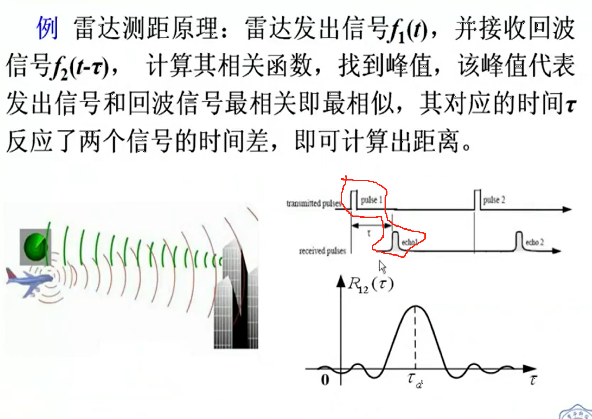
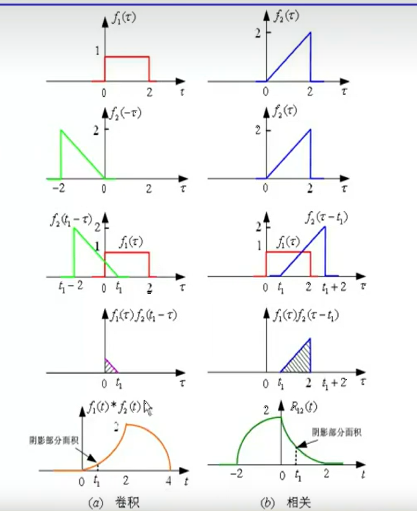
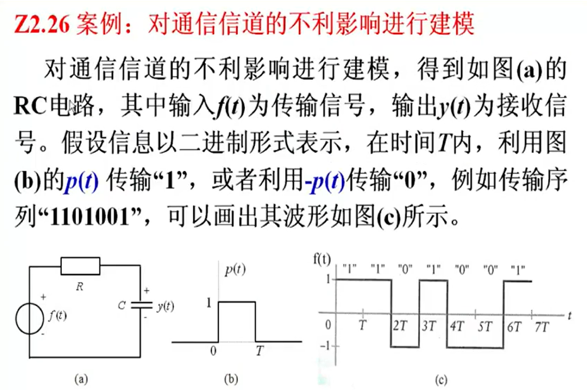
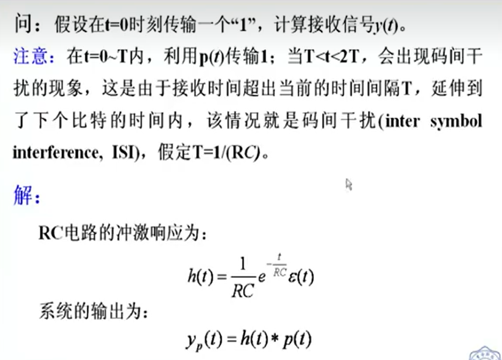
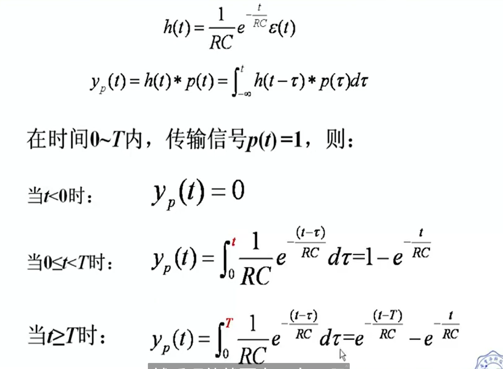
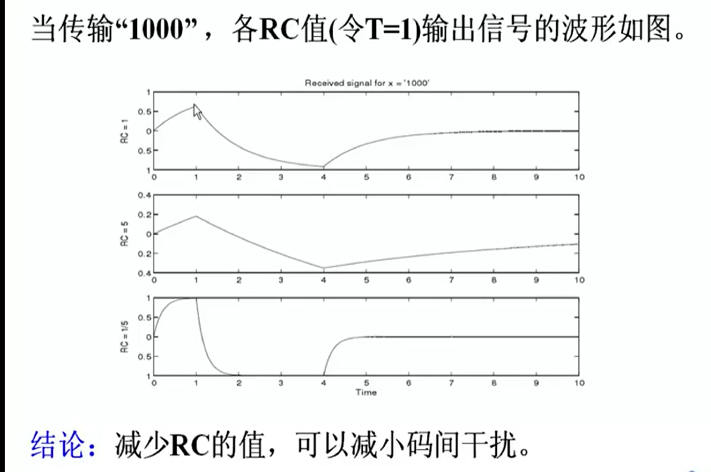
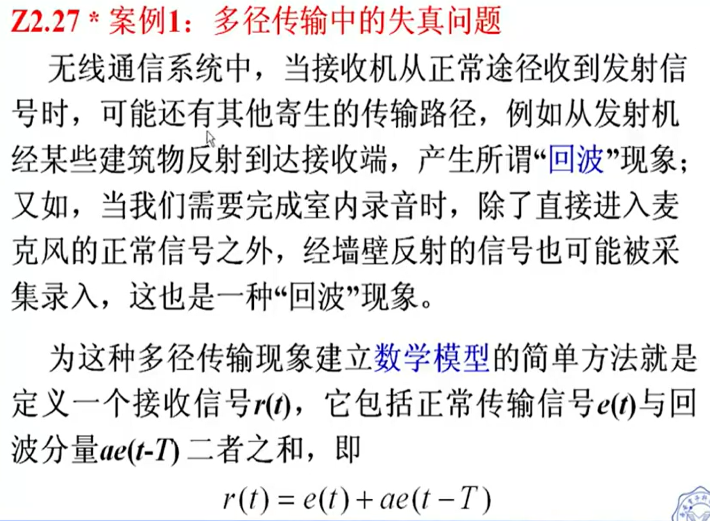
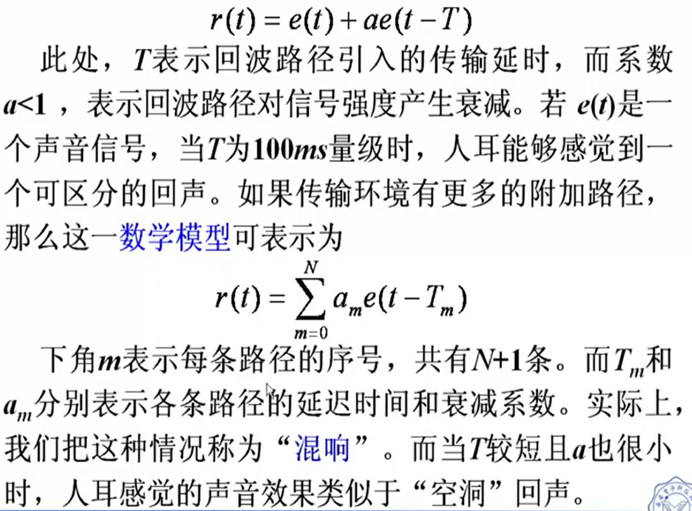
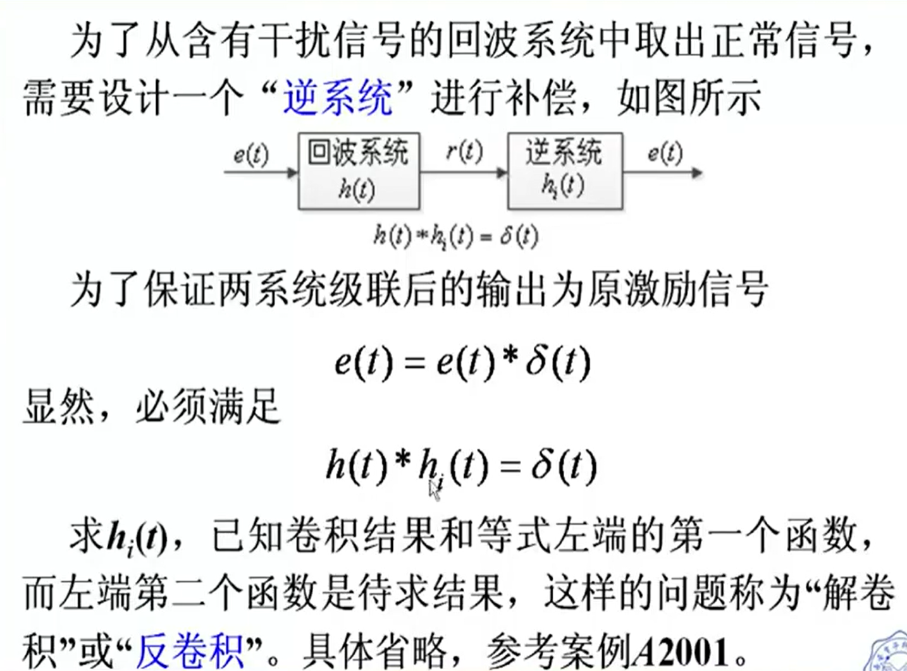
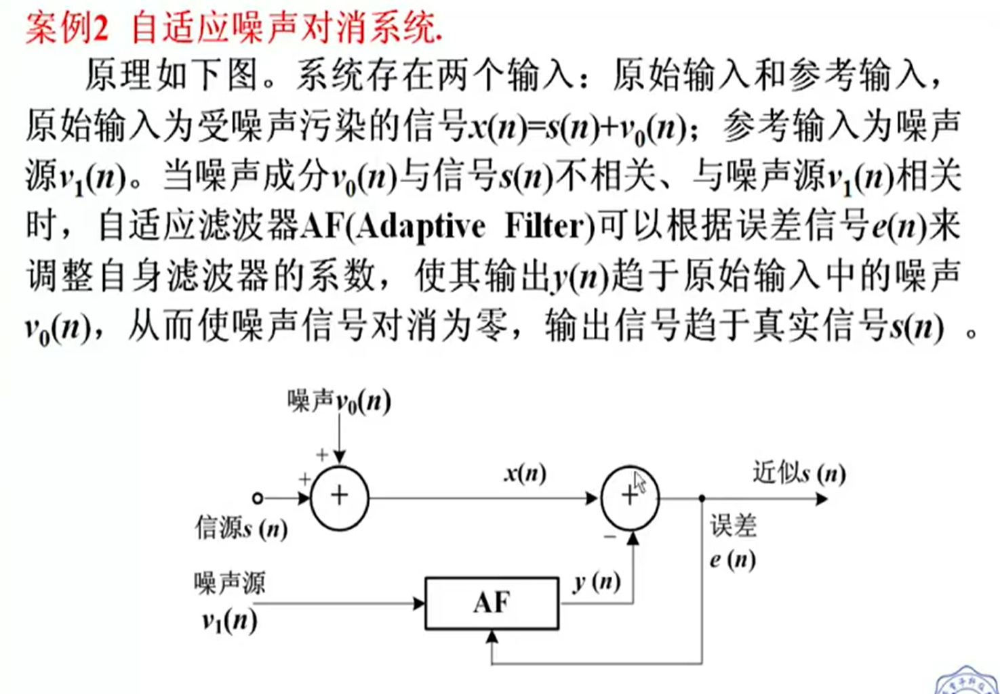

[TOC]

---

# 互相关和自相关函数的定义

为比较某信号与另一延时$\tau$的信号之间的相似度，需要引入**相关函数**的概念。

相关函数是鉴别信号的有力工具，被广泛应用于雷达回波的识别，通信同步信号的识别等领域。**相关函数也称为相关积分，它与卷积的运算方法类似**。

## 互相关函数定义

> 互相关函数是两信号之间时间差$\tau$的函数

实函数$f_1(t)$和$f_2(t)$，如为能量有限信号，它们之间的互相关函数定义为:
<mark>(注:下脚数字,前面的领先$\tau$)</mark>。就是$f_1(t)的时间 \tau 大于f_2(t)$

$$
R_{12}(\tau)=\int_{-\infty}^{\infty}f_1(t)f_2(t-\tau)d\tau=\int_{-\infty}^{\infty}f_1(t+\tau)f_2(t)dt\\
R_{21}(\tau)=\int_{-\infty}^{\infty}f_1(t-\tau)f_2(t)d\tau=\int_{-\infty}^{\infty}f_1(t)f_2(t+\tau)dt
$$

- **一般的**。$R_{12}(\tau) \ne R_{21}(\tau)$

- $R_{12}(\tau)=R_{21}(-\tau)$

## 自相关函数定义

如果$f_1(t)$和$f_2(t)$是**同一信号**，可记为$f(t)$，这时无需区分 $R_{12}和R_{21}$。用$R(\tau)$表示，称为**自相关函数**。

$$
R(\tau)=\int_{-\infty}^{\infty}f(t)f(t-\tau)d\tau=\int_{-\infty}^{\infty}f(t+\tau)f(t)dt\\
$$

- $R(\tau)=R(-\tau)$

- 偶函数

# 相关与卷积的比较

卷积的表达式：

$$
f_1(t)*f_2(t)=\int_{-\infty}^{\infty}f_1(\tau)f_2(t-\tau)d\tau
$$

为了便于与互相关函数进行比较，我们将互相关函数定义式中的**变量$\tau$和$t$进行互换**，可将实函数$f_1(t)$和$f_2(t)$的互相关函数写为:

$$
R_{12}(\tau)=\int_{-\infty}^{\infty}f_1(\tau)f_2(\tau-t)d\tau
$$

<mark>不同之处：</mark>

**卷积开始时需要将$f_2(\tau)$反折为$f_2(-\tau)$，而相关运算则不需反折**，仍为$f_2(\tau)$。其他的移位、相乘和积分的运算方法相同。

$$
f_1(t)*f_2(-t)=\int_{-\infty}^{\infty}f_1(\tau)f_2[-(t-\tau)]d\tau=\int_{-\infty}^{\infty}f_1(\tau)f_2(\tau-t)d\tau\\
R_{12}(t)=f_1(t)*f_2(-t)
$$

由上式可知，若$f_1(t)和f_2(t)$均为实偶函数，则卷积与相关的形式完全相同。

 

# 对通信信道的不利影响进行建模

# 多径传输中的失真问题

## 案例一

## 案例二

