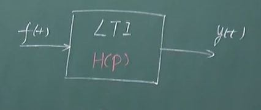

[TOC]

---

# 微分算子P的定义

LTI连续系统用线性常系数微分方程描述

$$
y^{(n)}(t)+a_{n-1}y^{n-1}(t)+...+a_1y^{(1)}(t)+a_0y(t)=\\
b_{m}f^{(m)}(t)+b_{m-1}f^{(m-1)}(t)+...+b_{1}f^{(1)}(t)+b_0f(t)
$$

## 微分算子的定义

用来简化微分方程：

微分算子：

$$
p\overset{\Delta }{=} \frac{d}{dt}  ;  p^n \overset{\Delta }{=} \frac{d^n }{dt^n }  
$$

积分算子：

$$
\frac{1}{P}\overset{\Delta }{=}\int_{-\infty }^{t}  (·)d \tau 
$$

**注意:$P$只是代表微分运算的一个算子($\frac{1}{p}$是代表积分运算)，P并不是变量**

示例

$$
pf(t)\overset{\Delta }{=} \frac{d}{dt}f(t) \\
p^nf(t) \overset{\Delta }{=} \frac{d^n }{dt^n }f(t) \\
\frac{1}{P}f(t)\overset{\Delta }{=}\int_{-\infty }^{t}  f(\tau)d \tau 
$$

## 微分算子方程

# 微分算子的性质

<mark>mark重点。需要注意3、4 先积分后微分是可以消除公因子</mark>

# 传输算子H(P)

<mark>mark重点</mark>

# RLC微分算子模型及算子方程建立

<mark>mark重点</mark>

## R、L、C元件的算子模型

## 系统微分算子方程的建立

- L和C都为1，所以直接缩略

- 将 $\frac{1}{P}i(t)$看作一个整体，可以推出下面的式子

