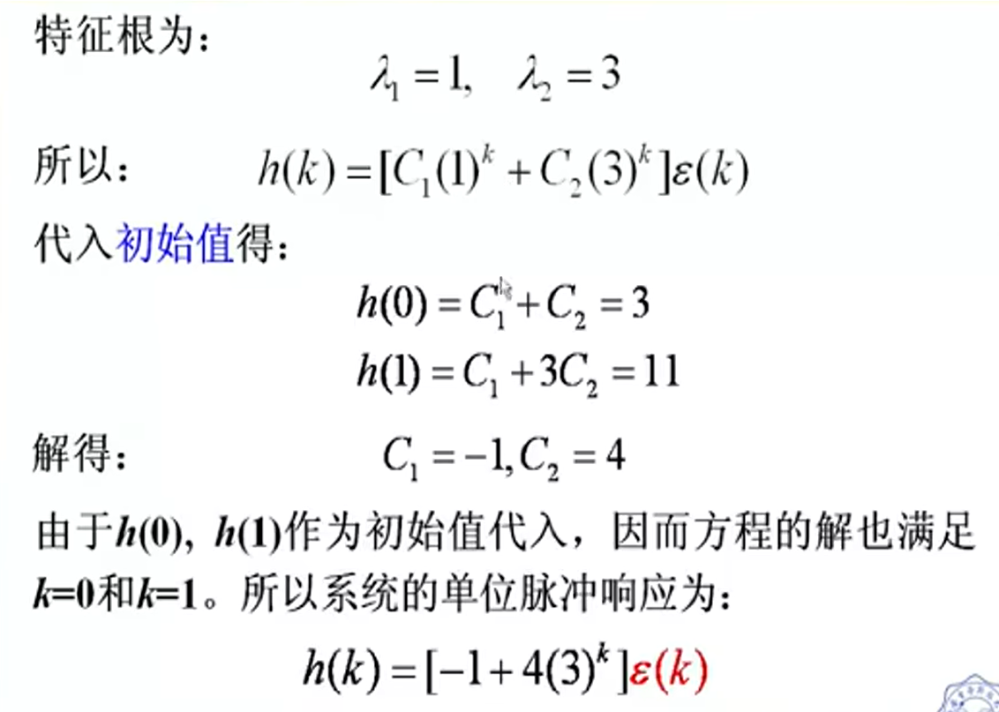

[TOC]

---

# 单位脉冲响应

## 定义

单位脉冲响应是由单位脉冲序列$\delta(k)$所引起的**零状态响应**，用$h(k)$表示。它的作用与连续系统中的冲激响应$h(t)$相类似。

**隐含条件**

$$
f(k)=\delta(k)\\
h(-1)=h(-2)=0 ; (对二阶系统)
$$

- 基本信号:单位脉冲序列$\delta(k)$

- 基本响应:单位脉冲响应$h(k)$

## 求解方法

由于单位脉冲序列$\delta(k)$仅在k=0处等于1，而在k>0时为零，因而此时单位脉冲响应$h(k)$与系统的零输入响应的**函数形式相同**。这样就把求解h(k)的问题转换为求解齐次方程的问题。而k=0处的值$h(0)$可**按零状态的条件由差分方程确定**。

1. 迭代求初始值;

2. 经典法求齐次解;

3. 代入初始值，求系数。

## 示例

### 示例一

# 单位阶跃信号

## 定义

单位阶跃响应是由单位阶跃序列$\varepsilon(k)$所引起的**零状态响应**，用$g(k)$表示。

**隐含条件**

$$
f(k)=\varepsilon(k)\\
g(-1)=g(-2)=0 ; (对二阶系统)
$$

- 基本信号:单位阶跃序列$\varepsilon(k)$

- 基本响应:单位阶跃响应$g(k)$

## 求解方法

1. 迭代求初始值;

2. 由特征根设定齐次解;

3. 求出特解;**(比较:单位脉冲响应只有齐次解)**

4. 代入初始值，求系数。

## 示例

### 示例一

- 这里的特征根是一个常数项 $a=1$，所以带入进去，$g_p(k)=P$  

- 带入后 ，由于是一个常数项，当$k\ge0$ 时，所以$g(k)-g(k-1)-g(k-2)=P-P-2P=1$

- 所以得出 $P=-\frac{1}{2}$

# 单位阶跃序列与单位脉冲序列的关系

<mark>mark重点</mark>

## 示例

尝试使用$g(k)\to h(k)$求解
