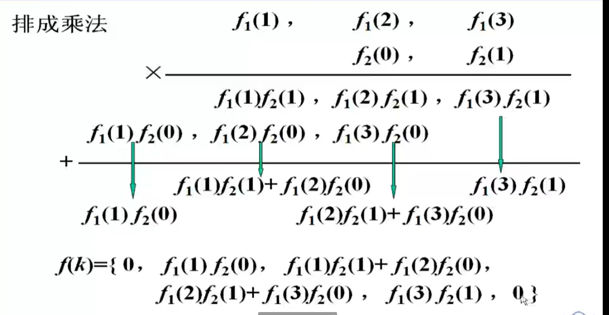

[TOC]

---

# 序列的时域分解

# 卷积和公式

## 定义

已知定义在区间$(\infty，-\infty)$上的两个函数$f_1(k)$和$f_2(k)$，则**定义**

$$
f(k)=\sum_{i=-\infty}^{\infty}f_1(i)f_2(k-i)
$$

为$f_1(k)$和$f_2(k)$的卷积和，进程卷积：记为

$$
f(k)=f_1(k)*f_2(k)
$$

**注意**:求和是在虚设的变量i下进行的，i为求和变量，k为参变量。结果仍为k的函数。

<mark>mark重点</mark>

$$
y_{zk}(k)=\sum_{i=-\infty}^{\infty}f(i)h(k-i)=f(k)*h(k)
$$

若有两个序列$f_1(k)和f_2(k)$，如果序列$f_1(k)$是**因果序列**，即有$f_1(k)=0,k<0$,则卷积和可改写为:

$$
f(k)=\sum_{i=0}^{\infty}f_1(i)f_2(k-i)
$$

若有两个序列$f_1(k)和f_2(k)$，如果序列$f_2(k)$是**因果序列**，即有$f_2(k)=0,k<0$,则卷积和可改写为:

$$
f(k)=\sum_{i=-\infty}^{k} f_1(i)f_2(k-i)
$$

若有两个序列$f_1(k)和f_2(k)$是**因果序列**，即有$f_1(k)=f_2(k)=0,k<0$,则卷积和可改写为:

$$
f(k)=[\sum_{i=0}^{k} f_1(i)f_2(k-i)]\varepsilon(k)
$$

## 示例

# 卷积和的图解法

<mark>mark重点</mark>

## 示例

# 卷积和的不进位乘法运算

<mark>mark重点，方法学习</mark>

<mark>注意结果序列的长度</mark>

# 卷积和的性质

## 满足乘法三律

1. 交换律：$f_1(k)*f_2(k)=f_2(k)*f_1(k)$

2. 分配律：$f_1(k)*[f_2(k)+f_3(k)]=f_1(k)*f_2(k)+f_1(k)*f_3(k)$

3. 结合律：$[f_1(k)*f_2(k)]*f_3=f_1(k)*[f_2(k)*f_3(k)]$

- 用 j 替换掉 $k-i$

## 复合函数的单位脉冲响应

$$
f(k)*\delta(k)=\delta(k)*f(k)=f(k)\\
f(k)*\delta(k-k_0)=f(k-k_0)\\
f(k)*\varepsilon(k)=\sum_{i=-\infty}^{k} f(i)\\
f_1(k-k_1)*f_2(k-k_2)=f_1(k-k_1-k_2)*f_2(k)\\
\bigtriangledown [f_1(k)*f_2(k)]=\bigtriangledown f_1(k)*f_2(k) = f_1(k)* \bigtriangledown f_2(k)
$$

## 重要公式

- $f(k)*\delta(k)=f(k);$

- $f(k)*\delta(k-k_0)=f(k-k_0);$

- $\delta(k)*\delta(k)=\delta(k);$

- $f(k)*\varepsilon(k)=\sum_{i=-\infty}^{k}f(i);$

- $\varepsilon(k)*\varepsilon(k)=t\varepsilon(k)$

- $f_1(k-k_1)*f_2(k-k_2)=f_1(k-k_2)*f_2(k-k_1)=f_1(k-k_1-k_2)*f_2(k)=f_1(k)*f_2(k-k_1-k_2)$

## 示例

