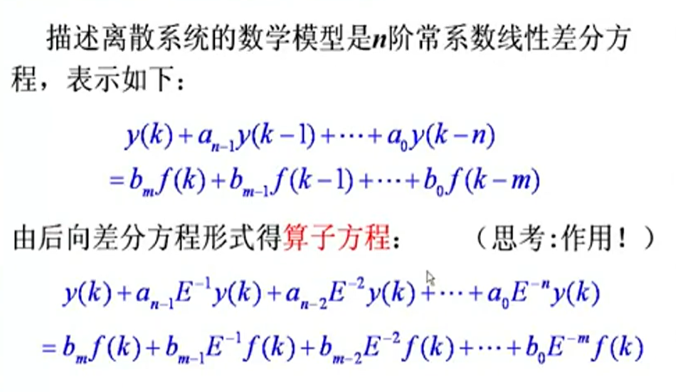
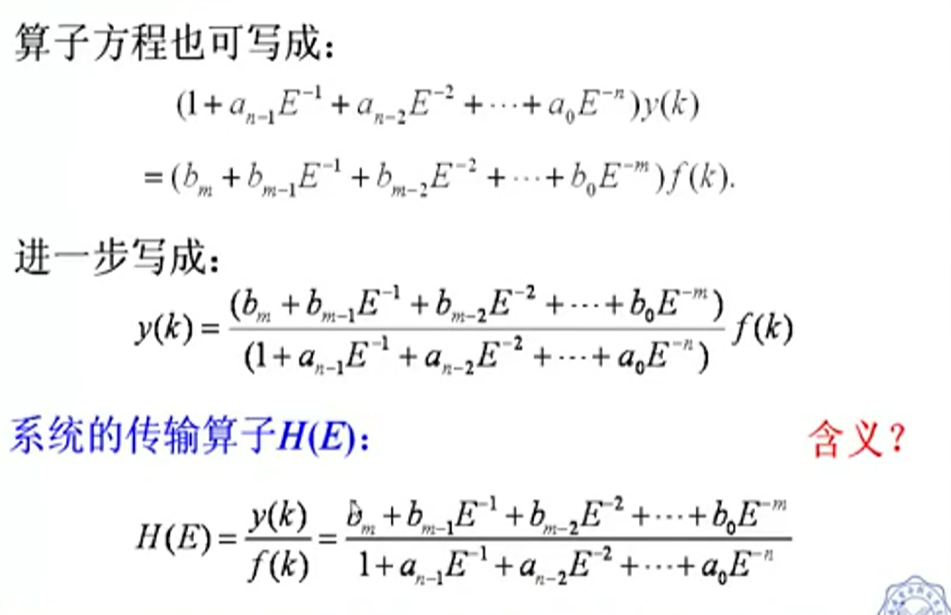
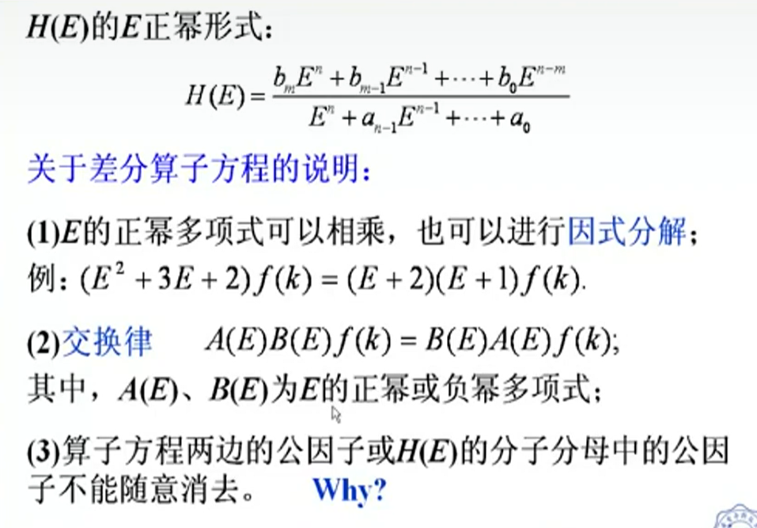
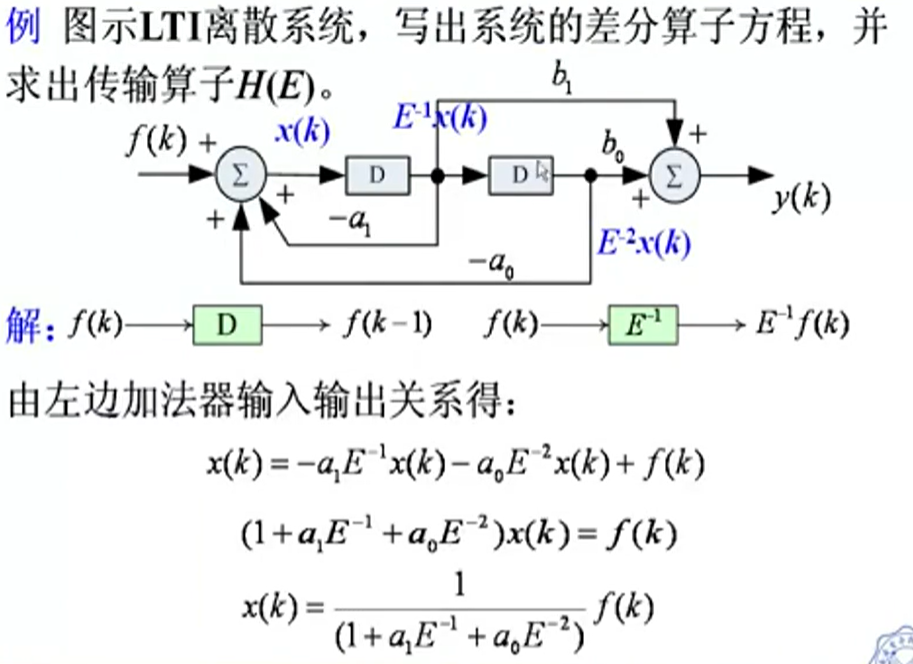
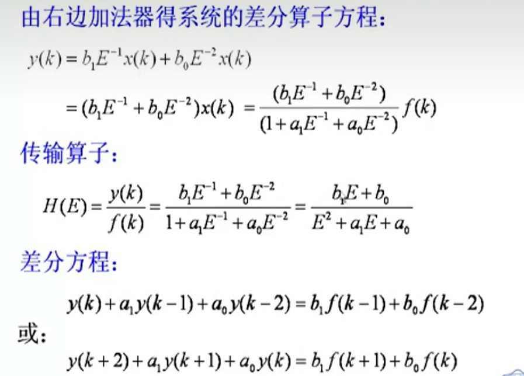

[TOC]

---

# 差分算子E的定义

- 延迟算子$E^{-1} $
  
  - $E^{-1}=f(k-1)$
  
  - $E^{-2}=f(k-2)$
  
  - $E^{-n}=f(k-n)$

- 超前算子$E$
  
  - $E^{1}=f(k+1)$
  
  - $E^{2}=f(k+2)$
  
  - $E^{n}=f(k+n)$

# 离散系统的差分算子方程

**<mark>差分算子使差分方程变成代数方程</mark>**

# 传输算子

传输算子 $H(E)$ .满足

1. 因式分解

2. 交换律

3. 公因子不能随意消除。主要是影响系统结构。零输入响应不能消除，求冲激响应能消去。

## 示例

