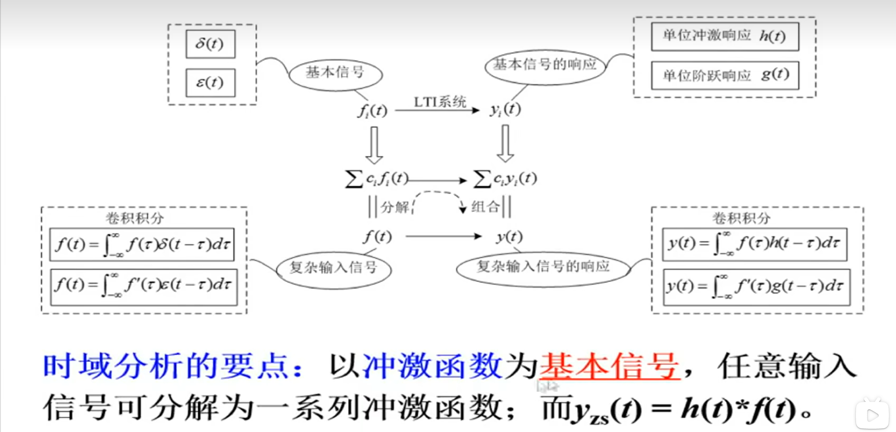
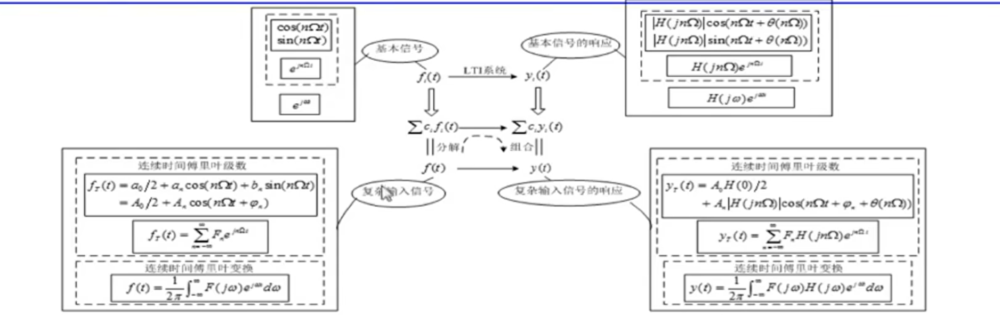
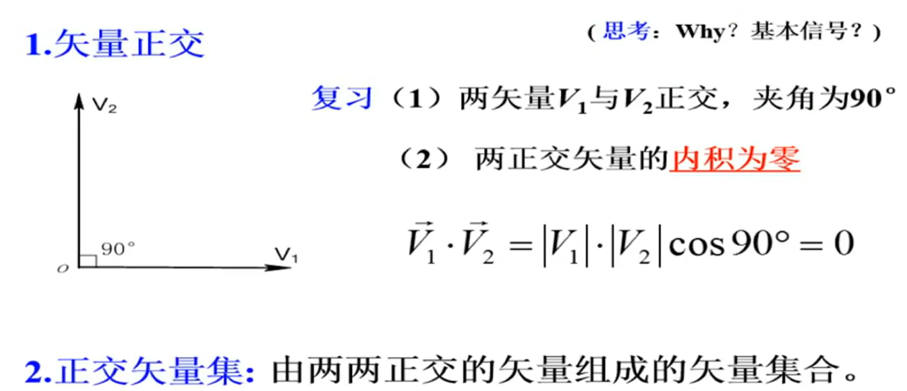
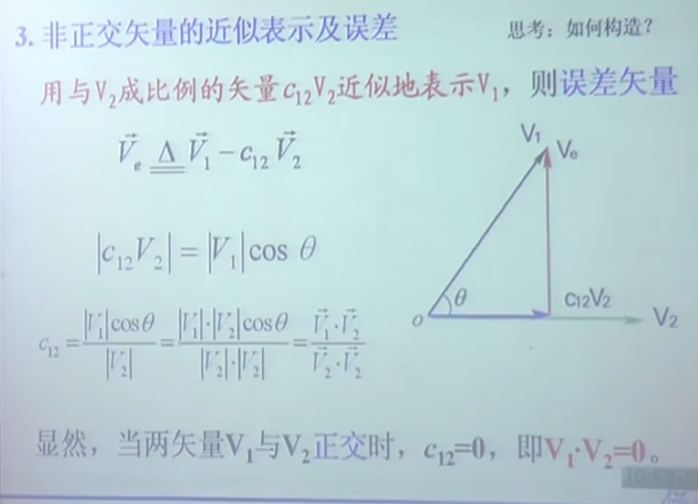
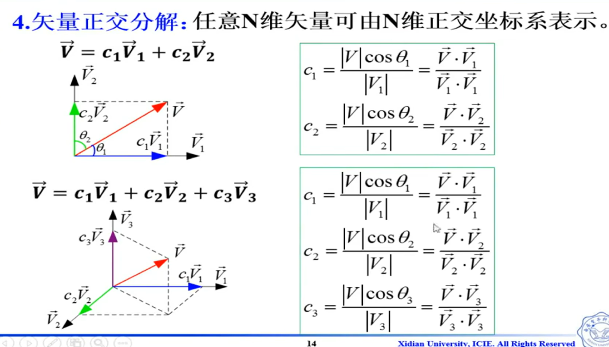
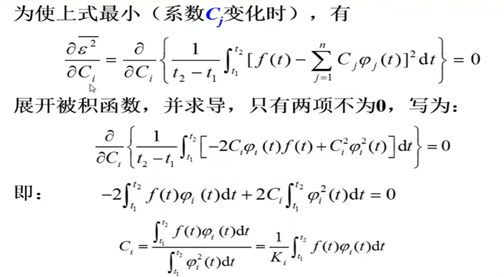
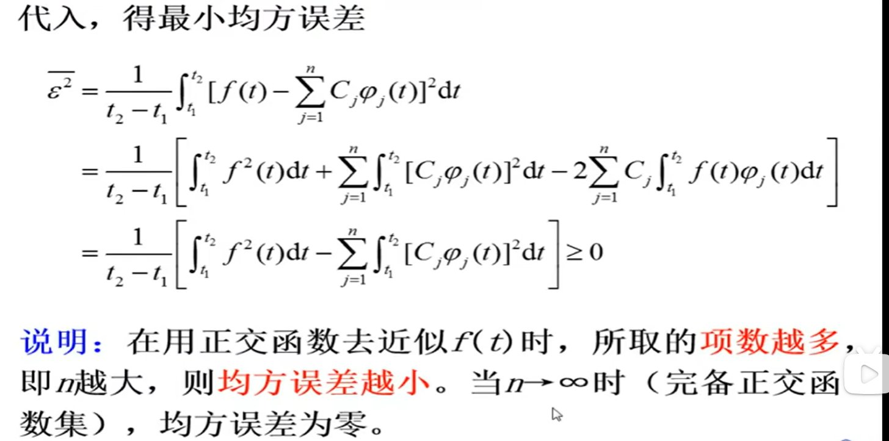
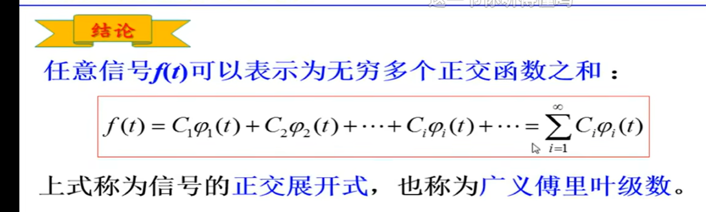
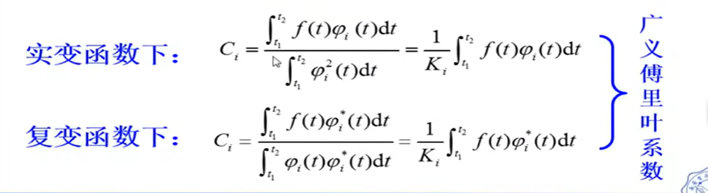

[TOC]

---

# 引言

## 思考问题

- 频域是什么?基本信号?

- 为什么要正交分解?频域分析方法?

- 频谱、调制、滤波、采样定理等含义及应用?

- 时域分析的要点:以冲激函数为基本信号，任意输入信号可分解为一系列冲激函数;而$y_{zs}(t)=h(t)*f(t)$

- 频域分析的要点：
  
  - 基本信号 $\to$ 基本响应
  
  - f(t)分解，不同频率（信号）分量的线性组合
  
  - 频域分析方法

**频域分析法要点**：以**正弦信号和虚指数信号为基本信号**，将任意输入信号分解为一系列**不同频率**的正弦信号或虚指数信号之和再利用LTI性质求出系统的响应。

说明:系统分析的独立变量是**频率**，分析是在频率空间进行的故称为**频率域分析**，简称**频域分析**。

# 矢量的正交分解

<mark>mark重点</mark>

1. 两矢量$V_1$与$V_2$正交，夹角为90°

2. 两正交矢量的内积为零
   
   $$
   \vec{V_1} · \vec{V_2} = \left | V_1 \right |  \left | V_2 \right |  \cos 90°=0
   $$

## 非正交矢量的近似表示及误差

推广：

$$
C_{1r}=\frac{\vec{V} ·\vec{V_r} }{\vec{V_r}·\vec{V_r}} ;\\
\vec{V_r}是一个分量
$$

## 矢量正交分解

**推广到n维空间**:n维空间的任一矢量V，可以精确地表示为n个正交矢量的**线性组合**，即

$$
\vec{V}=c_1\vec{V_1}+c_2\vec{V_2}+...+c_r\vec{V_r}+...+c_n\vec{V_n}
$$

其中 $V_i·V_j=0(i \ne j)$，第r个分量的**系数**是

$$
C_{r}=\frac{\vec{V} ·\vec{V_r} }{\vec{V_r}·\vec{V_r}}
$$

<mark>思路：</mark><u>将矢量空间正交分解的概念推广到信号空间</u>--在信号空间找到若干个相互正交的信号作为基本信号，使得信号空间中任意信号均可表示成它们的线性组合，

# 信号的正交分解

<mark>mark重点</mark>

## 信号正交

【定义】在$(t_1，t_2)$区间的两个函数$\varphi_1$和$\varphi_2$，若满足

$\int_{t_1}^{t_2} \varphi_1(t)\varphi_2^*(t)dt=0$(两函数的**内积**为0，$\varphi_2^*(t)$称为共轭)，则称$\varphi_1和\varphi_2$ 在区间$(t_1，t_2)$内正交。

**共轭**：**共轭复数**‌是指两个实部相等，虚部互为相反数的复数。例如，若z=a+ib(a,b∈R)，则其共轭复数为a-ib。

共轭的不是复数信号，而是实信号，则为原函数本身

所以若$\varphi_2^*(t)$为实信号，则$\int_{t_1}^{t_2} \varphi_1(t)\varphi_2^*(t)dt=\int_{t_1}^{t_2} \varphi_1(t)\varphi_2(t)dt=0$

## 正交函数集

若n个函数$\varphi_1(t),\varphi_2(t),...,\varphi_n(t)$构成一个函数集，当这些函数在区间$(t_1，t_2)$内满足:

$$
\int_{t_1}^{t_2} \varphi_i(t)\varphi_j^*(t)dt=\left\{\begin{matrix}
0  & i \ne j \\
K_i \ne 0  &   i =j
\end{matrix}\right.
$$

则称此函数集为在区间$(t_1，t_2)$上的**正交函数集**。

**说明**：如果$K_i=1$，称为标准正交函数集。

## 完备正交函数集

如果在正交函数集${\varphi_1(t),\varphi_2(t),...,\varphi_n(t)}$之外，**不存在**任何函数 $\varphi(t)(≠0)$满足

$$
\int_{t_1}^{t_2} \varphi(t)\varphi_i^*(t)dt=0;i=(1,2,3,...,n)
$$

则称此函数集为**完备正交函数集**。即该函数集已包括所有正交函数了。

例：两组典型的在区间($t_0,t_0+T$)($T=2 \frac{\pi}{\Omega}$)上的完备正交函数集。

1. 三角函数集。{$1，\cos(n\Omega t)，\sin(n\Omega t)，n=1,2,...$}

2. 虚指数函数集。{$e^{jn\Omega t}，n=0,\pm1,\pm2,...$}

## 信号正交分解

<mark>mark重点</mark>

设有n个函数${\varphi_1(t),\varphi_2(t),...,\varphi_n(t)}$在区间$(t_1，t_2)$构成一个正交函数空间。将任一函数$f(t)$用这n个正交函数的线性组合来近似，可表示为

$$
f(t)=C_1\varphi_1(t)+C_2\varphi_2(t)+...+C_n\varphi_n(t)=\sum_{j=1}^{n}C_j\varphi_j(t)
$$

**思考问题**：**如何选择各系数$C_j$**，使$f(t)$与近似函数之间的误差在区间$(t_1，t_2)$内为最小?

<u>通常</u>使误差的平均值（称为**均方误差**）最小.

$$
\bar{\varepsilon^2} = \frac{1}{t_2-t_1}\int_{t_1}^{t_2}[f(t)-\sum_{j=1}^{n}C_j\varphi_j(t)]^2dt
$$

<mark>任意信号f(t)可以表示为无穷多个正交函数之和：</mark>

$$
f(t)=C_1\varphi_1(t)+C_2\varphi_2(t)+...+C_i\varphi_i(t)=\sum_{i=1}^{\infty}C_i\varphi_i(t)
$$

**上式称为信号的正交展开式，也成为广义傅里叶级数。**

# 帕斯瓦尔定理

**物理意义**:在区间$(t_1，t_2)$，信号$f(t)$所含有的能量恒等于此信号在完备正交函数集中各正交分量能量之和，即**能量守恒定理**，也称**帕斯瓦尔定理。**

**数学本质是：矢量空间信号正交变换的范数不变性。**

$$
\int_{t_1}^{t_2}f^2(t)dt=\sum_{i=1}^{\infty}\int_{t_1}^{t_2}[C_i\varphi_i(t)]^2dt
$$

