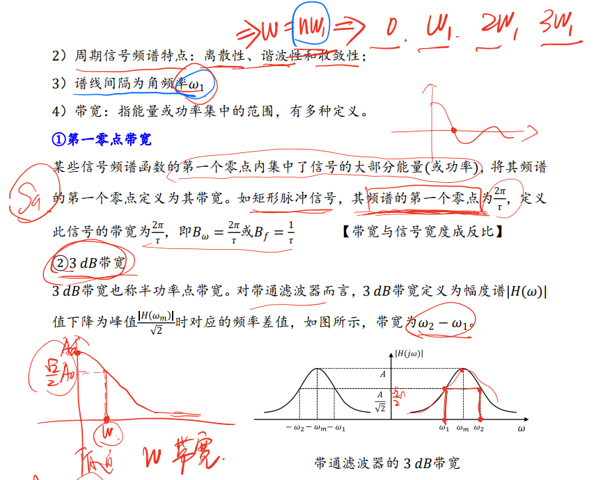
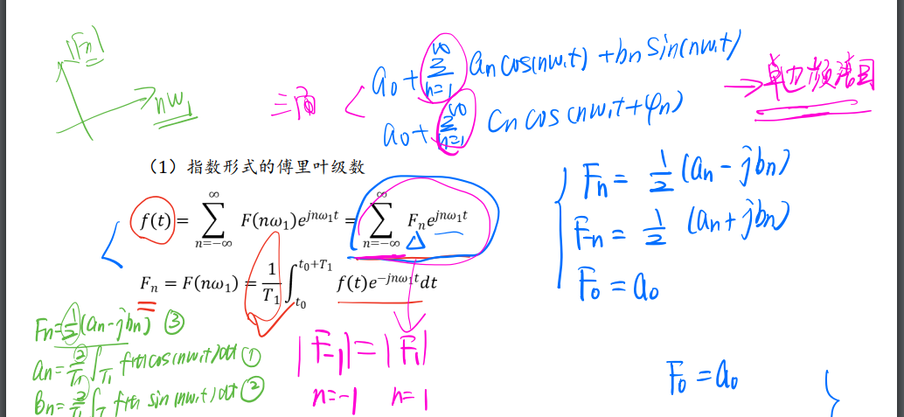
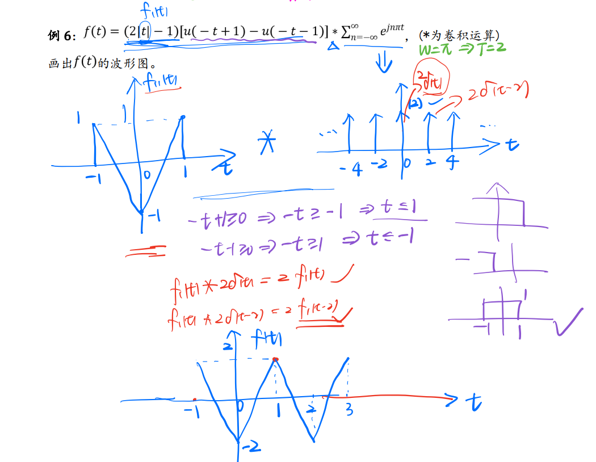
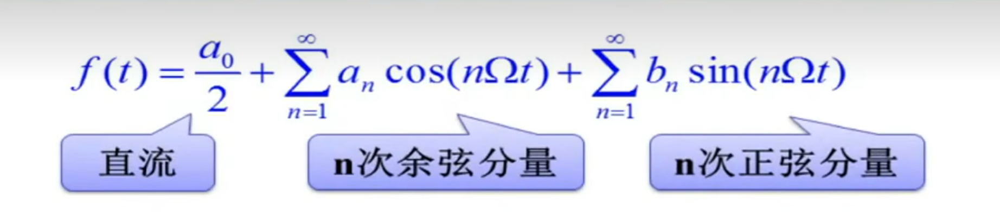
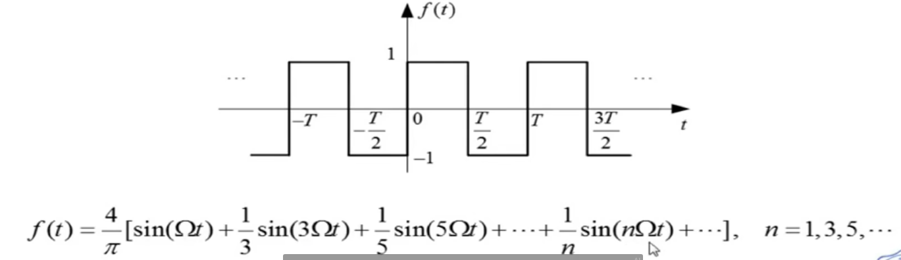

### 函数对称性的判断——观察法

[TOC]

---

# 知识点铺设——周期信号的傅里叶级数

## 抽样信号Sa函数

1. 定义 $Sa(t)=\frac{sin(t)}{t}$

2. 积分
   
   $$
   \int_{-\infty}^{\infty}S_{a}(t)dt=
\int_{0}^{\infty}S_{a}(t)dt=\frac{\pi}{2}
   $$

3. 说明：
   
   1. 零点的间隔：$\frac{2 \pi}{\tau}$
   
   2. 谱线的间隔：$\Omega = \frac{2\pi}{T}$
   
   3. 两零点间谱线间隔数：$\frac{零点的间隔}{谱线的间隔}$

## 1. 三角形式的傅里叶级数

研究对象：周期信号$f(t)$,其周期为$T$，角频率 $\omega = 2\pi/T$，频率$f_1=\frac{\omega}{2\pi}=\frac{1}{T}$

### 1. 一般形式

## 2. 信号对称性对频率分量产生的影响

### 信号对称性对频率分量的影响

### 函数对称性的判断——观察法

### 周期信号对称性的判断

<mark>重点</mark>

### 周期信号傅里叶级数的求解过程

### 示例

## 3. 余弦形式的傅里叶级数

3. 三角形式下频谱的定义

4. 带宽（第一零点带宽和有限带宽）

## 4. 周期信号的频谱画法

<mark>关于通过三角函数公式转化</mark>

1. 后面的cos和sin分别对应$a_2$和$b_2$。对应他们前面的信号分量类型，表示相位，即$a_n$和$b_n$

2. 数学法，需要掌握诱导公式、和角公式，参考例5
   
   $$
   sin(t\pm \frac{\pi}{2})=cos(t)\\
cos(t \pm \pi)=-cos(t)\\计
   $$

## 5. 指数形式的傅里叶级数

### 推导

逆推

### 1. 指数形式的傅里叶级数

$$
f(t)=\frac{1}{2}\sum_{n=-\infty}^{\infty}A_{n} \mathrm{e}^{j\varphi_{n}} \mathrm{e}^{jn\omega t}=\sum_{n=-\infty}^{\infty}F_{n} \mathrm{e}^{jn\omega t}
$$

令复数 $\frac{1}{2}A_{n} \mathrm{e}^{j\varphi_{n}}=\left|F_{n}\right|\mathrm{e}^{j\varphi_{n}}=F_{n}$

称为**复傅里叶系数**，简称**傅里叶系数**

$$
F_0=a_0\\
F_n=\frac{1}{2}(a_{n}-jb_{n})\\
F_{-n}=\frac{1}{2}(a_{n}+jb_{n})
$$

$$
F_{n}=\frac{1}{2}A_{n}e^{j\varphi_{n}}=\frac{1}{2}(A_{n}\cos\varphi_{n}+jA_{n}\sin\varphi_{n})=\frac{1}{2}(a_{n}-jb_{n})
$$

也可以从**Fn推出f(t)**

$$
F_n=F(n\omega t)=\frac{1}{T}\int^{t_0+T}_{t_0}f(t)e^{-jn\omega t}dt
$$

### 2. 指数形式下的频谱定义

- 若从 $-\infty \to \infty$ ，则 $F_n$是双边谱；若从$1 \to \infty$ ，则$F_n$是单边谱

- $F_n$是对称的

### 3. 三角与指数形式的关系及频谱特点

<mark>1. 余弦与三角形式的关系，需记忆理解</mark>

$$
F_0=c_0=a_0\\
F_n=\left|F_{n}\right|\mathrm{e}^{j\varphi_{n}}=\frac{1}{2}(a_{n}-jb_{n})\\
F_{-n}=\left|F_{n}\right|\mathrm{e}^{-j\varphi_{n}}=\frac{1}{2}(a_{n}+jb_{n})\\
|F_n|=|F_{-n}|=\frac{1}{2}C_n=\frac{1}{2}\sqrt{a^2_n+b^2_n} \\
F_n+F_{-n}=a_n\\
b_n=j(F_n-F_{-n})
$$

2 两种形式下频谱转换方法

### 示例

<mark>三种方法</mark>

1. 欧拉公式

2. $F_n=\frac{1}{2}(a_n-jb_n)\\F_{-n}=\frac{1}{2}(a_n+jb_n)\\f(t)=f(t)=\frac{1}{2}\sum_{n=-\infty}^{\infty}A_{n} \mathrm{e}^{j\varphi_{n}} \mathrm{e}^{jn\omega t}=\sum_{n=-\infty}^{\infty}F_{n} \mathrm{e}^{jn\omega t}$

3. 转余弦形式后，通过C

<mark>需要明白</mark>

### 傅里叶级数的求解过程

<mark>重点</mark>

## 6. 周期冲激串的傅里叶级数

<mark>记录公式和图形</mark>

# 三角形式的傅里叶级数

三角函数集 {$1，\cos(n\Omega t)，\sin(n\Omega t)，n=1,2,...$}

设周期信号$f(t)$,其周期为$T$，角频率 $\Omega = 2\pi/T$，当满足**狄里赫利(Dirichlet)条件**时，可展开为**三角形式的傅里叶级数**。

$$
f(t)=\frac{a_0}{2}+\sum_{n=1}^{\infty}a_n \cos (n\Omega t)+\sum_{n=1}^{\infty}b_n \sin (n\Omega t)
$$

系数 $a_n、b_n$称为**傅里叶系数**。

- 直流分量： $\frac{a_0}2=\frac2T\int_{-\frac T2}^\frac T2f(t)$d$t$
- 余弦分量系数：$a_n= \frac 2T\int _{- \frac T2}^{\frac T2}f( t) \cos ( n\Omega t)$d$t$
- 正弦分量系数：$b_n= \frac 2T\int _{- \frac T2}^{\frac T2}f( t) \sin ( n\Omega t)$d$t$

注意

1. 引入 $\frac{a_0}{2}$ 表示 $a_0$ 包含在$a_n$ 中 ，$n=0,1,2,3,...$

# 狄里赫利(Dirichlet)条件

1. **条件1**:在一个周期内，函数连续或只有有限个第一类间断点;

2. **条件2**:在一个周期内，函数极大值和极小值的数目应为有限个;

3. **条件3**:在一个周期内，函数绝对可积

# 余弦/谐波形式的傅里叶级数

>  含义:周期信号可分解为直流和许多余弦分量。

$$
f(t)=\frac{A_0}2+\sum_{n=1}^\infty A_n\cos(n\Omega t+\varphi_n)
$$

## 示例

# 吉布斯现象

用**有限项**傅里叶级数表示**有间断点**的信号时，在间断点附近不可避免的会出现**振荡和超调量**。超调量的幅度不会随所取项数的增加而减小。只是随着项数的增多，振荡频率变高，并向间断点处压缩，从而使它所占有的能量减少。
当选取的项数很大时，该超调量趋于一个常数，大约等于总跳变值的**9%**，并从间断点开始以起伏振荡的形式逐渐衰减下去。这种现象称为**吉布斯现象**

# 周期信号波形对称性和谐波特性

## 1. $f(t)$为偶函数——对称于纵轴$f(t)=f(-t)$

$$
a_{n}=\frac{2}{T}\int_{-\frac{T}{2}}^{\frac{T}{2}}f(t)\cos(n\Omega t)\operatorname{d}t\quad b_{n}=\frac{2}{T}\int_{-\frac{T}{2}}^{\frac{T}{2}}f(t)\sin(n\Omega t)\operatorname{d}t
$$

$b_{n}=0$,展开为余弦级数。

说明：

- $f(t)$为偶函数时，$a_n$ 在1个区间内，$f(t)cos(n\Omega t)$ 为偶函数，所以是 $a_n=2\frac{2}{T}\int_{0}^{\frac{T}{2}}f(t)\cos(n\Omega t)\operatorname{d}t$

- $f(t)$为偶函数时，$b_n $在1个区间内，$f(t)sin(n \Omega t)$为奇函数，所以 $b_n=0$

## 2. $f(t)$为奇函数——对称于原点$f(t)=-f(-t)$

$$
a_{n}=\frac{2}{T}\int_{-\frac{T}{2}}^{\frac{T}{2}}f(t)\cos(n\Omega t)\operatorname{d}t\quad b_{n}=\frac{2}{T}\int_{-\frac{T}{2}}^{\frac{T}{2}}f(t)\sin(n\Omega t)\operatorname{d}t
$$

$a_n=0$，展开为正弦级数。

说明

- $f(t)$为奇函数时，$a_n$ 在1个区间内，$f(t)sin(n\Omega t)$ 为奇函数，所以是 $a_n=0$

- $f(t)$为奇函数时，$b_n $在1个区间内，$f(t)sin(n \Omega t)$为偶函数，所以 $b_n=2\frac{2}{T}\int_{0}^{\frac{T}{2}}f(t)\sin(n\Omega t)\operatorname{d}t$

## 3. 奇谐函数——$f(t)=-f(t\pm \frac{T}{2})$

其傅里叶级数中只含**奇次谐波**分量,而不含偶次谐波分量,即:

$$
a_0=a_2=...=b_2=b_4=...=0
$$

## 4. 偶谐函数——$f(t)=f(t\pm \frac{T}{2})$

其傅里叶级数中只含**偶次谐波**分量,而不含奇次谐波分量,即:

$$
a_1=a_3=...=b_1=b_3=...=0
$$

# 指数形式的傅里叶级数

**三角形式的傅里叶级数**，含义比较明确，但运算常感不便，因而经常采用**<u>指数形式</u>**的傅里叶级数。

<mark>mark重点：公式</mark>

$$
f(t)=\frac{1}{2}\sum_{n=-\infty}^{\infty}A_{n} \mathrm{e}^{j\varphi_{n}} \mathrm{e}^{jn\Omega t}
$$

令复数 $\frac{1}{2}A_{n} \mathrm{e}^{j\varphi_{n}}=\left|F_{n}\right|\mathrm{e}^{j\varphi_{n}}=F_{n}$

称为**复傅里叶系数**，简称**傅里叶系数**

$$
F_{n}=\frac{1}{2}A_{n}e^{j\varphi_{n}}=\frac{1}{2}(A_{n}\cos\varphi_{n}+jA_{n}\sin\varphi_{n})=\frac{1}{2}(a_{n}-jb_{n})
$$

表明：任意周期信号$f(t)$可分解为许多不同频率的**虚指数信号**之和。$F_n$ 是频率为$n\Omega$的分量的系数，$F_0=A_0/2$ 为直流分量。

## 示例

# 两种傅里叶级数展开形式的关系

知道指数形式的傅里叶级数，求三角函数的傅里叶级数

1. $A_n=2|F_n|$

2. $\varphi_n=\varphi_n$

求出余弦形式的傅里叶级数

$$
f(t)=\frac{A_0}2+\sum_{n=1}^\infty A_n\cos(n\Omega t+\varphi_n)
$$
