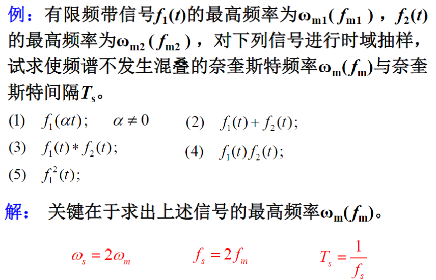

[TOC]

---

# 知识点铺设——傅里叶章节内容关联树

## 傅里叶变化回顾和梳理

<mark>这里需要了解如何将一个周期时域信号转换为一个傅里叶</mark>

# 知识点铺设——抽样及抽样定理

## 1. 抽样信号结构及原理

$$
F_s(\omega)=\frac{1}{2\pi}F(\omega)*P(\omega)
$$

## 2. 抽样信号的傅里叶变换

### 2.1 理想抽样/冲激抽样

$$
f_s(t)=f(t)\delta(t-nT_s)\\
F_s(\omega)=\frac{1}{2\pi}F(\omega)*\omega_s\sum_{n=-\infty}^{\infty}F(\omega-n\omega_s)=\frac{1}{T_s}\sum_{n=-\infty}^{\infty}F(\omega-n\omega_s)
$$

## 3. 抽样信号频谱特点

时域信号被周期信号抽样，**频域(频率分量)** 则伴随着频谱的周期延拓，延拓周期为周期信号的 **角频率**  ; **幅度包络线都按抽样脉冲的$F_n$变化**。

## 4. 抽样定理

<mark>需要记忆</mark>

<mark>以下几个说明和注释需要记忆</mark>

- 抽样频率$\omega_s>=2\omega_m (或f_s>=2f_m)$ ；抽样间隔$T_s<=\frac{1}{2f_m}=\frac{\pi}{\omega_m}$

- 奈奎斯特抽样**频率** $f_N=2f_m或（\omega_N=2\omega_m)$

- 奈奎斯特抽样**间隔** $T_s=\frac{1}{2f_m}=\frac{\pi}{\omega_m}$

## 5. 如何恢复

1. 乘以一个低通

2. 不混叠。即 $\omega_m<=\omega_c<\omega_s-\omega_m$

## 6. 信号运算对带宽的影响

<mark>重点，需要牢记时域相加相减相乘，则对应频域的操作。</mark>

时域的尺度变化后，**对应的$\omega_m$乘以相同尺度 $f(at)\to a\omega_m$**。示例：$f(2t)=>2\omega_m$

时域相乘后，对应的$\omega_m$乘以对应次方 $f^n(t)\to n\omega_m$

## 7. 低通信号与带通信号的带宽

## 示例题

<mark>这的第二问需要注意一下，最大值就是将两个图像的一个右点和左点相贴但不重叠的情况</mark>

# 信号的取样

 

## 定义

## 矩形脉冲取样

## 冲激取样

# 取样定理（时域）

# 取样定理（频域）

