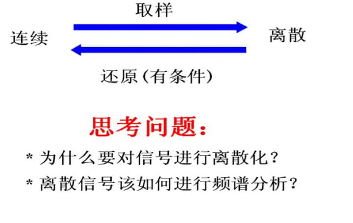
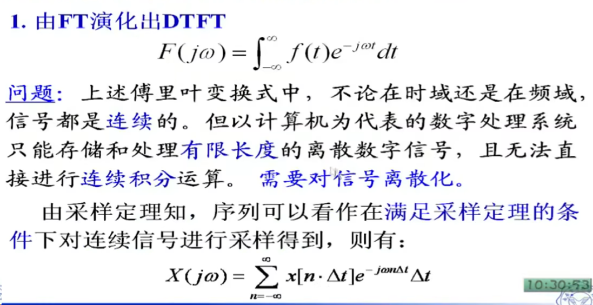
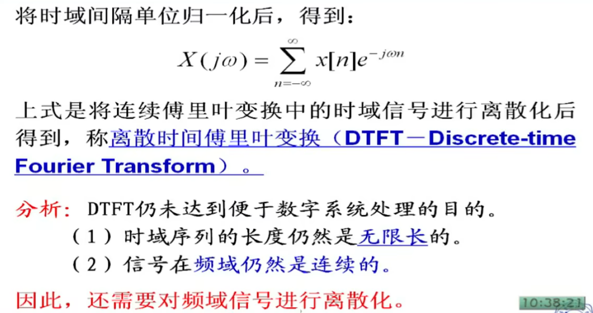
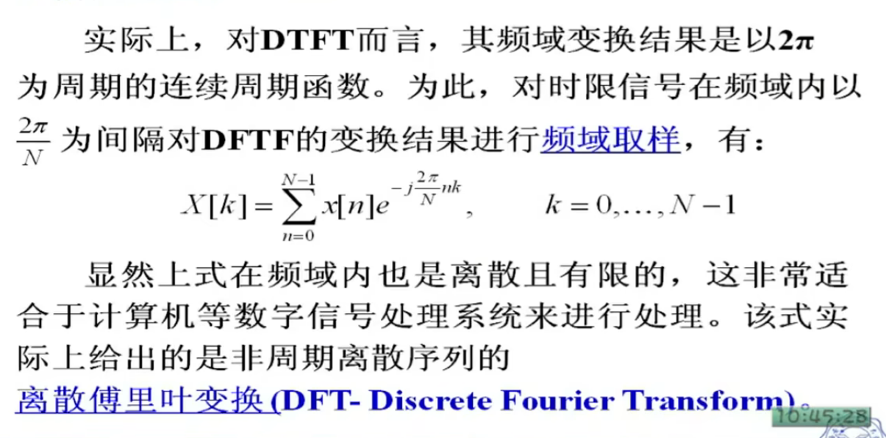
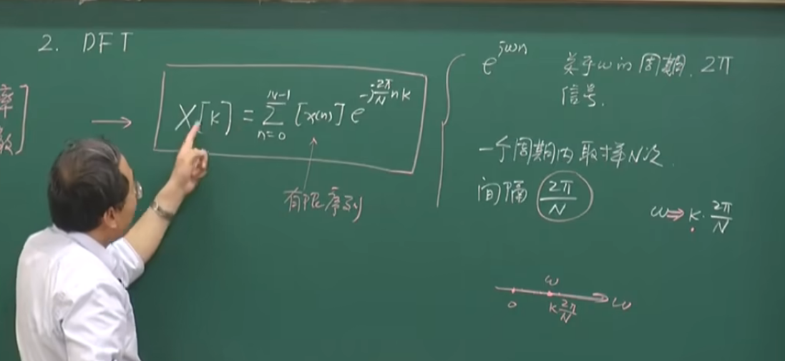
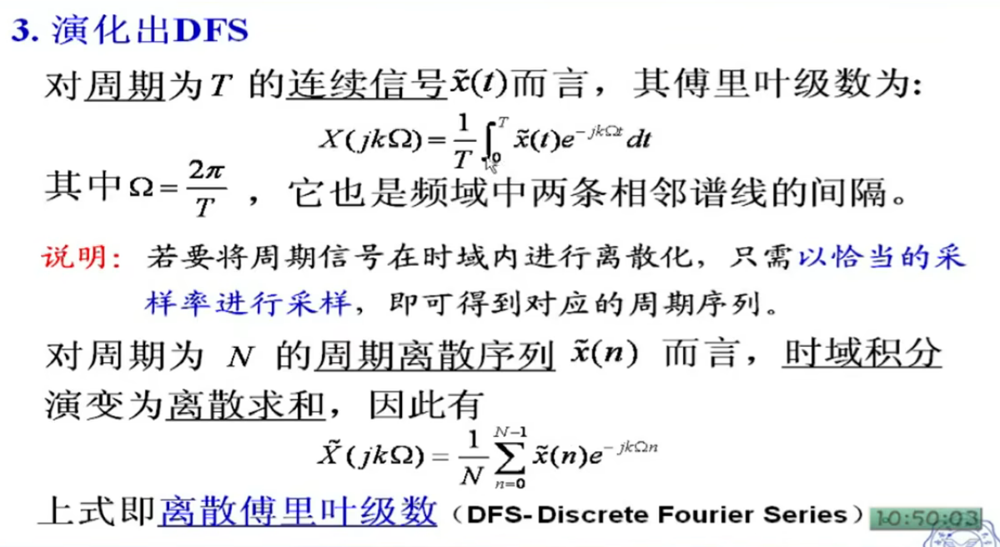
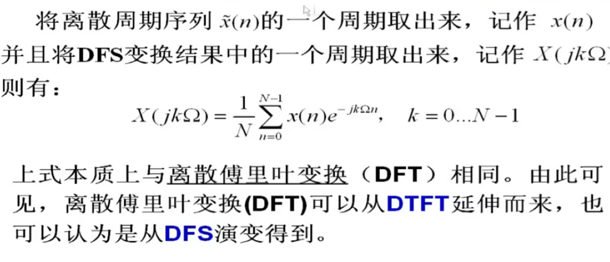
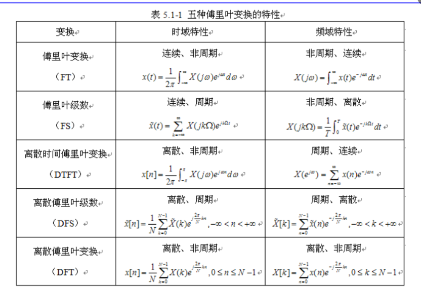
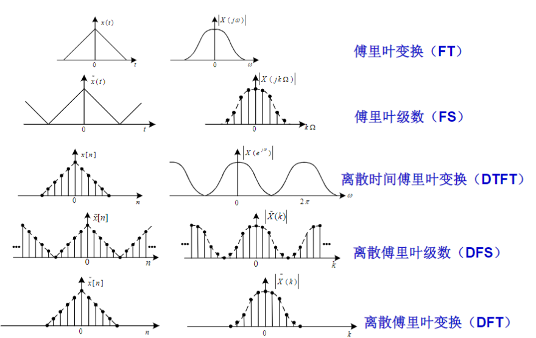

[TOC]

---

[一篇文章帮你梳理 FT 、FS、 DTFT、 DFS、 DFT_ft和dtft-CSDN博客](https://blog.csdn.net/weixin_65858849/article/details/135391929)

# 连续变换到离散变换的演化

- 因为要传入计算机进行处理

## FT演化为DTFT

## 

## 演化DFT

## 演化出DFS

# 五种傅里叶变换比较

结合前述特性图示可知，除**离散傅里叶变换**外，若某个信号在时域(或频域)内是周期的，则经变换(或反变换)后其变换结果在频域(或时域)内是离散的;若信号在时域(或频域)内是离散的，则其变换(或反变换)结果在频域(或时域)内是周期的。**周期性和离散性呈现出对偶关系**。
离散傅里叶变换则提供了一种在**时域和频域内均是离散**的信号变换方法。

# 
