[TOC]

---

# 连续信号

## 斜变信号

> 斜变信号也称斜坡信号或斜升信号。
> 
> 指某一时刻开始**随时间正比例增长**的信号。

### 单位斜变信号

如果**增长的变化率为1**，则称为**单位斜变信号**。

表示式子为:

$$
f(t)=\left\{\begin{matrix}
 0 & (t<0) \\
 t & (t\ge0) 
\end{matrix}\right.
$$

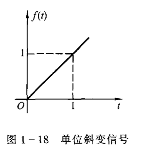

### 延迟的斜变信号

如果起始点由原点移至 $t_0$处，则写为：

$$
f(t-t_0)=\left\{\begin{matrix}
 0 & (t<t_0) \\
 t-t_0 & (t\ge t_0) 
\end{matrix}\right.
$$

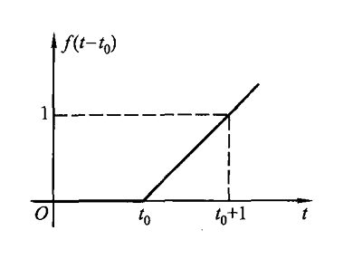

### 截平的斜变信号

在实际应用中常遇到"截平的"斜变信号，在时间$\tau$以后协变波形被切平，其表达式为：

$$
f_1(t)=\left\{\begin{matrix}
 \frac{K}{\tau}f(t) & (t< \tau) \\
 K & (t\ge \tau) 
\end{matrix}\right.
$$

此外，三角形脉冲也可以用斜变信号表示，写作：

$$
f_1(t)=\left\{\begin{matrix}
 \frac{K}{\tau}f(t) & (t< \tau) \\
 0 & (t\ge \tau) 
\end{matrix}\right.
$$

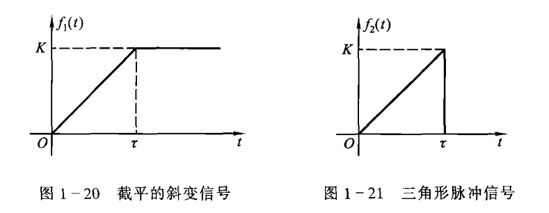

## 单位阶跃信号

### 物理背景

在 $t=0$ 时刻，对某一电路接入单位电源（可以是直流电压源或直流电流源），并且无限持续下去。如图所示，接入1V的直流电压源的情况，在接入端口处电压为阶跃信号$u(t)$。

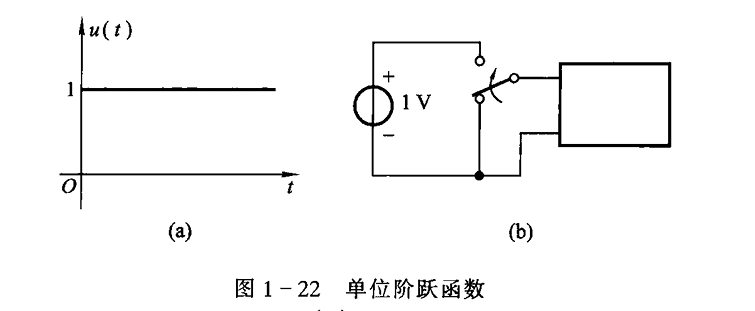

### 基本概念

单位阶跃信号的波形如上图所示，通常以 $u(t) / \varepsilon(t)$表示：

$$
f(t)=\left\{\begin{matrix}
 0 & (t<0) \\
 1 & (t\gt 0) 
\end{matrix}\right.
$$

**在跳变点 $t=0$处，函数值无定义，或在 $t=0$ 处规定函数值 $u(0)=\frac{1}{2}$**。

<mark>单位斜变函数的导数等于单位阶跃函数，单位阶跃函数的积分就是单位斜变函数</mark>

$$
\frac{\mathrm{d} f(t)}{\mathrm{d} x} = u(t)\\
\int_{-\infty}^{t} u(t)\mathrm{d} \tau = tu(t)
$$

### 延时的单位阶跃信号

如果接入电源的时间推迟到 $t=t_0,(t_0>0)$,那么表达式为：

$$
f(t-t_0)=\left\{\begin{matrix}
 0 & (t<t_0) \\
 1 & (t\gt t_0) 
\end{matrix}\right.
$$

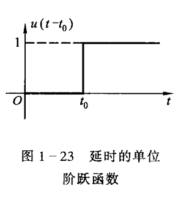

### 矩形脉冲

为书写方便，**常利用阶跃及其延时信号只差表示矩形脉冲**

- 对于信号a以符号$R_T(t)$表示。**下标T表示矩形脉冲出现在0到T时刻之间。**
  
  $$
  R_T(t)=u(t)-u(t-T)
  $$

- 如果矩形脉冲**关于纵坐标(x=0)左右对称**，则以符号$G_T(t)$表示。**下标T表示其宽度**
  
  $$
  G_T(t)=u(t+\frac{T}{2})-u(t-\frac{T}{2})
  $$

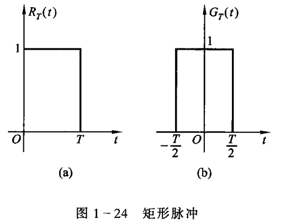

### 符号函数

符号函数（signum）简写做$\mathrm{sgn}(t)$。定义如下：

$$
\mathrm{sgn}(t)=\left\{\begin{matrix}
 1 & (t>0)\\
 -1 & (t<0)
\end{matrix}\right.
$$

与阶跃函数一样，**在跳变点出也可以不予定义或规定$\mathrm{sgn}(0)=0$。所以也可以用阶跃信号表示符号函数：**

$$
\mathrm{sgn}(t)=2u(t)-1
$$

### 作用

**阶跃信号鲜明地表现出信号的单边特性**。即**信号在某介入时候$t_0$以前的幅度为0**

1. 表示$\sin $函数只在x的正半轴上有值
   
   $$
   f(t)=(\sin t)u(t)
   $$
   
   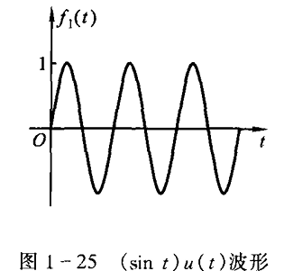

2. 表示 $e^{-t}$的图像在某一区间的波形
   
   $$
   f(t)=e^{-t}[u(t)-u(t-t_0)]
   $$
   
   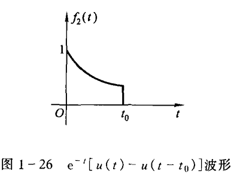

## 单位冲激信号

### 物理背景

某些物理现象需要用一个时间极短，但取值极大的函数模型来描述，例如力学中瞬间作用的冲击力，电学中的雷击电闪。"冲激函数"的概念就是以这类实际问题为背景引出的。

### 冲激函数定义

单位冲击函数：是奇异函数（狄拉克δ函数)通常用δ表示。它是对强度极大，作用时间极短的物理量的理想化模型（狄拉克提出）。

$$
\left\{\begin{matrix}
 \delta(t)=0 & t\ne 0 \\
 \int_{-\infty}^{\infty }\delta (t) \mathrm{d}t = 1   &
\end{matrix}\right.
$$

理解：高度无穷大，宽度无穷小，面积为1的对称窄脉冲。

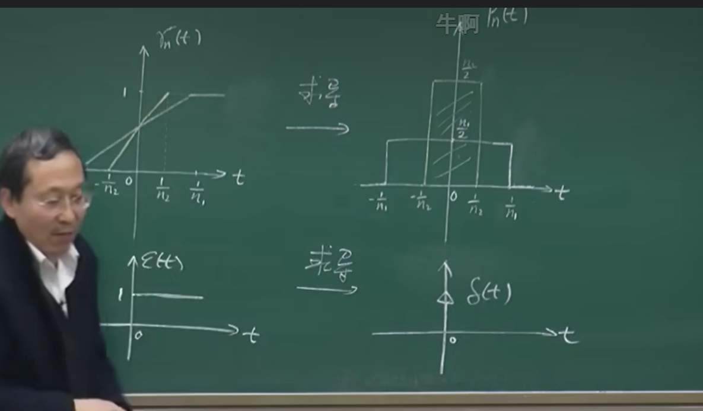

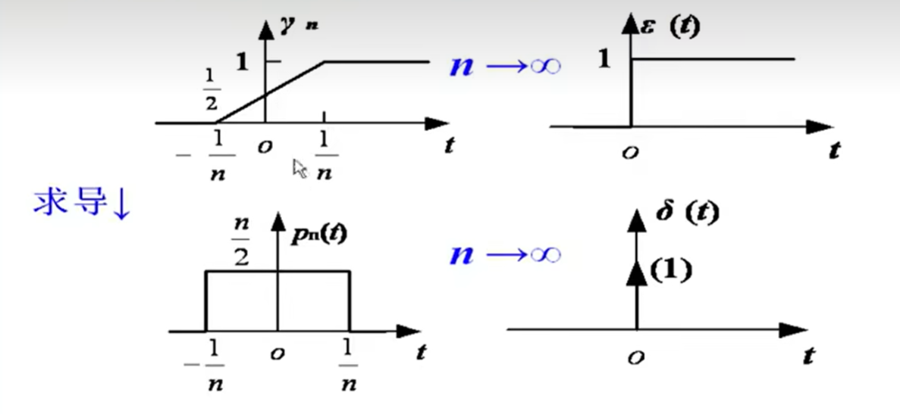

$$
\delta(t)=\frac{\mathrm{d} \epsilon (t) }{\mathrm{d}t } \\
\epsilon(t) = \int_{-\infty}^{t} \delta(\tau)\mathrm{d}\tau
$$

求积分后，因为单位冲激信号面积为1，所以 $\left\{\begin{matrix}
 1 & t>0\\
 0 & t<0
\end{matrix}\right.$

### 冲激函数的作用

> 描述间断点的导数。

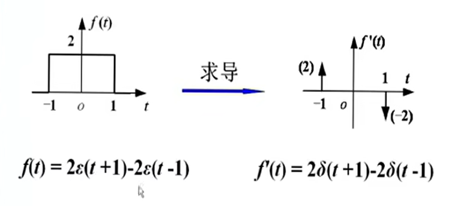

### 冲激函数的广义函数推广

> 思考如何定义映射

#### 广义函数定义

- 普通函数 $y=f(t)$ ：是将一维实数空间的数 $t$ 经过 $f$ 所规定的运算映射为一维实数空间的数 $y$ .

- 广义函数 $N_g[\varphi(t)]$：选择一类性能良好的函数$\varphi(t)$作为检验函数（相当于自变量），一个广义函数 $g(t)$对检验函数空间中的每个函数 $\varphi(t)$赋予一个数值N的映射，记为：
  
  $$
  N_g[\varphi(t)]=\int_{-\infty}^{\infty}g(t)\varphi(t)dt
  $$

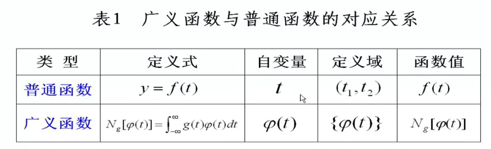

#### 冲激函数的广义函数定义

$$
\int_{-\infty}^{\infty}\delta(t)\varphi(t)dt=\varphi(0)
$$

含义：**冲激函数 $\delta(t)$ 作用与检验函数 $\varphi(t)$的结果是赋值为$\varphi(0)$，称为冲激函数的取样性质。**

**简言之：能从检验函数$\varphi(t)$中筛选出函数值$\varphi(0)$的广义函数就称为冲激函数$\delta(t)$**.

### @冲激函数的取样性质

#### $f(t)乘以\delta(t)$

$$
f(t)\delta(t)=f(0)\delta(t)\\

\int_{-\infty}^{\infty} f(t)\delta (t)dt =f(0)
$$

**注意：积分区间要包含冲激所在的时刻$t=0$**

#### $f(t)乘以\delta(t-a)$

> 相当于产生了一个a的偏移量。

$$
f(t)\delta(t-a)=f(a)\delta(t-a)\\

\int_{-\infty}^{\infty} f(t)\delta (t-a)dt =f(a)
$$

**注意：积分区间要包含冲激所在的时刻$t=a$**

### 冲激函数的导数（冲激偶函数）

> $\delta'(t)$（冲激偶）

冲激函数的微分（阶跃函数的二阶导数）将呈现正、负极性的一堆冲激，称为冲激偶函数

$$
f(t)\delta'(t)=f(0)\delta'(t)-f'(0)\delta (t)
$$

证明过程：

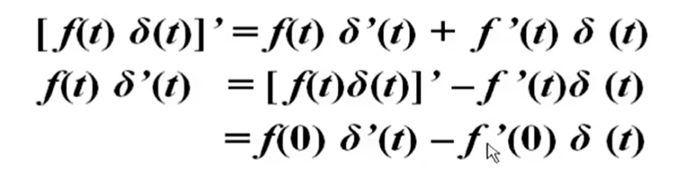

#### 重要性质：

##### 1. 定义式子

$$
\int_{-\infty}^{\infty} f(t)\delta '(t)dt =-f'(0)
$$

推广：

$$
\int_{-\infty}^{\infty} f(t)\delta '(t-a)dt =-f'(a)
$$

n阶导数推广：

$$
\int_{-\infty}^{\infty} f(t)\delta ^{n}(t)dt =(-1)^{n}f^{n}(0)
$$

##### 2. 面积为0

$$
\int_{-\infty}^{\infty} \delta '(t)dt =0
$$

### 尺度变换

1. $\delta (at)$的定义：
   
   $$
   \delta ^n(at)= \frac{1}{\left | a \right | } \frac{1}{\left | a^n \right | }\delta ^n(t)
   $$

2. 特例：
   
   $$
   \delta(at)= \frac{1}{\left | a \right | } \delta (t)
   $$

3. 推广
   
   $$
   \delta(at-t_0)=\delta[a(t-\frac{t_0}{a})]= \frac{1}{\left | a \right | } \delta (t-\frac{t_0}{a})\\
当 a=-1 时，\delta ^n(-t)= (-1)^n\delta ^n(t)
   $$

4. 奇偶性
   
   - $\delta(-t)=\delta(t)$。偶函数
   
   - $\delta'(-t)=-\delta'(t)$。奇函数

证明：

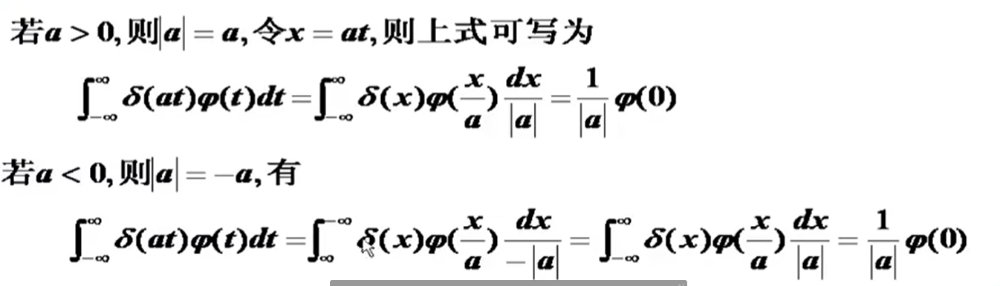

# 离散序列

## 单位脉冲序列 $\delta(k)$

### 基本定义

$$
\delta(k)=\begin{cases}
 1, & k=0 \\ 
0  & k \neq 0
\end{cases}
$$

图像：

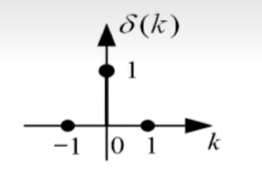

### 取样性质

1. $f(k)\delta(k)=f(0)\delta(k)$

2. $f(k)\delta(k-k_0)=f(k_0)\delta(k-k_0)$

3. $\sum_{k=-\infty}^{\infty} f(k)\delta(k)=f(0)$

## 单位阶跃序列

### 基本定义

$$
u(k)||\varepsilon(k)=\begin{cases}
 1, & k>0 \\ 
0  & k <0
\end{cases}
$$

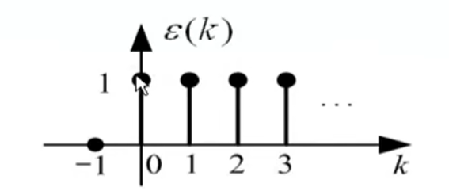

### $\varepsilon(k) \text{与} \delta(k)$的关系

- $\delta(k)=\varepsilon(k)-\varepsilon(k-1)$

- $\varepsilon(k)=\sum_{i=-\infty}^{k}\delta (i)$

- $\varepsilon(k)=\sum_{j=0}^{\infty}\delta (k-j)$

