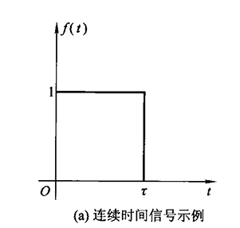
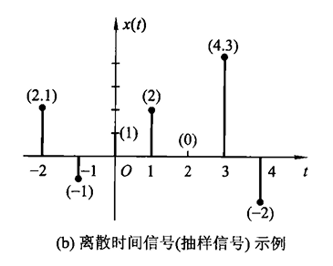
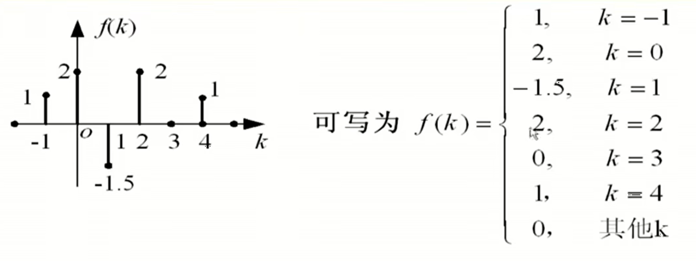
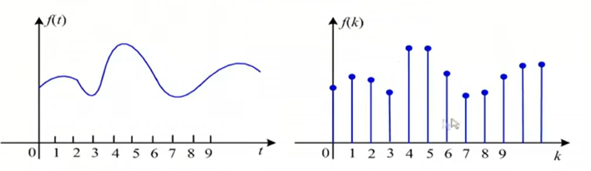
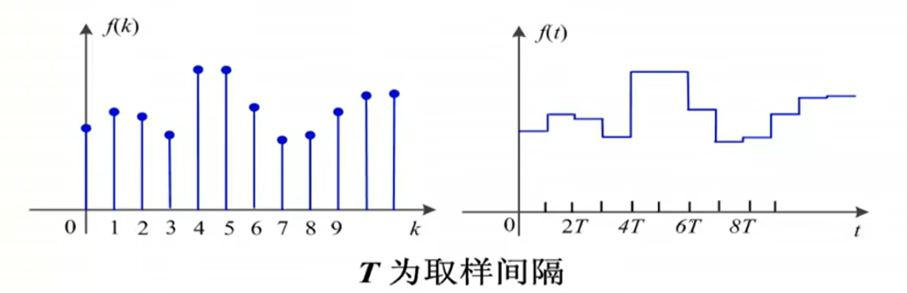
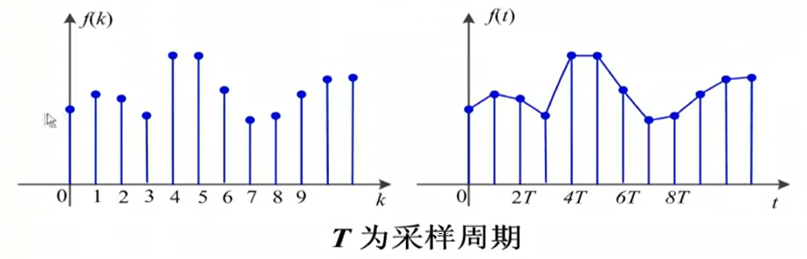

[TOC]

---

# 前言

信号与系统是很多专业的基础课程。

学完 一个章节，思考一下下面三个问题：

1. 概念

2. 分析方法

3. 数学运算

# 信号的基本概念

## 基础词汇

- 消息：知识状态发生了改变

- 信息：信息论中，将消息称作信息

- 信息量：
  
  - I=[收到某消息前对事件的无知程度]-[收到某消息后对事件的无知程度]
  
  - I= $log_aP(x_i)$ 取决事件发生的概率

- 信号：传递信息（或消息）的符号

- 系统：就是用来处理信号的程序。

# 信号的分类

## 确定性信号与随机信号

- 确定信号： 若信号被表示为一确定的时间函数,对于指定的某一时刻,可确定一相应的函数值,这种信号称为确定性信号或规则信号。例如正弦信号

- 随机信号：实际传输的信号往往具有未可预知的不确定性，这种信号被称为不确定信号或随机信号。

## 周期信号与非周期信号

- 周期信号：就是以一定时间间隔周而复始，而且是无始无终的信息
  
  - $f(t)=f(t+nT)$. T为最小正周期。
  
  - 若T趋于无穷大，则周期信号变为非周期信号

- 非周期信号：在时间上布局有周而复始的特性。

- 两个周期信号的周期分别为$T_1和T_2$ ，<u>若$T_1/T_2$为有理数</u>，则**周期信号之和仍然是周期信号，其周期为$T_1和T_2$的最小公倍数**。

### 例题 sin 周期判定

例题1：正弦信号 $f(k)=sin(\beta k)$ 是否为周期信号，若是，确定其周期，式子中 $\beta$ 称为数字角频率，单位：rad。·

解：$f(k)=sin(\beta k)=sin(\beta k+2m\pi), m=0,\pm1,\pm2\\=sin[\beta(k+m \frac{2\pi}{\beta})=sin[\beta(k+m \frac{2\pi}{N})$

$N ?= \frac{2\pi}{\beta}$

结论：

- **当 $\frac{2\pi}{\beta}$ 为整数时，正弦信号为 $N = \frac{2\pi}{\beta}$**

- **当 $\frac{2\pi}{\beta}$ 为有理数时，正弦信号仍具有周期性，但其周期为$ N = M(\frac{2\pi}{\beta})$，M取使N为整数的最小整数；**

- **当 $\frac{2\pi}{\beta}$ 为无理数时，正弦信号为非周期序列**

### 小结

1. **连续正弦信号一定是周期信号**，而正弦序列不一定是周期序列

2. 两连续周期信号之和不一定是周期信号，而两周期序列之和一定是周期序列。

## 连续信号与离散信息(**时间变量**)

- 按照时间函数取值的连续性和离散性可将信号分为连续时间信号和离散时间信号。

### 连续信号

- 如果在讨论的时间间隔内，出若干不连续点之外，对于任意时间都可给出确定的函数值。

- 连续信号的幅值可以是连续的，也可以是离散的（只取某些规定之）

- 时间和幅值都连续的信号成为**模拟信号**

### 离散信号

- 在时间上是离散的，只在某些不连续的规定瞬时给出函数值，其余时间**无定义**
- 时间间隔可以是均匀的，也可以是不均匀的。一般是采用均匀时间
- 离散时间信号的幅值是连续的，有可称为**抽样信号**
- 如果离散信号的幅值也是离散的，即时间与幅值都是离散的，又被称为**数字信号**
- 相邻离散点的间隔 $T_k=t_{k+1}-t_k$ 通常取等间隔T,离散信号可表示为$f(kT)$简写为$f(k)$，这种等间隔的离散信号也被称为**序列**，其中 **k为序号**，**将序号k的序列值称为第k个的样值**

#### 离散信号的周期

> 离散周期信号 $f(k)$，周期为N ，满足 $f(k)=f(k+mN),m=0,\pm1,\pm2$

## 一维信号与多维信号

- 从数学表达式来看，信号可以表示为一个或多个变量的函数。

- 一般研究一维信号，且自变量为时间(t)

## 能量信号与功率信号

### 基本概念

将信号 $f(t)$ 施加于 $1\Omega$ 电阻上，它所消耗的瞬时功率为 $\left |f(t)^2  \right | $，在区间 $(-\infin,+\infin)$ 的**能量和平均功率**公式如下：

- 能量：$E^{\mathrm{def}}=\int_{-\infty}^{\infty } \left | f(t)^2 \right | \mathrm{d}t  $
  
  - 能量可以看作是瞬时功率的积分。

- 平均功率：$P^{\mathrm{def}}=\lim_{T \to \infty} \frac{1}{T}  \int_{-\frac{T}{2} }^{\frac{T}{2}}  \left | f(t)^2 \right | \mathrm{d}t$
  
  - 功率是单位时间内的能量

### 对于离散

- 能量：满足$E^{\mathrm{def}}=\sum_{k=-\infty}^{\infty } \left | f(t)^2 \right | \mathrm{d}t<0$的离散信号

- 平均功率：$P^{\mathrm{def}}=\lim_{N \to \infty} \frac{1}{N} \sum_{k=-\frac{N}{2} }^{\frac{T}{2}} \left | f(t)^2 \right | \mathrm{d}t<\infty$

### 小结

- 能量有限信号：信号的能量 $E< \infty$，简称能量信号，此时$P=0$

- 功率有限信号：信号的功率$P<\infty$，简称功率能量，此时$E=\infty$

- **时限信号（尽在有限时间区间不为零）为能量信号。**

- **周期信号属于功率信号**

- 非周期信息可能是能量信号，也可能是功率信号

- 有些信号不是能量信号也不是功率信号。
  
  - 比如指数信号。

## 因果信号和反因果信号

### 基本概念

- 因果信号：$t<0,f(t)=0$的信号$f(t)$ [即$t=0$时接入系统的信号]，比如阶跃信号。

- 反因果信号：$t>=0，f(t)=0$的信号（除零信号外）

# 计算机处理信号

> 数字计算机处理的是离散时间信号。当处理对象为连续时间信号时，需要经抽样（采样）将它转换为离散时间信号。

1. 连续信号**采样**变离散信号。计算机输入

2. 离散信号变模拟信号。计算机输出
   
   - 零阶保持
     
     
   
   - 分段线性
     
     

# 总结

## 连续信号

- 连续时间信号：如果存在非零的**正数$T$**，对于**任意整数**m和所有t，满足$f(t+mT)=f(t)$，则成$f(t)$为周期为T的周期信号，其中基本周期（最小正周期）记为 $T_0$

- T 为正实数
  
  - 正有理数
    
    - 正整数
    
    - 正分数
  
  - 正无理数

## 离散信号

- 离散时间信号：如果存在**正整数N**，对于**任意整数**m和所有n，满足 $x(n+mN)=X(n)$，则称$x(n)$为周期为N的周期信号，其中基本周期为 $N_0$

- **N为正整数**

## 其它

1. 直流信号（常数）它的周期是任意的。

2. **$e^{j\omega t};e^{j\omega n}$。其中 j 表示虚数单位，w 是角频率，t 是时间。**
   
   - 欧拉公式：$e^{j\omega t}=cos(\omega t)+j*sin(\omega t)$

3- 如果不是三角信号，通过画图观察

## 如何判断信号

### 判断周期信号

> 一般以三角信号为例。针对三角信号

信号为一个时。

- 连续：$\cos \omega t /\sin \omega t. T=\frac{2\pi}{\omega}$
  
  - T=正实数时，信号为周期信号，基本周期 $T_0=\frac{2\pi}{\omega}$

- 离散：$\cos \omega n /\sin \omega n. N=\frac{2\pi}{\omega}$
  
  - N=正无理数时，非周期信号
  
  - N=正整数时，周期信号，基本周期为 $N_0=\frac{2\pi}{\omega}$
  
  - N=正分数，周期信号，基本周期为$N_0=\frac{2\pi}{\omega}=\frac{N}{M}=\frac{2\pi}{\omega}*M$

信号为两个时。

- 连续：$T_1=\frac{2\pi}{\omega_1};T_2=\frac{2\pi}{\omega_2}$
  
  $\frac{T_1}{T_2}=\left\{\begin{matrix}
   有理数 & f(t)为周期信号，基本周期T_0为T_1和T_2的最小公倍数 \\
   无理数 & f(t)为非周期信号
  \end{matrix}\right.$

- 离散：$N_1=\frac{2\pi}{\omega_1};N_2=\frac{2\pi}{\omega_2}$
  
  1. 若 $N_1,N_2$ 中有1个为正无理数，则 $x(n)$ 一定是非周期信号
  
  2. 若$ N_1,N_2$ 中没有正无理数，均为正整数，$x(n)$为周期信号，基本周期为$N_0$为$N_1,N_2$的最小公倍数.
  
  3. 若$N_1,N_2$ 中没有无理数，均为正分数，分别算两个信号的基本周期，取这两个基本周期的最小公倍数
