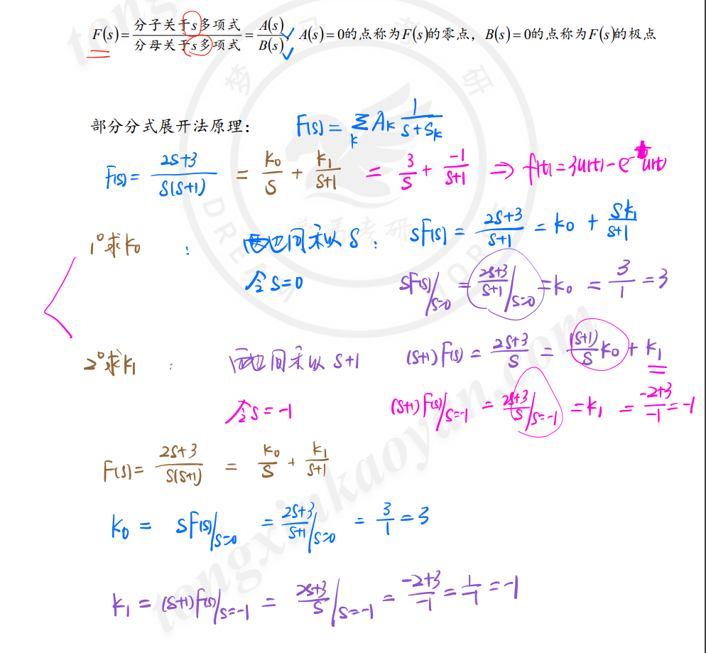

[TOC]

---

# 高等数学

## 积分

1. 分布积分

$$
\int_{a}^{b}u(x)\mathrm{d}v(x)=u(x)v(x)|_{a}^{b}-\int_{a}^{b}v(x) \mathrm{d} u(x)
$$

# 欧拉公式

$$
\sin x = \frac{e^{jx}-e^{-jx}}{2j} \\
\cos x = \frac{e^{jx}+e^{-jx}}{2}
$$

变形

$$
e^{jx}=\cos x+j \sin x \\ 
e^{-jx}=\cos x -j \sin x
$$

扩展

$$
e^{jx}=-1 \to x=\pi
$$

# 帕斯瓦尔等式

https://zhuanlan.zhihu.com/p/705496256

$$
\text{设函数 }f(x)\text{ 在 }[-\pi,\pi]\text{ 上有界可积,则有帕斯瓦尔}^+\textbf{(Parseval)等式}\\\frac{a_0^2}2+\sum_{k=1}^\infty(a_k^2+b_k^2)=\frac1\pi\int_{-\pi}^\pi f^2(x)dx\\\text{其中 }a_0,a_k,b_k\quad(k=1,2,\ldots,n)\text{ 是 }f(x)\text{ 的傅里叶系数。}
$$

# 诱导公式

常用的诱导公式有以下几组：

三角函数诱导公式一：

任意角α与-α的三角函数值之间的关系：

sin(-α)=-sinα

cos(-α)=cosα

tan(-α)=-tanα

cot(-α)=-cotα

三角函数诱导公式二：

设α为任意角，π+α的三角函数值与α的三角函数值之间的关系：

sin(π+α)=-sinα

cos(π+α)=-cosα

tan(π+α)=tanα

cot(π+α)=cotα

三角函数诱导公式三：

利用公式二和公式三可以得到π-α与α的三角函数值之间的关系：

sin(π-α)=sinα

cos(π-α)=-cosα

tan(π-α)=-tanα

cot(π-α)=-cotα

三角函数诱导公式四：

设α为任意角，终边相同的角的同一三角函数的值相等：

sin(2kπ+α)=sinα(k∈Z)

cos(2kπ+α)=cosα(k∈Z)

tan(2kπ+α)=tanα(k∈Z)

cot(2kπ+α)=cotα(k∈Z)

三角函数诱导公式五：

利用公式一和公式三可以得到2π-α与α的三角函数值之间的关系：

sin(2π-α)=-sinα

cos(2π-α)=cosα

tan(2π-α)=-tanα

cot(2π-α)=-cotα

三角函数诱导公式六：

π/2±α及3π/2±α与α的三角函数值之间的关系：

sin(π/2+α)=cosα

cos(π/2+α)=-sinα

tan(π/2+α)=-cotα

cot(π/2+α)=-tanα

sin(π/2-α)=cosα

cos(π/2-α)=sinα

tan(π/2-α)=cotα

cot(π/2-α)=tanα

sin(3π/2+α)=-cosα

cos(3π/2+α)=sinα

tan(3π/2+α)=-cotα

cot(3π/2+α)=-tanα

sin(3π/2-α)=-cosα

cos(3π/2-α)=-sinα

tan(3π/2-α)=cotα

cot(3π/2-α)=tanα

# 部分分式展开法

