- [随课](#随课)
  - [3.9 抽样及抽样定理](#39-抽样及抽样定理)
  - [4.2 拉氏变换](#42-拉氏变换)
- [强化](#强化)
  - [1.常见系统](#1常见系统)

# 随课
## 3.9 抽样及抽样定理

---

---

---

## 4.2 拉氏变换

---

---

---

----

---

---

# 强化

##  1.常见系统

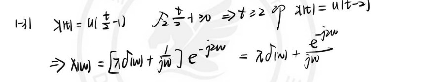

---

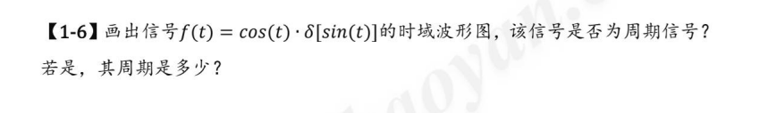

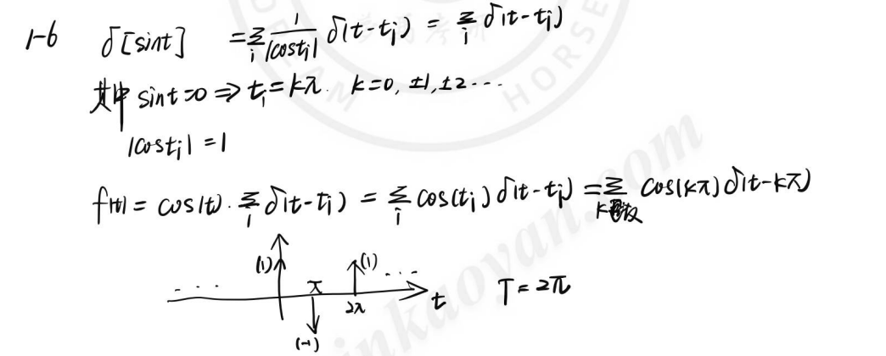

---

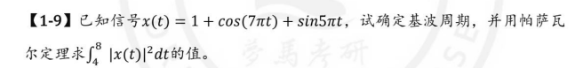

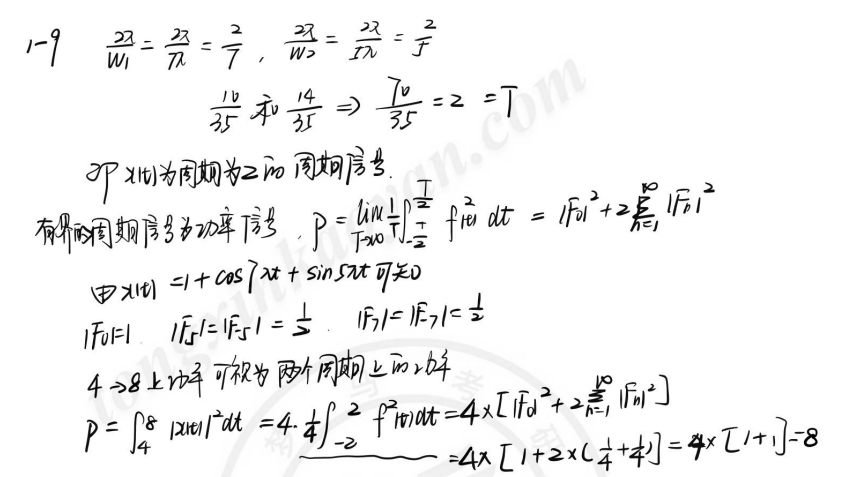

---

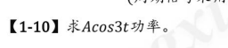

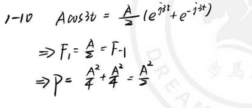

---

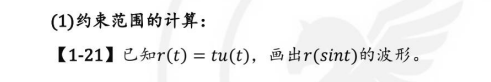

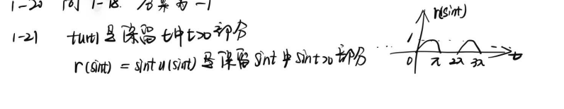

---

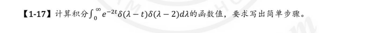

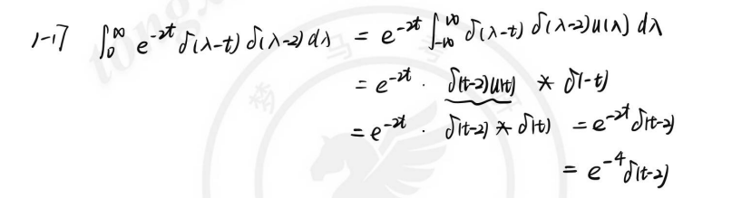

---

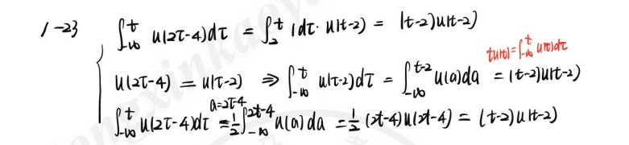

---

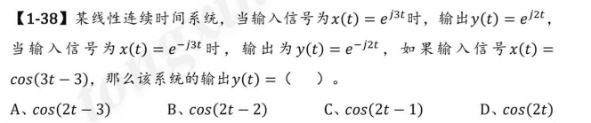

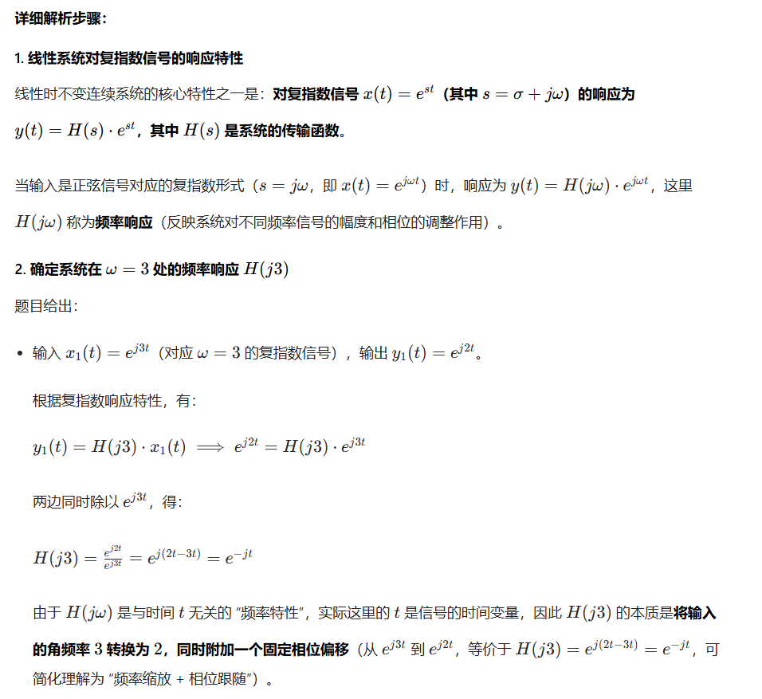

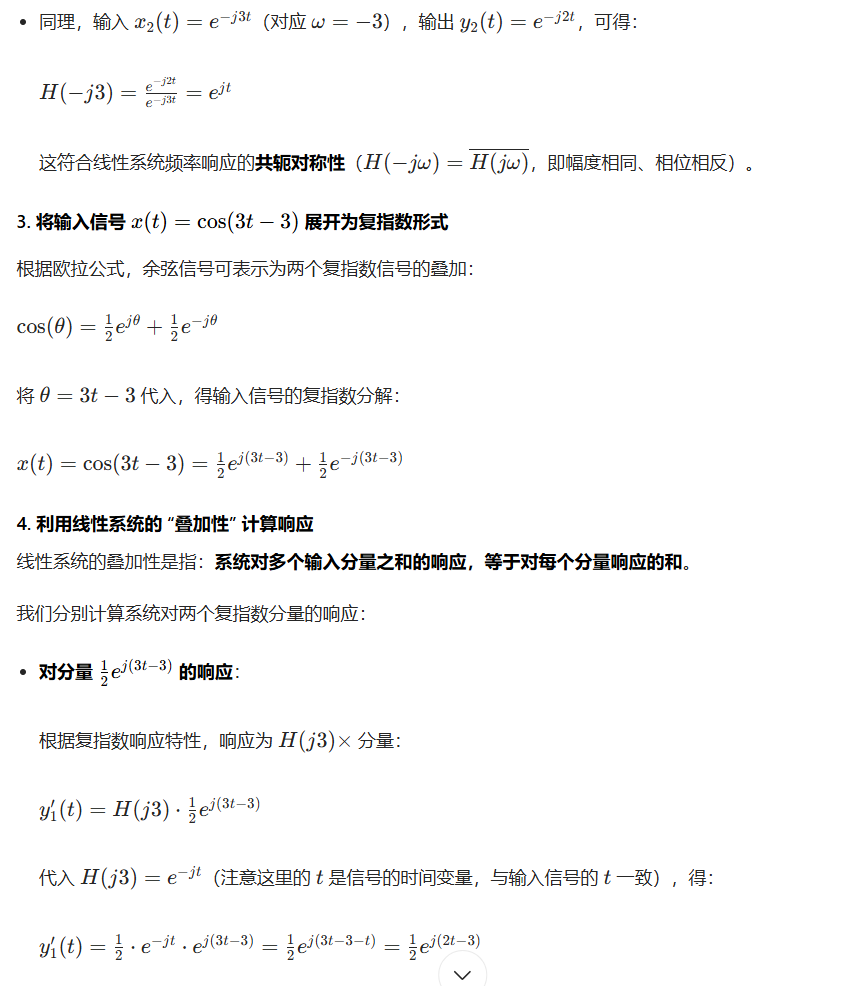

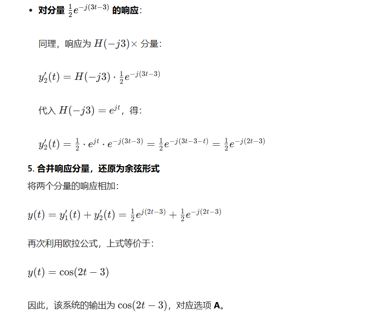

---

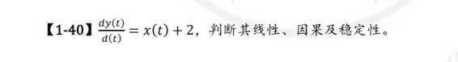

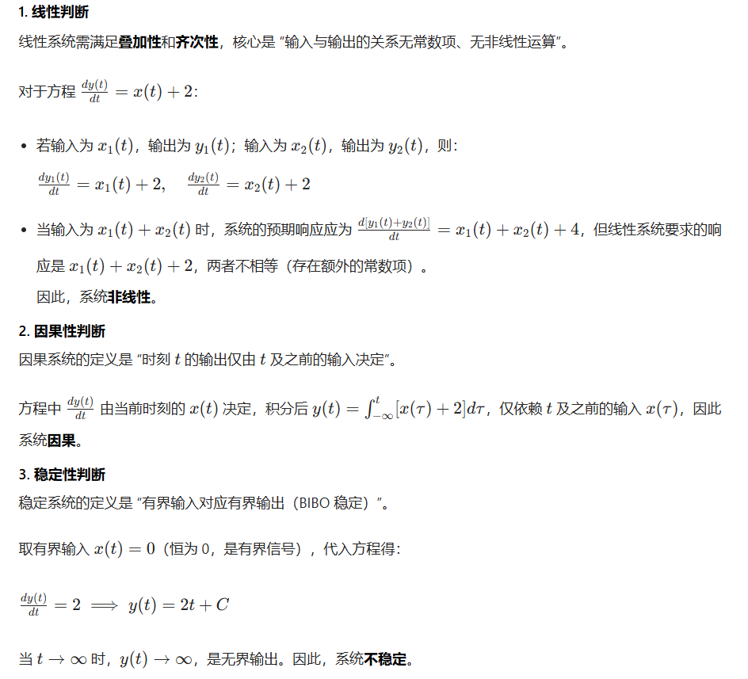

---

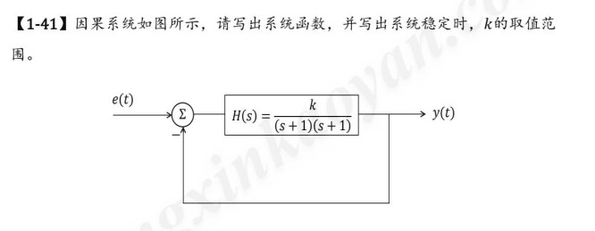

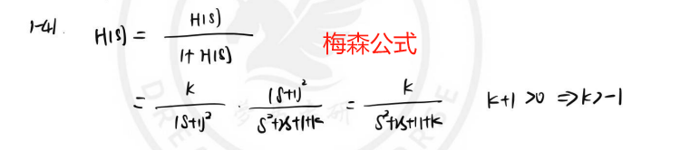

---

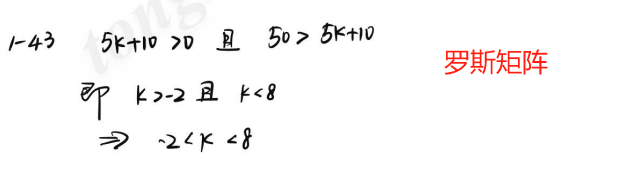

---

