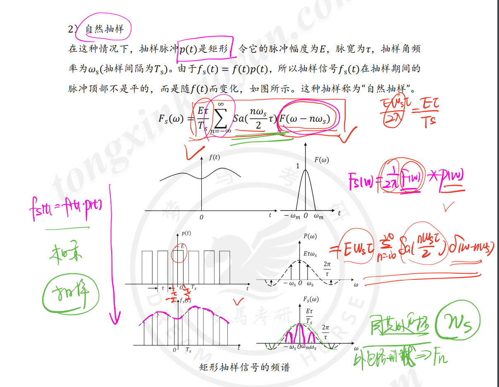

# 卷积公式

- $K*f(t)=K[f(t)波形的净面积值]$

- $f(t)*\delta(t)=f(t);$

- $f(t)*\delta'(t)=f'(t)*\delta(t)=f'(t);$

- $f(t)*\varepsilon(t)=f(t)*\delta^{(-1)}(t)=f^{(-1)}(t)*\delta(t)=f^{(-1)}(t)=\int_{-\infty}^{t}f(\tau)d\tau$

- $\varepsilon(t)*\varepsilon(t)=t\varepsilon(t)$

- $e^{-at}\varepsilon(t)*e^{-at}\varepsilon(t)=te^{-at}\varepsilon(t)$

- $e^{-a_1t}\varepsilon(t) *e^{-a_2t}\varepsilon(t)=\frac{1}{a_2-a_1} (e^{-a_1t}-e^{-a_2t})\varepsilon(t)  ;  (a_1 \ne  a_2)$

- $\varepsilon *e^{-at}\varepsilon(t)=\frac{1}{a} (1-e^{-at})\varepsilon(t)$

- $f(t)*\delta_T(t)=f(t)*\sum_{m=-\infty }^{\infty } \delta (t-mT)=\sum_{m=-\infty }^{\infty } f (t-mT)$

- 在 $f_1(-\infty)=0$或$f_2^{(-1)}(+\infty)=0$的前提下：
    $$
    f_1(t)*f_2(t)=f_1'(t)*f_2^{(-1)}(t)
    $$

# 傅里叶

···

# S域

# 解题方法

## 频率响应法求稳态响应 S域

以下是**频率响应法求解稳态响应的步骤总结**：

### 步骤1：确定激励的频率与幅值
从激励信号 $e(t)=E_m\cos(\omega t)u(t)$（或 $\sin$ 形式）中，提取：
- 角频率 $\omega$（单位：$\text{rad/s}$）
- 幅值 $E_m$

### 步骤2：求系统的频率响应 $H(j\omega)$
将系统传递函数 $H(s)$ 中的 $s$ 替换为 $j\omega$，得到频率响应：
$$H(j\omega)=H(s)\big|_{s=j\omega}$$

### 步骤3：计算 $H(j\omega)$ 的幅值与相角
对 $H(j\omega)$ 进行化简（有理化、复数运算），得到：
- 幅值：$|H(j\omega)|=\sqrt{\text{实部}^2+\text{虚部}^2}$
- 相角：$\angle H(j\omega)=\arctan\left(\frac{\text{虚部}}{\text{实部}}\right)$（注意根据实部/虚部符号确定象限）

### 步骤4：构造稳态响应
稳态响应的形式为：
$$r_{\text{ss}}(t)=|H(j\omega)|\cdot E_m \cdot \cos\left(\omega t + \angle H(j\omega)\right)$$
（若激励为 $\sin$ 形式，响应对应为 $\sin$ 形式）

### 关键说明
- 仅适用于**稳定的线性时不变系统**（传递函数极点均在左半复平面）；
- 稳态响应是系统在正弦激励下，暂态响应衰减后的长期输出，与系统的频域特性直接相关。

## 相位角计算

计算复函数的**相角（相位）**，核心是利用**复数的辐角（相位角）定义**，再结合“商的辐角 = 分子辐角 - 分母辐角”的性质。

以你之前的 $H(\omega) = \frac{j\omega - 2}{j\omega + 2}$ 为例，步骤如下：

### 步骤1：明确复数的相角定义
对于复数 $A = a + jb$（$a,b$ 为实数），其相角 $\arg(A)$ 是复平面中从实轴正方向到向量 $A$ 的夹角，需结合 $a,b$ 的符号确定象限，计算公式为：
$$
\arg(A) = \begin{cases}
\arctan\left(\frac{b}{a}\right) & a > 0 \\
\arctan\left(\frac{b}{a}\right) + \pi & a < 0, b \geq 0 \\
\arctan\left(\frac{b}{a}\right) - \pi & a < 0, b < 0 \\
\pm \frac{\pi}{2} & a = 0
\end{cases}
$$

### 步骤2：分别计算分子、分母的相角
- **分子：$j\omega - 2 = -2 + j\omega$**
  这里 $a=-2 < 0$，$b=\omega$，因此：
  $$
  \arg(j\omega - 2) = \arctan\left(\frac{\omega}{-2}\right) + \pi = \pi - \arctan\left(\frac{\omega}{2}\right)
  $$

- **分母：$j\omega + 2 = 2 + j\omega$**
  这里 $a=2 > 0$，$b=\omega$，因此：
  $$
  \arg(j\omega + 2) = \arctan\left(\frac{\omega}{2}\right)
  $$

### 步骤3：计算 $H(\omega)$ 的相角
根据“商的相角 = 分子相角 - 分母相角”：
$$
\arg[H(\omega)] = \arg(j\omega - 2) - \arg(j\omega + 2) = \left[\pi - \arctan\left(\frac{\omega}{2}\right)\right] - \arctan\left(\frac{\omega}{2}\right)
$$
化简得：
$$
\arg[H(\omega)] = \pi - 2\arctan\left(\frac{\omega}{2}\right)
$$

### 通用结论
对于复函数 $H = \frac{A}{B}$（$A,B$ 为复数），其相角为：
$$
\arg(H) = \arg(A) - \arg(B)
$$

要不要我帮你整理一份复数相角计算的常见案例？