[TOC]

---

> 引用：https://zhuanlan.zhihu.com/p/361415321

# **梅森增益公式的重要性和应用场合**

梅森增益公式主要应用于**求系统的传递函数**，而系统的传递函数是解决其他章节问题的第一步，在90%的考研院校中第一题或者第二题都会涉及用梅森增益公式求传递函数，因此，[梅森增益公式](https://zhida.zhihu.com/search?q=%E6%A2%85%E6%A3%AE%E5%A2%9E%E7%9B%8A%E5%85%AC%E5%BC%8F&zhida_source=entity&is_preview=1)的重要性不言而喻；下面我带你深入浅出地领会下这个不得不掌握的梅森增益公式，相信看完这篇文章后，你再做这类题将游刃有余，而且不会出错。

# # **梅森增益公式的定义**

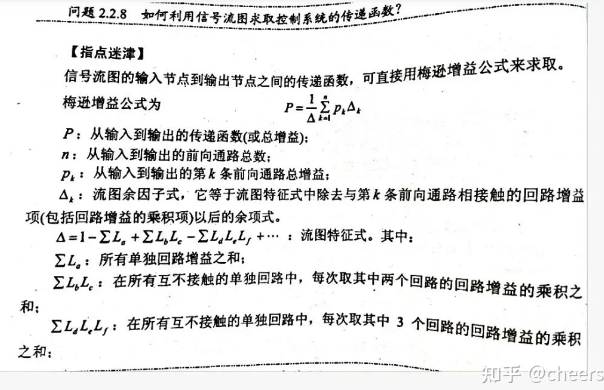

# 例题

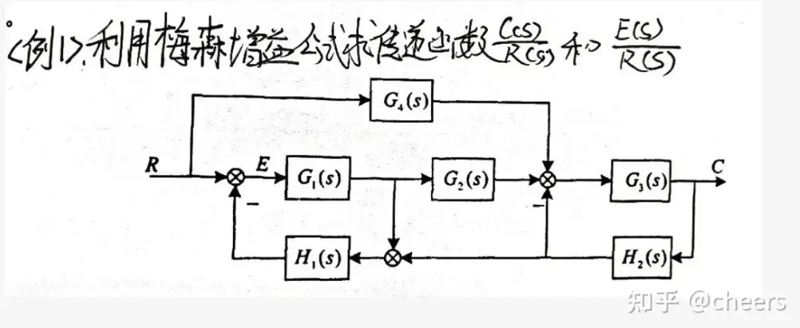

梅森增益公式适用于信号结构图和信号流图。为了提高准确率和更加清楚的说明公式的运用，我们这里先将其化成信号流图。

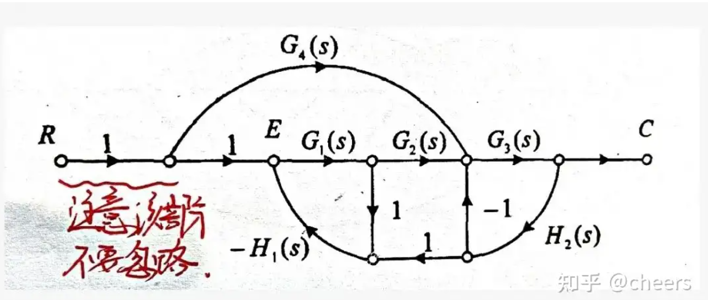

这里注意下 <u> R(s)和C(s) </u>的节点画法。

画完[信号流图](https://zhida.zhihu.com/search?q=%E4%BF%A1%E5%8F%B7%E6%B5%81%E5%9B%BE&zhida_source=entity&is_preview=1)之后，接下来正式开始进入正题。、

1. 找出所有的**[闭环回路](https://zhida.zhihu.com/search?q=%E9%97%AD%E7%8E%AF%E5%9B%9E%E8%B7%AF&zhida_source=entity&is_preview=1)**，这里有个技巧，那就是找闭环回路的时候，一定是先找**反馈**，有返回才能形成一个[闭合回路](https://zhida.zhihu.com/search?q=%E9%97%AD%E5%90%88%E5%9B%9E%E8%B7%AF&zhida_source=entity&is_preview=1)，当你盯着**反馈**找时，你会发现找回路会轻松很多，而且准确率也高，不容易找漏。

        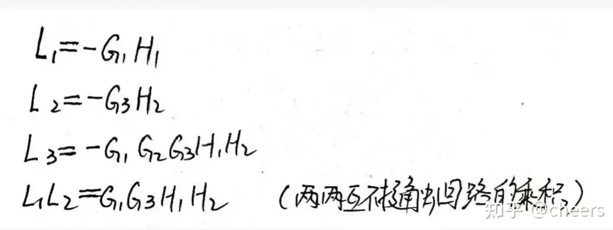

2. 判断所找的回路中是否有**不相接触**的回路，注意这里的互不相接触的回路是一点联系都没有，即使是一个点也不行，这里不理解我说什么的同学可以先接下去看，我在最后部分**易错点**会详细说明。

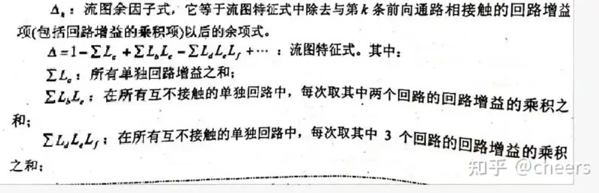

这个公式一般只用记到三项就行，考研题目中的传递函数不会过于复杂，下面分享下我记这个公式的技巧，首先是**奇数**前的系数都是**负**的（单个之和、三三相乘），**偶数**前面的系数是**正**的。然后要注意**第一项是相加**，**后两项是相乘**。一般来说，考研只需要记住前三项即可，题目不会过于复杂的，即使真的遇到，后面几项也可以按这个规律推出来。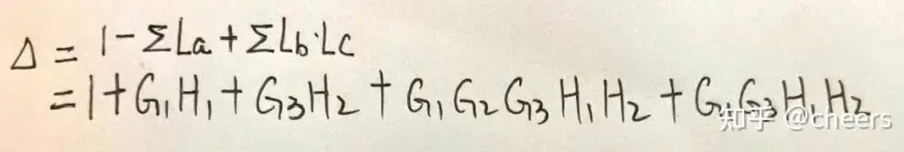

这样，我们就可以得到传递函数的分母部分，而这里的分母部分就是**闭环系统的[特征方程](https://zhida.zhihu.com/search?q=%E7%89%B9%E5%BE%81%E6%96%B9%E7%A8%8B&zhida_source=entity&is_preview=1)**，常结合**劳斯稳定判据**进行对系统的判稳，因此，有时如果题目中给出结构图后，要求**判定系统的稳定性**时，就可以只用以上的方法，求出传递函数的分母即可。

分母求出来后，我们来解决下传递函数的分子，分子是累加和的形式，即求出各个部分之后，将他们相加就行，每个部分是由前项通路和它所对应的[流图余子式](https://zhida.zhihu.com/search?q=%E6%B5%81%E5%9B%BE%E4%BD%99%E5%AD%90%E5%BC%8F&zhida_source=entity&is_preview=1)相乘，公式如下

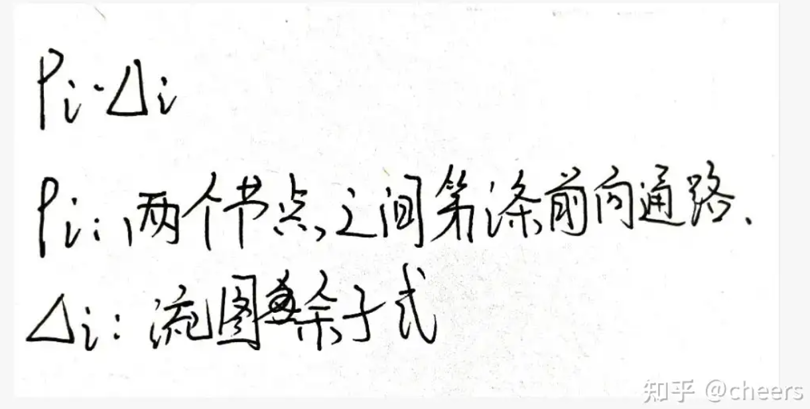

这里的难点是求流图余子式，其实流图余子式和[特征余子式](https://zhida.zhihu.com/search?q=%E7%89%B9%E5%BE%81%E4%BD%99%E5%AD%90%E5%BC%8F&zhida_source=entity&is_preview=1)求法类似，主要区别就是流图余子式闭环回路的限定范围是**不与该条前项通路相接触**，而特征余子式没有。接下来我完整的展示一下这道题答题是的过程步骤，希望同学们能够严格遵守做题规范，让阅卷老师找不出扣分的理由。

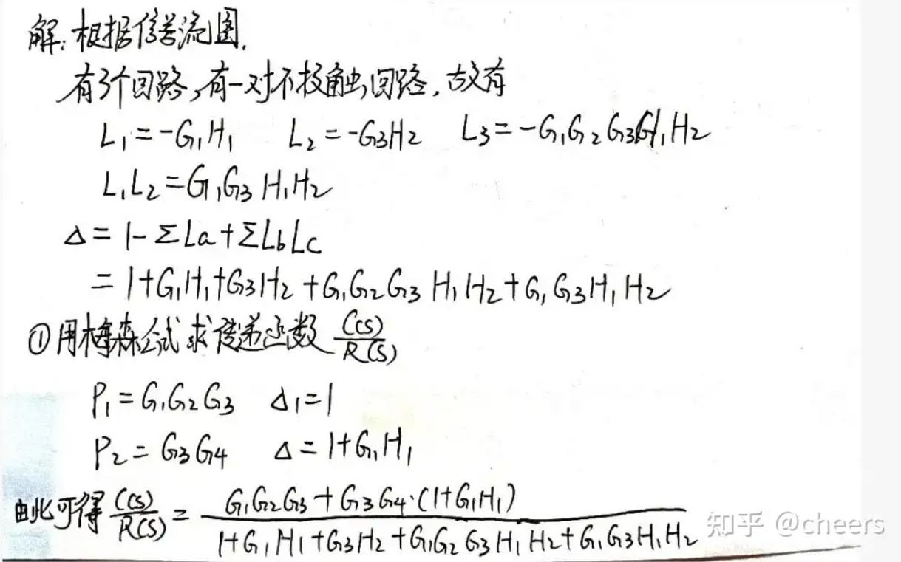

# 考研真题

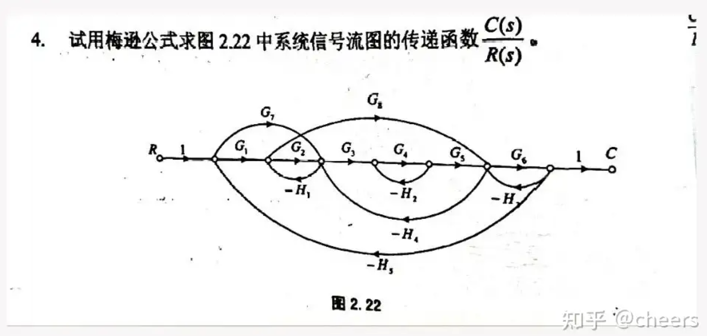

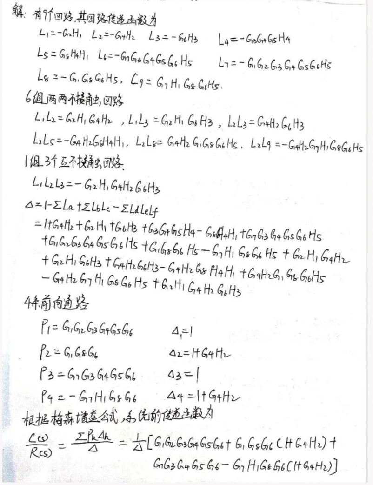

# 易错点

## **互不接触的概念**

> 两个回路有共用一个公共点都不行

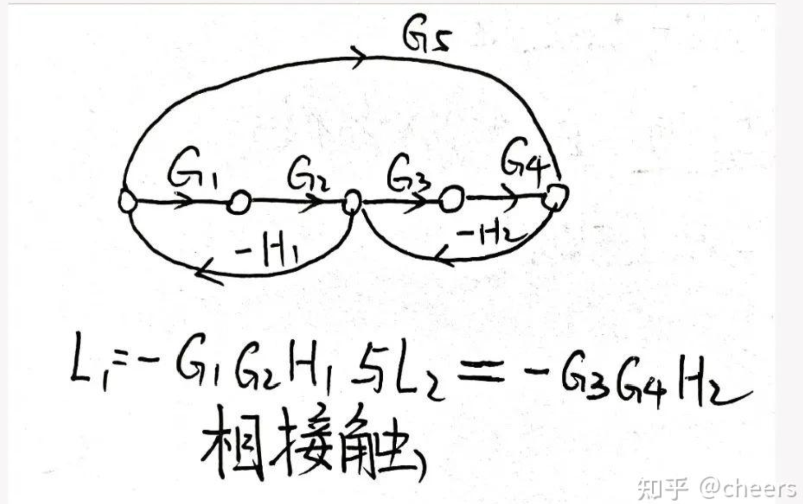

## 找回路要仔细

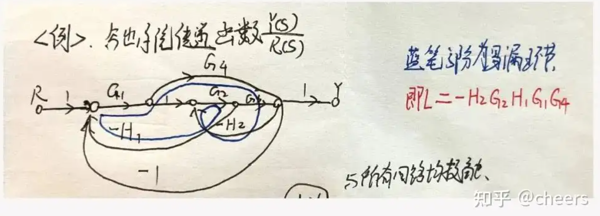

## **[混合节点](https://zhida.zhihu.com/search?q=%E6%B7%B7%E5%90%88%E8%8A%82%E7%82%B9&zhida_source=entity&is_preview=1)**之间不能使用

这里注意求最后一个传递函数时，不能直接利用梅森增益公式，因为梅森增益公式只能在输入输出节点中使用，而这道题中y5和y2均是混合节点。所以该题的正确做法是求出y5与y1的[传函](https://zhida.zhihu.com/search?q=%E4%BC%A0%E5%87%BD&zhida_source=entity&is_preview=1)和y2与y1的传函，两个相除即可。

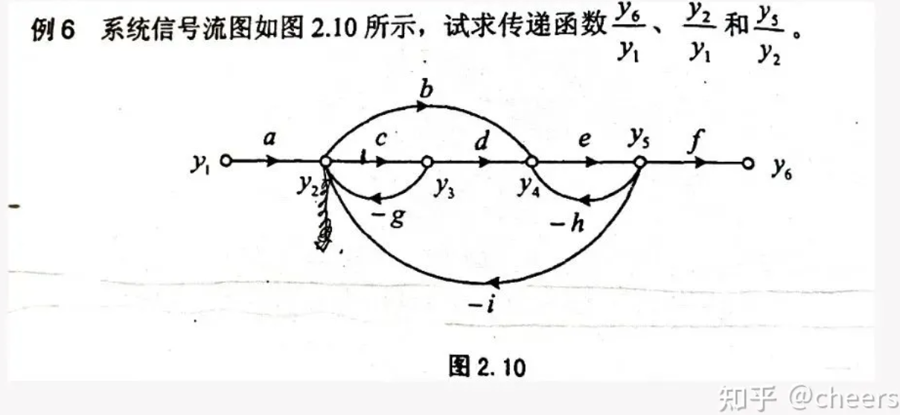
