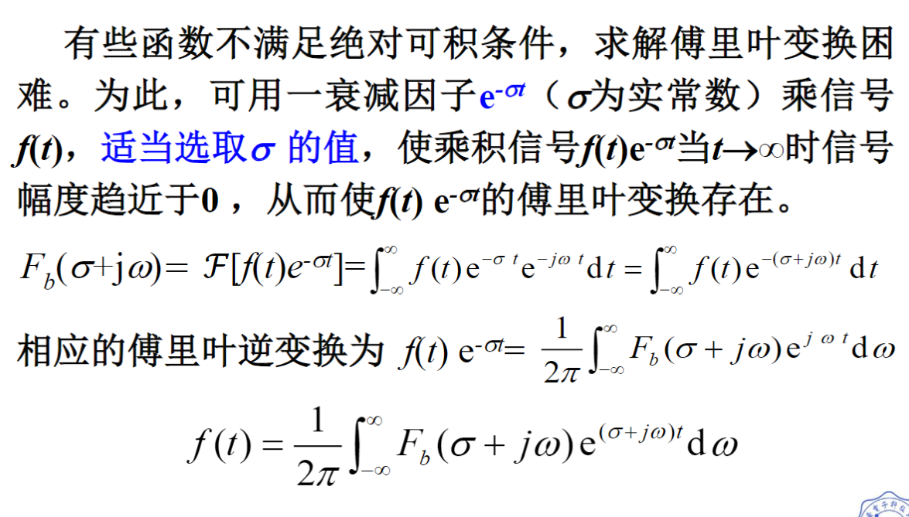
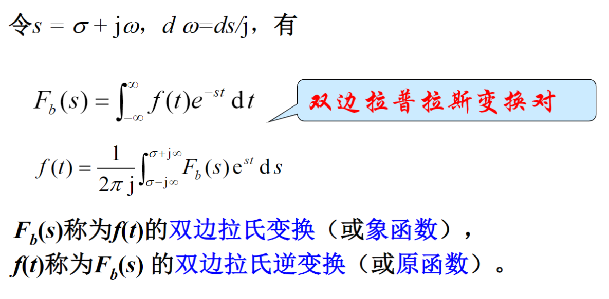
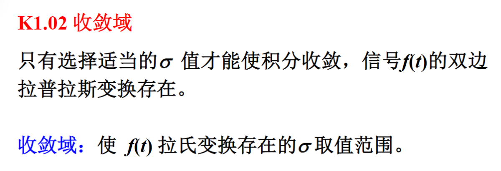
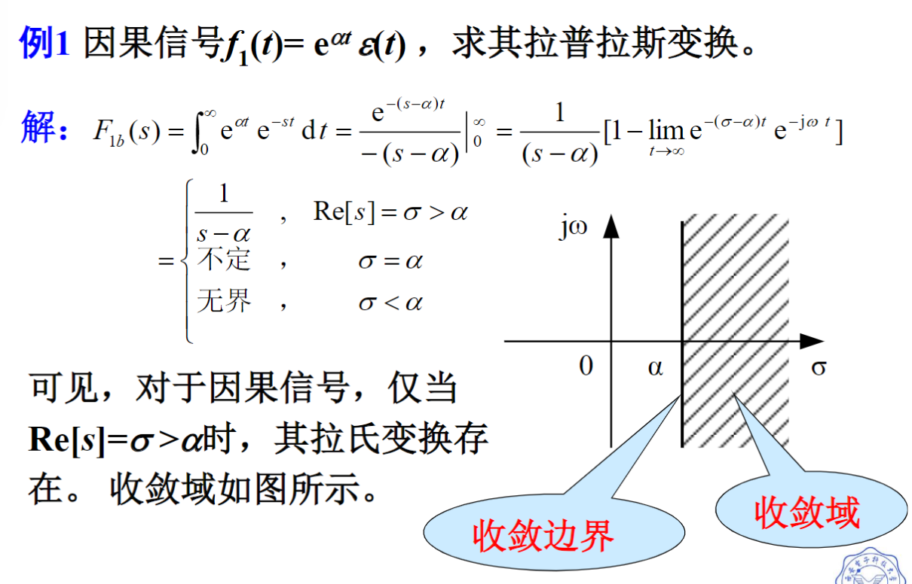
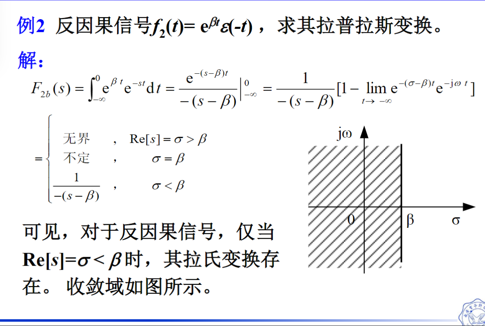
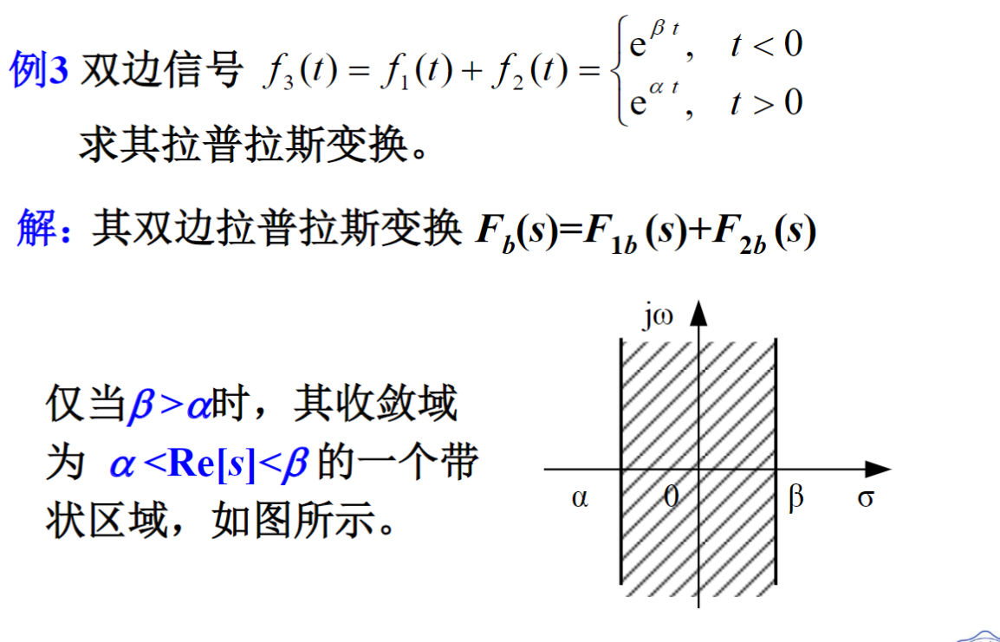
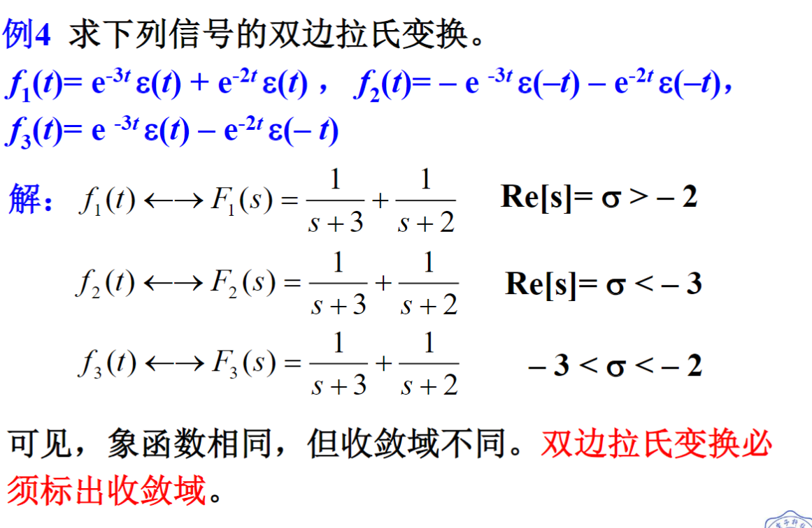
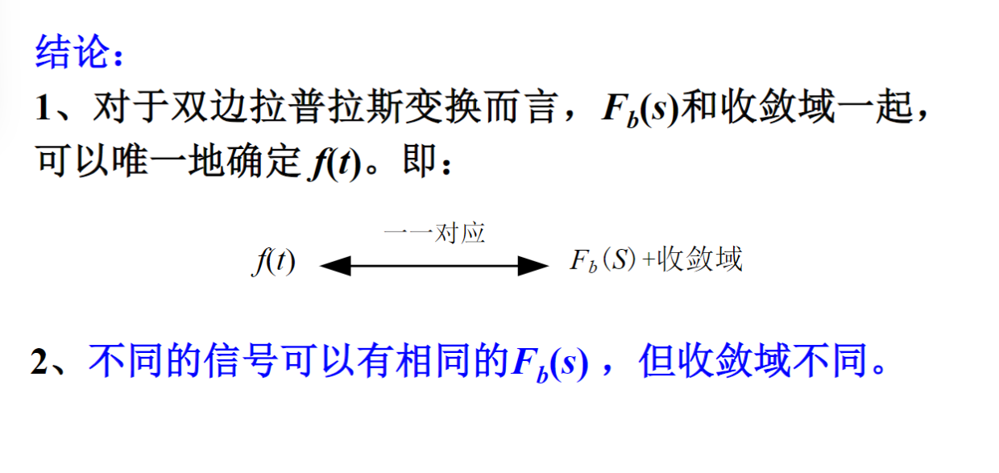

[TOC]

---

# 双边拉普拉斯变换的定义

拉普拉斯变换解决了傅里叶什么问题？

1. 傅里叶变换不存在的信号

2. 傅里叶取值范围是假设负无穷到正无穷，起始点不是在负无穷怎么办？

# 收敛域

由 $F_b(s)$ 是否可唯一求出$f(t)$?

## 因果信号

## 反因果信号

## 双边信号

绝对收敛域

- 定义： $\int_{-\infty}^{\infty} |f(t)e^{-\sigma t}|dt < \infty$ 。由所有 $\sigma$组成的点集，称为 $f(t)$的绝对收敛域

- 计算方法：
  
  $$
  \lim_{t\to-\infty||\infty}|f(t)e^{-\sigma t}| = 0
  $$
