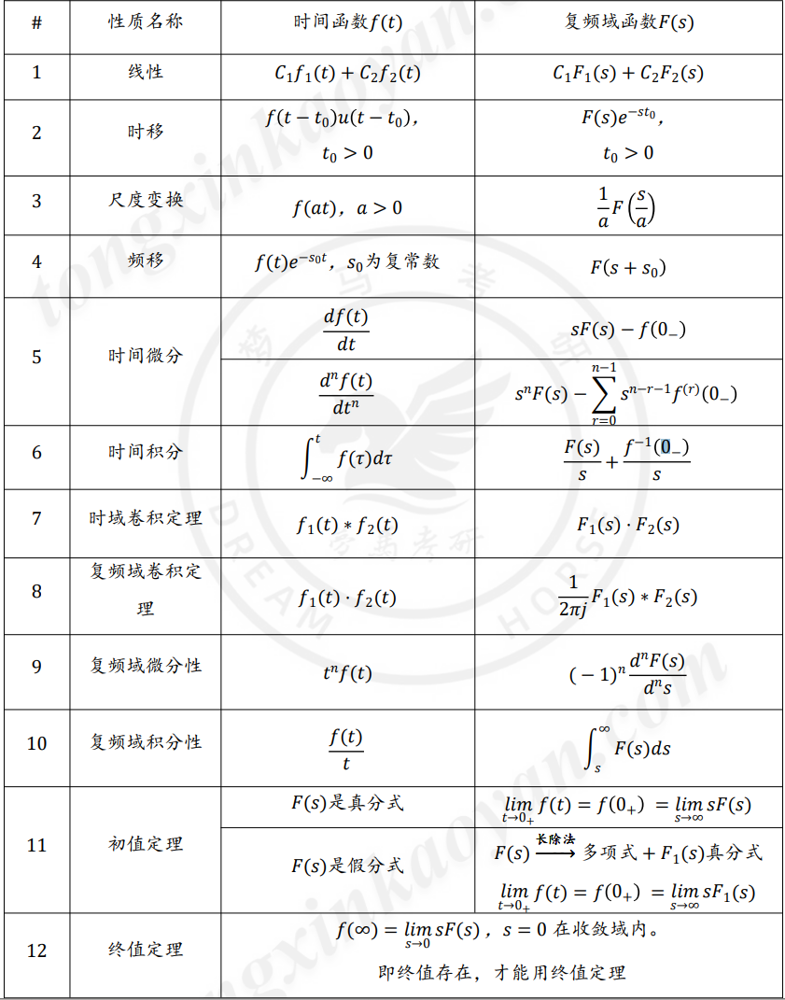

[TOC]

---

# 知识点铺设——拉式变换

## 拉斯变换

### 与傅里叶变换的关系

### 拉普拉斯变换的定义

$$
s=\sigma + j\omega \to F(s)=\int_{\infty}^{\infty}f(t)^{st}dt
$$

- 一般说拉普拉斯变换都是指单边拉普拉斯

### 系统的表示方法

<mark>需要注意的是如果拉式变换转傅里叶变换，需要满足在收敛域中包含jw轴</mark>

## 收敛域 （ROC）

只有选择**适当的**衰减因子 σ 值才能使积分收敛（**满足绝对可积**），即**该条件**称为象函数肚饿收敛域ROC

## 常见信号的拉式变换

## LT变换的性质

### 线性

### 尺度变换

### 时移和s域移位

<mark>和之前的傅里叶规则一样，时不变，不时则变；一方变另一方加e</mark>

<mark>有个不同点，就是在于要凑$f(t-t_0)u(t-t_0)$</mark>

### 时域微分性质

$$
f'(t)=sF(s)-f(0_-)\\
f''(t)=s^2F(s)-sf(0_-)-f'(0_-)
$$

<mark>记忆方式：S[原函数的拉式变换]-[原函数的0_]</mark>

### 时域积分性质

### s域微分性质

### s域积分性质

### 时域卷积

<mark>下面两种方式需要理解透，明白怎么正逆变换</mark>

### 频域卷积

 

### 初值定理

### 终值定理

# 双边拉普拉斯变换的定义

拉普拉斯变换解决了傅里叶什么问题？

1. 傅里叶变换不存在的信号

2. 傅里叶取值范围是假设负无穷到正无穷，起始点不是在负无穷怎么办？

# 收敛域

由 $F_b(s)$ 是否可唯一求出$f(t)$?

## 因果信号

## 反因果信号

## 双边信号

绝对收敛域

- 定义： $\int_{-\infty}^{\infty} |f(t)e^{-\sigma t}|dt < \infty$ 。由所有 $\sigma$组成的点集，称为 $f(t)$的绝对收敛域

- 计算方法：
  
  $$
  \lim_{t\to-\infty||\infty}|f(t)e^{-\sigma t}| = 0
  $$
