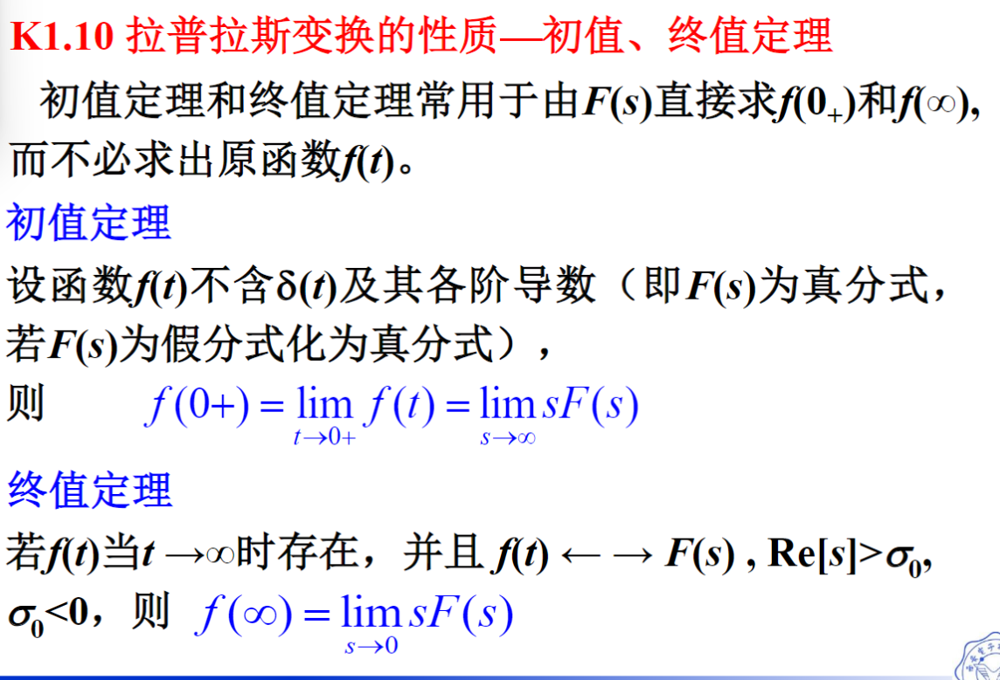

[TOC]

---

# 单边拉式变换和傅里叶变换的关系

- $\sigma = 0 == s=j\omega$

- 傅里叶变换不存在，但拉普拉斯变换存在     

# 常见的拉普拉斯变换

# 拉普拉斯变换的性质——线性、尺度变换

# 拉普拉斯变换的性质——时移、复频移特性

# 拉普拉斯变换的性质——时域和复频域的微积分特性

*s域是连续时间信号的表示域,z域是离散时间信号的表示域*

# 拉普拉斯变换的性质——卷积定理

# 拉普拉斯变换的性质——初值、终值定理

