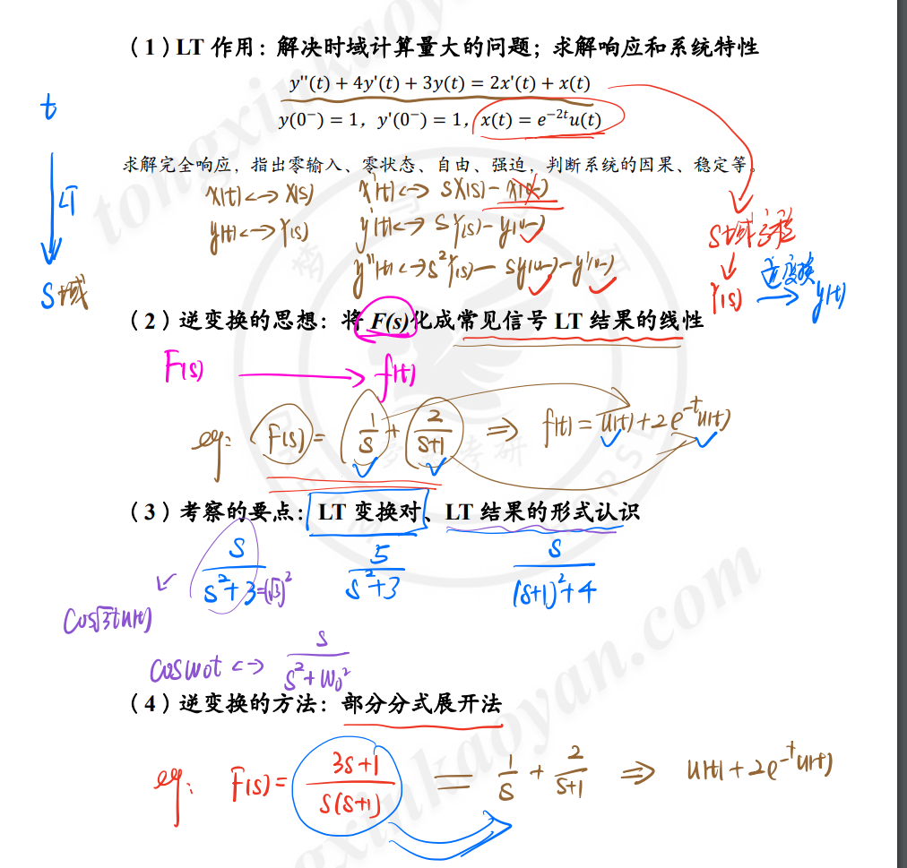
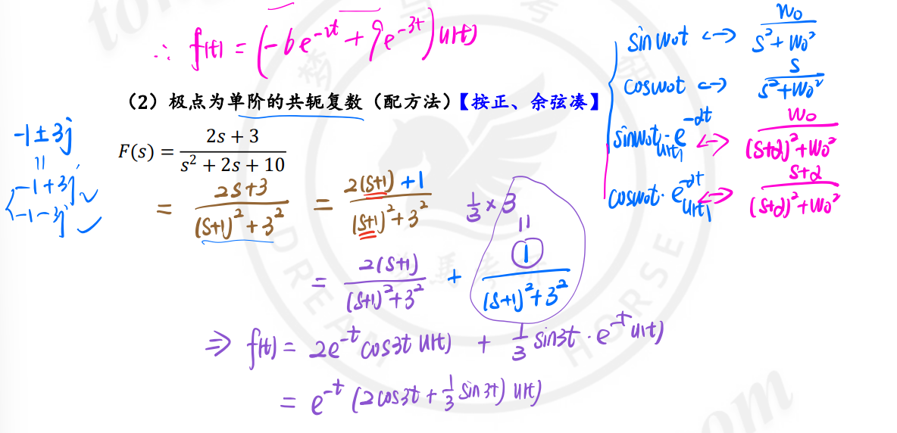

[TOC]

---

# 知识点铺设——拉式逆变换F(s)->f(t)

## 前言

## 部分分式展开法

### 极点为单阶的共轭复数（配方法）

<mark>正弦余弦凑</mark>

### 极点为单阶的实数和共轭复数并存

### 极点有重极点

<mark>可以通过求导法或者代值法解决</mark>

## 特殊情况的逆变换

### F(s)为假分式

<mark>利用长除法</mark>

### F(s)含有$e^{as}$

### 有始周期信号

<mark>需要注意一个转换</mark>

$$
\frac{1}{1+e^{-sT}}=\sum_{n=0}^{\infty}(-e^{-sT})^{n}=\sum_{n=0}^{\infty}(-1)^{n}\delta(t-nT)
$$

### s域积分

# 拉普拉斯反变换

