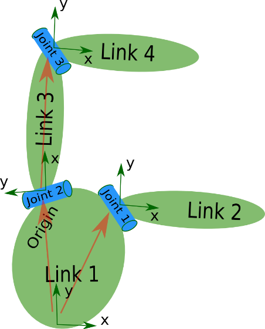
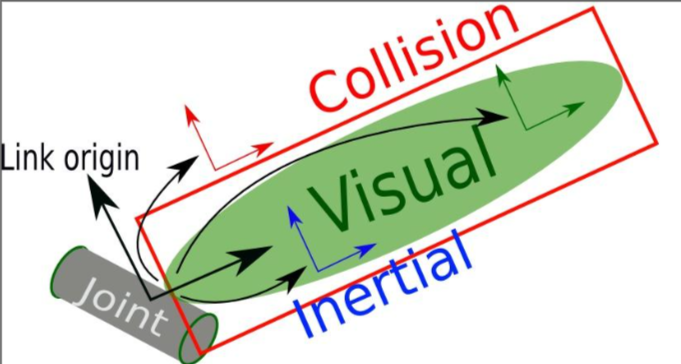
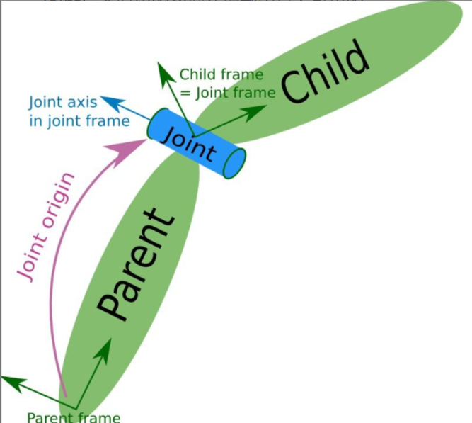

[toc]

---

# URDF基础
## 什么是URDF

ROS中的建模方法叫做URDF，全称是统一机器人描述格式，不仅可以清晰描述机器人自身的模型，还可以描述机器人的外部环境。

URDF模型文件使用的是XML格式。

如何使用这样一个文件描述机器人呢？比如这个机械臂，大家可以看下自己的手臂，我们的手臂是由大臂和小臂组成，他们独自是无法运动的，必须通过一个手肘关节连接之后，才能通过肌肉驱动，产生相对运动。

在建模中，大臂和小臂就类似机器人的这些独立的刚体部分，称为连杆Link，手肘就类似于机器人电机驱动部分，称为关节joint。

所以在URDF建模过程中，关键任务就是通过这里的`<link>`和`<joint>`，理清楚每一个连杆和关节的描述信息。

## 连杆Link
`<link>`标签用来描述机器人某个刚体部分的外观和物理属性，外观包括尺寸、颜色、形状，物理属性包括质量、惯性矩阵、碰撞参数等。

```xml
<link name="base_link">
    <visual>
        <geometry>
            <mesh filename="drawer.obj" />
        </geometry>
    </visual>
</link>
<link name="head">
    <visual>
        <geometry>
        <sphere radius="0.2"/>
        </geometry>
        <material name="white"/>
    </visual>
    <collision>
        <geometry>
        <sphere radius="0.2"/>
        </geometry>
    </collision>
    <inertial>
        <mass value="2"/>
        <inertia ixx="1.0" ixy="0.0" ixz="0.0" iyy="1.0" iyz="0.0" izz="1.0"/>
    </inertial>
</link>

```
- `<link>`标签用来标记连杆
  - name：连杆的名称
- `<visual>`标签用来描述机器人外观，包括颜色、尺寸、形状等。
  - `<geometry>`标签用来描述机器人外观的几何形状，包括几何体、球体、圆柱体、立方体等。
    - `<mesh>`标签用来描述机器人外观的几何体，包括mesh文件、mesh的尺寸等。
      - filename：mesh文件的路径
      - scale：mesh文件的尺寸
    - `<sphere>`标签用来描述机器人外观的球体，包括半径等。
      - radius：球体的半径 
      - color：颜色
      - texture：纹理
    - `<cylinder>`标签用来描述机器人外观的圆柱体，包括半径和高度等。
      - radius：半径
      - height：高度
      - color：颜色
    - `<box>`标签用来描述机器人外观的立方体，包括边长等。
    - `<plane>`标签用来描述机器人外观的平面，包括方向向量和偏移等。
    - `<capsule>`标签用来描述机器人外观的胶囊体，包括半径和高度等。
  - `<material>`标签用来描述机器人外观的材质，包括颜色、纹理等。
  - `<origin>`标签用来描述机器人外观的坐标系，包括位置和旋转等。
    - xyz: 位置
    - rpy: 旋转
- `<collision>`标签用来描述机器人碰撞参数，包括碰撞体积、碰撞体积的材质等。
  - `<geometry>`标签用来描述碰撞体积的几何形状，包括几何体、球体、圆柱体、立方体等。
  - `contact_coefficients`
- `<inertial>`标签用来描述机器人惯性参数，包括质量、惯性矩阵等。
  - `<mass>`标签用来描述质量，单位是kg。
  - `<inertia>`标签是一个3x3的惯性矩阵，用来描述物体绕其质心的惯性。
    - 由于矩阵对称，可以用6个元素来表示。[ixx,ixy,ixz,iyy,iyz,izz]
        | x   | y   | z   |
        | --- | --- | --- |
        | ixx | ixy | ixz |
        | ixy | iyy | iyz |
        | ixz | iyz | izz |


## 关节joint
`<joint>`标签用来描述机器人关节，包括关节类型、关节名称、关节参数、连接的连杆等。



```xml
<joint name="joint" type="revolute">
    <parent link="base_link" />
    <child link="mobile_link" />
    <origin xyz="0.1 0.1 0"/>
    <axis xyz="0 0 1"/>
    <limit lower="0" upper="1.5" effort="0.0" velocity="0.0" />
</joint>
```

- `<joint>`标签用来标记关节
  - name：关节的名称
  - type：关节类型
    - continuous: 旋转关节，可以绕单轴无限旋转
    - revolute: 旋转关节，类似于 continues,但是有旋转角度限制
    - prismatic: 滑动关节，沿某一轴线移动的关节，有位置极限
    - planer: 平面关节，允许在平面正交方向上平移或旋转
    - floating: 浮动关节，允许进行平移、旋转运动
    - fixed: 固定关节，不允许运动的特殊关节
- `<parent>`标签用来描述关节的父连杆
  - link: 连杆的名称
- `<child>`标签用来描述关节的子连杆
  - link: 连杆的名称
- `<origin>`标签用来描述关节的坐标系，包括位置和旋转等。
  - xyz: 位置
  - rpy: 旋转
- `<axis>`标签用来描述关节的轴向，包括轴向的x、y、z坐标。
  - xyz: 轴向的x、y、z坐标
- `<limit>`标签用来描述关节的参数，包括关节角度、关节力矩、关节速度等。
  - lower: 关节角度的下限
  - upper: 关节角度的上限
  - effort: 关节力矩的上限
  - velocity: 关节速度的上限
    
    
    
    
    
    


## 注意事项
1. URDF是右手坐标系（x朝向右，y朝向上，z朝向内）
2. 构建树结构（link和joint）
3. 每个模型link的参考坐标系在其底部，并于关节joint的参考坐标系正交，为了添加尺寸，需要指定偏移从一个link到他的关节的子link，通过添加origin到每个joint实现。**origin是joint中chlid link相对parent link 的距离和旋转**

