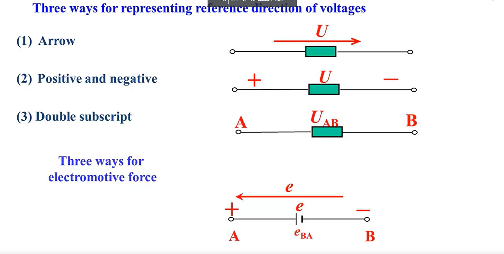

[TOC]

---

# circuit basic composition

1. Source. 来源：generator,pv cell,mic
2. Load. 负载： motor, speaker , screen
3. energy or/and signal **processing circuit** 执行电路：transformer,filter amplifier
4. switch and line. 开关和线路：circuit board, transmission line

## How to regard circuit

从负债Load 来看:

- Resistive阻性电路。如果都是由电阻构成
- Dynamic动态电路。如果包含电容元件。又可以根据时间段的电压和电流的变化划分：
  - Transient 暂态分析。变化过程分析
  - steady state 稳态分析。对变化之前和之后的。

从电源Source 来看：

- dc 直流
  
  - 

- ac 交流
  
  - sine 正弦交流
    
    
  
  - periodical  周期性
    
    

## CIrcuit model

### Ideal circuit elements 理想电路原件

理想电路元件都是从 实际电路元件  **抽象===>**  得到简单电压电流关系。

**这里是不考虑电阻的变化，就看为是一个0电阻的理想电路的。那为什么不用更精确的电路模型呢？**稍后总结。

## classification

### linear and nonlinear

通常用**激励和响应**来表示电路的关系。

如果激励是电压，响应是电流，那么公式 U=RI 就构成了一个线性关系。

**什么是线性？** 

1. **齐次性**：当激励 $U=kU$ 时，$i=\frac{KU}{R}=K\frac{U}{R}$。响应就变成原先的K倍。

2. **可加性**：当激励 $U=U_{1}+U_{2}$时，$i=\frac{U_{1}+U_{2}}{R}=\frac{U_{1}}{R}+\frac{U_2}{R}$。响应为分别激励之和。

满足上面两个关系，我们称之为线性关系。

如果一个电路里面的负载都是线性元件的话，那么这个电路就是线性电路。线性电路描绘的方程是线性方程。

如果一个电路里面的负债有一个是非线性元件，那么这个电路就是非线性电路。描绘的方程就是非线性方程。

### planar and non-planar

平面电路可以画在一个平面上，没有一个交叠元素；

非平面电路将有至少一个交叠点；

# branch variables(支路变量)

## 电流 Time variance rate of charges

> positive charge moved by  electric field force from A to B in unit time
> 
> 电场力在单位时间内从A到B移动的正电荷的数量。

$i(t)^{def}=\lim_{\Delta t \to 0}\frac{\Delta q}{\Delta t} = \frac{\mathrm{d}q} {\mathrm{d}t}$

Unit : A(ampere) 

直流电流：Direct Current (dc)

- Ideal dc current **(I)**

```vega-lite
{
  "data": {
    "values": [
      {"a": "1", "b": 1},
      {"a": "2", "b": 1},
      {"a": "3", "b": 1}
    ]
  },
  "mark": "line",
  "encoding": {
    "x": {"field": "a", "type": "nominal"},
    "y": {"field": "b", "type": "quantitative", "scale": {"domain": [0, 2]}}
  }
}
```

交流电流：Alternating Current(ac)

- Sinusoidal ac current **(i(t))**

## 电压 Voltage

> The work provided by electric field force while moving unit positive charge
> 
> 电场力移动单位正电荷从A到B所做的功

$U_{AB}=\frac{\mathrm{d}\omega_{AB}}{\mathrm{d}q}$

Unit: V (Volt) 

电场力给单位正电荷所做的功，就是单位正电荷所吸收的能量。

## 电位 potential

> THe voltage from some point to the reference point
> 
> 从某一点到参考点的电压

我们定义参考点的电位值时零值，任何一个电路只有一个参考点位，或者一个零值点

Symbol:  $\varphi$ Unit: V (Volt).

**relation**

1. there is a voltage between any points;

2. the potential of some point is its voltage toward the reference point

3. **the voltage between two points = the difference of the potential of these two points. l两点之间的电压等于这两点之间的点位差**

示例：


$\varphi_a=U_{ac}，\varphi_b=U_{bc},\varphi_d=U_{dc}$

求： $\varphi_a$,$\varphi_b$和$U_{ab}$的关系

证：  $\varphi_a=U_{ac}，\varphi_b=U_{bc}$ 。因为 串联分压，所以 $U_{ac}=U_{ab}+U_{bc} => U_{ab}=U_{ac}-U_{bc}=\varphi_a-\varphi_b$

> 两点之间的电位差，就是这两点之间的电压，所以可以成为称为**电位降**，也可以叫做**电压降**。**两点之间的电压和参考点的选择是没有关系的**

## 电动势 Electromotive force

> The work provided by **non-electric field force（非电场力）** while moving unit positive charge
> 
> 非电场力将单位正电荷移动所做的功

公式：$e_{BA}=\frac{\mathrm{d}\omega_{BA}}{\mathrm{d}q}$

说明：从B点到A点非电场力移动单位正电荷所做的工表征为$e_{BA}$。

Unit：V(Volt)

与电压不一样的是：**电动势主要是指的在电源中表示，根本目的是表示电位的变化**

1. $e_{BA}$。increase of potential。电位增高
   
   1. 非电场力从B到A所做的功是使得单位正电荷从B到A具有更多的能量。使得A点的电位高于B点的电位。
   
   2. 所以$e_{BA}$表征着从B到A的电位升。
   
   3. $e_{BA}=\varphi_A-\varphi_B$

2. $u_{AB}$。decrease of potential。电位降低。
   
   1. $u_{AB}=\varphi_A-\varphi_B$


1. 这里B流到A是电位增高，A经过电阻R后流到B是电位降低。

2. <mark>$e_{BA}=u_{AB}$；$e_{BA}=-u_{BA}$</mark>

## 变量大小写问题 Capital and small letter for variables

- Capital for constant variables。常值用大写 U, I

- Small for changeable variables。变化值用小写 u,i

## 参考方向（reference direction）

> 参考方向就是假设的电流/电压流动的方向

- 如果电流从正电压流向负电压，则称之为关联参考方向；如果电流从负电压流向正电压，则称为非关联参考方向。

- 当如果参考方向与实际方向相等，则相等，反之相反。

- 注意电动势和电压的区别。
  
  - $e_{BA}=U_{AB}$。电压表示从正电压到负电压的电压降，而电动势表示从负电压到正电压的电位升。
  
  - 

# power 功率

## 概念

> The work provided by electric field force in unit time
> 
> 电场力在单位时间所做的功

公式：$p=\frac{\mathrm{d}\omega}{\mathrm{d}t}=\frac{\mathrm{d}\omega}{\mathrm{d}q}\frac{\mathrm{d}q}{\mathrm{d}t}=ui$

Power unit: w (Watt)

Energy Unit: J (Joule)

## 计算


根据$p=ui$有几个猜想

- u和i是关联（assoc）,那么就是吸收（absorb）

- u和i是非关联（non-assoc）,那么就是释放（deliver）


通常都是将u和i 转换为关联的参考方向，来计算吸收。

# Resistor 电阻

> [欧姆定律](./电路-定律和公式.md)

## Resistor 电阻 - Resistance 电阻器

> The opposition of a body or substance to current passing through it, resulting in a change of  electrical energy into heat or another form of energy.
> 
> 阻值/电阻指的是一种物体它抵抗电流或通过自身的能力，导致电能转化为了热能或其他形式的能量。
> 
> A device used to control current in an electric circuit by providing resistance。
> 
> 电阻器指的是通过提供电阻来控制电路中的电流的装置

在关联参考方向下，$u=Ri$，R=>Resistance

Unit: $\Omega$ (Ohm)

## Conductance 电导

电导$G=1/R$，为电阻的倒数。

在关联参考方向下, $i=Gu$，G=>Conductance

Unit: S (Siemens)

## think 思考


1. what's t he meaning for $a=0^{o}$ and $a=90^{o}$ respectively?

2. Is there any possibility to get a resistor which passes through the second and the fourth quadrant？(意味着是否存在负电阻嘛？)

## Short circuit and open circuit 短路和开路


- 根据公式$u=Ri=>R=\tan a=\frac{u}{i}$，也就是意味着当 $\tan a = 0\\ G=\infty$时， 也就意味是一个理想导线。也就是短路 short circuit。其上的电流由外部电路决定。

- 根据公式$u=Ri=>R=\tan a=\frac{u}{i}$，也就是意味着当 $\tan a = 90^{o}\\ G=0$时， 也就是开路 open circuit。其上的电压由外电路决定。

## power dissipated in resistors 电阻器上消耗的功率

无论是哪种参考方向，电阻始终都是吸收功率的。


## Rated value 额定值

| 类型               | 特点                   |
| ---------------- | -------------------- |
| chip 贴片电阻        | small，light,reliable |
| carbon-film 碳膜电阻 | wide range ,cheap，   |
| metal-film 金属膜电阻 | reliable，precise     |
| power 功率电阻       | high power           |

# Independent source 独立源

## Ideal independent voltage source 独立电压源


### properties 特性

1. The voltage of $u_s$ is independent of other elements.理想电压源的电压是独立于电路的其它部分的。
   
   - dc: $u_s$ is constant ($U_s$)
   
   - sine ac: $u_s$ changes with time, $u_s=U_m\sin \omega t$

2- The current of $u_s$ is determined by outer circuits. 流过理想电压源的电流是取决于外部电路的。

### u-i relationship


1. $u_s=0$时，零值电阻从电气特性上来说是等效零值电压源的。

2. 电压为0，电流由外电路决定。

## ideal independent current source


### properties 特性

1. The current of $i_s$ is independent of other elements.独立电流源的电流是独立于电路的其他部分。
   
   - dc：$i_s$ is constant ($I_s$)
   
   - sinc ac: $i_s$ is changes with time, $i_s=I_m\sin \omega t$

2. The voltage of $i_s$ is determined by outer circuits. 独立电流源的电压是取决于外部电路的。

### u-i relationship


- $i_s=0$时，零值电阻从电气特性上来说是等效零值电流源的。

- 电流为0，电压由外电路决定。

## Open/Short circuit for independent sources 独立源的开路和短路


## The power of independent sources 独立源的功率


电压和电流的关系是非关联的，注意是$p_d 和 p_a$。

所以是对外部电路释放功率的，而不是吸收功率。

## The models for real sources


# port 端口

> Two terminals constitute ap port if they satify the following condition:**端口条件**
> 
> **The current flowing into one terminal equals to the one flowing out of the other**
> 
> 从一个接线端流入的电流等于从另一个接线端流出的电流，那么这两个接线端就构成了一个端口。

two-terminal elements are one-port。两个接线端的元件一定是一个端口。 

## passive/active one-port 无源/有源网络或者无源/有源一端口

> If for any $t>0$ , there is $\int_{-\infty }^{t} u(\tau )i(\tau )\mathrm{d}\tau \ge 0$ , then it is a **passive** one-port. Otherwise ,it is a active one-port.
> 
> 对于任何一个时间来说，都有从负无穷到这个时间，这个端口吸收的瞬时功率的积分是大于等于0的话，那么这个端口就叫无源一端口，否则就叫有缘一端口。

- passive sign convention associated reference direction. **无源符号约定也叫关联参考方向。**

- active sign convention non-associated reference direction. **有源符号约定也叫非关联参考方向。**

# dependent elements 受控元件

## Controlled resistors 受控电阻

### Switch 开关

> 三端原件


## Mosfet 金属氧化物半导体场效应管

> 三端元件、受控的电流源


- 当$U_{GS}$ 增加时，D和S之间的阻值是发生减小的

- 这里问号所指的其实对应的电子元件是电流源。

## dependent sources 受控源

### dependent voltage source 受控电压源

1. 具有电压源特性

2. 电压受到电路中其他的电压或电流控制

3. 用线穿过的菱形表示，受控的电压源；

存在2种构成

1. Linear Current Controlled Voltage Source(CCVS) 线性的流控电压源。
   
   - $ri_1$ 表示受谁控制，r 是一个控制参数，表示收到支路量$i_1$控制；
   
   - 右端的端口的电压是一个电压源的特性。

        

2. Linear Volage Controleled Current Source(VCVS) 线性的压控电压源。
   
   - $\mu u_1$表示受谁控制，$\mu$ 是一个参数，表示受到支路量 $u_1$控制。
   
   

### Dependent current source 受控电流源

1. 具备电流源特性

2. 电流收到电路中其他的电压或电流控制

存在2种构成

1. Linear Voltage Controlled Current Source(VCCS) 线性的压控电流源。
   
   - 用横线水平穿过的菱形表示，受控的电流源；
   
   - $gu_1$ 表示受谁控制，g 是一个控制参数，表示收到支路量$u_1$控制；
     
     

2. Linear Current Controlled Current Source(CCCS) 线性的流控电流源。
   
   - $\beta i_1$ 表示受谁控制，$\beta$ 是一个控制参数，表示收到支路量$i_1$控制；
     
     

## Discussion

### Are the dependent source two-terminal elements?


- 虽然会画成如右边的受控源的形式，看着是二端元件，但实际是四端元件

- 仍然由电路的某一个电压控制。

### Comparisons between dependent and independent source


- 独立电压源的电压制造出来就决定了是什么样的；受控电压源的电压是有电路中的某一个支路量来决定的。

- 独立源是电路中真正的能量或者信号源；而受控源是对电路进行能量处理或信号处理原件所进行建模得到的电路模型。

# Kirchhoff’s Laws 基尔霍夫定律

> 也可以叫做拓扑约束。

上面的独立源和受控源的变量都是作为元件约束的。

## Terms 术语


### 支路 branch

> A branch is constitiute by the end to end connection of several elements without any divarication
> 
> 支路是若干彼此相连同时有没有分叉的元件的整体。

### 节点 node

> A node is the connection point of 3 or more branches.
> 
> 节点是连接3个及3个以上支路的连接点。

### 路径 path

> A path is the branches(es) between two nodes.
> 
> 路径是两个节点之间的支路。

注意：for circuit with nodes more than two, path might be the connection of several branches. 

**对于有两个以上节点的电路，路径可以是若干支路的连接**

### 回路 loop

> A loop is the close path constituted by  branches;
> 
> 回路是由分支组成的闭合路径，也就是说起点和重点相重合的路径。

回路一般有两种方向，顺时针和逆时针。clockwise or counterclockwise

### 网格 mesh

> A mesh is the loop which has no intersection with other branches in the planar cicuits。
> 
> 网格是在**平面电路**中与**其它分支不相交的回路**。
> 
> 这是一种**特殊的回路**

### 其它说明（一般很少采用这种）

- A two-terminal element constitute a branch。任意一个两端元件构成一个支路。

- The connecting terminal between two elements constitute a node。两个元件之间的接线端构成了一个节点。

## Kirchhoff's Current Laws（KCL）基尔霍夫电流定律

**公式：** $\sum i(t)$

<mark>重点：基尔霍夫电流定律可以用两个方式表示</mark>。

- The algebra sum of the currents flowing out of any node is ZERO。 从任何节点流出的电流的代数和为零。

- The algebra sum of the currents flowing into any node is ZERO。从任何节点流入的电流的代数和为零

得出结论<mark>$\sum i_{in}(t)=\sum i_{out}(t)$</mark>。**即节点的流入电流和流出电流相等。**


**generalized KCL（推广KCL）**。任何一个网格的输入端和输出端电流的代数和结果为0


## Kirchhoff's Voltage Laws(KVL) 基尔霍夫电压定律

**公式**：$\sum u(t)=0$

<mark>重点</mark>：

- The algebra sum of the voltage drop through any loop is ZERO。任意回路的电压降的代数和为零。


- 从电压-端流入+端流出的为电压升，所以这里的电压需要取反得到电压降

- 从电压+端流入-端流出的为电压降，所以这里的电压就是电压降。

可得公式：<mark>$\sum u_{drop}(t)=\sum u_{rise}(t)$</mark>。**即电压降的代数和等于电压升的代数和。**


**Generalized KVL(推广 KVL)。**

- The voltage between any two points in the circuit equals to the algebra sum of the voltages through any path between these two points。在电路中任意两点之间的电压等于通过这两点之间任意路径的电压的代数和
  
  


## 小题

### what are the requirements for solving any circuit?


<mark>解决任何电路的要求是换**拓扑约束和与元件约束**</mark>。


### For the circuit, U=__V

计算U的值，用两种方式。结果为2

- 取左上右下角的点，顺时针$1V+2V=5V+U-1V-3V$ ,得出结果 $U=2V$

- 从U出发顺时针计算电位降。$-U-5V+1V+2V+3V+1V => U+5V=7V$，得出结果$U=2V$


# 2B method 2B方法

> B => Branch.
> 
> 2B equation => b 个电压和电流


2b 方法的使用步骤

1. 找出所有支路变量，即b个电流和 b个 电压

2. 列出独立的电流方程

3. 列出独立的电压方程

<mark>**重点：n指节点数量,b指分支数量**</mark>

- b independent element constraints。b个独立的元件约束

- $n-1$ independent KCLs 。$n-1$个KCL方程

- $b-n+1$ independent KVLs。$b-n+1$个KVL方程

### 小题


1. 4 branch,2 node。因为 中间上下4个节点可以看作是2个。

2. $KVL = b-n+1=4-2+1=3$

3. $KCL=n-1=2-1=1$


# 小结

电动势和电压的关系

- 电动势是指电压从负端流向正端的电压升，而电压是从正端流向负端的电压降。

- A和B两端的电压$U_{ab}$和电动势$E_{ab}$的关系是$E_{ab}=U_{ba}；E_{ab}=-U_{ab}$

- $E_{ba}=\varphi_a -\varphi_b$ 而 $U_{ab}=\varphi_a-\varphi_b$

## 小题

### 电压和电动势关系

注意 E_{ab} 和 U_{ab} 以及  U{ba} 的关系


### 电动势和电压的计算

- 电动势是从负端流向正端的电压升，但这里是从正端流向负端，所以$E_{ab}=\varphi_b-\varphi_a=5V-10V=-5V$。相当于取反了。


### 二端元件的端电压和流过的电流   ，求二端元件发出的功率


### 计算 电压 $u_{ab}$


### 计算电流 I


### 计算 电流电压


### 计算 电流电压


### 计算电流电压


