[toc]

---

# 关系代数运算

关系代数用对关系的运算来表达查询，运算对象是关系，结果得到关系

关系可以理解为一张二维表，例如一张学生表，就是一个关系，关系代数运算就是我们写sql的一些查询操作，操作表生成新的表或者视图

关系代数的运算有两种：

- 运算符为传统的集合运算符：并、差、交、笛卡尔积
- 运算符为专门的关系运算符：选择、投影、连接、除

**传统的集合运算符**：从表的行的角度进行运算，所以需要运算的关系R、S具有相同的属性列的类型、属性列数目

**专门的关系运算符**：涉及到列、行，没有那些限制

其他：**选择、投影、并、差、笛卡尔积**是查询操作的基本操作，其他操作可以由这5种基本操作推出

> 关于这些操作的概念是很晦涩的，结合具体的SQL来理解

------

## 并（union）

并操作两个关系R、S，得到的关系由属于R或S的元组组成，就是逻辑并

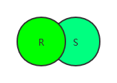

对应的Sql操作就是`Union`
第一次查询的id=1的关系 **并** 第二次查询id=2的关系 的结果：

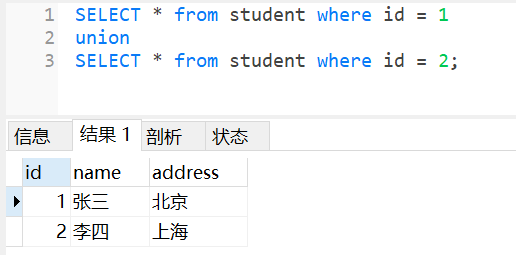

`and`的结果也是这样的，为什么不说and呢？

这里主要谈的是并的思想，两个关系的并运算，and的话并不是两个关系的运算

------

## 差（except）

差：关系R与关系S的差由属于R而不属于S的所有元组组成

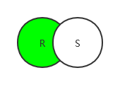

很明显，完成差的查询操作只需要从R中排除R与S交集关系即可，用`not in`关键字sql查询

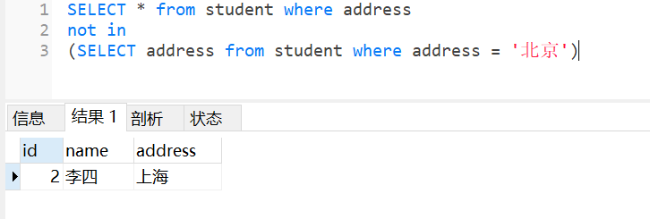

实际上存在`except`关键字，Mysql不支持

换成Sql Server试试：

```n1ql
select * from 学生 where 学号 < 3
except
select * from 学生 where 学号 = 1;
```

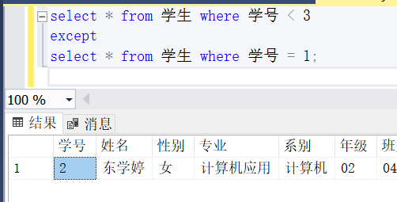

但是没必要记这么多关键字，了解思想就行

------

## 笛卡尔积（cartesian product）

m个属性的关系R与n个属性的关系S，笛卡尔积为（m+n）列的元组的集合，行数为（m*n）
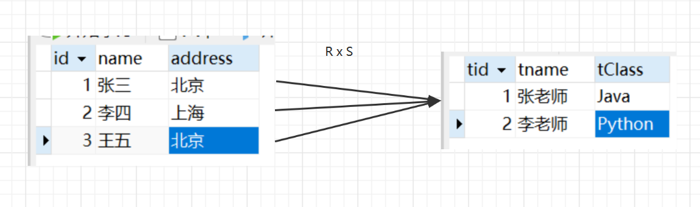

我们常用的没有限制的表连接就是笛卡尔积

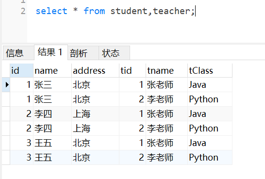

------

## 选择（Selection）

选择又称为限制，在关系R中选择满足给定条件的元组，**也就是筛选行**

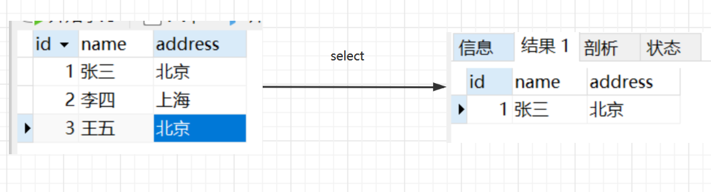

sql语句对应的就是我们的`where`关键字

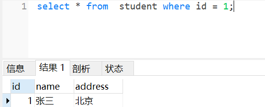

------

## 投影（projection）

投影：关系R上的投影是从R中选择出若干属性列组成新的关系
**这不就是select语句吗？从表R中选择一些属性组成新的关系**

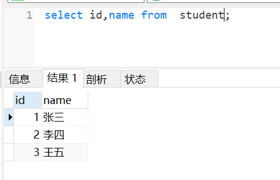

下面得到的结果就是一个新的关系

------

## 小结

五种基本操作：并、差、笛卡尔积、选择、投影 就是这么简单

**相关的概念很晦涩但是完整，我们学习时需要通俗**

由这5个基本查询操作，可以组成复杂的关系运算，例如连接

------

## 连接（join）

连接：从两个关系的笛卡尔积中选取属性间满足一定条件的元组

连接可以分为：

- 内连接：两个关系R、S的笛卡尔积限制了一些条件，抛弃R、S中公共属性值不存在相等的元组；**等值连接、非等值连接**
- 外连接：没有抛弃R、S中公共属性值不存在相等的元组；**左外连接、右外连接、全连接**
- 交叉连接（笛卡尔积）

内外连接的区别在与那些**被舍弃的元组**是否保存到了结果中，通过后面的sql来理解

teacher、student表：

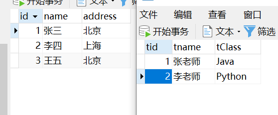

内连接：

1. 等值连接
   `select * from student,teacher where student.id = teacher.tid;`

仅取出`student.id = teacher.tid`的元组
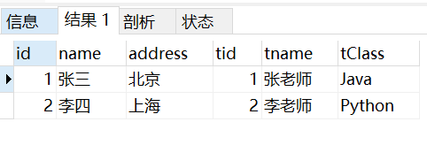

1. 非等值连接，也就是不是等号，而是>、<这些符号
   `select * from student,teacher where student.id > teacher.tid;`

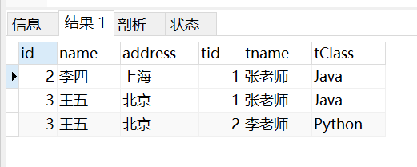

1. 内连接不加限制就是交叉连接了，也就是笛卡尔积

外连接：R、S中舍弃的元组也保存到结果中，而在其他属性上填空值

- 左外连接：只保留左边关系R的舍弃的元组
  `select * from student left join teacher on student.id = teacher.tid;`

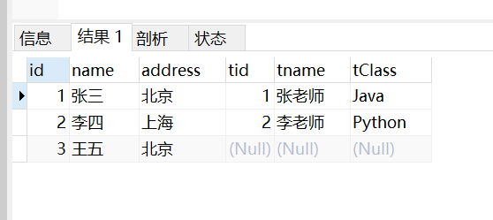

- 右外连接：只保留右边关系S的舍弃的元组，因为我们teacher表比student表少，所以交换一下位置

```n1ql
select * from teacher
right join student on  student.id = teacher.tid;
```

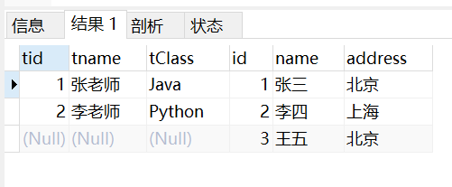

- 全连接：左右两表中的舍弃的元组都保留
  **MySQL不支持full join关键字，但可以通过左连接 union 右连接实现**

Sql Server：
`select * from 学期成绩 R full join 课程注册 S on R.课程编号 = S.课程编号;`

这两个表是这样的：
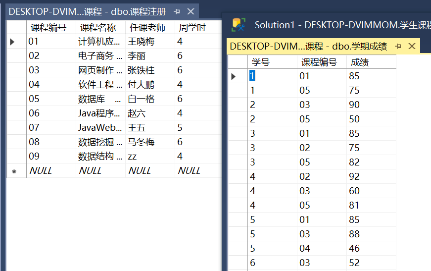

可以获得查询结果：

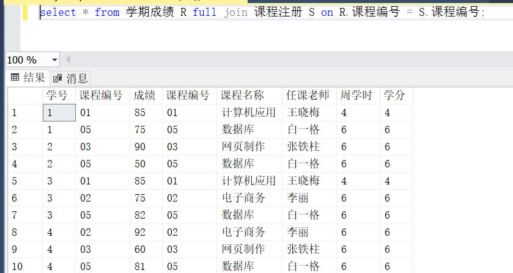

Mysql通过左连接 union 右连接就不实现了


# 三大范式

为了建立冗余较小、结构合理的数据库，设计数据库时必须遵循一定的规则。在关系型数据库中，这种规则就是范式。范式是符合某一种级别的关系模式的集合。关系型数据库中的关系必须满足一定的要求，即满足不同的范式。

目前关系型数据库有六种范式，分别为：第一范式（1NF）、第二范式（2NF）、第三范式（3NF）、第四范式（4NF）、第五范式（5NF）和第六范式（6NF）。要求最低的范式是第一范式。第二范式在第一范式的基础上又进一步的添加了要求，其余范式依次类推。

一般说来，数据库只需满足第三范式就行了，而通常我们用的最多的就是第一范式、第二范式、第三范式，也就是接下来要讲的“三大范式”。

## 第一范式（1NF）
​        概念：第一范式用来确保每列（每个属性）的原子性，要求每列（每个元素）都是最小不可再分的最小数据单元->>{具有原子性}

        举个🌰：

客人住宿信息表 （姓名，客人编号，地址，客房号，客房描述，客房类型，客房状态，床位数，入住人数，价格）

        其中地址又可以进一步的划分为国家省、市、区等。将“地址”列拆分，使得每列都是具备原子性，则下列写法符合第一范式：

客人住宿信息表（姓名，客人编号，国家，省，市，区，门牌号，客房号，客房描述，客房类型，客房状态，床位数，入住人数，价格）

## 第二范式 （2NF）
​         概念：第二范式是在第一范式的基础上要求每列（每个属性）都与主键相关，也就是要求实体的唯一性。如果一个表满足第一范式并且除去主键额的其余属性（列）都完全依赖于该主键，那么该表就满足了第二范式。

        还是以客人住宿信息表为🌰，客人住宿信息表中的数据主要用来描述客人住宿信息，所以该表主键为（客人编号，客房号），其中“姓名”、“地址”依赖于“客人编号”。“客房描述”、 “客房类型”、“客房状态”、“床位数”、“入住人数”、“价格”都依赖于“客房号”。所以使用第二范式后客人住宿信息表就会拆分为两张表：

 客人信息表（客人编号，姓名，地址，客房号，入住时间，结账日期，押金，总金额），主键为“客人编号”列，其他列都全部依赖于主键列

客房信息表（客房号，客房描述，客房类型，客房状态，床位数，入住人数，价格），主键为“客房号”列，其他列都全部依赖于主键列

 ## 第三范式 （3NF）
​        概念：第三范式指的是在第二范式的基础上更近一层，确保每列都与主键直接相关，并不是间接相关，即限制列的冗余性。如果一个关系满足第二范式，并且除了主键以外的其他列都依赖于主键列，列和列之间不存在相互依赖关系，则满足第三范式。

        以第二范式中的客房信息表为🌰，每列都和主键列“客房号”相关，再细看会发现："床位数” 、“价格”依赖于“客房类型”，“客房类型”依赖于“客房号”，“床位数”、“价格”依赖于“客房号”。所以为了能满足第三范式客房信息表又可以分为两张表：

客房表（客房号，客房描述，客房类型编号，客房状态，入住人数）

客房类型表（客房类型编号，客房类型名称，床位数，价格）

## Bcnf范式

 要在 3NF 的基础上消除主属性对于码的部分与传递函数依赖。 


# 函数依赖

函数依赖是关系模式中各个属性之间的一种依赖关系，是规范化理论中最为重要和基础的概念。

为了便于理解，直接通过以下一个例子进行讲解。

| 学号     | 姓名 | 专业名 | 性别 | 出生日期   | 本学期学分 |
| -------- | ---- | ------ | ---- | ---------- | ---------- |
| 42014601 | 小明 | 信管   | 男   | 2000-2-11  | 24         |
| 42014602 | 小红 | 电商   | 女   | 2001-8-7   | 24         |
| 42014603 | 二丫 | 财会   | 女   | 2001-9-4   | 24         |
| 42014604 | 狗蛋 | 物流   | 男   | 2002-10-18 | 24         |

我们观察以上的表，其中学号、姓名、性别、出生日期、本学期学分，这些我们可以看作是不同的属性，假设我们已知一个同学的学号为42014603，我们就可以得到这个人的姓名为二丫，专业为财会，性别为女等信息。

也就是说在此表中如果说已知了一个学号值，我们可以通过这个学号值查找到这个学号对应的唯一的姓名,也可以通过这个学号值得到唯一的专业名。

上面这种属性(属性组）和属性（属性组）之间一对一的推导关系便为函数依赖

我们用一个“→”来表示这种函数依赖关系。即X→Y，其所表达的含义为Y依赖于X（注意是后依赖前）

例如：学号→姓名，学号→专业名，学号→性别，学号→出生日期，学号→本学期学分

## 几种特别的函数依赖

为了便于理解下面内容，我们用以下这个表作为例子。

| 学号 | 姓名 | 课程号 | 个人成绩 |
| ---- | ---- | ------ | -------- |
| 011  | 小马 | 020114 | 99       |

### 平凡函数依赖
定义： 设一个关系为R(U)，X和Y为属性集U上的子集，当X → Y时，如果Y ⊂ X(也就是Y是X的子集） 那么称X→Y是平凡的函数依赖。（这时候的X一般为属性组，Y为单个属性或者属性组)

举例：（学号，姓名）→姓名

注意：如果有Y ⊂ X ，那么X → Y 一定成立。

解释：因为Y ⊂ X ，那么Y必然是X中的一部分，因为X确定了，那么自然其子集也确定了，因为整体可以决定部分。

特殊情况：Y有可能和X是一样的，因为子集可以包含自己本身，也就是自己推导自己。

### 非平凡函数依赖
定义：设一个关系为R(U)，X和Y为属性集U上的子集，若X→Y且X不包含Y，则称X→Y为非平凡函数依赖。

举例：

（学号、课程号）→个人成绩   

相对于平凡函数依赖来说，非平凡函数依赖更为重要与常见

### 完全函数依赖
定义：一个关系模式R(U)中，X和Y为属性集U上的子集，如果X→Y，且对与X的任意一个真子集Z来说，Z→Y都不成立。

这个完全函数依赖我们分俩个情况理解，1.X为单个属性值，这时候X→Y，那么这个关系必定为完全依赖关系。2.X为属性组，也就是你用他的子集无法推导出Y，必须用整个X才行。

举例：1.单个属性：学号→姓名，这个依赖关系必是完全函数依赖，因为X没真子集。

           2.属性组：（学号，课程号）→个人成绩，其真子集有俩：学号和课程编号，如果只知道其中一个，是推导不出来个人成绩的，必须合在一起整体使用，所以是完全函数依赖。

### 部分函数依赖
定义：一个关系模式R(U)中，X和Y为属性集U上的子集，如果X→Y，对与X的真子集Z来说，存在一个Z→Y，那么X→Y为部分函数依赖。

举例：(学号，课程号）→姓名，此时X为属性组（学号，课程号）其真子集有俩个：学号、课程号，我们通过学号可以直接得到学生的姓名，也就是学号→姓名，所以(学号，课程号）→姓名为部分函数依赖

### 传递函数依赖
定义：一个关系模式R(U)中，X、Y、Z为属性集U上的子集，如果X→Y，Y不能反推出X，且Y→Z，这时候通过X可以推出Z，即X→Z，我们把X→Z称为传递函数依赖。

| 学号 | 所在系 | 系主任 |
| ---- | ------ | ------ |
| 0112 | 管理系 | 王老师 |

学号→所在系，所在系→系主任，所以学号→系主任为传递函数依赖。