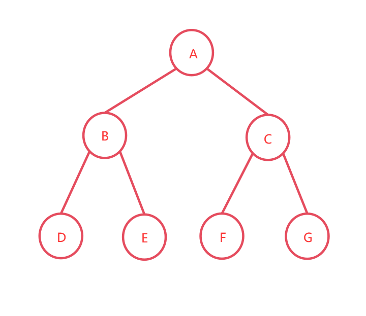
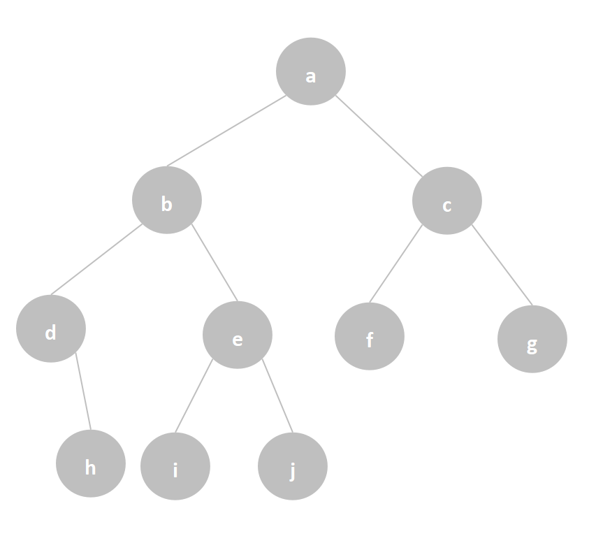

[toc]

---

# 广义表定义

 广义表是[线性表](https://so.csdn.net/so/search?q=线性表&spm=1001.2101.3001.7020)的进一步推广，是由n（n≥0）个数据元素组成的有限序列。线性表中的数据元素只能是单个元素（原子），它是不可分割的，而广义表中的数据元素既可以是原子，也可以是一个广义表（包括空表和非空表），广义表通过圆括号“`()`”括起来，通过逗号“`,`”隔开表中的各个[数据元素](https://so.csdn.net/so/search?q=数据元素&spm=1001.2101.3001.7020)。 

一个n维数组可以看成元素是n-1维数组的广义表，广义表的元素都是n-1维数组。广义表满足线性表的特征，只是其中的元素是原子或广义表（子表），分别只有一个表头元素和表尾元素，表头元素有后继但是没有前驱，表尾元素有前驱但是没有后继，剩下每个元素都有唯一的前驱和后继。

# 广义表的表头和表尾
广义表是可以递归的，一个广义表也可以是其自身的子表，广义表中的第一个元素称为广义表的表头，而剩余数据元素组成的表称为广义表的表尾，广义表的表头和表尾可以看作通过函数head()和tail()对广义表操作。例如，已知广义表S=(((a)),(b),c,(a),(((d,e))))，通过head()和tail()取出元素e的操作如下：

head(tail(head(head(head(tail(tail(tail(tail(A)))))))))
任何一个非空广义表，表头可能是单个元素（原子）或广义表，但表尾只可能是广义表，其原因是广义表的取表尾tail()是非空广义表除去表头元素后，剩余元素组成的表，所以不可能是原子。

例如，C=(a,b,c,d,e,f,g)，该广义表的表头是(a)，表尾是(b,c,d,e,f,g)；
例如，D=((a,b),((c,d,e),(f,g,h)))，该广义表的表头是(a,b)，表尾是((c,d,e),(f,g,h))。

另外，若一个广义表为空，则为一个空表。例如，E=( )，F=(( ))，广义表E是一个空表，只有非空广义表才能取表头，广义表F的表头和表尾都是()。

# 广义表的深度和长度

广义表的深度通过括号的层数求得，而长度是广义表中所含元素的个数。【深度层数，长度个数】
例如，一个空广义表G=()，括号层数为1，所以广义表的深度为1，而由于是空表，所以广义表的长度为0；
例如，一个广义表H=((a,b),(c,(d,e)))，括号层数为3，所以广义表的深度为3，最高层为(c,(d,e))，逗号隔开了原子( c )和广义表( d,e )，元素个数为2，所以广义表的长度为2。
例如，一个广义表I=((),(a),(b,c,(d),((d,f))))，由于括号的最大层数为4，所以广义表的深度为4，可知广义表有三个元素，分别是()、(a)、(b,c,(d),((d,f)))，元素个数为3，所以广义表的长度为3。
例如，设广义表J=(( ),( ))，对广义表J，head(J)=( )，tail(J)=(( ))，括号的最大层数为2，所以广义表的深度为2，广义表有两个元素，分别是()、()，元素个数为2，所以广义表长度为2。

```
注：这里的Tail(J)=(( ))，而不是( )。
```

## 广义表与二叉树
（一）广义表表示二叉树
根据广义表中“ 数据元素既可以是原子，也可以是一个广义表（包括空表和非空表) ”这一点可以来表示二叉树，即通过(根结点，根结点的广义表)的形式来表示，其中可以嵌套。
例如，下面是一个满二叉树：

  

通过广义表表示该二叉树：
(A , ( B , ( D , E ) ) , ( C , ( F , G ) ) ) )
这个二叉树的解释如下：
根结点是A，它的左孩子是B，B的左孩子是D，B的右孩子是E。
根结点A的右孩子是C，C的左孩子是F，C的右孩子是G。

（二）广义表表示二叉树的代码实现
通过广义表来显示建立的二叉树，一个非空的二叉树T，当对于左孩子结点或右孩子结点时，此时输出一个左括号“(”，递归处理左子树，输出一个“,”用于隔开结点，然后递归处理右子树，输出一个右括号“)”，从而完成一个根结点以下的两个左/右结点处理，代码如下：

/*广义表输出二叉树*/
void ShowTree(BTree T) {
	if(T!=NULL) {
		//当二叉树不为空时
		printf("%c",T->data);	//输入出该结点的数据域
		if(T->lchild!=NULL) {		//若该结点的左子树不为空
			printf("(");	//输出一个左括号
			ShowTree(T->lchild);	//通过递归继续输出结点的左子树结点下的各结点
			if(T->rchild!=NULL) {	//若该结点右子树不为空
				printf(",");	//输出一个逗号
				ShowTree(T->rchild);	//通过递归继续输出结点的右子树结点下的各结点
			}
			printf(")");	//输出一个右括号
		} else {	//若左子树为空，右子树不为空
			if(T->rchild!=NULL) {
				printf("(");	//输出一个左括号
				ShowTree(T->lchild);	//通过递归继续输出结点的左子树结点下的各结点
				if(T->rchild!=NULL) {		//若该结点的右子树不为空	
					printf(",");	//输出一个逗号
					ShowTree(T->rchild);	//通过递归继续输出结点的右子树结点下的各结点
				}
				printf(")");	//输出一个右括号
			}
		}
	}
}
例如，一个二叉树如下图，通过链式存储结构实现建立二叉树并输出。

  

代码如下：

```c
#include <stdio.h>
#include <malloc.h>
/*1、二叉树的定义*/
typedef struct BNode {
	int data;		//数据域
	struct BNode *lchild,*rchild;		//左孩子、右孩子指针
} *BTree;

/*2、二叉树的建立*/
BTree CreateTree() {
	BTree T;
	char ch;
	scanf("%c",&ch);
	getchar();	//getchar()用于接收每次输入字符结点后的回车符，从而以便输入下一个字符结点
	if(ch=='0')	//当为0时，将结点置空
		T=NULL;
	else {
		T=(BTree)malloc(sizeof(BTree));	//分配一个新的结点
		T->data=ch;
		printf("请输入%c结点的左孩子结点：",T->data);
		T->lchild=CreateTree();		//通过递归建立左孩子结点
		printf("请输入%c结点的右孩子结点：",T->data);
		T->rchild=CreateTree();		//通过递归建立右孩子结点
	}
	return T;
}

/*3、广义表输出二叉树*/
void ShowTree(BTree T) {
	if(T!=NULL) {
		//当二叉树不为空时
		printf("%c",T->data);	//输入出该结点的数据域
		if(T->lchild!=NULL) {		//若该结点的左子树不为空
			printf("(");	//输出一个左括号
			ShowTree(T->lchild);	//通过递归继续输出结点的左子树结点下的各结点
			if(T->rchild!=NULL) {	//若该结点右子树不为空
				printf(",");	//输出一个逗号
				ShowTree(T->rchild);	//通过递归继续输出结点的右子树结点下的各结点
			}
			printf(")");	//输出一个右括号
		} else {	//若左子树为空，右子树不为空
			if(T->rchild!=NULL) {
				printf("(");	//输出一个左括号
				ShowTree(T->lchild);	//通过递归继续输出结点的左子树结点下的各结点
				if(T->rchild!=NULL) {		//若该结点的右子树不为空	
					printf(",");	//输出一个逗号
					ShowTree(T->rchild);	//通过递归继续输出结点的右子树结点下的各结点
				}
				printf(")");	//输出一个右括号
			}
		}
	}
}

/*主函数*/
int main() {
	BTree T;
	T=NULL;
	printf("请输入二叉树的根结点：");
	T=CreateTree();		//建立二叉树
	printf("建立的二叉树如下：\n");
	ShowTree(T);		//通过广义表显示二叉树
}
```

依次输入各个结点的左右孩子结点，若结点不存在则输入0，例如树中结点d的左孩子结点不存在，结点f、g、h、i、j的左右孩子都不存在，输入时都输入0。
运行结果如下，结果通过广义表的定义显示：