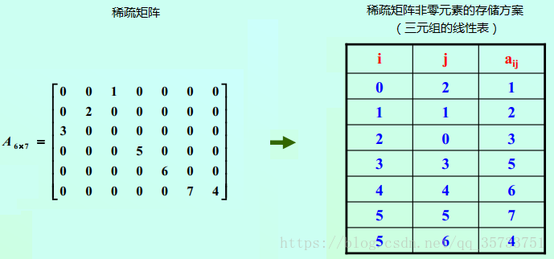

[toc]

----

# 稀疏矩阵的定义

 一个阶数较大的矩阵中的非零元素个数s相对于矩阵元素的总个数 t 很小时，即s<t�<�，称该矩阵为稀疏矩阵。

  比如：在一个100×100的矩阵中，其中只有100个非零元素，而非零元素相对于矩阵中的元素总个数10000很小，那么该矩阵为稀疏矩阵。

#  稀疏矩阵的压缩存储方法（三元组）

 对于稀疏矩阵来说，如果我们还是用100×100的方式来存储的话，显然是非常浪费的，因此我们可以采用一种稀疏矩阵的压缩存储方式，即三元组方式。 

三元组方式存储数据的策略是只存储非零元素。但是稀疏矩阵中非零元素的分布是没有任何规律的，在这种情况下，存储方案是：
1.存储非零元素

2.同时存储该非零元素所对应的行下标和列下标

3.稀疏矩阵中的每一个非零元素需由一个三元组(i, j, aij)唯一确定,稀疏矩阵中的所有非零元素构成三元组线性表，三元组中的i就是行下标，j是列下标，aij是对应的元素值。


图1	-稀疏矩阵的压缩存储

  拿稀疏矩阵中的元素1来说，该元素的位置为第0行，第2列，在用三元组（i ，j ，aij）进行存储时，就是0 2 1，我们发现在这个三元组的线性表中，每个数据元素都是以三元组的方式组成的。

# 定义存储结构
当我们确定三元组的存储策略后，下一步我们要做的就是如何把这样的三元组存储下来。我们在进行保存时，需要把矩阵中的行数，列数，非零元素个数，矩阵中的数据都保存在data数据域（数组），在data数据域中的每个数据元素都是以三元组（行号，列号，元素值）形式存储，data域中表示的非零元素通常以行序为主序顺序排列，下标按行有序的存储结构。如图2所示：

图2-定义存储结构
  当定义好这样的存储结构后，我们可以使用计算机程序设计语言来实现这样的存储结构，如下所示：

```c


#define MaxSize 100

//定义三元组线性表中的数据元素存储结构
typedef struct
{
    int row;        //行号
    int col;        //列号
    ElemType d;     //元素值，ElemType为数据元素类型

} TupNode; //三元组定义


//定义三元组线性表存储结构
typedef struct
{
    int rows;                   //行数值
    int cols;                   //列数值
    int nums;                   //非零元素个数
    TupNode data[MaxSize];      //data数据域

} TSMatrix; //三元组顺序表定义
```


# 稀疏矩阵的三元组基本运算
算法：以行序方式扫描二维矩阵A，将其非零的元素加入到三元组t。
要求为data域以行序为主序顺序排列

图中是采用6行7列的稀疏矩阵作为说明，但是在下面的算法中以3行4列说明

    
    
    //以行序方式扫描二维矩阵A，将其非零的元素加入到三元组t
    //以3行4列的稀疏矩阵为例
    void CreatMat(TSMatrix *t, int arr[3][4])
    {
        int i;
        int j;
        t->rows = 3;
        t->cols = 4;
        t->nums = 0;
        //扫描矩阵中的非零元素
    for(i = 0; i < 3; i++)
    {
        for(j = 0; j < 4; j++)
        {
            //只存非零值，以三元组方式
            if(arr[i][j] != 0)
            {
                t->data[t->nums].row = i;
                t->data[t->nums].col = j;
                t->data[t->nums].d = arr[i][j];
                t->nums++;
            }
        }
    }
    }


算法：将指定位置的元素值赋给变量x：执行x=arr[ i ] [ j ]

    
    
    //将三元组线性表中指定位置的元素值赋值给变量x
    void arr_Assign(TSMatrix t , int *data , int i , int j)
    {
        int k = 0;
        //i和j是否合法
        if(i >= t.rows || j >= t.cols)
        {
            return;
        }
    
    //找到指定元素的行下标
    while(k < t.nums && i > t.data[k].row)
    {
        k++;
    }
    
    //当找到指定元素的行下标后，再找到指定元素的列下标
    while (k < t.nums && i == t.data[k].row && j > t.data[k].col)
    {
        k++;
    }
    //如果指定元素的行和列都相等，说明找到了
    if(t.data[k].row == i && t.data[k].col)
    {
        *data = t.data[k].d;
    }
    else
    {
        //说明没找到
        *data = 0;
    }
    }


算法：三元组元素赋值：执行A[ i ] [ j ] = x
1. 将一个非0元素修改为非0值，如A[ 5 ] [ 6 ] = 8

将矩阵A中第5行，第6列的元素的值改为8，即修改三元组线性表中的数据元素的值。


2.将一个0元素修改为非0值，如A[ 3 ] [ 5 ] = 8

将矩阵A中第3行，第6列值为0的元素改为8，这时需要在三元组线性表数组中下标为3的位置往后插入一个数据元素

//修改三元组元素中的值：执行A[i][j]=x

    
    void arr_Value(TSMatrix *t , int data , int i , int j)
    {
        int k = 0;
        int k1;
        //指定的行和列是否合法
        if(i >= t->rows || j >= t->cols)
        {
            return;
        }
        //先查找行
        while(k < t->nums && i > t->data[k].row)
        {
            k++;
        }
        //查找列
    while(k < t->nums && i == t->data[k].row && j > t->data[k].col)
    {
        k++;
    }
    
    //当找到指定位置时直接修改
    if(i == t->data[k].row && j == t->data[k].col)
    {
        t->data[k].d = data;
    }
    else
    {
        //如果指定位置不存在，则说明该元素值为0，此时插入
        for(k1 = t->nums; k1 >= k; k1--)
        {
            t->data[k1+1].col = t->data[k1].col;
            t->data[k1+1].row = t->data[k1].row;
            t->data[k1+1].d = t->data[k1].d;
        }
        //插入数据
        t->data[k].row = i;
        t->data[k].col = j;
        t->data[k].d = data;
        t->nums++;
    }
    }


输出三元组：从头到尾扫描三元组t,依次输出元素值

```
void DispMat(TSMatrix *t)
{
    int i;
    if(t->nums <= 0)
    {
        return;
    }
    printf("\t行数:%d\t列数:%d\t元素个数:%d\n", t->rows , t->cols , t->nums);
    printf(" ------------------\n");
    //输出所有的三元组
    for(i = 0; i < t->nums; i++)
    {
        printf("\t第%d行\t第%d列\t%d\n" , t->data[i].row , t->data[i].col, t->data[i].d);
    }
}


```


5. 测试

  ```c
  
     int main(void)
     {
      //通过自定义3行4列的二维数组来表示稀疏矩阵
      int arr[3][4] = {
                      {0 , 1 , 0 , 0},
                      {0 , 0 , 0 , 2},
                      {3 , 0 , 0 , 4}
                      };
  
      int data = 0;
      TSMatrix t = {0};
      CreatMat(&t , arr);
      //输出三元组
      DispMat(&t);
      //获取稀疏矩阵指定位置的值,data的值应该为1才对
      arr_Assign(t, &data , 0 , 1);
      printf("---------------\n");
      printf("第0行第1列的数据元素值：%d\n\n" , data);
      printf("----------------\n");
  
      //将稀疏矩阵第0行第0列元素的值设置为1
      arr_Value(&t , data , 0 , 0);
      //输出三元组
      DispMat(&t);
      return 0;
     }
  
  
  ```

  
