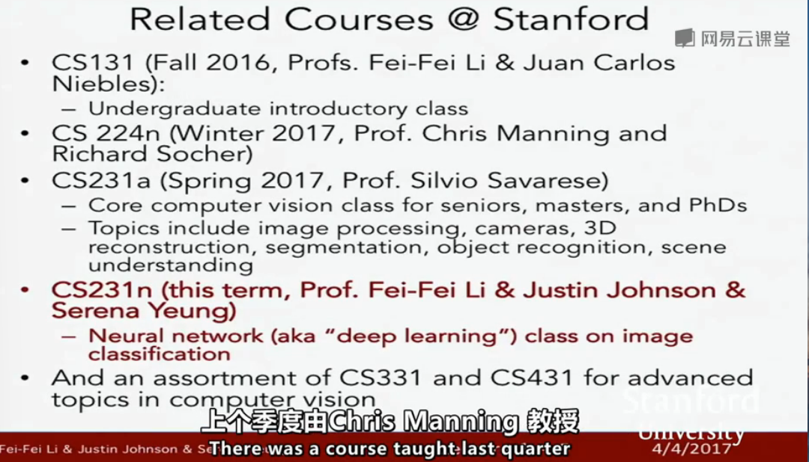
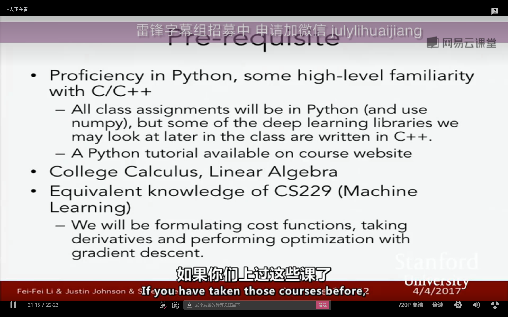
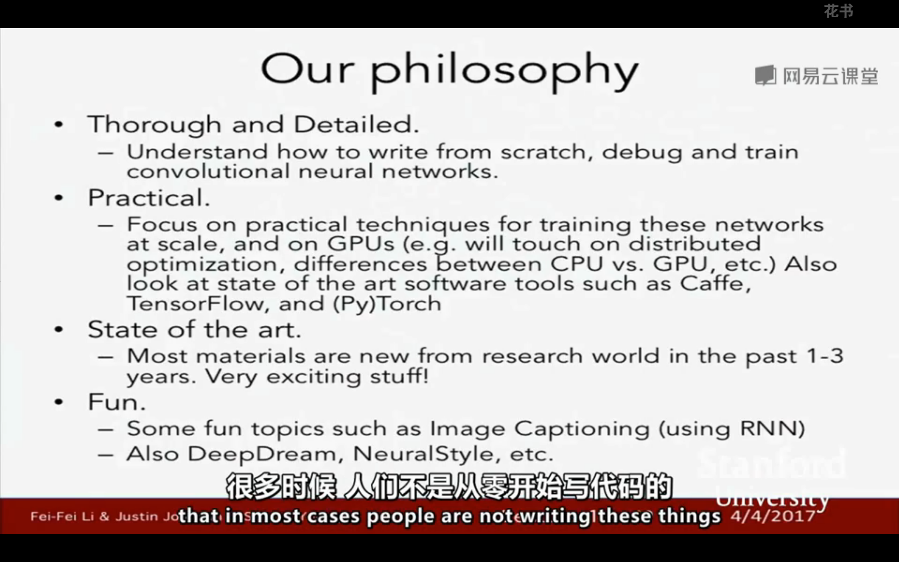
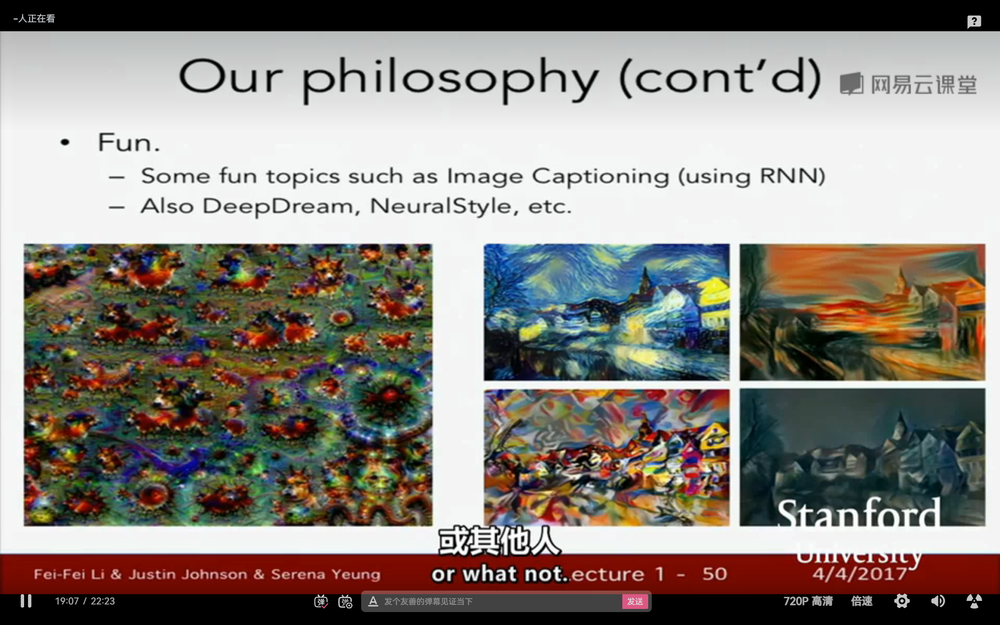

[toc]

---

# 前言
这里是基于 CS231n 课程进行学习计算机视觉方向的入门学习。

## 相关课程

- Cs131
- Cs224n 深度学习和自然语言处理。
- Cs231a 更全面的计算机视觉课程，专注于3D重建。
- Cs231n 专注于某一类特定算法，围绕神经网络，并将它们用在应用上。

## 什么是计算机视觉？
计算机视觉就是针对视觉数据进行研究的。

## 标准数据集
- 21世纪早期，发表的最具有影响力的标注数据集 【PASCAL Visual Object Challenge】,其中包含了20个类别。
- image-net. [www.image-net.org]。一个成百上千数据集的集合网站。
  
# 准备

# cs231n 的探讨问题
- 图像分类。
- 目标检测。
- 卷积神经网络。

# 资料网站
https://cs321n.stanford.edu/

# 选读
- Deep Learning《机器学习》

