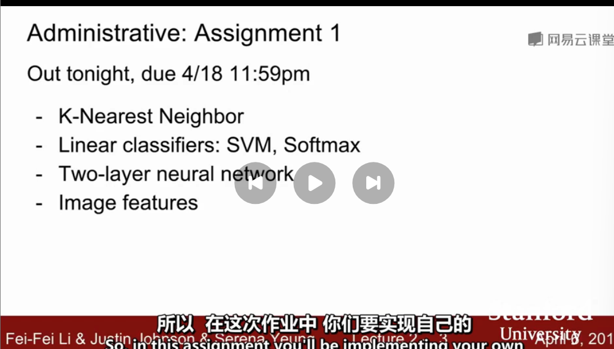

[toc]

---

# 图像分类
## 课程准备
### 基础
- 微积分
- 线性代数

### 入门基础课程
> http://cs231n.github.io/python-numpy-tuorial/

- python
- numpy

## 数据驱动方法

### 作业1 

- K-最近邻分类器
- 线性分类器：SVM,Softmax
- 两层神经网络
- 图像特征

#### google Cloud

谷歌支持了这个课程。可以从这个获取制作这个课程的GPU虚拟机。

http://cs231n.github.io/gce-tutorial/

