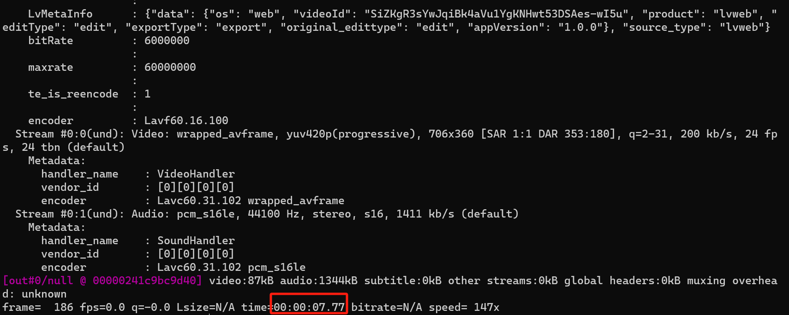

[toc]

---

# 前言

在处理视频时，经常需要获取视频的时长信息，通常会碰到这样的问题：

1. 不同播放器显示的文件时长不一样
2. 视频转码后，时长会发生变化
3. 视频播放到后面，缺少画面等。

那我们需要先明白一个视频的时长包含那几个方面。

1. 文件(容器)时长(container duration)
2. 音视频流时长(stream duration)
3. 解码后播放时长(get duration by decoding)

# ffprobe

## 容器时长

```shell
ffprobe -v error -show_entries format=duration -of default=noprint_wrappers=1:nokey=1 -i [video.suffix]
```

## 音视频流时长

```shell
ffprobe.exe -v error -select_streams v:0 -show_entries stream=duration -of default=noprint_wrappers=1:nokey=1 [video.suffix]
```

通常媒体文件里有多个视频流，各个流的时长也未必一样，一般播放器会以video stream 的时长作为播放时长。


## 解码后文件播放时长

```shell
ffmpeg.exe -i [video.suffix] -f null -
```



**一般这种未最准确的方法**，但由于需要解码，耗时可能会较长。