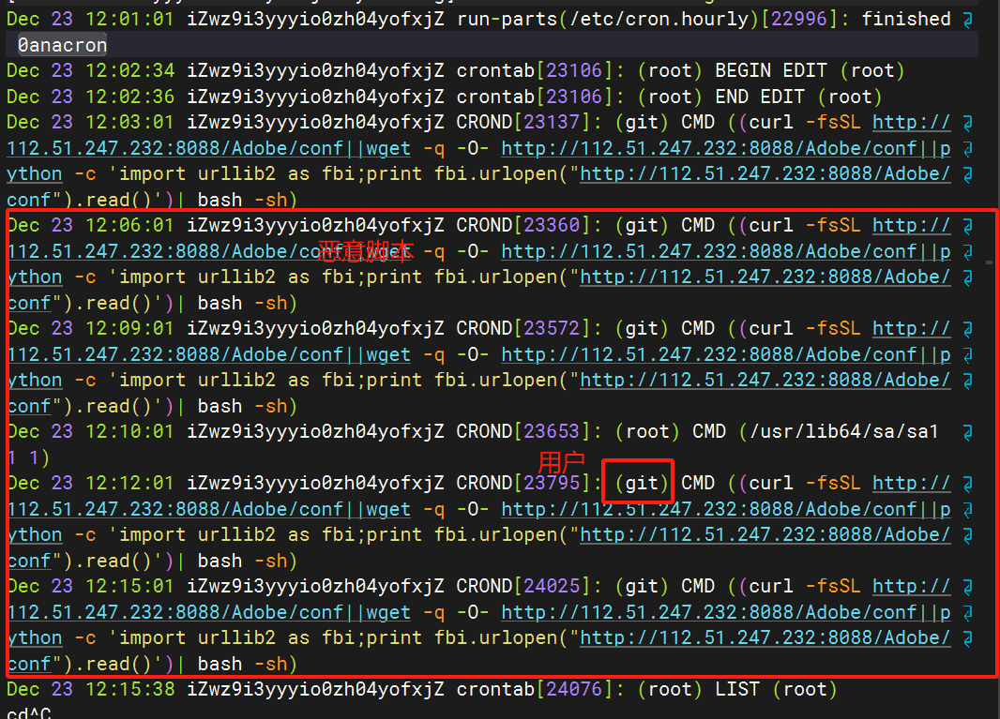

[TOC]

---

# 关于定时任务恶意脚本

- 查找执行历史 `sudo tail -f /var/log/cron`
  
  

- 查看用户任务
  
  ```bash
  crontab -l
  # 其它用户
  crontab -l -u username
  ```
  
- 编辑任务
  ```bash
  crontab -e 
  # 其它用户
  crontab -e -u username
  ```
  
- 删除用户任务

  ```bash
  crontab -r 
  # 其它用户
  crontab -e -u username
  ```
  