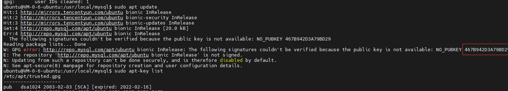

[toc]

---

# 说明


支持系统: 

- ubuntu 18.04


# 方法一

1. 切换路径，下载安装包

```shell
cd /usr/local
mkdir mysql-8.0
cd /mysql-8.0
wget -c https://dev.mysql.com/get/mysql-apt-config_0.8.10-1_all.deb
```

2. 安装程序

```shell
sudo dpkg -i mysql-apt-config_0.8.10-1_all.deb
```

3. 下载最新的软件包信息 

```shell
sudo apt update	
```

4. 如果出现异常 仓库 “http://repo.mysql.com/apt/[ubuntu](https://so.csdn.net/so/search?q=ubuntu&spm=1001.2101.3001.7020) bionic InRelease” 没有数字签名 。请看踩坑记录
5. 查看升级

```shell
apt list --upgradable
```

6.  安装mysql8.0 

```shell
sudo apt install mysql-server
```

7.  验证安装 

```shell
mysql -uroot -p
```

8. 设置远程访问权限

```shell
SHOW DATABASES;
USE mysql;
SELECT 'host' FROM user WHERE user='root'; #查看user表的host值
UPDATE user SET host = '%' WHERE user ='root'; #修改host值
flush privileges; #刷新MySQL的系统权限相关表
```

9. 修改绑定IP

```shell
sudo vim /etc/mysql/mysql.conf.d/mysqld.cnf

# 更改bind-address
bind-address = 0.0.0.0
```


# 踩坑记录

##  仓库 “http://repo.mysql.com/apt/[ubuntu](https://so.csdn.net/so/search?q=ubuntu&spm=1001.2101.3001.7020) bionic InRelease” 没有数字签名 

执行 `apt update`时，报出异常。



1. 查看签名列表

```shell
apt-key list
```

2.  删除过期签名 

```shell
sudo apt-key del dsa1024
```

3.  重新添加新的签名。这里的key为 上面红色框中的 key 

```shell
sudo apt-key adv --keyserver keyserver.ubuntu.com --recv-keys 467B942D3A79BD29
```

## 关于groupby 的sqlmode配置问题

1. 进入mysqld配置文件目录

```shell
cd /etc/mysql/mysql.conf.d
```

2. 增加sql_mode

```shell
sql_mode=STRICT_TRANS_TABLES,NO_ZERO_IN_DATE,NO_ZERO_DATE,ERROR_FOR_DIVISION_BY_ZERO,NO_AUTO_CREATE_USER,NO_ENGINE_SUBSTITUTION 

sql_mode=NO_ZERO_IN_DATE,NO_ZERO_DATE,ERROR_FOR_DIVISION_BY_ZERO,NO_ENGINE_SUBSTITUTION
```

# 启动服务

1. 启动服务

```shell
cd /usr/bin
sudo mysqld restart --user=root
```

