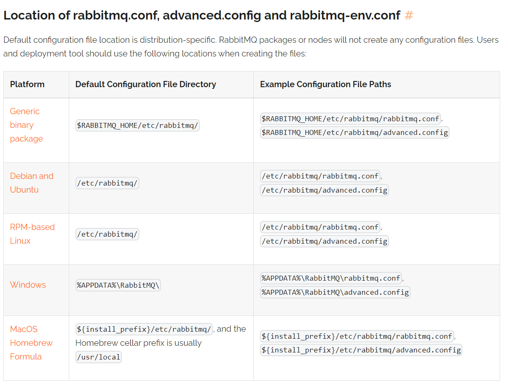

[toc]

---


# 配置文件

> https://www.rabbitmq.com/docs/configure#config-file



## rabbitmq.conf

> 示例文件 https://github.com/rabbitmq/rabbitmq-server/blob/v3.13.x/deps/rabbit/docs/rabbitmq.conf.example

### 基本配置

```properties
# AMQP 绑定端口
listeners.tcp.default = 5672


# 监听本地ipv4格式的特地接口。
# listeners.tcp.local    = 127.0.0.1:5672

# 监听本地ipv6格式的特地接口。
# listeners.tcp.local_v6 = ::1:5672

# rabbitmq web管理界面使用的端口
management.listener.port = 15672

# 该参数用于指定系统的可用内存总量，一般不使用，适用于在容器等一些获取内存实际值不精确的环境。默认2GB
total_memory_available_override_value = 512mb

# AMQP 0-9-1 和 AMQP 1.0握手允许的最大时间量。
# handshake_timeout = 10000

```


### ssl

```properties
# AMQP SSL 端口
listeners.ssl.default = 5671


# 禁用常规TCP(非tls)侦听器参数。客户未配置为使用TLS，且正确启用TLS的端口将无法使用连接到此节点。
listeners.tcp = none

# 控制TCP和TLS监听器连接Erlang进程数量。
num_acceptors.tcp = 10
num_acceptors.ssl = 10


# verify_peer参数表示要求验证对方证书。设置成false表示完全忽略验证证书的结果。
ssl_options.verify               = verify_peer
ssl_options.fail_if_no_peer_cert = false


#  服务端私钥和证书文件，不要修改。
ssl_options.cacertfile           = /path/to/cacert.pem
ssl_options.certfile             = /path/to/cert.pem
ssl_options.keyfile              = /path/to/key.pem
ssl_options.honor_cipher_order   = true
ssl_options.honor_ecc_order      = true


#  推荐使用TLSv1.2，但不能使用TLSv1.3。如果启用TLSv1.3，需要删除这两行。（晦涩难懂，不能随意更改）
# ssl_options.client_renegotiation = false
# ssl_options.secure_renegotiate   = true


# 最前沿的TLS版本，需要最近的客户端运行时版本，并且没有与早期TLS版本相同的密码套件。（晦涩难懂，不能随意更改）
# ssl_options.versions.1 = tlsv1.3


# 启用TLSv1.2以获得最佳兼容性。（晦涩难懂，不能随意更改）
ssl_options.versions.2 = tlsv1.2


# 限制服务器将为客户端TLS使用的密码套件连接，缩小范围可以阻止一些客户连接。如果启用TLSv1.3，密码套件被覆盖，TLSv1.3特定密码套件也必须显式启用。
# ssl_options.ciphers.1  = TLS_AES_256_GCM_SHA384
# ssl_options.ciphers.2  = TLS_AES_128_GCM_SHA256
# ssl_options.ciphers.3  = TLS_CHACHA20_POLY1305_SHA256
# ssl_options.ciphers.4  = TLS_AES_128_CCM_SHA256
# ssl_options.ciphers.5  = TLS_AES_128_CCM_8_SHA256
# ssl_options.ciphers.1  = ECDHE-ECDSA-AES256-GCM-SHA384
# ssl_options.ciphers.2  = ECDHE-RSA-AES256-GCM-SHA384
# ssl_options.ciphers.3  = ECDHE-ECDSA-AES256-SHA384
# ssl_options.ciphers.4  = ECDHE-RSA-AES256-SHA384
# ssl_options.ciphers.5  = ECDH-ECDSA-AES256-GCM-SHA384
# ssl_options.ciphers.6  = ECDH-RSA-AES256-GCM-SHA384
# ssl_options.ciphers.7  = ECDH-ECDSA-AES256-SHA384
# ssl_options.ciphers.8  = ECDH-RSA-AES256-SHA384
# ssl_options.ciphers.9  = DHE-RSA-AES256-GCM-SHA384
# ssl_options.ciphers.10 = DHE-DSS-AES256-GCM-SHA384
# ssl_options.ciphers.11 = DHE-RSA-AES256-SHA256
# ssl_options.ciphers.12 = DHE-DSS-AES256-SHA256
# ssl_options.ciphers.13 = ECDHE-ECDSA-AES128-GCM-SHA256
# ssl_options.ciphers.14 = ECDHE-RSA-AES128-GCM-SHA256
# ssl_options.ciphers.15 = ECDHE-ECDSA-AES128-SHA256
# ssl_options.ciphers.16 = ECDHE-RSA-AES128-SHA256
# ssl_options.ciphers.17 = ECDH-ECDSA-AES128-GCM-SHA256
# ssl_options.ciphers.18 = ECDH-RSA-AES128-GCM-SHA256
# ssl_options.ciphers.19 = ECDH-ECDSA-AES128-SHA256
# ssl_options.ciphers.20 = ECDH-RSA-AES128-SHA256
# ssl_options.ciphers.21 = DHE-RSA-AES128-GCM-SHA256
# ssl_options.ciphers.22 = DHE-DSS-AES128-GCM-SHA256
# ssl_options.ciphers.23 = DHE-RSA-AES128-SHA256
# ssl_options.ciphers.24 = DHE-DSS-AES128-SHA256
# ssl_options.ciphers.25 = ECDHE-ECDSA-AES256-SHA
# ssl_options.ciphers.26 = ECDHE-RSA-AES256-SHA
# ssl_options.ciphers.27 = DHE-RSA-AES256-SHA
# ssl_options.ciphers.28 = DHE-DSS-AES256-SHA
# ssl_options.ciphers.29 = ECDH-ECDSA-AES256-SHA
# ssl_options.ciphers.30 = ECDH-RSA-AES256-SHA
# ssl_options.ciphers.31 = ECDHE-ECDSA-AES128-SHA
# ssl_options.ciphers.32 = ECDHE-RSA-AES128-SHA
# ssl_options.ciphers.33 = DHE-RSA-AES128-SHA
# ssl_options.ciphers.34 = DHE-DSS-AES128-SHA
# ssl_options.ciphers.35 = ECDH-ECDSA-AES128-SHA
# ssl_options.ciphers.36 = ECDH-RSA-AES128-SHA

```

### 虚拟空间设置

```properties
## On first start RabbitMQ will create a vhost and a user. These
## config items control what gets created.
## Relevant doc guide: https://www.rabbitmq.com/docs/access-control
##
# default_vhost = /
# default_user = guest
# default_pass = guest

# default_permissions.configure = .*
# default_permissions.read = .*
# default_permissions.write = .*

## Tags for default user
##
## For more details about tags, see the documentation for the
## Management Plugin at https://www.rabbitmq.com/docs/management.
##
# default_user_tags.administrator = true

## Define other tags like this:
# default_user_tags.management = true
# default_user_tags.custom_tag = true
```

### 网络协议配置

```properties
## Set the server AMQP 0-9-1 heartbeat timeout in seconds.
## RabbitMQ nodes will send heartbeat frames at roughly
## the (timeout / 2) interval. Two missed heartbeats from
## a client will close its connection.
##
## Values lower than 6 seconds are very likely to produce
## false positives and are not recommended.
##
## Related doc guides:
##
## * https://www.rabbitmq.com/docs/heartbeats
## * https://www.rabbitmq.com/docs/networking
##
heartbeat = 60

## Set the max permissible size of an AMQP frame (in bytes). 
frame_max = 131072

## Set the max frame size the server will accept before connectiontuning occurs
initial_frame_max = 4096

## Set the max permissible number of channels per connection.
## 0 means "no limit".
##
channel_max = 128

## Customising TCP Listener (Socket) Configuration.
##
## Related doc guides:
##
## * https://www.rabbitmq.com/docs/networking
## * https://www.erlang.org/doc/man/inet.html#setopts-2
##

# 设置队列未接受连接的最大数目。当达到此值时，新连接会被拒绝
# tcp_listen_options.backlog = 128

# 设置为ture，则禁用Nagle算法，默认设置为true，也推荐设置为true。
# tcp_listen_options.nodelay = true
# tcp_listen_options.exit_on_close = false

# 设置为ture，则启用TCP的存活时间。
# tcp_listen_options.keepalive = true
# tcp_listen_options.send_timeout = 15000

# 设置TCP缓冲区大小。
# tcp_listen_options.buffer = 196608
# tcp_listen_options.sndbuf = 196608
# tcp_listen_options.recbuf = 196608
```

### 资源流量限制

```properties

## Resource Limits & Flow Control
## ==============================


1. 设置基于内存的流量控制阈值。
# vm_memory_high_watermark.relative = 0.4


2. 设置节点使用的RAM的限制(字节)。
# vm_memory_high_watermark.absolute = 1073741824


3. 从Rabbitmq 3.6.0版本开始，你可以使用内存单位设置绝对值。
# vm_memory_high_watermark。absolute = 2GB

##支持的单元符号:
## k, kiB: kibibytes (2^10 - 1,024 bytes)
## M, MiB: mebibytes (2^20 - 1,048,576 bytes)
## G, GiB: gibibytes (2^30 - 1,073,741,824 bytes)
## kB: kilobytes (10^3 - 1,000 bytes)
## MB: megabytes (10^6 - 1,000,000 bytes)
## GB: gigabytes (10^9 - 1,000,000,000 bytes)


4. 设置队列开始的高水位限制的百分比，将页消息输出到磁盘以释放内存。
##例如，当vm_memory_high_watermark设置为0.4，该值设置为0.5时，分页可以在节点使用总可用RAM的20%时就开始。大于1.0的值可能是危险的，应谨慎使用。
##一个替代方案是使用持久队列并发布消息作为持久的(传递模式= 2)更快地将消息移动到磁盘。另一种替代方法是配置队列来分页所有消息(两者都可以)持久和瞬时到磁盘。
# vm_memory_high_watermark_paging_ratio = 0.5

5. 选择Erlang虚拟机内存消耗计算策略。（' allocated '、 ' rss '、' legacy '(别名为' erlang ')。' rss '是3.6.12时的默认值。
# vm_memory_calculation_strategy = rss


6. 设置执行内存检查的时间间隔(以毫秒为单位)
# memory_monitor_interval = 2500

7. 设置可用的总内存可以从操作系统资源中计算。可以时默认选项，也可以作为配置参数提供。
# total_memory_available_override_value = 2GB


8. 设置磁盘空闲限制(字节)。
# disk_free_limit.absolute = 50000


9. 从RabbitMQ 3.6.0版本开始，自定义设置磁盘空闲限制大小。
# disk_free_limit.absolute = 500KB
# disk_free_limit.absolute = 50mb
# disk_free_limit.absolute = 5GB


10. 设置一个相对于总可用RAM的限制，低于1.0比较危险，谨慎使用。
# disk_free_limit.relative = 2.0

```

### 集群

```properties
## Clustering
## =====================


1. 设置网络分区处理策略，一共有四种（ignore模式、pause-minority模式、pause-if-all-down模式、autoheal模式），默认为ignore模式。
# cluster_partition_handling = ignore

2. 设置暂停分区少数部分的所有节点。集群节点数必须为奇数。
# cluster_partition_handling = pause_minority

3. 若设置为pause_if_all_down模式策略，还需要额外配置。
# cluster_partition_handling = pause_if_all_down

4.  恢复策略。可以是autoheal，或者是ignore。
# cluster_partition_handling.pause_if_all_down.recover = ignore

5. 设置集群节点名称。
# cluster_partition_handling.pause_if_all_down.nodes.1 = rabbit@localhost
# cluster_partition_handling.pause_if_all_down.nodes.2 = hare@localhost

6. 从RabbitMQ 3.6.0版本开始，可以设置镜像同步批处理大小，但总批大小(字节)不得超过2 GiB。
# mirroring_sync_batch_size = 4096

7. 集群首次启动设置。
# cluster_formation.peer_discovery_backend     = rabbit_peer_discovery_classic_config
# cluster_formation.classic_config.nodes.1 = rabbit1@hostname
# cluster_formation.classic_config.nodes.2 = rabbit2@hostname
# cluster_formation.classic_config.nodes.3 = rabbit3@hostname
# cluster_formation.classic_config.nodes.4 = rabbit4@hostname
# cluster_formation.peer_discovery_backend = rabbit_peer_discovery_dns
# cluster_formation.dns.hostname = discovery.eng.example.local

8.  配置节点类型。默认使用'disc'。
# cluster_formation.node_type = disc

9. 设置发送keepalive消息的间隔(以毫秒为单位)到其他集群成员。
# cluster_keepalive_interval = 10000

```

### 数据收集

```properties
## Statistics Collection
## =====================

1. 设置统计信息收集间隔(单位:毫秒)
# collect_statistics_interval = 5000
```

### 管理相关

```properties
# Management section
# =======================================


1. 管理页面端口，绑定可以支持tcp协议的IP。
# management.tcp.port = 15672
# management.tcp.ip   = 0.0.0.0

2.  web页面管理相关参数。
# management.tcp.shutdown_timeout   = 7000
# management.tcp.max_keepalive      = 120
# management.tcp.idle_timeout       = 120
# management.tcp.inactivity_timeout = 120
# management.tcp.request_timeout    = 120
# management.tcp.compress           = true

3. HTTP监听器和嵌入式Web服务器设置。
# management.ssl.port       = 15671
# management.ssl.cacertfile = /path/to/ca_certificate.pem
# management.ssl.certfile   = /path/to/server_certificate.pem
# management.ssl.keyfile    = /path/to/server_key.pem

4. 更多TLS选项
# management.ssl.honor_cipher_order   = true
# management.ssl.honor_ecc_order      = true
# management.ssl.client_renegotiation = false
# management.ssl.secure_renegotiate   = true
## Supported TLS versions
# management.ssl.versions.1 = tlsv1.2

5. 服务器允许使用的密码套件：
# management.ssl.ciphers.1 = ECDHE-ECDSA-AES256-GCM-SHA384
# management.ssl.ciphers.2 = ECDHE-RSA-AES256-GCM-SHA384
# management.ssl.ciphers.3 = ECDHE-ECDSA-AES256-SHA384
# management.ssl.ciphers.4 = ECDHE-RSA-AES256-SHA384
# management.ssl.ciphers.5 = ECDH-ECDSA-AES256-GCM-SHA384
# management.ssl.ciphers.6 = ECDH-RSA-AES256-GCM-SHA384
# management.ssl.ciphers.7 = ECDH-ECDSA-AES256-SHA384
# management.ssl.ciphers.8 = ECDH-RSA-AES256-SHA384
# management.ssl.ciphers.9 = DHE-RSA-AES256-GCM-SHA384


6. HTTP API和管理UI的URL路径前缀。
# management.path_prefix = /a-prefix


7.  设置聚合数据的长度(例如消息速率和队列)长度被保留。（分、时、日）
# management.sample_retention_policies.global.minute    = 5
# management.sample_retention_policies.global.hour  = 60
# management.sample_retention_policies.global.day = 1200

# management.sample_retention_policies.basic.minute   = 5
# management.sample_retention_policies.basic.hour = 60

# management.sample_retention_policies.detailed.10 = 5

```

# 