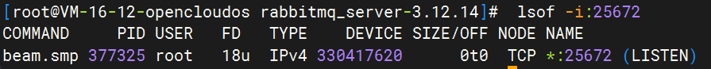

[toc]

----

# 说明

## 支持系统

- 方法1
  - Centos(Tencent版本)


# 方法一

## 安装步骤

> 需要注意 erlang 和 rabbitmq 的版本匹配

### 安装 Erlang

1. 下载地址，选择指定版本，这里用这个地址：https://github.com/erlang/otp/releases/download/OTP-26.2.5/otp_src_26.2.5.tar.gz
   - https://github.com/erlang/otp/releases
   - https://www.erlang-solutions.com/downloads 
   - https://erlang.org/download/otp_versions_tree.htm

2. 在服务器上执行下面命令。下载并解压

   ```shell
   cd /usr/local
   mkdir erlang
   cd erlang
   
   wget https://github.com/erlang/otp/releases/download/OTP-26.2.5/otp_src_26.2.5.tar.gz
   tar -zxvf otp_src_26.2.5.tar.gz
   ```

3. 配置安装目录

   ```shell
   cd otp_src_26.2.5
   ./configure --prefix=/usr/local/erlang
   make && make install
   ```

4. 编辑环境变量

   ```shell
   vim /etc/profile
   ```

5. 配置ERLANG_HOME

   ```shell
   # ERLANG_HOME
   export ERLANG_HOME=/usr/local/erlang
   export PATH=$PATH:$ERLANG_HOME/bin
   ```

6. 使配置⽂件⽣效并使⽤

   ```shell
   source /etc/profile
   erl -version
   ```

### 安装rabbitmq

1. 下载rabbitmq。[地址](https://github.com/rabbitmq/rabbitmq-server/releases)

```shell
cd /usr/local
mkdir rabbitmq
cd rabbitmq

wget https://github.com/rabbitmq/rabbitmq-server/releases/download/v3.12.14/rabbitmq-server-generic-unix-3.12.14.tar.xz
tar -xvf rabbitmq-server-generic-unix-3.12.14.tar.xz
```


2. 编辑环境变量

   ```shell
   vim /etc/profile
   ```

3. 配置RABBITMQ_HOME

   ```shell
   # RABBITMQ_HOME
   export RABBITMQ_HOME=/usr/local/rabbitmq/rabbitmq_server-3.12.14
   export PATH=$PATH:$RABBITMQ_HOME/sbin
   ```

4. 使配置⽂件⽣效并使⽤

   ```shell
   source /etc/profile
   ```

5. 启动RabbitMq管理插件

   ```shell
   rabbitmq-plugins enable rabbitmq_management
   ```

6. 启动RabbitMq

   ```shell
   rabbitmq-server
   
   # 后台启动
   
   rabbitmq-server -detached
   ```

   

## 守护线程脚本

1. 创建 rabbitmq_daemon.sh

   ```shell
   cd /usr/local/rabbitmq
   vim rabbitmq_daemon.sh
   ```

2. 文件内容

   ```sh
   #!/bin/bash
   mqpath=/usr/local/rabbitmq/rabbitmq_server-3.12.14
   
   pid=$(ps -ef | grep  rabbitmq | grep -v grep)
   if [ ! -n "$pid" ]
   then
    echo $(date +"%Y-%m-%d %H:%M:%S") $mqpath ' is not runing'
    export PATH=$PATH:/usr/local/erlang/bin
    export HOME=/usr/local/rabbitmq/rabbitmq_server-3.12.14
    $mqpath/sbin/./rabbitmq-server -detached
   else
     echo $(date +"%Y-%m-%d %H:%M:%S") $mqpath 'is running ' $pid
   fi
   pid2=$(ps -ef | grep rabbitmq | grep -v grep)
   if [ ! -n "$pid2" ]
   then
     echo $(date +"%Y-%m-%d %H:%M:%S") ' rabbitmq reload fail '
   else
     echo $(date +"%Y-%m-%d %H:%M:%S") ' rabbitmq reload success '
   fi
   
   ```

3. 赋予脚本执行权限

   ```shell
   chmod 777 /usr/local/rabbitmq/rabbitmq_daemon.sh
   ```

## 异常记录

## ERROR: could not bind to distribution port 25672

- 环境说明
  - Tencent Centos 8
  - erlang = 26.2.5
  - rabbitmq = 3.12.14

- 异常描述：启动 rabbitmq时，他ishi启动失败，无法绑定端口

  ```shell
  ERROR: could not bind to distribution port 25672, it is in use by another node: rabbit@VM-16-12-opencloudos
  ```

- 解决办法

  1. 查看端口占用。查看端口 25672

     ```shell
      lsof -i:25672
     ```

  2. 如果是这样的输出，不能直接kill -9 25672

     

  3. 执行下面这个命令，停止rabbitmq节点

     ```shell
     rabbitmqctl stop
     ```

- 完整错误信息：

  ```shell
  
  BOOT FAILED
  2024-05-14 11:08:42.733443+08:00 [error] <0.136.0> 
  2024-05-14 11:08:42.733443+08:00 [error] <0.136.0> BOOT FAILED
  2024-05-14 11:08:42.733443+08:00 [error] <0.136.0> ===========
  2024-05-14 11:08:42.733443+08:00 [error] <0.136.0> ERROR: could not bind to distribution port 25672, it is in use by another node: rabbit@VM-16-12-opencloudos
  2024-05-14 11:08:42.733443+08:00 [error] <0.136.0> 
  ===========
  ERROR: could not bind to distribution port 25672, it is in use by another node: rabbit@VM-16-12-opencloudos
  
  2024-05-14 11:08:43.745806+08:00 [error] <0.136.0>     supervisor: {local,rabbit_prelaunch_sup}
  2024-05-14 11:08:43.745806+08:00 [error] <0.136.0>     errorContext: start_error
  2024-05-14 11:08:43.745806+08:00 [error] <0.136.0>     reason: {dist_port_already_used,25672,"rabbit","VM-16-12-opencloudos"}
  2024-05-14 11:08:43.745806+08:00 [error] <0.136.0>     offender: [{pid,undefined},
  2024-05-14 11:08:43.745806+08:00 [error] <0.136.0>                {id,prelaunch},
  2024-05-14 11:08:43.745806+08:00 [error] <0.136.0>                {mfargs,{rabbit_prelaunch,run_prelaunch_first_phase,[]}},
  2024-05-14 11:08:43.745806+08:00 [error] <0.136.0>                {restart_type,transient},
  2024-05-14 11:08:43.745806+08:00 [error] <0.136.0>                {significant,false},
  2024-05-14 11:08:43.745806+08:00 [error] <0.136.0>                {shutdown,5000},
  2024-05-14 11:08:43.745806+08:00 [error] <0.136.0>                {child_type,worker}]
  2024-05-14 11:08:43.745806+08:00 [error] <0.136.0> 
  2024-05-14 11:08:43.746121+08:00 [error] <0.134.0>   crasher:
  2024-05-14 11:08:43.746121+08:00 [error] <0.134.0>     initial call: application_master:init/4
  2024-05-14 11:08:43.746121+08:00 [error] <0.134.0>     pid: <0.134.0>
  2024-05-14 11:08:43.746121+08:00 [error] <0.134.0>     registered_name: []
  2024-05-14 11:08:43.746121+08:00 [error] <0.134.0>     exception exit: {{shutdown,
  2024-05-14 11:08:43.746121+08:00 [error] <0.134.0>                          {failed_to_start_child,prelaunch,
  2024-05-14 11:08:43.746121+08:00 [error] <0.134.0>                              {dist_port_already_used,25672,"rabbit",
  2024-05-14 11:08:43.746121+08:00 [error] <0.134.0>                                  "VM-16-12-opencloudos"}}},
  2024-05-14 11:08:43.746121+08:00 [error] <0.134.0>                      {rabbit_prelaunch_app,start,[normal,[]]}}
  2024-05-14 11:08:43.746121+08:00 [error] <0.134.0>       in function  application_master:init/4 (application_master.erl, line 142)
  2024-05-14 11:08:43.746121+08:00 [error] <0.134.0>     ancestors: [<0.133.0>]
  2024-05-14 11:08:43.746121+08:00 [error] <0.134.0>     message_queue_len: 1
  2024-05-14 11:08:43.746121+08:00 [error] <0.134.0>     messages: [{'EXIT',<0.135.0>,normal}]
  2024-05-14 11:08:43.746121+08:00 [error] <0.134.0>     links: [<0.133.0>,<0.44.0>]
  2024-05-14 11:08:43.746121+08:00 [error] <0.134.0>     dictionary: []
  2024-05-14 11:08:43.746121+08:00 [error] <0.134.0>     trap_exit: true
  2024-05-14 11:08:43.746121+08:00 [error] <0.134.0>     status: running
  2024-05-14 11:08:43.746121+08:00 [error] <0.134.0>     heap_size: 376
  2024-05-14 11:08:43.746121+08:00 [error] <0.134.0>     stack_size: 28
  2024-05-14 11:08:43.746121+08:00 [error] <0.134.0>     reductions: 168
  2024-05-14 11:08:43.746121+08:00 [error] <0.134.0>   neighbours:
  2024-05-14 11:08:43.746121+08:00 [error] <0.134.0> 
  2024-05-14 11:08:43.753916+08:00 [notice] <0.44.0> Application rabbitmq_prelaunch exited with reason: {{shutdown,{failed_to_start_child,prelaunch,{dist_port_already_used,25672,"rabbit","VM-16-12-opencloudos"}}},{rabbit_prelaunch_app,start,[normal,[]]}}
  Runtime terminating during boot (terminating)
  
  Crash dump is being written to: erl_crash.dump...done
  ```

  

# 方法二（yum/dnf)

## 安装步骤

### 安装Erlang 

1. 更新软件包和存储库

   ```shell
   yum -y update
   ```

2.  Erlang在默认的YUM存储库中不可用，因此您将需要安装EPEL存储库 

   ```shell
   yum -y install epel-release
   yum -y update
   ```

3. 安装erlang和socat

   ```shell
   yum -y install erlang socat 
   ```

4. 检查erlang版本，默认最新版本。主要看自己的版本

   ```shell
   erl -version
   ```

### 安装rabbitmq

1. 下载rabbitmq

   ```shell
   cd /usr/local
   mkdir rabbitmq
   cd rabbitmq
   
   wget https://github.com/rabbitmq/rabbitmq-server/releases/download/v3.13.2/rabbitmq-server-3.13.2-1.el8.noarch.rpm
   ```

2. 安装rabbitmq

   ```shell
   rpm -ivh rabbitmq-server-3.13.2-1.el8.noarch.rpm
   # 或者 rpm -Uvh rabbitmq-server-3.6.16-1.el7.noarch.rpm
   # -U表升级
   ```


# service服务注册
## server

> https://github.com/rabbitmq/rabbitmq-server/blob/v3.13.x/deps/rabbit/docs/rabbitmq-server.service.example

```service
# systemd unit example
[Unit]
Description=RabbitMQ broker
After=network.target epmd@0.0.0.0.socket
Wants=network.target epmd@0.0.0.0.socket

[Service]
# Note: You *may* wish to uncomment the following lines to apply systemd
# hardening effort to RabbitMQ, to prevent your system from being illegally 
# modified by undiscovered vulnerabilities in RabbitMQ.
# ProtectSystem=full
# ProtectHome=true
# PrivateDevices=true
# ProtectHostname=true
# ProtectClock=true
# ProtectKernelTunables=true
# ProtectKernelModules=true
# ProtectKernelLogs=true
# ProtectControlGroups=true
# RestrictRealtime=true
Type=notify
User=rabbitmq
Group=rabbitmq
NotifyAccess=all
TimeoutStartSec=3600
# Note:
# You *may* wish to add the following to automatically restart RabbitMQ
# in the event of a failure. systemd service restarts are not a
# replacement for service monitoring. Please see
# https://www.rabbitmq.com/monitoring.html
#
# Restart=on-failure
# RestartSec=10
WorkingDirectory=/var/lib/rabbitmq
ExecStart=/usr/lib/rabbitmq/bin/rabbitmq-server
ExecStop=/usr/lib/rabbitmq/bin/rabbitmqctl stop
ExecStop=/bin/sh -c "while ps -p $MAINPID >/dev/null 2>&1; do sleep 1; done"

[Install]
WantedBy=multi-user.target
```

   

# 相关指令

## 服务
- 启动服务
	
	```shell
	rabbitmq-server
	# 后台启动
	rabbitmq-server -detached
	```
	
- 停止服务

  ```shell
  rabbitmqctl shutdown
  
  rabbitmqctl stop
  ```

## 用户管理

> 默认存在 guest/guest

- 

- 查看用户列表

  ```shell
  rabbitmqctl list_users
  ```

- 添加用户

  ```shell
  rabbitmqctl add_user 用户名 密码
  ```

- 删除用户

  ```shell
  rabbitmqctl delete_user 'username'
  ```

## 权限管理

- 添加权限

  - administrator。可登陆管理控制台，可查看所有的信息，并且可以对用户，策略(policy)进行操作。
  - monitoring：可登陆管理控制台，同时可以查看rabbitmq节点的相关信息(进程数，内存使用情况，磁盘使用情况等)
  - policymaker。可登陆管理控制台, 同时可以对policy进行管理。但无法查看节点的相关信息(上图红框标识的部分)。
  - management。仅可登陆管理控制台，无法看到节点信息，也无法对策略进行管理。

  ```shell
  rabbitmqctl set_user_tags 用户名 角色
  ```

-  添加资源权限 

  ```shell
  rabbitmqctl set_permissions -p / 用户名 ".*" ".*" ".*"
  ```

- 清空资源权限

  ```shell
  rabbitmqctl clear_permissions -p "custom-vhost" "username"
  ```

## 服务诊断

- 查看节点信息

  ```shell
  rabbitmq-diagnostics status --node rabbit@主机名
  ```

-  查看监听端口：

  ```shell
  rabbitmq-diagnostics listeners
  ```

  

## 配置服务
### Generic binary package
- 配置文件位于`$RABBITMQ_HOME/etc/RabbitMQ/RabbitMQ.conf`，是配置节点的主要方式。
- 环境变量来控制某些设置。建议使用`$RABBITMQ_HOME/etc/rabbitmq/rabbitmq-env.conf`文件。
- 安装后这两个文件都不存在，因此必须先创建它们。
- 补充配置文件`$RABBITMQ_HOME/etc/rabbitmq/advanced.config`。

### 配置文件示例
- rabbitmq.conf：https://github.com/rabbitmq/rabbitmq-server/blob/main/deps/rabbit/docs/advanced.config.example
- advanced.conf：https://github.com/rabbitmq/rabbitmq-server/blob/main/deps/rabbit/docs/advanced.config.example