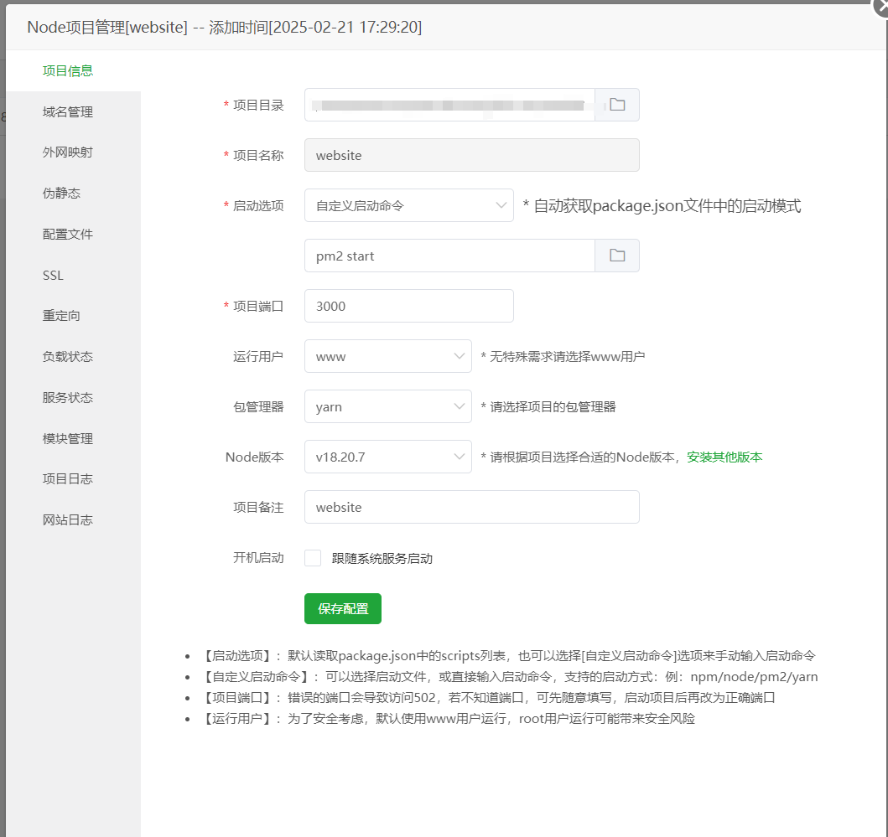

[toc]

---

# pm2
## 配置
```js
module.exports = {
  apps: [
    {
      name: 'NuxtAppName',
      port: '3000',
      exec_mode: 'cluster',
      instances: 'max',
      script: './.output/server/index.mjs'
    }
  ]
}

```
## 启动
```bash
pm2 start ecosystem.config.js
```

# 宝塔
## 配置图


# Nginx
## 配置
```nginx
server {
    listen 80;
    server_name yourdomain.com;
    
    # SSR模式代理
    location / {
        proxy_pass http://127.0.0.1:3000; # Nuxt默认端口
        proxy_http_version 1.1;
        proxy_set_header Upgrade $http_upgrade;
        proxy_set_header Connection 'upgrade';
        proxy_set_header Host $host;
        proxy_cache_bypass $http_upgrade;
    }
 
    # SSG静态模式配置
    # root /www/wwwroot/nuxt-app/dist;
    # index index.html;
}
```
