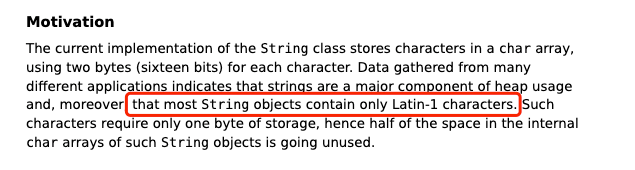
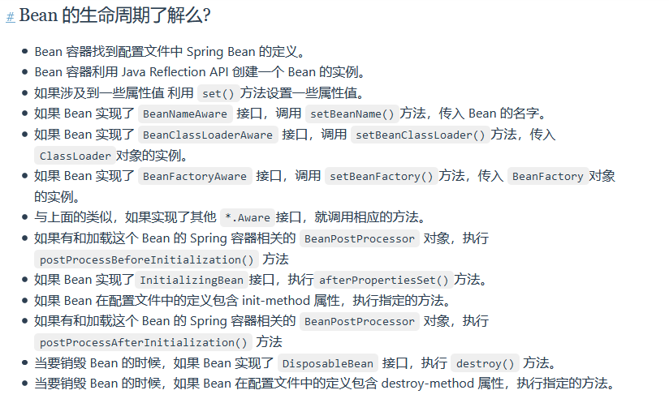

[toc]

---

# Java基础

## 数据类型

### 基本类型和包装类型的区别？

- 成员变量包装类型不赋值就是 `null` ，而基本类型有默认值且不是 `null`。
- 包装类型可用于泛型，而基本类型不可以。
- 基本数据类型的局部变量存放在 Java 虚拟机栈中的局部变量表中，基本数据类型的成员变量（未被 `static` 修饰 ）存放在 Java 虚拟机的堆中。包装类型属于对象类型，我们知道几乎所有对象实例都存在于堆中。
- 相比于对象类型， 基本数据类型占用的空间非常小。

**为什么说是几乎所有对象实例呢？** 这是因为 HotSpot 虚拟机引入了 JIT 优化之后，会对对象进行逃逸分析，如果发现某一个对象并没有逃逸到方法外部，那么就可能通过标量替换来实现栈上分配，而避免堆上分配内存

⚠️ 注意 ： **基本数据类型存放在栈中是一个常见的误区！** 基本数据类型的成员变量如果没有被 `static` 修饰的话（不建议这么使用，应该要使用基本数据类型对应的包装类型），就存放在堆中。

### [包装类型的缓存机制了解么？](https://snailclimb.gitee.io/javaguide/#/./docs/java/basis/java-basic-questions-01?id=包装类型的缓存机制了解么？)

Java 基本数据类型的包装类型的大部分都用到了缓存机制来提升性能。

`Byte`,`Short`,`Integer`,`Long` 这 4 种包装类默认创建了数值 **[-128，127]** 的相应类型的缓存数据，`Character` 创建了数值在 **[0,127]** 范围的缓存数据，`Boolean` 直接返回 `True` or `False`。

**Integer 缓存源码：**

```java
public static Integer valueOf(int i) {
    if (i >= IntegerCache.low && i <= IntegerCache.high)
        return IntegerCache.cache[i + (-IntegerCache.low)];
    return new Integer(i);
}
private static class IntegerCache {
    static final int low = -128;
    static final int high;
    static {
        // high value may be configured by property
        int h = 127;
    }
}
```

**`Character` 缓存源码:**

```java
public static Character valueOf(char c) {
    if (c <= 127) { // must cache
      return CharacterCache.cache[(int)c];
    }
    return new Character(c);
}

private static class CharacterCache {
    private CharacterCache(){}
    static final Character cache[] = new Character[127 + 1];
    static {
        for (int i = 0; i < cache.length; i++)
            cache[i] = new Character((char)i);
    }

}
```

**`Boolean` 缓存源码：**

```java
public static Boolean valueOf(boolean b) {
    return (b ? TRUE : FALSE);
}
```

如果超出对应范围仍然会去创建新的对象，缓存的范围区间的大小只是在性能和资源之间的权衡。

两种浮点数类型的包装类 `Float`,`Double` 并没有实现缓存机制。

```java
Integer i1 = 33;
Integer i2 = 33;
System.out.println(i1 == i2);// 输出 true

Float i11 = 333f;
Float i22 = 333f;
System.out.println(i11 == i22);// 输出 false

Double i3 = 1.2;
Double i4 = 1.2;
System.out.println(i3 == i4);// 输出 false
```

下面我们来看一下问题。下面的代码的输出结果是 `true` 还是 `false` 呢？

```java
Integer i1 = 40;
Integer i2 = new Integer(40);
System.out.println(i1==i2);
```

`Integer i1=40` 这一行代码会发生装箱，也就是说这行代码等价于 `Integer i1=Integer.valueOf(40)` 。因此，`i1` 直接使用的是缓存中的对象。而`Integer i2 = new Integer(40)` 会直接创建新的对象。

因此，答案是 `false` 。你答对了吗？

记住：**所有整型包装类对象之间值的比较，全部使用 equals 方法比较**。

### [自动装箱与拆箱了解吗？原理是什么？](https://snailclimb.gitee.io/javaguide/#/./docs/java/basis/java-basic-questions-01?id=自动装箱与拆箱了解吗？原理是什么？)

**什么是自动拆装箱？**

- **装箱**：将基本类型用它们对应的引用类型包装起来；
- **拆箱**：将包装类型转换为基本数据类型；

举例：

```java
Integer i = 10;  //装箱
int n = i;   //拆箱
```

上面这两行代码对应的字节码为：

```java
   L1

    LINENUMBER 8 L1

    ALOAD 0

    BIPUSH 10

    INVOKESTATIC java/lang/Integer.valueOf (I)Ljava/lang/Integer;

    PUTFIELD AutoBoxTest.i : Ljava/lang/Integer;

   L2

    LINENUMBER 9 L2

    ALOAD 0

    ALOAD 0

    GETFIELD AutoBoxTest.i : Ljava/lang/Integer;

    INVOKEVIRTUAL java/lang/Integer.intValue ()I

    PUTFIELD AutoBoxTest.n : I

    RETURN
```

从字节码中，我们发现装箱其实就是调用了 包装类的`valueOf()`方法，拆箱其实就是调用了 `xxxValue()`方法。

因此，

- `Integer i = 10` 等价于 `Integer i = Integer.valueOf(10)`
- `int n = i` 等价于 `int n = i.intValue()`;

注意：**如果频繁拆装箱的话，也会严重影响系统的性能。我们应该尽量避免不必要的拆装箱操作。**

```java
private static long sum() {
    // 应该使用 long 而不是 Long
    Long sum = 0L;
    for (long i = 0; i <= Integer.MAX_VALUE; i++)
        sum += i;
    return sum;
}
```

### [为什么浮点数运算的时候会有精度丢失的风险？](https://snailclimb.gitee.io/javaguide/#/./docs/java/basis/java-basic-questions-01?id=为什么浮点数运算的时候会有精度丢失的风险？)

浮点数运算精度丢失代码演示：

```java
float a = 2.0f - 1.9f;
float b = 1.8f - 1.7f;
System.out.println(a);// 0.100000024
System.out.println(b);// 0.099999905
System.out.println(a == b);// false
```

为什么会出现这个问题呢？

这个和计算机保存浮点数的机制有很大关系。我们知道计算机是二进制的，而且计算机在表示一个数字时，宽度是有限的，无限循环的小数存储在计算机时，只能被截断，所以就会导致小数精度发生损失的情况。这也就是解释了为什么浮点数没有办法用二进制精确表示。

就比如说十进制下的 0.2 就没办法精确转换成二进制小数：

```java
// 0.2 转换为二进制数的过程为，不断乘以 2，直到不存在小数为止，
// 在这个计算过程中，得到的整数部分从上到下排列就是二进制的结果。
0.2 * 2 = 0.4 -> 0
0.4 * 2 = 0.8 -> 0
0.8 * 2 = 1.6 -> 1
0.6 * 2 = 1.2 -> 1
0.2 * 2 = 0.4 -> 0（发生循环）
...
```

关于浮点数的更多内容，建议看一下[计算机系统基础（四）浮点数](http://kaito-kidd.com/2018/08/08/computer-system-float-point/)

## 对象

### [接口和抽象类有什么共同点和区别？](https://snailclimb.gitee.io/javaguide/#/./docs/java/basis/java-basic-questions-02?id=接口和抽象类有什么共同点和区别？)

**共同点** ：

- 都不能被实例化。
- 都可以包含抽象方法。
- 都可以有默认实现的方法（Java 8 可以用 `default` 关键字在接口中定义默认方法）。

**区别** ：

- 接口主要用于对类的行为进行约束，你实现了某个接口就具有了对应的行为。抽象类主要用于代码复用，强调的是所属关系。
- 一个类只能继承一个类，但是可以实现多个接口。
- 接口中的成员变量只能是 `public static final` 类型的，不能被修改且必须有初始值，而抽象类的成员变量默认 default，可在子类中被重新定义，也可被重新赋值。

### [深拷贝和浅拷贝区别了解吗？什么是引用拷贝？](https://snailclimb.gitee.io/javaguide/#/./docs/java/basis/java-basic-questions-02?id=深拷贝和浅拷贝区别了解吗？什么是引用拷贝？)

关于深拷贝和浅拷贝区别，我这里先给结论：

- **浅拷贝**：浅拷贝会在堆上创建一个新的对象（区别于引用拷贝的一点），不过，如果原对象内部的属性是引用类型的话，浅拷贝会直接复制内部对象的引用地址，也就是说拷贝对象和原对象共用同一个内部对象。
- **深拷贝** ：深拷贝会完全复制整个对象，包括这个对象所包含的内部对象。

上面的结论没有完全理解的话也没关系，我们来看一个具体的案例！

**浅拷贝**

浅拷贝的示例代码如下，我们这里实现了 `Cloneable` 接口，并重写了 `clone()` 方法。

`clone()` 方法的实现很简单，直接调用的是父类 `Object` 的 `clone()` 方法。

```java
public class Address implements Cloneable{
    private String name;
    // 省略构造函数、Getter&Setter方法
    @Override
    public Address clone() {
        try {
            return (Address) super.clone();
        } catch (CloneNotSupportedException e) {
            throw new AssertionError();
        }
    }
}

public class Person implements Cloneable {
    private Address address;
    // 省略构造函数、Getter&Setter方法
    @Override
    public Person clone() {
        try {
            Person person = (Person) super.clone();
            return person;
        } catch (CloneNotSupportedException e) {
            throw new AssertionError();
        }
    }
}
```

测试 ：

```java
Person person1 = new Person(new Address("武汉"));
Person person1Copy = person1.clone();
// true
System.out.println(person1.getAddress() == person1Copy.getAddress());
```

从输出结构就可以看出， `person1` 的克隆对象和 `person1` 使用的仍然是同一个 `Address` 对象。

**深拷贝**

这里我们简单对 `Person` 类的 `clone()` 方法进行修改，连带着要把 `Person` 对象内部的 `Address` 对象一起复制。

```java
@Override
public Person clone() {
    try {
        Person person = (Person) super.clone();
        person.setAddress(person.getAddress().clone());
        return person;
    } catch (CloneNotSupportedException e) {
        throw new AssertionError();
    }
}
```

测试 ：

```java
Person person1 = new Person(new Address("武汉"));
Person person1Copy = person1.clone();
// false
System.out.println(person1.getAddress() == person1Copy.getAddress());
```

从输出结构就可以看出，虽然 `person1` 的克隆对象和 `person1` 包含的 `Address` 对象已经是不同的了。

**那什么是引用拷贝呢？** 简单来说，引用拷贝就是两个不同的引用指向同一个对象。

我专门画了一张图来描述浅拷贝、深拷贝、引用拷贝：  

## Java常见类

### Object类

#### [== 和 equals() 的区别](https://snailclimb.gitee.io/javaguide/#/./docs/java/basis/java-basic-questions-02?id=-和-equals-的区别)

**`==`** 对于基本类型和引用类型的作用效果是不同的：

- 对于基本数据类型来说，`==` 比较的是值。
- 对于引用数据类型来说，`==` 比较的是对象的内存地址。

> 因为 Java 只有值传递，所以，对于 == 来说，不管是比较基本数据类型，还是引用数据类型的变量，其本质比较的都是值，只是引用类型变量存的值是对象的地址。

**`equals()`** 不能用于判断基本数据类型的变量，只能用来判断两个对象是否相等。`equals()`方法存在于`Object`类中，而`Object`类是所有类的直接或间接父类，因此所有的类都有`equals()`方法。

`Object` 类 `equals()` 方法：

```java
public boolean equals(Object obj) {
     return (this == obj);
}
```

`equals()` 方法存在两种使用情况：

- **类没有重写 `equals()`方法** ：通过`equals()`比较该类的两个对象时，等价于通过“==”比较这两个对象，使用的默认是 `Object`类`equals()`方法。
- **类重写了 `equals()`方法** ：一般我们都重写 `equals()`方法来比较两个对象中的属性是否相等；若它们的属性相等，则返回 true(即，认为这两个对象相等)。

举个例子（这里只是为了举例。实际上，你按照下面这种写法的话，像 IDEA 这种比较智能的 IDE 都会提示你将 `==` 换成 `equals()` ）：

```java
String a = new String("ab"); // a 为一个引用
String b = new String("ab"); // b为另一个引用,对象的内容一样
String aa = "ab"; // 放在常量池中
String bb = "ab"; // 从常量池中查找
System.out.println(aa == bb);// true
System.out.println(a == b);// false
System.out.println(a.equals(b));// true
System.out.println(42 == 42.0);// true
```

`String` 中的 `equals` 方法是被重写过的，因为 `Object` 的 `equals` 方法是比较的对象的内存地址，而 `String` 的 `equals` 方法比较的是对象的值。

当创建 `String` 类型的对象时，虚拟机会在常量池中查找有没有已经存在的值和要创建的值相同的对象，如果有就把它赋给当前引用。如果没有就在常量池中重新创建一个 `String` 对象。

`String`类`equals()`方法：

```java
public boolean equals(Object anObject) {
    if (this == anObject) {
        return true;
    }
    if (anObject instanceof String) {
        String anotherString = (String)anObject;
        int n = value.length;
        if (n == anotherString.value.length) {
            char v1[] = value;
            char v2[] = anotherString.value;
            int i = 0;
            while (n-- != 0) {
                if (v1[i] != v2[i])
                    return false;
                i++;
            }
            return true;
        }
    }
    return false;
}
```

#### [hashCode() 有什么用？](https://snailclimb.gitee.io/javaguide/#/./docs/java/basis/java-basic-questions-02?id=hashcode-有什么用？)

`hashCode()` 的作用是获取哈希码（`int` 整数），也称为散列码。这个哈希码的作用是确定该对象在哈希表中的索引位置。

`hashCode()`定义在 JDK 的 `Object` 类中，这就意味着 Java 中的任何类都包含有 `hashCode()` 函数。另外需要注意的是： `Object` 的 `hashCode()` 方法是本地方法，也就是用 C 语言或 C++ 实现的，该方法通常用来将对象的内存地址转换为整数之后返回。

```java
public native int hashCode();
```

散列表存储的是键值对(key-value)，它的特点是：**能根据“键”快速的检索出对应的“值”。这其中就利用到了散列码！（可以快速找到所需要的对象）**

#### [为什么要有 hashCode？](https://snailclimb.gitee.io/javaguide/#/./docs/java/basis/java-basic-questions-02?id=为什么要有-hashcode？)

我们以“`HashSet` 如何检查重复”为例子来说明为什么要有 `hashCode`？

下面这段内容摘自我的 Java 启蒙书《Head First Java》:

> 当你把对象加入 `HashSet` 时，`HashSet` 会先计算对象的 `hashCode` 值来判断对象加入的位置，同时也会与其他已经加入的对象的 `hashCode` 值作比较，如果没有相符的 `hashCode`，`HashSet` 会假设对象没有重复出现。但是如果发现有相同 `hashCode` 值的对象，这时会调用 `equals()` 方法来检查 `hashCode` 相等的对象是否真的相同。如果两者相同，`HashSet` 就不会让其加入操作成功。如果不同的话，就会重新散列到其他位置。这样我们就大大减少了 `equals` 的次数，相应就大大提高了执行速度。

其实， `hashCode()` 和 `equals()`都是用于比较两个对象是否相等。

**那为什么 JDK 还要同时提供这两个方法呢？**

这是因为在一些容器（比如 `HashMap`、`HashSet`）中，有了 `hashCode()` 之后，判断元素是否在对应容器中的效率会更高（参考添加元素进`HashSet`的过程）！

我们在前面也提到了添加元素进`HashSet`的过程，如果 `HashSet` 在对比的时候，同样的 `hashCode` 有多个对象，它会继续使用 `equals()` 来判断是否真的相同。也就是说 `hashCode` 帮助我们大大缩小了查找成本。

**那为什么不只提供 `hashCode()` 方法呢？**

这是因为两个对象的`hashCode` 值相等并不代表两个对象就相等。

**那为什么两个对象有相同的 `hashCode` 值，它们也不一定是相等的？**

因为 `hashCode()` 所使用的哈希算法也许刚好会让多个对象传回相同的哈希值。越糟糕的哈希算法越容易碰撞，但这也与数据值域分布的特性有关（所谓哈希碰撞也就是指的是不同的对象得到相同的 `hashCode` )。

总结下来就是 ：

- 如果两个对象的`hashCode` 值相等，那这两个对象不一定相等（哈希碰撞）。
- 如果两个对象的`hashCode` 值相等并且`equals()`方法也返回 `true`，我们才认为这两个对象相等。
- 如果两个对象的`hashCode` 值不相等，我们就可以直接认为这两个对象不相等。

相信大家看了我前面对 `hashCode()` 和 `equals()` 的介绍之后，下面这个问题已经难不倒你们了。

#### [为什么重写 equals() 时必须重写 hashCode() 方法？](https://snailclimb.gitee.io/javaguide/#/./docs/java/basis/java-basic-questions-02?id=为什么重写-equals-时必须重写-hashcode-方法？)

因为两个相等的对象的 `hashCode` 值必须是相等。也就是说如果 `equals` 方法判断两个对象是相等的，那这两个对象的 `hashCode` 值也要相等。

如果重写 `equals()` 时没有重写 `hashCode()` 方法的话就可能会导致 `equals` 方法判断是相等的两个对象，`hashCode` 值却不相等。

**思考** ：重写 `equals()` 时没有重写 `hashCode()` 方法的话，使用 `HashMap` 可能会出现什么问题。

**总结** ：

- `equals` 方法判断两个对象是相等的，那这两个对象的 `hashCode` 值也要相等。
- 两个对象有相同的 `hashCode` 值，他们也不一定是相等的（哈希碰撞）。

更多关于 `hashCode()` 和 `equals()` 的内容可以查看：[Java hashCode() 和 equals()的若干问题解答](https://www.cnblogs.com/skywang12345/p/3324958.html)

### String类

#### [String、StringBuffer、StringBuilder 的区别？](https://snailclimb.gitee.io/javaguide/#/./docs/java/basis/java-basic-questions-02?id=string、stringbuffer、stringbuilder-的区别？)

**可变性**

`String` 是不可变的（后面会详细分析原因）。

`StringBuilder` 与 `StringBuffer` 都继承自 `AbstractStringBuilder` 类，在 `AbstractStringBuilder` 中也是使用字符数组保存字符串，不过没有使用 `final` 和 `private` 关键字修饰，最关键的是这个 `AbstractStringBuilder` 类还提供了很多修改字符串的方法比如 `append` 方法。

```java
abstract class AbstractStringBuilder implements Appendable, CharSequence {
    char[] value;
    public AbstractStringBuilder append(String str) {
        if (str == null)
            return appendNull();
        int len = str.length();
        ensureCapacityInternal(count + len);
        str.getChars(0, len, value, count);
        count += len;
        return this;
    }
      //...
}
```

**线程安全性**

`String` 中的对象是不可变的，也就可以理解为常量，线程安全。`AbstractStringBuilder` 是 `StringBuilder` 与 `StringBuffer` 的公共父类，定义了一些字符串的基本操作，如 `expandCapacity`、`append`、`insert`、`indexOf` 等公共方法。`StringBuffer` 对方法加了同步锁或者对调用的方法加了同步锁，所以是线程安全的。`StringBuilder` 并没有对方法进行加同步锁，所以是非线程安全的。

**性能**

每次对 `String` 类型进行改变的时候，都会生成一个新的 `String` 对象，然后将指针指向新的 `String` 对象。`StringBuffer` 每次都会对 `StringBuffer` 对象本身进行操作，而不是生成新的对象并改变对象引用。相同情况下使用 `StringBuilder` 相比使用 `StringBuffer` 仅能获得 10%~15% 左右的性能提升，但却要冒多线程不安全的风险。

**对于三者使用的总结：**

1. 操作少量的数据: 适用 `String`
2. 单线程操作字符串缓冲区下操作大量数据: 适用 `StringBuilder`
3. 多线程操作字符串缓冲区下操作大量数据: 适用 `StringBuffer`

#### [String 为什么是不可变的?](https://snailclimb.gitee.io/javaguide/#/./docs/java/basis/java-basic-questions-02?id=string-为什么是不可变的)

`String` 类中使用 `final` 关键字修饰字符数组来保存字符串，~~所以`String` 对象是不可变的。~~

```java
public final class String implements java.io.Serializable, Comparable<String>, CharSequence {
    private final char value[];
    //...
}
```

🐛 修正 ： 我们知道被 `final` 关键字修饰的类不能被继承，修饰的方法不能被重写，修饰的变量是基本数据类型则值不能改变，修饰的变量是引用类型则不能再指向其他对象。因此，`final` 关键字修饰的数组保存字符串并不是 `String` 不可变的根本原因，因为这个数组保存的字符串是可变的（`final` 修饰引用类型变量的情况）。

`String` 真正不可变有下面几点原因：

1. 保存字符串的数组被 `final` 修饰且为私有的，并且`String` 类没有提供/暴露修改这个字符串的方法。
2. `String` 类被 `final` 修饰导致其不能被继承，进而避免了子类破坏 `String` 不可变。

相关阅读：[如何理解 String 类型值的不可变？ - 知乎提问](https://www.zhihu.com/question/20618891/answer/114125846)

补充（来自[issue 675](https://github.com/Snailclimb/JavaGuide/issues/675)）：在 Java 9 之后，`String` 、`StringBuilder` 与 `StringBuffer` 的实现改用 `byte` 数组存储字符串。

```java
public final class String implements java.io.Serializable,Comparable<String>, CharSequence {
    // @Stable 注解表示变量最多被修改一次，称为“稳定的”。
    @Stable
    private final byte[] value;
}

abstract class AbstractStringBuilder implements Appendable, CharSequence {
    byte[] value;

}
```

**Java 9 为何要将 `String` 的底层实现由 `char[]` 改成了 `byte[]` ?**

新版的 String 其实支持两个编码方案： Latin-1 和 UTF-16。如果字符串中包含的汉字没有超过 Latin-1 可表示范围内的字符，那就会使用 Latin-1 作为编码方案。Latin-1 编码方案下，`byte` 占一个字节(8 位)，`char` 占用 2 个字节（16），`byte` 相较 `char` 节省一半的内存空间。

JDK 官方就说了绝大部分字符串对象只包含 Latin-1 可表示的字符。



如果字符串中包含的汉字超过 Latin-1 可表示范围内的字符，`byte` 和 `char` 所占用的空间是一样的。

这是官方的介绍：https://openjdk.java.net/jeps/254 。

#### [字符串拼接用“+” 还是 StringBuilder?](https://snailclimb.gitee.io/javaguide/#/./docs/java/basis/java-basic-questions-02?id=字符串拼接用-还是-stringbuilder)

Java 语言本身并不支持运算符重载，“+”和“+=”是专门为 String 类重载过的运算符，也是 Java 中仅有的两个重载过的运算符。

```java
String str1 = "he";
String str2 = "llo";
String str3 = "world";
String str4 = str1 + str2 + str3;
```

上面的代码对应的字节码如下：


可以看出，字符串对象通过“+”的字符串拼接方式，实际上是通过 `StringBuilder` 调用 `append()` 方法实现的，拼接完成之后调用 `toString()` 得到一个 `String` 对象 。

不过，在循环内使用“+”进行字符串的拼接的话，存在比较明显的缺陷：**编译器不会创建单个 `StringBuilder` 以复用，会导致创建过多的 `StringBuilder` 对象**。

```java
String[] arr = {"he", "llo", "world"};
String s = "";
for (int i = 0; i < arr.length; i++) {
    s += arr[i];
}
System.out.println(s);
```

`StringBuilder` 对象是在循环内部被创建的，这意味着每循环一次就会创建一个 `StringBuilder` 对象。


如果直接使用 `StringBuilder` 对象进行字符串拼接的话，就不会存在这个问题了。

```java
String[] arr = {"he", "llo", "world"};
StringBuilder s = new StringBuilder();
for (String value : arr) {
    s.append(value);
}
System.out.println(s);
```


如果你使用 IDEA 的话，IDEA 自带的代码检查机制也会提示你修改代码。

不过，使用 “+” 进行字符串拼接会产生大量的临时对象的问题在 JDK9 中得到了解决。在 JDK9 当中，字符串相加 “+”  改为了用动态方法 `makeConcatWithConstants()` 来实现，而不是大量的 `StringBuilder` 了。这个改进是 JDK9 的 [JEP 280](https://openjdk.org/jeps/280) 提出的，这也意味着 JDK 9 之后，你可以放心使用“+” 进行字符串拼接了。关于这部分改进的详细介绍，推荐阅读这篇文章：还在无脑用 [StringBuilder？来重温一下字符串拼接吧](https://juejin.cn/post/7182872058743750715) 。

#### [字符串常量池的作用了解吗？](https://snailclimb.gitee.io/javaguide/#/./docs/java/basis/java-basic-questions-02?id=字符串常量池的作用了解吗？)

**字符串常量池** 是 JVM 为了提升性能和减少内存消耗针对字符串（String 类）专门开辟的一块区域，主要目的是为了避免字符串的重复创建。

```java
// 在堆中创建字符串对象”ab“
// 将字符串对象”ab“的引用保存在字符串常量池中
String aa = "ab";
// 直接返回字符串常量池中字符串对象”ab“的引用
String bb = "ab";
System.out.println(aa==bb);// true
```

更多关于字符串常量池的介绍可以看一下 [Java 内存区域详解](https://javaguide.cn/java/jvm/memory-area.html)

#### [intern 方法有什么作用?](https://snailclimb.gitee.io/javaguide/#/./docs/java/basis/java-basic-questions-02?id=intern-方法有什么作用)

`String.intern()` 是一个 native（本地）方法，其作用是将指定的字符串对象的引用保存在字符串常量池中，可以简单分为两种情况：

- 如果字符串常量池中保存了对应的字符串对象的引用，就直接返回该引用。
- 如果字符串常量池中没有保存了对应的字符串对象的引用，那就在常量池中创建一个指向该字符串对象的引用并返回。

示例代码（JDK 1.8） :

```java
// 在堆中创建字符串对象”Java“
// 将字符串对象”Java“的引用保存在字符串常量池中
String s1 = "Java";
// 直接返回字符串常量池中字符串对象”Java“对应的引用
String s2 = s1.intern();
// 会在堆中在单独创建一个字符串对象
String s3 = new String("Java");
// 直接返回字符串常量池中字符串对象”Java“对应的引用
String s4 = s3.intern();
// s1 和 s2 指向的是堆中的同一个对象
System.out.println(s1 == s2); // true
// s3 和 s4 指向的是堆中不同的对象
System.out.println(s3 == s4); // false
// s1 和 s4 指向的是堆中的同一个对象
System.out.println(s1 == s4); //true
```

#### [String 类型的变量和常量做“+”运算时发生了什么？](https://snailclimb.gitee.io/javaguide/#/./docs/java/basis/java-basic-questions-02?id=string-类型的变量和常量做运算时发生了什么？)

先来看字符串不加 `final` 关键字拼接的情况（JDK1.8）：

```java
String str1 = "str";
String str2 = "ing";
String str3 = "str" + "ing";
String str4 = str1 + str2;
String str5 = "string";
System.out.println(str3 == str4);//false
System.out.println(str3 == str5);//true
System.out.println(str4 == str5);//false
```

> **注意** ：比较 String 字符串的值是否相等，可以使用 `equals()` 方法。 `String` 中的 `equals` 方法是被重写过的。 `Object` 的 `equals` 方法是比较的对象的内存地址，而 `String` 的 `equals` 方法比较的是字符串的值是否相等。如果你使用 `==` 比较两个字符串是否相等的话，IDEA 还是提示你使用 `equals()` 方法替换。


**对于编译期可以确定值的字符串，也就是常量字符串 ，jvm 会将其存入字符串常量池。并且，字符串常量拼接得到的字符串常量在编译阶段就已经被存放字符串常量池，这个得益于编译器的优化。**

在编译过程中，Javac 编译器（下文中统称为编译器）会进行一个叫做 **常量折叠(Constant Folding)** 的代码优化。《深入理解 Java 虚拟机》中是也有介绍到：


常量折叠会把常量表达式的值求出来作为常量嵌在最终生成的代码中，这是 Javac 编译器会对源代码做的极少量优化措施之一(代码优化几乎都在即时编译器中进行)。

对于 `String str3 = "str" + "ing";` 编译器会给你优化成 `String str3 = "string";` 。

并不是所有的常量都会进行折叠，只有编译器在程序编译期就可以确定值的常量才可以：

- 基本数据类型( `byte`、`boolean`、`short`、`char`、`int`、`float`、`long`、`double`)以及字符串常量。
- `final` 修饰的基本数据类型和字符串变量
- 字符串通过 “+”拼接得到的字符串、基本数据类型之间算数运算（加减乘除）、基本数据类型的位运算（<<、>>、>>> ）

**引用的值在程序编译期是无法确定的，编译器无法对其进行优化。**

对象引用和“+”的字符串拼接方式，实际上是通过 `StringBuilder` 调用 `append()` 方法实现的，拼接完成之后调用 `toString()` 得到一个 `String` 对象 。

```java
String str4 = new StringBuilder().append(str1).append(str2).toString();
```

我们在平时写代码的时候，尽量避免多个字符串对象拼接，因为这样会重新创建对象。如果需要改变字符串的话，可以使用 `StringBuilder` 或者 `StringBuffer`。

不过，字符串使用 `final` 关键字声明之后，可以让编译器当做常量来处理。

示例代码：

```java
final String str1 = "str";
final String str2 = "ing";
// 下面两个表达式其实是等价的
String c = "str" + "ing";// 常量池中的对象
String d = str1 + str2; // 常量池中的对象
System.out.println(c == d);// true
```

被 `final` 关键字修改之后的 `String` 会被编译器当做常量来处理，编译器在程序编译期就可以确定它的值，其效果就相当于访问常量。

如果 ，编译器在运行时才能知道其确切值的话，就无法对其优化。

示例代码（`str2` 在运行时才能确定其值）：

```java
final String str1 = "str";
final String str2 = getStr();
String c = "str" + "ing";// 常量池中的对象
String d = str1 + str2; // 在堆上创建的新的对象
System.out.println(c == d);// false
public static String getStr() {
      return "ing";
}
```

## Java异常

**Java 异常类层次结构图概览** ：


### [Exception 和 Error 有什么区别？](https://snailclimb.gitee.io/javaguide/#/./docs/java/basis/java-basic-questions-03?id=exception-和-error-有什么区别？)

在 Java 中，所有的异常都有一个共同的祖先 `java.lang` 包中的 `Throwable` 类。`Throwable` 类有两个重要的子类:

- **`Exception`** :程序本身可以处理的异常，可以通过 `catch` 来进行捕获。`Exception` 又可以分为 Checked Exception (受检查异常，必须处理) 和 Unchecked Exception (不受检查异常，可以不处理)。

- **`Error`** ：`Error` 属于程序无法处理的错误 ，~~我们没办法通过 `catch` 来进行捕获~~不建议通过`catch`捕获 。例如 Java 虚拟机运行错误（`Virtual MachineError`）、虚拟机内存不够错误(`OutOfMemoryError`)、类定义错误（`NoClassDefFoundError`）等 。这些异常发生时，Java 虚拟机（JVM）一般会选择线程终止。

  


### [Checked Exception 和 Unchecked Exception 有什么区别？](https://snailclimb.gitee.io/javaguide/#/./docs/java/basis/java-basic-questions-03?id=checked-exception-和-unchecked-exception-有什么区别？)

  **Checked Exception** 即 受检查异常 ，Java 代码在编译过程中，如果受检查异常没有被 `catch`或者`throws` 关键字处理的话，就没办法通过编译。

  比如下面这段 IO 操作的代码：

  

  除了`RuntimeException`及其子类以外，其他的`Exception`类及其子类都属于受检查异常 。常见的受检查异常有： IO 相关的异常、`ClassNotFoundException` 、`SQLException`...。

  **Unchecked Exception** 即 **不受检查异常** ，Java 代码在编译过程中 ，我们即使不处理不受检查异常也可以正常通过编译。

  `RuntimeException` 及其子类都统称为非受检查异常，常见的有（建议记下来，日常开发中会经常用到）：

  - `NullPointerException`(空指针错误)
  - `IllegalArgumentException`(参数错误比如方法入参类型错误)
  - `NumberFormatException`（字符串转换为数字格式错误，`IllegalArgumentException`的子类）
  - `ArrayIndexOutOfBoundsException`（数组越界错误）
  - `ClassCastException`（类型转换错误）
  - `ArithmeticException`（算术错误）
  - `SecurityException` （安全错误比如权限不够）
  - `UnsupportedOperationException`(不支持的操作错误比如重复创建同一用户)
  - ......

  

### [try-catch-finally 如何使用？](https://snailclimb.gitee.io/javaguide/#/./docs/java/basis/java-basic-questions-03?id=try-catch-finally-如何使用？)

- `try`块 ： 用于捕获异常。其后可接零个或多个 `catch` 块，如果没有 `catch` 块，则必须跟一个 `finally` 块。
- `catch`块 ： 用于处理 try 捕获到的异常。
- `finally` 块 ： 无论是否捕获或处理异常，`finally` 块里的语句都会被执行。当在 `try` 块或 `catch` 块中遇到 `return` 语句时，`finally` 语句块将在方法返回之前被执行。

代码示例：

```java
try {
    System.out.println("Try to do something");
    throw new RuntimeException("RuntimeException");
} catch (Exception e) {
    System.out.println("Catch Exception -> " + e.getMessage());
} finally {
    System.out.println("Finally");
}
```

输出：

```
Try to do something
Catch Exception -> RuntimeException
Finally
```

**注意：不要在 finally 语句块中使用 return!** 当  try 语句和 finally 语句中都有 return 语句时，try 语句块中的 return 语句会被忽略。这是因为 try 语句中的  return 返回值会先被暂存在一个本地变量中，当执行到 finally 语句中的 return 之后，这个本地变量的值就变为了 finally 语句中的 return 返回值。

[jvm 官方文档](https://docs.oracle.com/javase/specs/jvms/se7/html/jvms-4.html#jvms-4.10.2.5)中有明确提到：

> If the `try` clause executes a *return*, the compiled code does the following:
>
> 1. Saves the return value (if any) in a local variable.
> 2. Executes a *jsr* to the code for the `finally` clause.
> 3. Upon return from the `finally` clause, returns the value saved in the local variable.

代码示例：

```java
public static void main(String[] args) {
    System.out.println(f(2));
}

public static int f(int value) {
    try {
        return value * value;
    } finally {
        if (value == 2) {
            return 0;
        }
    }
}
```

输出：

```
0
```

### [finally 中的代码一定会执行吗？](https://snailclimb.gitee.io/javaguide/#/./docs/java/basis/java-basic-questions-03?id=finally-中的代码一定会执行吗？)

不一定的！在某些情况下，finally 中的代码不会被执行。

就比如说 finally 之前虚拟机被终止运行的话，finally 中的代码就不会被执行。

```java
try {
    System.out.println("Try to do something");
    throw new RuntimeException("RuntimeException");
} catch (Exception e) {
    System.out.println("Catch Exception -> " + e.getMessage());
    // 终止当前正在运行的Java虚拟机
    System.exit(1);
} finally {
    System.out.println("Finally");
}
```

输出：

```
Try to do something
Catch Exception -> RuntimeException
```

另外，在以下 2 种特殊情况下，`finally` 块的代码也不会被执行：

1. 程序所在的线程死亡。
2. 关闭 CPU。

相关 issue： https://github.com/Snailclimb/JavaGuide/issues/190。

🧗🏻 进阶一下：从字节码角度分析`try catch finally`这个语法糖背后的实现原理。

### [如何使用 `try-with-resources` 代替`try-catch-finally`？](https://snailclimb.gitee.io/javaguide/#/./docs/java/basis/java-basic-questions-03?id=如何使用-try-with-resources-代替try-catch-finally？)

1. **适用范围（资源的定义）：** 任何实现 `java.lang.AutoCloseable`或者 `java.io.Closeable` 的对象
2. **关闭资源和 finally 块的执行顺序：** 在 `try-with-resources` 语句中，任何 catch 或 finally 块在声明的资源关闭后运行

《Effective Java》中明确指出：

> 面对必须要关闭的资源，我们总是应该优先使用 `try-with-resources` 而不是`try-finally`。随之产生的代码更简短，更清晰，产生的异常对我们也更有用。`try-with-resources`语句让我们更容易编写必须要关闭的资源的代码，若采用`try-finally`则几乎做不到这点。

Java 中类似于`InputStream`、`OutputStream` 、`Scanner` 、`PrintWriter`等的资源都需要我们调用`close()`方法来手动关闭，一般情况下我们都是通过`try-catch-finally`语句来实现这个需求，如下：

```java
//读取文本文件的内容
Scanner scanner = null;
try {
    scanner = new Scanner(new File("D://read.txt"));
    while (scanner.hasNext()) {
        System.out.println(scanner.nextLine());
    }
} catch (FileNotFoundException e) {
    e.printStackTrace();
} finally {
    if (scanner != null) {
        scanner.close();
    }
}
```

使用 Java 7 之后的 `try-with-resources` 语句改造上面的代码:

```java
try (Scanner scanner = new Scanner(new File("test.txt"))) {
    while (scanner.hasNext()) {
        System.out.println(scanner.nextLine());
    }
} catch (FileNotFoundException fnfe) {
    fnfe.printStackTrace();
}
```

当然多个资源需要关闭的时候，使用 `try-with-resources` 实现起来也非常简单，如果你还是用`try-catch-finally`可能会带来很多问题。

通过使用分号分隔，可以在`try-with-resources`块中声明多个资源。

```java
try (BufferedInputStream bin = new BufferedInputStream(new FileInputStream(new File("test.txt")));
     BufferedOutputStream bout = new BufferedOutputStream(new FileOutputStream(new File("out.txt")))) {
    int b;
    while ((b = bin.read()) != -1) {
        bout.write(b);
    }
}
catch (IOException e) {
    e.printStackTrace();
}
```

### [异常使用有哪些需要注意的地方？](https://snailclimb.gitee.io/javaguide/#/./docs/java/basis/java-basic-questions-03?id=异常使用有哪些需要注意的地方？)

- 不要把异常定义为静态变量，因为这样会导致异常栈信息错乱。每次手动抛出异常，我们都需要手动 new 一个异常对象抛出。
- 抛出的异常信息一定要有意义。
- 建议抛出更加具体的异常比如字符串转换为数字格式错误的时候应该抛出`NumberFormatException`而不是其父类`IllegalArgumentException`。
- 使用日志打印异常之后就不要再抛出异常了（两者不要同时存在一段代码逻辑中）。

## 泛型

### [什么是泛型？有什么作用？](https://snailclimb.gitee.io/javaguide/#/./docs/java/basis/java-basic-questions-03?id=什么是泛型？有什么作用？)

**Java 泛型（Generics）** 是 JDK 5 中引入的一个新特性。使用泛型参数，可以增强代码的可读性以及稳定性。

编译器可以对泛型参数进行检测，并且通过泛型参数可以指定传入的对象类型。比如 `ArrayList persons = new ArrayList()` 这行代码就指明了该 `ArrayList` 对象只能传入 `Person` 对象，如果传入其他类型的对象就会报错。

```java
ArrayList<E> extends AbstractList<E>
```

并且，原生 `List``Object`

### [泛型的使用方式有哪几种？](https://snailclimb.gitee.io/javaguide/#/./docs/java/basis/java-basic-questions-03?id=泛型的使用方式有哪几种？)

泛型一般有三种使用方式:**泛型类**、**泛型接口**、**泛型方法**。

**1.泛型类**：

```java
//此处T可以随便写为任意标识，常见的如T、E、K、V等形式的参数常用于表示泛型
//在实例化泛型类时，必须指定T的具体类型
public class Generic<T>{

    private T key;

    public Generic(T key) {
        this.key = key;
    }

    public T getKey(){
        return key;
    }
}
```

如何实例化泛型类：

```java
Generic<Integer> genericInteger = new Generic<Integer>(123456);
```

**2.泛型接口** ：

```java
public interface Generator<T> {
    public T method();
}
```

实现泛型接口，不指定类型：

```java
class GeneratorImpl<T> implements Generator<T>{
    @Override
    public T method() {
        return null;
    }
}
```

实现泛型接口，指定类型：

```java
class GeneratorImpl<T> implements Generator<String>{
    @Override
    public String method() {
        return "hello";
    }
}
```

**3.泛型方法** ：

```java
   public static < E > void printArray( E[] inputArray )
   {
         for ( E element : inputArray ){
            System.out.printf( "%s ", element );
         }
         System.out.println();
    }
```

使用：

```java
// 创建不同类型数组： Integer, Double 和 Character
Integer[] intArray = { 1, 2, 3 };
String[] stringArray = { "Hello", "World" };
printArray( intArray  );
printArray( stringArray  );
```

> 注意: `public static < E > void printArray( E[] inputArray )` 一般被称为静态泛型方法;在 java  中泛型只是一个占位符，必须在传递类型后才能使用。类在实例化时才能真正的传递类型参数，由于静态方法的加载先于类的实例化，也就是说类中的泛型还没有传递真正的类型参数，静态的方法的加载就已经完成了，所以静态泛型方法是没有办法使用类上声明的泛型的。只能使用自己声明的 ``

## 反射

关于反射的详细解读，请看这篇文章 [Java 反射机制详解](https://snailclimb.gitee.io/javaguide/#/./reflection) 。

### [何谓反射？](https://snailclimb.gitee.io/javaguide/#/./docs/java/basis/java-basic-questions-03?id=何谓反射？)

如果说大家研究过框架的底层原理或者咱们自己写过框架的话，一定对反射这个概念不陌生。反射之所以被称为框架的灵魂，主要是因为它赋予了我们在运行时分析类以及执行类中方法的能力。通过反射你可以获取任意一个类的所有属性和方法，你还可以调用这些方法和属性。

### [反射的优缺点？](https://snailclimb.gitee.io/javaguide/#/./docs/java/basis/java-basic-questions-03?id=反射的优缺点？)

反射可以让我们的代码更加灵活、为各种框架提供开箱即用的功能提供了便利。

不过，反射让我们在运行时有了分析操作类的能力的同时，也增加了安全问题，比如可以无视泛型参数的安全检查（泛型参数的安全检查发生在编译时）。另外，反射的性能也要稍差点，不过，对于框架来说实际是影响不大的。

相关阅读：[Java Reflection: Why is it so slow?](https://stackoverflow.com/questions/1392351/java-reflection-why-is-it-so-slow) 。

### [反射的应用场景？](https://snailclimb.gitee.io/javaguide/#/./docs/java/basis/java-basic-questions-03?id=反射的应用场景？)

像咱们平时大部分时候都是在写业务代码，很少会接触到直接使用反射机制的场景。但是！这并不代表反射没有用。相反，正是因为反射，你才能这么轻松地使用各种框架。像 Spring/Spring Boot、MyBatis 等等框架中都大量使用了反射机制。

**这些框架中也大量使用了动态代理，而动态代理的实现也依赖反射。**

比如下面是通过 JDK 实现动态代理的示例代码，其中就使用了反射类 `Method` 来调用指定的方法。

```java
public class DebugInvocationHandler implements InvocationHandler {
    /**
     * 代理类中的真实对象
     */
    private final Object target;

    public DebugInvocationHandler(Object target) {
        this.target = target;
    }

    public Object invoke(Object proxy, Method method, Object[] args) throws InvocationTargetException, IllegalAccessException {
        System.out.println("before method " + method.getName());
        Object result = method.invoke(target, args);
        System.out.println("after method " + method.getName());
        return result;
    }
}
```

另外，像 Java 中的一大利器 **注解** 的实现也用到了反射。

为什么你使用 Spring 的时候 ，一个`@Component`注解就声明了一个类为 Spring Bean 呢？为什么你通过一个 `@Value`注解就读取到配置文件中的值呢？究竟是怎么起作用的呢？

这些都是因为你可以基于反射分析类，然后获取到类/属性/方法/方法的参数上的注解。你获取到注解之后，就可以做进一步的处理。

## [注解](https://snailclimb.gitee.io/javaguide/#/./docs/java/basis/java-basic-questions-03?id=注解)

### [何谓注解？](https://snailclimb.gitee.io/javaguide/#/./docs/java/basis/java-basic-questions-03?id=何谓注解？)

`Annotation` （注解） 是 Java5 开始引入的新特性，可以看作是一种特殊的注释，主要用于修饰类、方法或者变量，提供某些信息供程序在编译或者运行时使用。

注解本质是一个继承了`Annotation` 的特殊接口：

```java
@Target(ElementType.METHOD)
@Retention(RetentionPolicy.SOURCE)
public @interface Override {

}

public interface Override extends Annotation{

}
```

JDK 提供了很多内置的注解（比如 `@Override` 、`@Deprecated`），同时，我们还可以自定义注解。

### [注解的解析方法有哪几种？](https://snailclimb.gitee.io/javaguide/#/./docs/java/basis/java-basic-questions-03?id=注解的解析方法有哪几种？)

注解只有被解析之后才会生效，常见的解析方法有两种：

- **编译期直接扫描** ：编译器在编译 Java 代码的时候扫描对应的注解并处理，比如某个方法使用`@Override` 注解，编译器在编译的时候就会检测当前的方法是否重写了父类对应的方法。
- **运行期通过反射处理** ：像框架中自带的注解(比如 Spring 框架的 `@Value` 、`@Component`)都是通过反射来进行处理的。

## [SPI](https://snailclimb.gitee.io/javaguide/#/./docs/java/basis/java-basic-questions-03?id=spi)

关于 SPI 的详细解读，请看这篇文章 [Java SPI 机制详解](https://snailclimb.gitee.io/javaguide/#/./spi) 。

### [何谓 SPI?](https://snailclimb.gitee.io/javaguide/#/./docs/java/basis/java-basic-questions-03?id=何谓-spi)

SPI 即 Service Provider Interface ，字面意思就是：“服务提供者的接口”，我的理解是：专门提供给服务提供者或者扩展框架功能的开发者去使用的一个接口。

SPI 将服务接口和具体的服务实现分离开来，将服务调用方和服务实现者解耦，能够提升程序的扩展性、可维护性。修改或者替换服务实现并不需要修改调用方。

很多框架都使用了 Java 的 SPI 机制，比如：Spring 框架、数据库加载驱动、日志接口、以及 Dubbo 的扩展实现等等。


### [SPI 和 API 有什么区别？](https://snailclimb.gitee.io/javaguide/#/./docs/java/basis/java-basic-questions-03?id=spi-和-api-有什么区别？)

**那 SPI 和 API 有啥区别？**

说到 SPI 就不得不说一下 API 了，从广义上来说它们都属于接口，而且很容易混淆。下面先用一张图说明一下：


一般模块之间都是通过接口进行通讯，那我们在服务调用方和服务实现方（也称服务提供者）之间引入一个“接口”。

当实现方提供了接口和实现，我们可以通过调用实现方的接口从而拥有实现方给我们提供的能力，这就是 API ，这种接口和实现都是放在实现方的。

当接口存在于调用方这边时，就是 SPI ，由接口调用方确定接口规则，然后由不同的厂商去根据这个规则对这个接口进行实现，从而提供服务。

举个通俗易懂的例子：公司 H 是一家科技公司，新设计了一款芯片，然后现在需要量产了，而市面上有好几家芯片制造业公司，这个时候，只要 H  公司指定好了这芯片生产的标准（定义好了接口标准），那么这些合作的芯片公司（服务提供者）就按照标准交付自家特色的芯片（提供不同方案的实现，但是给出来的结果是一样的）。

### [SPI 的优缺点？](https://snailclimb.gitee.io/javaguide/#/./docs/java/basis/java-basic-questions-03?id=spi-的优缺点？)

通过 SPI 机制能够大大地提高接口设计的灵活性，但是 SPI 机制也存在一些缺点，比如：

- 需要遍历加载所有的实现类，不能做到按需加载，这样效率还是相对较低的。
- 当多个 `ServiceLoader` 同时 `load` 时，会有并发问题。

## [序列化和反序列化](https://snailclimb.gitee.io/javaguide/#/./docs/java/basis/java-basic-questions-03?id=序列化和反序列化)

关于序列化和反序列化的详细解读，请看这篇文章 [Java 序列化详解](https://snailclimb.gitee.io/javaguide/#/./serialization) ，里面涉及到的知识点和面试题更全面。

### [什么是序列化?什么是反序列化?](https://snailclimb.gitee.io/javaguide/#/./docs/java/basis/java-basic-questions-03?id=什么是序列化什么是反序列化)

如果我们需要持久化 Java 对象比如将 Java 对象保存在文件中，或者在网络传输 Java 对象，这些场景都需要用到序列化。

简单来说：

- **序列化**： 将数据结构或对象转换成二进制字节流的过程
- **反序列化**：将在序列化过程中所生成的二进制字节流转换成数据结构或者对象的过程

对于 Java 这种面向对象编程语言来说，我们序列化的都是对象（Object）也就是实例化后的类(Class)，但是在 C++这种半面向对象的语言中，struct(结构体)定义的是数据结构类型，而 class 对应的是对象类型。

下面是序列化和反序列化常见应用场景：

- 对象在进行网络传输（比如远程方法调用 RPC 的时候）之前需要先被序列化，接收到序列化的对象之后需要再进行反序列化；
- 将对象存储到文件之前需要进行序列化，将对象从文件中读取出来需要进行反序列化；
- 将对象存储到数据库（如 Redis）之前需要用到序列化，将对象从缓存数据库中读取出来需要反序列化；
- 将对象存储到内存之前需要进行序列化，从内存中读取出来之后需要进行反序列化。

维基百科是如是介绍序列化的：

> **序列化**（serialization）在计算机科学的数据处理中，是指将数据结构或对象状态转换成可取用格式（例如存成文件，存于缓冲，或经由网络中发送），以留待后续在相同或另一台计算机环境中，能恢复原先状态的过程。依照序列化格式重新获取字节的结果时，可以利用它来产生与原始对象相同语义的副本。对于许多对象，像是使用大量引用的复杂对象，这种序列化重建的过程并不容易。面向对象中的对象序列化，并不概括之前原始对象所关系的函数。这种过程也称为对象编组（marshalling）。从一系列字节提取数据结构的反向操作，是反序列化（也称为解编组、deserialization、unmarshalling）。

综上：**序列化的主要目的是通过网络传输对象或者说是将对象存储到文件系统、数据库、内存中。**


https://www.corejavaguru.com/java/serialization/interview-questions-1

**序列化协议对应于 TCP/IP 4 层模型的哪一层？**

我们知道网络通信的双方必须要采用和遵守相同的协议。TCP/IP 四层模型是下面这样的，序列化协议属于哪一层呢？

1. 应用层
2. 传输层
3. 网络层
4. 网络接口层


如上图所示，OSI 七层协议模型中，表示层做的事情主要就是对应用层的用户数据进行处理转换为二进制流。反过来的话，就是将二进制流转换成应用层的用户数据。这不就对应的是序列化和反序列化么？

因为，OSI 七层协议模型中的应用层、表示层和会话层对应的都是 TCP/IP 四层模型中的应用层，所以序列化协议属于 TCP/IP 协议应用层的一部分。

### [如果有些字段不想进行序列化怎么办？](https://snailclimb.gitee.io/javaguide/#/./docs/java/basis/java-basic-questions-03?id=如果有些字段不想进行序列化怎么办？)

对于不想进行序列化的变量，使用 `transient` 关键字修饰。

`transient` 关键字的作用是：阻止实例中那些用此关键字修饰的的变量序列化；当对象被反序列化时，被 `transient` 修饰的变量值不会被持久化和恢复。

关于 `transient` 还有几点注意：

- `transient` 只能修饰变量，不能修饰类和方法。
- `transient` 修饰的变量，在反序列化后变量值将会被置成类型的默认值。例如，如果是修饰 `int` 类型，那么反序列后结果就是 `0`。
- `static` 变量因为不属于任何对象(Object)，所以无论有没有 `transient` 关键字修饰，均不会被序列化。

### [常见序列化协议有哪些？](https://snailclimb.gitee.io/javaguide/#/./docs/java/basis/java-basic-questions-03?id=常见序列化协议有哪些？)

JDK 自带的序列化方式一般不会用 ，因为序列化效率低并且存在安全问题。比较常用的序列化协议有 Hessian、Kryo、Protobuf、ProtoStuff，这些都是基于二进制的序列化协议。

像 JSON 和 XML 这种属于文本类序列化方式。虽然可读性比较好，但是性能较差，一般不会选择。

### [为什么不推荐使用 JDK 自带的序列化？](https://snailclimb.gitee.io/javaguide/#/./docs/java/basis/java-basic-questions-03?id=为什么不推荐使用-jdk-自带的序列化？)

我们很少或者说几乎不会直接使用 JDK 自带的序列化方式，主要原因有下面这些原因：

- **不支持跨语言调用** : 如果调用的是其他语言开发的服务的时候就不支持了。
- **性能差** ：相比于其他序列化框架性能更低，主要原因是序列化之后的字节数组体积较大，导致传输成本加大。
- **存在安全问题** ：序列化和反序列化本身并不存在问题。但当输入的反序列化的数据可被用户控制，那么攻击者即可通过构造恶意输入，让反序列化产生非预期的对象，在此过程中执行构造的任意代码。相关阅读：[应用安全：JAVA反序列化漏洞之殇](https://cryin.github.io/blog/secure-development-java-deserialization-vulnerability/) 。

## I/O

关于 I/O 的详细解读，请看下面这几篇文章，里面涉及到的知识点和面试题更全面。

- [Java IO 基础知识总结]()
- [Java IO 设计模式总结]()
- [Java IO 模型详解

### [#](#i-o-流为什么要分为字节流和字符流呢) I/O 流为什么要分为字节流和字符流呢?

问题本质想问：**不管是文件读写还是网络发送接收，信息的最小存储单元都是字节，那为什么 I/O 流操作要分为字节流操作和字符流操作呢？**

个人认为主要有两点原因：

- 字符流是由 Java 虚拟机将字节转换得到的，这个过程还算是比较耗时；
- 如果我们不知道编码类型的话，使用字节流的过程中很容易出现乱码问题。

### [#](#java-io-中的设计模式有哪些) Java IO 中的设计模式有哪些？

参考答案：[Java IO 设计模式总结]()

### [#](#bio、nio-和-aio-的区别) BIO、NIO 和 AIO 的区别？

参考答案：[Java IO 模型详解]()

------

著作权归Guide所有 原文链接：https://javaguide.cn/java/basis/java-basic-questions-03.html#i-o-%E6%B5%81%E4%B8%BA%E4%BB%80%E4%B9%88%E8%A6%81%E5%88%86%E4%B8%BA%E5%AD%97%E8%8A%82%E6%B5%81%E5%92%8C%E5%AD%97%E7%AC%A6%E6%B5%81%E5%91%A2

# Java集合


# Spring

## Spring Bean管理

### Spring Bean生命周期

**1：设置beanName 。**

**2：设置BeanClassLoader。**

**3：设置BeanFactory 。**

**4：设置Environment。**

**5：设置EmbeddedValueResolver。**

**上面5个步骤在开发中不常介入**

**6：设置ResourceLoader 。**

**7：设置ApplicationEventPublisher。**

**8：设置MessageSource 。**

**9：设置ApplicationContext。**

**10：设置ServletContext 。**

**（6-10要通常需要实现对应的Aware接口，特别是第9个步骤开发中常常用到）**

**11：执行postProcessBeforeInitialization。**

**12：执行InitializingBean's afterPropertiesSet。**

**13：执行custom init-method definition（加了@PostConstruct注解的方法会执行由上面顺序可知这个方法在afterPropertiesSet后执行）。**

**14：执行postProcessAfterInitialization。**

**（11-14这几个步骤很重要需要掌握）**

**15：当Spring容器关闭的时候开始执行DisposableBean's destroy方法销毁Bean**




  

## SpringMvc

## SpringMvc DispatcherServlet加载流程

dispatcherservlet详解initstrategies方法在webapplicationcontext初始化购自动执行，自动扫描上下文bean查找自定义组件，找不到就加载dispatcherservlet.properties配置文件中的默认组件，装配的组件有些只允许一个组件有的允许多个，同一类型的组件错在多个可以通过order属性确定优先级的顺序，这些组件包括各种解析器，映射器，适配器，对于处理器相关的组件会有多个实例

### SpringMvc 执行流程

  

1. 用户发送请求至前端控制器 DispatcherServlet 
2. DispatcherServlet 收到请求调用 HandlerMapping 处理器映射器。 
3. 处理器映射器根据请求 url 找到具体的处理器，生成处理器对象及处理器拦截器（如果有则生成）可以一并返回给 DispatcherServlet。 
4. DispatcherServlet 通过 HandlerAdapter 处理器适配器调用处理器 
5. 执行处理器（Controller，也叫后端控制器）。 
6. Controller 执行完成返回 ModelAndView。 
7. HandlerAdapter 将 controller 执行结果 ModelAndView 返回给 DispatcherServlet。 
8. DispatcherServlet 将 ModelAndView 传给 View Reslover 视图解析器。 
9. View Reslover 解析后返回具体 View。 
10. DispatcherServlet 对 View 进行渲染视图（即将模型数据填充至视图 中）。 
11. DispatcherServlet 响应用户。

### SpringMvc 核心组件

**`DispatcherServlet`**：**核心的中央处理器**，负责接收请求、分发，并给予客户端响应。

**`HandlerMapping`**：**处理器映射器**，根据 uri 去匹配查找能处理的 `Handler` ，并会将请求涉及到的拦截器和 `Handler` 一起封装。

**`HandlerAdapter`**：**处理器适配器**，根据 `HandlerMapping` 找到的 `Handler` ，适配执行对应的 `Handler`；

**`Handler`**：**请求处理器**，处理实际请求的处理器。

**`ViewResolver`**：**视图解析器**，根据 `Handler` 返回的逻辑视图 / 视图，解析并渲染真正的视图，并传递给 `DispatcherServlet` 响应客户端

## SpringAop

aop 底层是采用动态代理机制实现的：接口+实现类 

- 如果要代理的对象，实现了某个接口，那么 Spring AOP 会使用 **JDK Proxy**，去创建代理对象。 
- 没有实现接口的对象，就无法使用 JDK Proxy 去进行代理了，这时候 Spring AOP 会使用**Cglib** 生成一个被代理对象的子类来作为代理。 

**就是由代理创建出一个和 impl 实现类平级的一个对象，但是这个对象不是一个真正的对象，** 

**只是一个代理对象，但它可以实现和 impl 相同的功能，这个就是 aop 的横向机制原理，这** 

**样就不需要修改源代码**