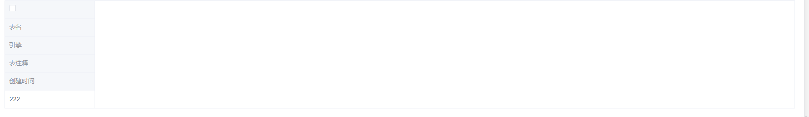

[toc]

---

# 关于table表格格式错乱问题

> 此问题 elementui 和 elementplus都有这个问题
>
> 是通过纯html+elementui cdn的形式来实现的

问题代码：

```html
<el-table
          ref="table"
          v-loading="loading"
          element-loading-text="Loading..."
          :data="tableData"
          style="width: 100%"
          @selection-change="handleSelectionChange"
          >
    <el-table-column type="selection" width="50"/>
    <el-table-column prop="tableName" label="表名" width="200"/>
    <el-table-column prop="engine" label="引擎" width="200"/>
    <el-table-column prop="tableComment" label="表注释"/>
    <el-table-column prop="createTime" label="创建时间" width="200"/>
</el-table>
```

效果如下：可以看到全部都偏向了一侧



**修复方法：** 将单标签换成开始标签+结束标签，即可

```html
<el-table
          ref="table"
          v-loading="loading"
          element-loading-text="Loading..."
          :data="tableData"
          style="width: 100%"
          @selection-change="handleSelectionChange"
          >
    <el-table-column type="selection" width="50"></el-table-column>
    <el-table-column prop="tableName" label="表名" width="200"></el-table-column>
    <el-table-column prop="engine" label="引擎" width="200"></el-table-column>
    <el-table-column prop="tableComment" label="表注释"></el-table-column>
    <el-table-column prop="createTime" label="创建时间" width="200"></el-table-column>
</el-table>
```

