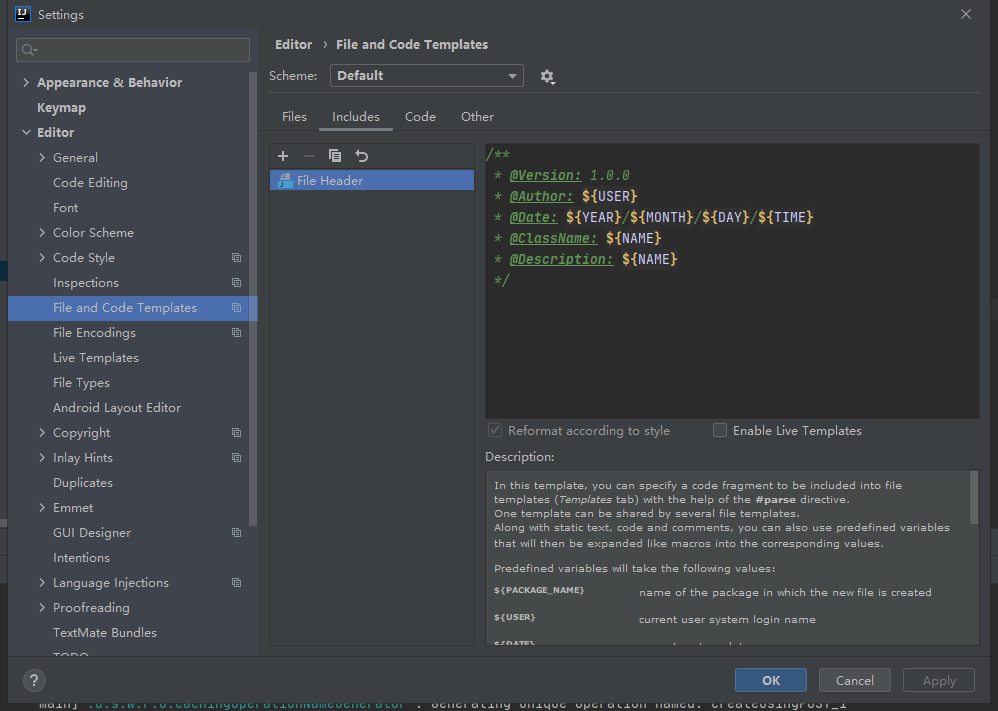

[toc]

---

# IntelliJ IDEA设置类注释和方法注释带作者和日期

> 设置路径：File->setting->Editor->File and Code Templates -> File header

```javascript
/**
 * @Version: 1.0.0
 * @Author: ${USER}
 * @Date: ${YEAR}/${MONTH}/${DAY}/${TIME}
 * @ClassName: ${NAME}
 * @Description: ${NAME}
 */
```



参数说明

| 变量      | 说明     |
| --------- | -------- |
| ${NAME}   | 文件名称 |
| ${YEAR}   | 年       |
| ${MONTH}  | 月       |
| ${DAY}    | 日       |
| ${HOUR}   | 时       |
| ${MINUTE} | 分       |
| ${USER}   | 登录用户 |
| ${TIME}   | 时分     |
|           |          |
|           |          |

