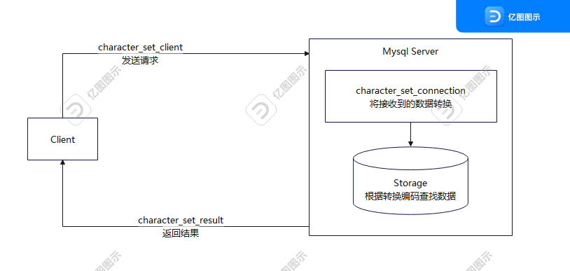

[toc]

---

# 字符集

## 查看

查看数据库默认字符集

```shell
show VARIABLES like "%character%"
```

结果信息如下：

| MySql 5.7                |                                                         | MySql 8.0                |                                                  |
| ------------------------ | ------------------------------------------------------- | ------------------------ | ------------------------------------------------ |
| Variable_name            | Value                                                   | Variable_name            | Value                                            |
| character_set_client     | utf8mb4                                                 | character_set_client     | utf8mb4                                          |
| character_set_connection | utf8mb4                                                 | character_set_connection | utf8mb4                                          |
| character_set_database   | latin1                                                  | character_set_database   | utf8mb4                                          |
| character_set_filesystem | binary                                                  | character_set_filesystem | binary                                           |
| character_set_results    |                                                         | character_set_results    |                                                  |
| character_set_server     | latin1                                                  | character_set_server     | utf8mb4                                          |
| character_set_system     | utf8                                                    | character_set_system     | utf8mb3                                          |
| character_sets_dir       | C:\Program Files\MySQL\MySQL Server 5.7\share\charsets\ | character_sets_dir       | D:\dev-tools\mysql-8.0.33-winx64\share\charsets\ |

## 测试

在 `MySQL 8.0` 中执行建表语句

```sql
create database test_char;

use test_char;

create table user(id int,name varchar(20));

insert into user(id,name) value(1,"张三");
insert into user(id,name) value(2,"李四");

select * from `user`;
```

输出结果

```mysql
id|name
--+----
 1|张三  
 2|李四  
```

试着在 `MySQL 5.7` 中执行建表语句，会出现错误。

```shell
SQL 错误 [1366] [HY000]: Incorrect string value: '\xE5\xBC\xA0\xE4\xB8\x89' for column 'name' at row 1
```

这是因为我们数据库和表使用的**字符集是`latin1`，是不支持中文的**。

可以在`/mysql/conf/mysqld.conf`或者`my.ini`，添加这如下配置就能将 `Mysql 5.7` 的字符集设置为 `UTF8`。重启服务后生效。需要注意的是：**对于已经创建了的数据库和表字符集是不会被联动更改的，只对更改配置以后的新创建的数据库和表生效。**

```ini
[mysqld]
character_set_server=utf8 # 设置为utf8，也可以设置为 utf8mb4
```

修改现有库的字符集

```sql
ALTER DATABASE test_char character set 'utf8';
```

对于现有表字符集的调整，可以通过以下指令进行操作。同样**这对数据表里现有的字段不会联动更改。**

```sql
-- 不会转换现有表和字段的字符集。
ALTER TABLE test_char.`user` DEFAULT CHARSET=utf8mb4;

-- 会转换现有数据表和字段的字符集为 utf8
ALTER TABLE user convert to CHARACTER set 'utf8'; 
```

对于现有数据表的字段调整。

```sql
ALTER TABLE test_char.`user` MODIFY COLUMN name varchar(20) CHARACTER SET utf8mb4 COLLATE utf8mb4_general_ci;
```

## 小结-各级别的字符集

从前面的测试例子，可以看出字符集从上到下，可以分为4类

1. 服务器级别（决定默认字符集）。一般通过配置文件来配置。

   ```ini
   [mysqld]
   character_set_server=utf8
   ```

2. 数据库级别。未配置时采用服务器级别

   ```sql
   -- 创建
   create database [db_name] character set utf8;
   
   -- 更新
   alter database [db_name] character set utf8;
   ```

3. 数据表级别。未配置时采用数据库级别

   ```sql
   -- 创建
   create table [tb_name] character set utf8;
   
   -- 更新
   alter table [tb_name] character set utf8;
   ```

4. 数据列级别。未配置时采用数据表级别

   ```sql
   -- 建表时
   create table if not exists [tb_name](
   	id int(11) not null,
       name varchar(20) default null character set utf8mb4, -- 未设置则跟表级别
       primary key (`id`)
   ) ENGINE=InnoDB Default CHARSET=utf8; -- 表级别设置
   
   -- 已有数据表，注意字段类型，如果使用数字型会抛出异常
   ALTER TABLE [tb_name] ADD COLUMN [column_name] varchar(1) NOT NULL DEFAULT 1  CHARACTER SET utf8 COLLATE utf8_general_ci COMMENT '1主要的，2次选的';
   
   -- 修改数据列
   Alter Table [tb_name] MODIFY COLUMN [column_name] varchar(1) CHARACTER SET utf8 COLLATE utf8_general_ci;
   ```

   

# 字符集比较规则

## 查看

通过查询字符集命令对比常用的 `utf8`，`utf8mb3`，`utf8mb4`有什么区别

```sql
show charset;
```

输出结果：

| CHARSET | Description   | Default collation  | maxlen |
| ------- | ------------- | ------------------ | ------ |
| utf8    | UTF-8 Unicode | utf8_general_ci    | 3      |
| utf8mb3 | UTF-8 Unicode | utf8mb3_general_ci | 3      |
| utf8mb4 | UTF-8 Unicode | utf8mb4_0900_ai_ci | 4      |

- 这里可以看出 `utf8` 和 `utf8` 最大字节长度都是3
- 注意：**Mysql中`utf8`是`utf8mb3`的别名**
- **若有需求去存储4字节编码一个字符的情况，例如emoji表情，那就需要设置字符集为`utf8mb4`.** 
- 现在我们在设计 Web 数据库时更多的使用 `utf8mb4`

我们再看一下 `Default collation` ，代表字符集的默认比较规则。

| 后缀 | 描述             |
| ---- | ---------------- |
| _ai  | 不区分重音       |
| _as  | 区分重音         |
| _ci  | 不区分大小写     |
| _cs  | 区分大小写       |
| _bin | 以二进制方式比较 |

- `utf8_general_ci`和`utf8_unicode_ci`对于中英文来说没有什么实质区别。
- `utf8_general_ci`相对而言速度快，但是准确度较差。
- `utf8_unicode_ci`准确度高，但是速度较慢。**并且适用于多语言的比较。**

 查看和修改表的比较规则： 

```sql
show table status from dbtest1 like '%user';

ALTER table user DEFAULT CHARACTER SET 'utf8' COLLATE 'utf8_general_ci';
```

## 变化过程

之前我们可以看到有几种类型的字符集，那么他们几种之间有什么区别？

- **character_set_filesystem**：文件系统上的存储格式，默认为binary（二进制），即不做转换；
- **character_set_system** ：系统的存储格式，默认为utf8；
- **character_sets_dir**：可以使用的字符集的文件路径；

剩下的5个就是影响读写乱码的罪魁祸首：

- **character_set_client**：客户端请求数据的字符集；
- **character_set_connection**：从客户端接收到数据，然后传输的字符集；
- **character_set_database**：默认数据库的字符集；如果没有默认数据库，使用character_set_server字段；
- **character_set_results**：结果集的字符集，一般与业务代码的编码相同，否则会导致乱码；
- **character_set_server**：数据库[服务器](https://cloud.tencent.com/product/cvm?from=20065&from_column=20065)的默认字符集；

我们看一下客户端请求到返回的大致过程



1. 客户端请求数据库数据，发送的数据采用 `character_set_client`  字符集。客户端包括但不限于 `bash`、`jdbc`和 `odbc`等
2. 数据库接收到客户端的请求后，将数据转换为 `character_set_connection` 字符集
3. `MySQL` 进行内部操作时，将数据字符集转换为内部操作字符集（使用每个数据字段的`character set`设定值；若没设定则使用对应数据表的`default character set`设定值；若没设定则使用对应数据库的default character set设定值；若没设定则使用character_set_server设定值）。
4.  将操作结果集从内部操作字符集转换为`character_set_result`。

### **character_set_filesystem**

- `character_set_filesystem` 文件系统配置的编码格式，把操作系统上的文件名转化为该字符集。
-  即从 `character_set_client` 转化为 `character_set_filesystem`
- 默认值 `binary` 即不做操作。

我们来改变一下 `character_set_filesystem` ，看看输出结果。

1. 设置成 `UTF8`/`ascii`

```sql
set character_set_filesystem = utf8
```

2. 执行输出文件

```sql
select * from test into outfile 'D://你好.txt';

-- 这里 into outfile 可能会抛出异常，需要配置对应属性。secure-file-priv
```

3. 查看输出文件名

###  **character_set_system** 

 默认就是utf8，它是元数据的编码，比如数据库的字段名、数据库名等。是个只读数据不能更改，而且也不要去更改它，因为类似于用户名密码可能会使用各种奇怪的字符，只有utf8能够容纳它们。 

### 实验

#### 关于collation_connection作用

**其实这里为什么服务器不直接从`character_set_client`转化成对应`character_set_results`字符集？**

这可以从官方文档中看到一段这样的说明解释了 `character_set_client` 、 `character_set_server` 和 `character_set_connection`。https://dev.mysql.com/doc/refman/5.7/en/charset-connection.html

> - What character set are statements in when they leave the client?
>
> The server takes the [`character_set_client`](https://dev.mysql.com/doc/refman/5.7/en/server-system-variables.html#sysvar_character_set_client) system variable to be the character set in which statements are sent by the client.
>
> - What character set should the server translate statements to after receiving them?
>
> To determine this, the server uses the [`character_set_connection`](https://dev.mysql.com/doc/refman/5.7/en/server-system-variables.html#sysvar_character_set_connection) and [`collation_connection`](https://dev.mysql.com/doc/refman/5.7/en/server-system-variables.html#sysvar_collation_connection) system variables:
>
>   - The server converts statements sent by the client from [`character_set_client`](https://dev.mysql.com/doc/refman/5.7/en/server-system-variables.html#sysvar_character_set_client) to [`character_set_connection`](https://dev.mysql.com/doc/refman/5.7/en/server-system-variables.html#sysvar_character_set_connection). Exception: For string literals that have an introducer such as `_utf8mb4` or `_latin2`, the introducer determines the character set. See [Section 10.3.8, “Character Set Introducers”](https://dev.mysql.com/doc/refman/5.7/en/charset-introducer.html).
>   - [`collation_connection`](https://dev.mysql.com/doc/refman/5.7/en/server-system-variables.html#sysvar_collation_connection) is important for comparisons of literal strings. For comparisons of strings with column values, [`collation_connection`](https://dev.mysql.com/doc/refman/5.7/en/server-system-variables.html#sysvar_collation_connection) does not matter because columns have their own collation, which has a higher collation precedence (see [Section 10.8.4, “Collation Coercibility in Expressions”](https://dev.mysql.com/doc/refman/5.7/en/charset-collation-coercibility.html)).
>
> - What character set should the server translate query results to before shipping them back to the client?
>
> The [`character_set_results`](https://dev.mysql.com/doc/refman/5.7/en/server-system-variables.html#sysvar_character_set_results) system variable indicates the character set in which the server returns query results to the client. This includes result data such as column values, result metadata such as column names, and error messages.

这里引用一下翻译。

>  服务器将客户端发送的语句从character_set_client转换为character_set_connection。异常:对于具有引入器(如_utf8mb4或_latin2)的字符串字面值，引入器决定字符集。 
>
>  Collation_connection对于字面值字符串的比较很重要。对于字符串与列值的比较，collation_connection无关紧要，因为列有自己的排序规则，排序规则优先级更高 


让我们来试验一下 关于 `Collation_connection` 的部分。我们用字面值来测试一下。

1. 先执行查询字符集 

   ```sql
   show variables like "%character%"
   
   show variables like "%connection%"  -- 查询排序字符
   ```

   ```sql
   Variable_name           |Value                                                  
   ------------------------+-------------------------------------------------------
   character_set_client    |utf8mb4                                                
   character_set_connection|utf8mb4                                                
   ```

2. 设置一下排序规则

   ```sql
   set collation_connection=utf8_general_ci; # _ci不区分大小写
   ```

3. 执行字面量查询

   ```sql
   select 'A' = 'a'
   ```

   ```sql
   'A' = 'a'
   ---------
           1
   ```

4. 再设置一下排序结果

   ```sql
   set collation_connection=utf8_bin;
   ```

5. 执行字面量查询

   ```sql
   select 'A' = 'a'
   ```

   ```sql
   'A' = 'a'
   ---------
           0
   ```

x可以看到两次输出结果分别是0和1，也就是说字面量直接根据配置的 `collation_conntion` 直接排序比较的。那表内部的是怎么样呢？

1. 设置一下排序结果

   ```sql
   set collation_connection=utf8_bin;
   ```

2. 创建表

   ```sql
   CREATE TABLE `temp` (
     `id` int(11) NOT NULL,
     `name` varchar(20) CHARACTER SET utf8mb4 DEFAULT NULL,
     PRIMARY KEY (`id`)
   ) ENGINE=InnoDB DEFAULT CHARSET=utf8;
   ```

3. 执行对 `name` 的比较规则设置 `utf8mb4_general_ci`

	```sql
ALTER TABLE test_char.temp MODIFY COLUMN name varchar(20) CHARACTER SET utf8mb4 COLLATE utf8mb4_general_ci;
	```

4. 执行查询比较

   ```sql
   select (select name from temp where name = "A" ) = 'a'
   ```

   ```sql
   Name                                           |Value|
   -----------------------------------------------+-----+
   (select name from temp where name = "A" ) = 'a'|1    |
   ```

5. 执行对 `name` 的比较规则设置  `utf8mb4_bin`

   ```sql
   ALTER TABLE test_char.temp MODIFY COLUMN name varchar(20) CHARACTER SET utf8mb4 COLLATE utf8mb4_bin;
   ```

   ```sql
   Name                                           |Value|
   -----------------------------------------------+-----+
   (select name from temp where name = "A" ) = 'a'|0    |
   ```

由这两个实验结果，我们可以看看字面量和列值比较结果是不一样的。

1. 服务器在进行 `字节序列` 处理的时候，根据 `character_set_connection` 的字符集进行编码，使用比较规则 `Collation_connection`，进行比较。
2. 另一边，对于数据表的数据列， **列的字符集和排列规则的优先级更高** ，也就是说还需要从 `character_set_collection` 转换成对应列的字符集。
3. 也就是说，对于 `character_set_connection ` 起了一个中转作用，解决了字面值无法排序处理的问题。

## 存在的问题

### 乱码

1. 客户端使用的字符集和`character_set_results`不一致，会导致客户端无法解码。**也就是所谓的乱码现象（本质原因了）。**
2. 编码不一致，且是有损编码，所以转换过程中存在丢失。

处理方法：

- 错误方法

  1.  Alter TABLE .. character set=XXX

     如果数据已经产生丢失，那么再进行转换并不能起到修复作用。

  2.  ALTER TABLE … CONVERT TO CHARACTER SET … 

     - 官方文档对该命令的解释：用于对一个表的数据进行编码转换，该命令只适用于当前并没有乱码，并且并不能将错进错出纠正为对进对出。 
     - 举例说明：假设我们有一张通过错进错出（set names latin1）存入了UTF-8的数据、编码是latin1的表，并打算把表的字符集编码改成UTF-8（同时set names utf8）并且不影响原有数据的正常显示，执行alter table test_latin1 convert to character set utf8后发现依然可以错进错出（set names latin1），然而对进对出就会显示乱码（**这是由于错进错出本质上数据存储的内容就是错误的内容，我们通过正确的步骤编码、读取，得到的结果一定是错的**）。

-  正确方法

  1. 导入导出法
     1. 将数据通过错进错出的方法导出到文件。 **一定要确认导出的文件用文本编辑器在UTF-8编码下查看没有乱码** 
     2. 用正确的字符集创建新表
     3. 将之前导出的文件重新导入到新表中。 

  2.  Convert to Binary & Convert Back 

     这种方法是将二进制数据作为中间数据的方法来实现修改编码的，因为MySQL在将有编码意义的数据流转换为无编码意义的二进制数据的时候并不做实际的数据转换，而从二进制数据准换为带编码的数据时又会用目标编码做一次编码转换校验，利用这两个特性就可以实现在MySQL内部模拟了一次“错出”将乱码修正了。 


## 小结

1. 如果想保证任何情况下都不出现乱码，那么我们应该保证**数据库编码和set names XXX是一致**的；
2. 假如由于某种原因不能做到第一条，那么**一定要保证character_set_client、character_set_connection、character_set_results是一致的且可以和数据库编码无损转换**。

