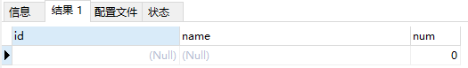
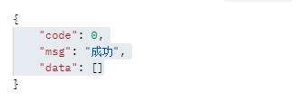

[toc]


---


# 关于使用Left join 和 count时，无数据时，list 返回时出现一条空数据

1. 创建msyql数据表

```mysql
create table `tb_group`(
    id bigint(20) unsigned not null AUTO_INCREMENT,
    `name` varchar(255) CHARACTER set utf8mb4 COLLATE utf8mb4_bin DEfault Null comment "组名称",
    primary key (`id`) using btree
)ENGINE=Innodb CHARSET=utf8mb4 COMMENT="分组表";


create table `tb_detail`(
    id bigint(20) unsigned not null AUTO_INCREMENT,
		group_id bigint(20) unsigned not null,
    `name` varchar(255) CHARACTER set utf8mb4 COLLATE utf8mb4_bin DEfault Null comment "明细名称",
    primary key (`id`) using btree
)ENGINE=Innodb CHARSET=utf8mb4 COMMENT="明细表";
```

2. 插入数据

```mysql
INSERT INTO `tb_group` (`id`, `name`) VALUES (1, '1');
INSERT INTO `tb_group` (`id`, `name`) VALUES (2, '2');
INSERT INTO `tb_detail` (`id`, `group_id`, `name`) VALUES (1, 1, '1-1');
INSERT INTO `tb_detail` (`id`, `group_id`, `name`) VALUES (2, 1, '1-2');
INSERT INTO `tb_detail` (`id`, `group_id`, `name`) VALUES (3, 2, '1-2');
```

3. 实体类

```java
/**
 * 组实体类
 */
@Data
public class TbGroup{
    private Long id;
    private String name;
}
/**
 * 明细实体类
 */
@Data
public class TbDetail{
    private Long id;
    private Long groupId;
    private String name;
}
/**
 * 组统计实体类
 */
@Data
public class TbGroupAndDetailCountVo{
    private Long id;
    private String name;
    private Integer count;
}
```

4. 编写mapper.xml

```xml
<select id="selectGroupAndDetailCount" result="TbGroupAndDetailCountVo">
	select 
    	tb_group.id,
    	tb_group.name,
    	count(1) `count`
    from 
    	tb_group left join tb_detail on tb_group.id = tb_detail.group_id
    where tb_group.id =3 
</select>
```

5. 编写mapper.dao

```java
List<TbGroupAndDetailCountVo> selectGroupAndDetailCount()
```

6. 我们将下面的sql在mysql里面直接执行，都会看见同样的输出结果。



7. 那通过mybatis映射后呢？


可以看见会有一条空数据count 0 。那么如何解决这个问题呢？

只需要在sql里面增加一句 group by tb_group.id即可。

```mysql
select 
    	tb_group.id,
    	tb_group.name,
    	count(1) `count`
    from 
    	tb_group left join tb_detail on tb_group.id = tb_detail.group_id
    where tb_group.id =3 
    group by tb_group.id
```



# Mybatis-plus下Mybatis 拦截器，更改sql后，无生效问题。

因为在项目里面集成了 `mybatis-plus` 但是我又不太想使用 `mybatis-plus` 的拦截器方法 `InnerInterceptor` ，偏向使用 `Mybatis` 的 `Interceptor` 。（完整代码可以参见 `GIT项目`）

## mybatis-plus 的使用方法

- 数据域拦截器

```JAVA
public class DataScopeInnerInterceptor extends JsqlParserSupport implements InnerInterceptor {
    // ...
}
```

- 拦截器使用

  - 方式一：`MybatisPlusInterceptor` 配置拦截器，可以控制优先顺序

    ```java
    @Bean
    public MybatisPlusInterceptor mybatisPlusInterceptor() {
        MybatisPlusInterceptor interceptor = new MybatisPlusInterceptor();
        //     数据权限过滤
        interceptor.addInnerInterceptor(new DataScopeInnerInterceptor());
        interceptor.addInnerInterceptor(new PaginationInnerInterceptor());
        interceptor.addInnerInterceptor(new OptimisticLockerInnerInterceptor());
        return interceptor;
    }
    ```

  - 方式二：直接注入 `Bean`

    ```java
    @Resource
    private DataScopeInterceptor dataScopeInterceptor;
    
    @Bean
    public PaginationInnerInterceptor paginationInterceptor() {
        return new PaginationInnerInterceptor();
    }
    
    @Bean
    public OptimisticLockerInnerInterceptor optimisticLockerInterceptor() {
        return new OptimisticLockerInnerInterceptor();
    }
    
    @Component
    public class DataScopeInnerInterceptor extends JsqlParserSupport implements InnerInterceptor {
        // ...
    }
    ```


## 问题原因

原先代码：通过 `@Component` 注入我们自己的拦截器，但是更改SQL后没有生效。

`DataScopeInterceptor` 没有注入成功 `AND create_by = 17779983758` 方法

```shell
2023-03-10 16:46:51.678  INFO 28452 --- [ XNIO-1 task-29] c.a.h.m.a.d.i.DataScopeInnerInterceptor  : MappedStatement => org.apache.ibatis.mapping.MappedStatement@564722db,BoundSQL => org.apache.ibatis.mapping.BoundSql@7247474d,SQL => SELECT id FROM kb_goods WHERE del_flag = 0 AND (usable_flag = ?) AND create_by = 17779983758
2023-03-10 16:46:51.679  INFO 28452 --- [ XNIO-1 task-29] c.a.h.m.a.d.i.DataScopeInterceptor       : MappedStatement => org.apache.ibatis.mapping.MappedStatement@564722db,BoundSQL => org.apache.ibatis.mapping.BoundSql@7c80a775,SQL => SELECT id FROM kb_goods WHERE del_flag = 0 AND (usable_flag = ?)
```

在我们使用 `Mybatis-Plus` 的注入方式时，会优先走 `MybatisPlusInterceptor` 的拦截器。我们看一下打印日志。虽然使用的都是同一个 `MappedStatement`，但是实际修改的 `BoundSql`  不是同一个实体，但是修改了后不起作用。

而且 `MybatisPlusInterceptor` 的优先级是高于我们自定义的 `Interceptor` 拦截器。

当我们在自定义的 `Mybatis拦截器` 里面更改了 `SQL语句`。但是 `Mybatis-Plus` 操作后，没有发生变化，因为`MybatisPlus` 本身的拦截器优先注入执行了，导致自定义的拦截器修改 `BoundSQL` 后没有生效。

### 解决方法

1. 使用`Mybatis-plus`提供的 `ConfigurationCustomizer`  类，提高自定义拦截器的执行顺序。

```java
@Configuration
public class MybatisConfig {
// 注册插件方式
    @Bean
    public ConfigurationCustomizer configurationCustomizer() {
        return configuration -> {
            //插件拦截链采用了责任链模式，执行顺序和加入连接链的顺序有关
            configuration.addInterceptor(new UpdateInterceptor());
        };
    }
}
```

2. 使用`SqlSessionFactory` 手动更改执行顺序。

```java

    @Resource
    private List<SqlSessionFactory> sqlSessionFactories;

    @PostConstruct
    public void addInterceptor() {

		// MybatisPlus 拦截器的初始化
        MybatisPlusInterceptor interceptor = new MybatisPlusInterceptor();
        interceptor.addInnerInterceptor(new DataScopeInnerInterceptor());
        interceptor.addInnerInterceptor(new PaginationInnerInterceptor());
        interceptor.addInnerInterceptor(new OptimisticLockerInnerInterceptor());

        sqlSessionFactories.forEach(item -> {
            item.getConfiguration().addInterceptor(interceptor);
            // 自定义拦截器，先执行的后加入
            item.getConfiguration().addInterceptor(new DataScopeInterceptor());
        });
    }

```


